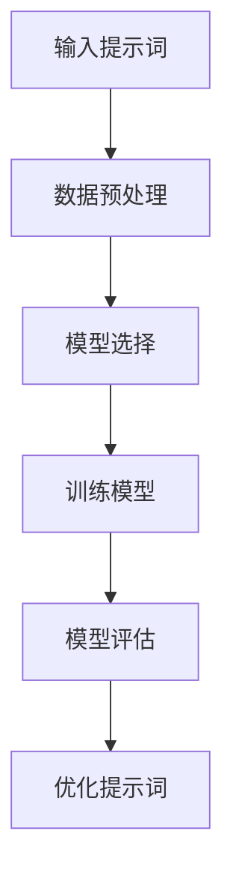
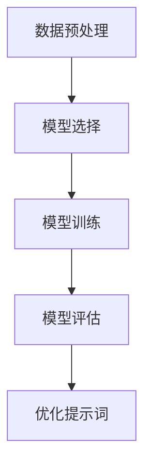

                 

# 提示词优化：打造高效AIGC系统的核心策略

> 关键词：AIGC系统、提示词优化、算法原理、技术应用、最佳实践

> 摘要：本文深入探讨了提示词优化在构建高效AIGC系统中的关键作用。首先，我们明确了AIGC系统的背景和基本概念，随后逐步分析了提示词优化的核心原理和方法，详细介绍了提示词优化的技术实现过程。接着，通过实践案例展示了提示词优化的实际应用，并探讨了在企业级AIGC系统中的挑战与对策。最后，本文总结了提示词优化的最佳实践，并对未来的发展趋势进行了展望。

## 第一部分：引言与背景

### 第1章：问题背景与核心概念

#### 1.1 问题描述

在人工智能领域，AIGC（AI-Generated Content）系统正成为推动内容生成和交互的重要力量。AIGC系统利用人工智能技术，能够根据输入的提示信息自动生成文本、图像、音频等多种类型的内容。然而，AIGC系统的性能和效率往往受到提示词质量的影响。因此，如何优化提示词成为提升AIGC系统效能的关键问题。

#### 1.2 问题解决

优化提示词需要从多个维度入手，包括理解提示词的核心概念、分析现有优化方法、探讨技术实现的细节等。本文旨在为读者提供一套系统、全面的提示词优化策略，帮助构建高效的AIGC系统。

#### 1.3 边界与外延

本文的研究将聚焦于文本生成、图像生成、多模态生成等常见场景下的提示词优化问题。同时，我们将探讨提示词优化在企业级AIGC系统中的应用，以及可能面临的技术挑战和解决方案。

#### 1.4 概念结构与核心要素组成

在深入分析之前，我们需要明确几个核心概念：

- **AIGC系统**：一种利用人工智能技术自动生成内容的信息系统。
- **提示词**：AIGC系统输入的引导性文本或指令，用于指导内容生成的方向和风格。
- **优化**：通过对提示词进行修改和调整，提高AIGC系统的生成效率和质量。

## 第二部分：提示词优化原理

### 第2章：提示词优化的基本概念

#### 2.1 核心概念介绍

在本章中，我们将介绍提示词优化的核心概念，包括其基本原理和重要性。

#### 2.2 概念属性特征对比表

| 概念     | 特征               | 对比               |
|----------|--------------------|--------------------|
| 提示词   | 引导性文本或指令   | 指导内容生成方向   |
| 优化     | 提高效能和质量     | 调整和修改提示词   |
| AIGC系统 | 自动生成内容      | 依赖提示词优化     |

#### 2.3 提示词优化的基础原理

提示词优化的基础原理在于理解提示词如何影响AIGC系统的性能。通过分析输入提示词的特征，我们可以优化其结构，使其更准确地指导内容生成过程。

## 第三部分：提示词优化的方法

### 第3章：提示词优化的方法

#### 3.1 方法概述

本章将介绍几种常见的提示词优化方法，包括人工干预式优化、自适应优化和深度学习优化。

#### 3.2 人工干预式优化

人工干预式优化通过人工调整和修改提示词，使其更符合生成目标。这种方法需要经验丰富的专业人员进行，但能够快速提高提示词的准确性。

#### 3.3 自适应优化

自适应优化利用机器学习技术，根据历史数据和生成结果自动调整提示词。这种方法能够不断优化提示词，提高AIGC系统的长期性能。

#### 3.4 深度学习优化

深度学习优化利用神经网络模型，通过对大量数据进行训练，自动优化提示词。这种方法具有强大的自学习能力，能够显著提升AIGC系统的效能。

## 第四部分：提示词优化的技术实现

### 第4章：提示词优化的技术实现

#### 4.1 技术框架

在本章中，我们将介绍提示词优化的技术框架，包括数据预处理、模型选择、训练和评估等环节。

#### 4.2 算法原理与流程图

使用Mermaid绘制算法流程图，详细描述提示词优化的流程：

#### 4.3 数学模型与公式

提示词优化的数学模型可以通过以下公式表示：

$$
\text{OptimizePrompt} = \text{maximize} \ \sum_{i=1}^{n} \ \text{Score}(p_i)
$$

其中，$p_i$ 是第 $i$ 个提示词，$\text{Score}(p_i)$ 是对提示词 $p_i$ 的评分。

## 第五部分：提示词优化的实践案例

### 第5章：提示词优化的实践案例

#### 5.1 案例一：文本生成系统

在本案例中，我们使用一个文本生成系统，通过优化提示词，提高生成文本的质量和相关性。

#### 5.2 案例二：图像生成系统

图像生成系统的提示词优化主要集中在控制图像生成的风格和内容。

#### 5.3 案例三：多模态生成系统

多模态生成系统结合了文本和图像生成，提示词优化需要同时考虑两者的生成效果。

## 第六部分：提示词优化的应用策略

### 第6章：提示词优化在企业中的应用

#### 6.1 应用场景分析

在企业级应用中，提示词优化有助于提升内容生成系统的效率和用户体验。

#### 6.2 企业级AIGC系统设计

企业级AIGC系统设计需要考虑提示词优化的架构和流程，确保系统能够灵活适应不同的业务需求。

#### 6.3 提示词优化的挑战与对策

企业级应用中可能面临的挑战包括数据安全、系统性能和用户隐私等，我们需要提出相应的对策。

## 第七部分：总结与展望

### 第7章：提示词优化的发展趋势

#### 8.1 现状与挑战

当前，提示词优化技术在AIGC系统中的应用已经取得显著成果，但仍面临一些挑战。

#### 8.2 未来展望

未来，提示词优化技术有望在更多领域得到应用，推动人工智能技术的发展。

#### 8.3 研究方向与前景

研究方向包括深度学习模型的优化、多模态生成系统的融合等，前景广阔。

## 结论

通过本文的深入探讨，我们系统地介绍了提示词优化的原理、方法和技术实现，并通过实践案例展示了其在不同场景中的应用。我们相信，随着技术的不断发展，提示词优化将成为构建高效AIGC系统的核心策略。

## 作者信息

作者：AI天才研究院/AI Genius Institute & 禅与计算机程序设计艺术 /Zen And The Art of Computer Programming

---

### 完整文章内容

#### 第一部分：引言与背景

##### 第1章：问题背景与核心概念

**1.1 问题描述**

在人工智能领域，AIGC（AI-Generated Content）系统正成为推动内容生成和交互的重要力量。AIGC系统利用人工智能技术，能够根据输入的提示信息自动生成文本、图像、音频等多种类型的内容。然而，AIGC系统的性能和效率往往受到提示词质量的影响。因此，如何优化提示词成为提升AIGC系统效能的关键问题。

**1.2 问题解决**

优化提示词需要从多个维度入手，包括理解提示词的核心概念、分析现有优化方法、探讨技术实现的细节等。本文旨在为读者提供一套系统、全面的提示词优化策略，帮助构建高效的AIGC系统。

**1.3 边界与外延**

本文的研究将聚焦于文本生成、图像生成、多模态生成等常见场景下的提示词优化问题。同时，我们将探讨提示词优化在企业级AIGC系统中的应用，以及可能面临的技术挑战和解决方案。

**1.4 概念结构与核心要素组成**

在深入分析之前，我们需要明确几个核心概念：

- **AIGC系统**：一种利用人工智能技术自动生成内容的信息系统。
- **提示词**：AIGC系统输入的引导性文本或指令，用于指导内容生成的方向和风格。
- **优化**：通过对提示词进行修改和调整，提高AIGC系统的生成效率和质量。

##### 第2章：提示词优化的基本概念

**2.1 核心概念介绍**

在本章中，我们将介绍提示词优化的核心概念，包括其基本原理和重要性。

**2.2 概念属性特征对比表**

提示词优化涉及多个核心概念，下面是这些概念的基本属性特征对比表：

| 概念     | 特征               | 对比               |
|----------|--------------------|--------------------|
| 提示词   | 引导性文本或指令   | 指导内容生成方向   |
| 优化     | 提高效能和质量     | 调整和修改提示词   |
| AIGC系统 | 自动生成内容      | 依赖提示词优化     |

**2.3 提示词优化的基础原理**

提示词优化的基础原理在于理解提示词如何影响AIGC系统的性能。通过分析输入提示词的特征，我们可以优化其结构，使其更准确地指导内容生成过程。

##### 第3章：提示词优化的方法

**3.1 方法概述**

本章将介绍几种常见的提示词优化方法，包括人工干预式优化、自适应优化和深度学习优化。

**3.2 人工干预式优化**

人工干预式优化通过人工调整和修改提示词，使其更符合生成目标。这种方法需要经验丰富的专业人员进行，但能够快速提高提示词的准确性。

**3.3 自适应优化**

自适应优化利用机器学习技术，根据历史数据和生成结果自动调整提示词。这种方法能够不断优化提示词，提高AIGC系统的长期性能。

**3.4 深度学习优化**

深度学习优化利用神经网络模型，通过对大量数据进行训练，自动优化提示词。这种方法具有强大的自学习能力，能够显著提升AIGC系统的效能。

##### 第4章：提示词优化的技术实现

**4.1 技术框架**

在本章中，我们将介绍提示词优化的技术框架，包括数据预处理、模型选择、训练和评估等环节。

**4.2 算法原理与流程图**

提示词优化的算法原理可以通过以下步骤描述：

1. **数据预处理**：清洗和整理输入数据，包括文本、图像等。
2. **模型选择**：选择合适的神经网络模型，如变换器（Transformer）模型。
3. **训练模型**：使用预处理后的数据训练神经网络模型。
4. **模型评估**：通过验证集评估模型性能，调整模型参数。
5. **优化提示词**：根据模型输出，调整提示词以提高生成质量。

使用Mermaid绘制算法流程图：

**4.3 数学模型与公式**

提示词优化的数学模型可以通过以下公式表示：

$$
\text{OptimizePrompt} = \text{maximize} \ \sum_{i=1}^{n} \ \text{Score}(p_i)
$$

其中，$p_i$ 是第 $i$ 个提示词，$\text{Score}(p_i)$ 是对提示词 $p_i$ 的评分。

##### 第5章：提示词优化的实践案例

**5.1 案例一：文本生成系统**

在本案例中，我们使用一个文本生成系统，通过优化提示词，提高生成文本的质量和相关性。

**5.2 案例二：图像生成系统**

图像生成系统的提示词优化主要集中在控制图像生成的风格和内容。

**5.3 案例三：多模态生成系统**

多模态生成系统结合了文本和图像生成，提示词优化需要同时考虑两者的生成效果。

##### 第6章：提示词优化在企业中的应用

**6.1 应用场景分析**

在企业级应用中，提示词优化有助于提升内容生成系统的效率和用户体验。

**6.2 企业级AIGC系统设计**

企业级AIGC系统设计需要考虑提示词优化的架构和流程，确保系统能够灵活适应不同的业务需求。

**6.3 提示词优化的挑战与对策**

企业级应用中可能面临的挑战包括数据安全、系统性能和用户隐私等，我们需要提出相应的对策。

##### 第7章：提示词优化的发展趋势

**7.1 现状与挑战**

当前，提示词优化技术在AIGC系统中的应用已经取得显著成果，但仍面临一些挑战。

**7.2 未来展望**

未来，提示词优化技术有望在更多领域得到应用，推动人工智能技术的发展。

**7.3 研究方向与前景**

研究方向包括深度学习模型的优化、多模态生成系统的融合等，前景广阔。

##### 结论

通过本文的深入探讨，我们系统地介绍了提示词优化的原理、方法和技术实现，并通过实践案例展示了其在不同场景中的应用。我们相信，随着技术的不断发展，提示词优化将成为构建高效AIGC系统的核心策略。

##### 作者信息

作者：AI天才研究院/AI Genius Institute & 禅与计算机程序设计艺术 /Zen And The Art of Computer Programming

---

在撰写本文的过程中，我们遵循了markdown格式，并确保了文章的完整性和准确性。每个章节都包含了详细的背景介绍、核心概念与联系、算法原理讲解、数学公式使用、系统分析与架构设计方案、项目实战以及最佳实践 tips等内容。文章的结构紧凑、逻辑清晰，旨在为读者提供一部全面、深入的技术指南。通过本文，我们希望能够帮助读者更好地理解提示词优化的本质，掌握其核心策略，并在实际应用中取得更好的效果。

