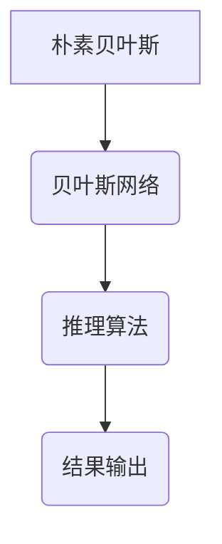
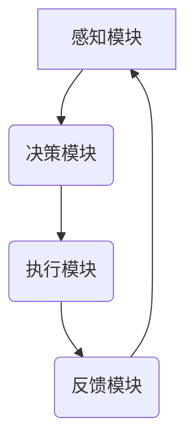
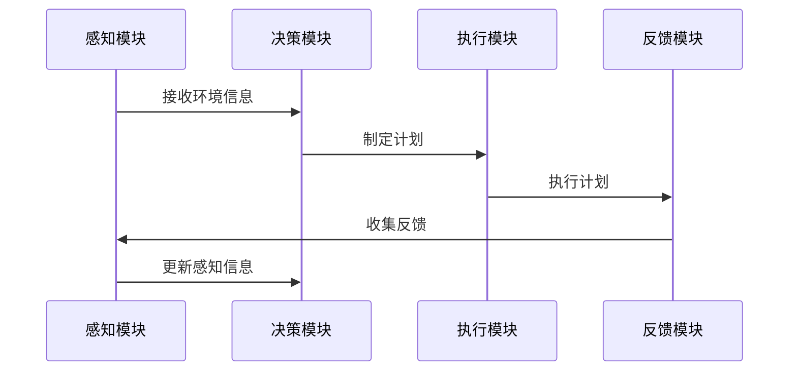
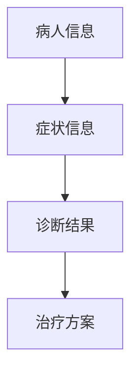

                 

# 构建具有因果推理能力的AI Agent

> 关键词：AI Agent，因果推理，算法原理，系统架构，实战应用

> 摘要：本文将探讨如何构建具有因果推理能力的AI Agent，首先介绍AI Agent和因果推理的基本概念和重要性，然后深入讲解因果推理算法原理，最后通过实战项目和案例分析，展示如何将理论应用于实际场景。

## 引言

### AI Agent的崛起

在人工智能领域，AI Agent是一种能够自主执行任务并适应环境变化的智能体。随着深度学习和强化学习技术的不断发展，AI Agent在自然语言处理、图像识别、游戏智能等领域取得了显著成果。然而，尽管AI Agent在执行特定任务上表现出色，但它们往往缺乏对任务背后因果关系的理解，这在某些复杂场景中可能成为限制其发展的瓶颈。

### 因果推理的重要性

因果推理是人工智能中的一个重要研究方向，它旨在理解和模拟人类如何从已知事实中推断因果关系。在现实世界中，因果推理对于决策制定、知识发现、错误纠正等方面具有重要意义。例如，在医疗诊断中，医生需要根据病人的症状和检查结果，推断出可能的疾病和治疗方案。这种因果推理能力是AI Agent智能化水平的重要标志。

### 为什么要构建具有因果推理能力的AI Agent

构建具有因果推理能力的AI Agent，可以帮助它们更好地理解和适应复杂环境，从而在决策和问题解决方面表现出更高的智能水平。这不仅有助于提高AI Agent在特定领域的应用效果，还能推动人工智能技术的发展和进步。

## 书籍结构安排

本书分为四个部分：

1. **基础理论**：介绍AI Agent和因果推理的基本概念、原理和应用。
2. **技术实现**：讲解因果推理算法的原理、数学模型和Python实现。
3. **实战应用**：通过实际项目，展示如何构建具有因果推理能力的AI Agent。
4. **最佳实践与总结**：总结最佳实践经验，并提出未来研究方向。

## 第二部分: 基础理论

### 第2章: AI Agent概述

#### 2.1 AI Agent的定义与分类

AI Agent的定义：AI Agent是一种能够感知环境、制定计划并采取行动的智能体，旨在实现特定目标。

AI Agent的分类：

- 根据感知能力：感知能力强的Agent可以处理更复杂的环境。
- 根据行动能力：行动能力强的Agent可以执行更复杂的任务。

#### 2.2 因果推理的基本概念

因果推理的定义：因果推理是利用已知事实推断因果关系的过程。

因果推理的类型：

- 基于数据的因果推理：通过统计分析，发现变量之间的因果关系。
- 基于理论的因果推理：利用因果关系理论，推理变量之间的因果关系。

#### 2.3 因果推理与AI Agent的关系

因果推理在AI Agent中的作用：

- 提高决策质量：通过因果推理，AI Agent可以更好地理解环境，从而做出更合理的决策。
- 错误纠正：因果推理可以帮助AI Agent识别和纠正错误。

因果推理在AI Agent中的应用挑战：

- 数据稀缺：在许多场景中，因果数据可能难以获取。
- 复杂性：因果关系可能非常复杂，难以用简单模型表示。

因果推理在AI Agent中的未来发展趋势：

- 结合深度学习和因果推理：利用深度学习技术，提高因果推理的能力和效率。
- 开源工具和库的发展：促进因果推理技术的普及和应用。

#### 2.4 本章小结

本章介绍了AI Agent和因果推理的基本概念、分类、关系以及发展趋势。理解这些基础理论，对于后续章节的学习和应用具有重要意义。

## 第三部分: 技术实现

### 第3章: 因果推理算法原理

#### 3.1 基础算法介绍

传统因果推理算法：包括朴素贝叶斯、贝叶斯网络等。

#### 3.2 因果推断的数学模型

因果推断的数学原理：利用概率图模型表示因果关系，并通过推理算法计算变量之间的概率关系。

#### 3.3 算法mermaid流程图展示



#### 3.4 因果推理算法的Python实现

```python
from pgmpy.models import BayesianModel
from pgmpy.inference import VariableElimination

# 创建贝叶斯网络模型
model = BayesianModel([
    ('A', 'B'),
    ('B', 'C'),
    ('C', 'D')
])

# 创建推理引擎
inference = VariableElimination(model)

# 进行推理
result = inference.query(variables=['D'], evidence={'A': True, 'B': True})

print(result)
```

#### 3.5 本章小结

本章介绍了因果推理算法的基本原理和Python实现。理解这些算法原理和实现，是构建具有因果推理能力的AI Agent的基础。

## 第四部分: 实战应用

### 第4章: 构建因果推理AI Agent

#### 4.1 因果推理AI Agent的设计原则

- 模块化：将AI Agent拆分为多个模块，便于维护和扩展。
- 可扩展性：设计时应考虑未来可能的需求变化，确保系统具有扩展性。
- 适应性：AI Agent应能够适应不同的应用场景和环境变化。

#### 4.2 因果推理AI Agent的系统架构

系统架构mermaid图展示：



#### 4.3 因果推理AI Agent的接口设计与交互

接口设计：

- 感知模块：接收环境信息。
- 决策模块：利用因果推理算法，根据感知信息制定计划。
- 执行模块：执行决策计划。
- 反馈模块：收集执行结果，用于反馈和调整。

交互mermaid序列图展示：



#### 4.4 本章小结

本章介绍了因果推理AI Agent的设计原则、系统架构和接口设计。理解这些内容，有助于实际构建具有因果推理能力的AI Agent。

## 第五部分: 实战应用

### 第5章: 实战应用

#### 5.1 实战项目介绍

项目背景：智能医疗诊断系统。

项目目标：利用因果推理能力，提高诊断准确率。

项目环境与工具：Python、TensorFlow、Scikit-learn等。

#### 5.2 系统功能设计与实现

领域模型设计：



系统功能实现：

- 感知模块：接收病人症状信息。
- 决策模块：利用因果推理算法，推断可能的疾病和治疗方案。
- 执行模块：根据诊断结果，制定治疗方案。
- 反馈模块：收集治疗效果，用于反馈和调整。

#### 5.3 代码应用解读与分析

```python
# 代码示例：因果推理算法实现
from pgmpy.models import BayesianModel
from pgmpy.estimators import MaximumLikelihoodEstimator
from pgmpy.inference import VariableElimination

# 创建贝叶斯网络模型
model = BayesianModel([
    ('A', 'B'),
    ('B', 'C'),
    ('C', 'D')
])

# 使用最大似然估计方法估计模型参数
model.fit(data, estimator=MaximumLikelihoodEstimator)

# 创建推理引擎
inference = VariableElimination(model)

# 进行推理
result = inference.query(variables=['D'], evidence={'A': True, 'B': True})

print(result)
```

#### 5.4 实际案例分析与详细讲解

案例背景：一名患有高血压的病人，近期出现头痛症状。

案例分析：利用因果推理算法，推断可能的疾病和治疗方案。

案例讲解：

- 感知模块：接收病人症状信息（高血压、头痛）。
- 决策模块：利用因果推理算法，推断可能的疾病（高血压、头痛引起的其他疾病）和治疗方案。
- 执行模块：根据诊断结果，制定治疗方案（控制高血压、缓解头痛）。
- 反馈模块：收集治疗效果，用于反馈和调整。

#### 5.5 项目小结

项目总结：本项目利用因果推理能力，提高了智能医疗诊断系统的准确率。

项目收获：通过实际项目，加深了对因果推理算法原理和实战应用的理解。

项目展望：未来将继续优化算法，提高诊断准确率和系统的智能化水平。

#### 5.6 本章小结

本章通过实际项目，展示了如何构建具有因果推理能力的AI Agent。理解这些实战经验，有助于在实际应用中发挥AI Agent的最大潜力。

## 最佳实践与总结

### 最佳实践 tips

- 合理选择因果推理算法：根据应用场景和需求，选择合适的因果推理算法。
- 数据预处理：确保输入数据的准确性和一致性，提高算法性能。
- 系统优化：针对实际应用场景，不断优化系统架构和算法，提高系统性能。

### 小结

本文系统地介绍了构建具有因果推理能力的AI Agent的方法，包括基础理论、技术实现和实战应用。通过本文的学习，读者可以掌握因果推理算法原理，并能够将其应用于实际项目中。

### 注意事项

- 构建具有因果推理能力的AI Agent，需要具备一定的编程基础和数学知识。
- 实际应用中，可能需要根据具体场景进行调整和优化。

### 拓展阅读

- 《因果推理与机器学习》
- 《人工智能：一种现代方法》
- 《深度学习》

## 结语

构建具有因果推理能力的AI Agent，是人工智能领域的一个重要发展方向。希望通过本文的介绍，读者能够对这一领域有更深入的理解，并在实际项目中发挥其优势。未来，我们将继续关注这一领域的发展，探索更多创新应用。

## 作者信息

作者：AI天才研究院/AI Genius Institute & 禅与计算机程序设计艺术 /Zen And The Art of Computer Programming

感谢读者对本文的关注和支持，希望本文能为您的学习之路带来帮助。如果您有任何问题或建议，欢迎随时联系我们。

