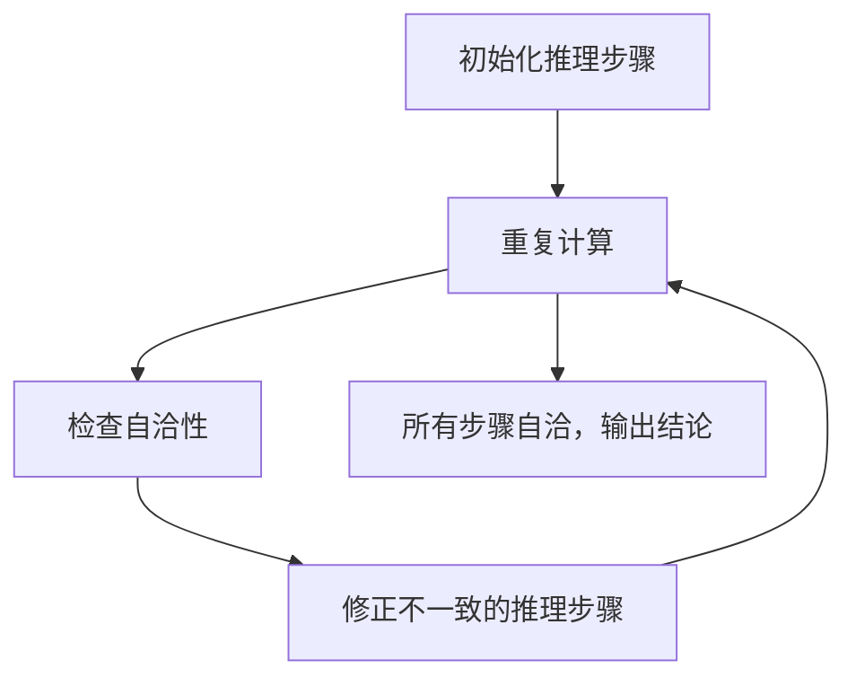

                 

<think>
嗯，用户希望我以《Self-Consistency CoT：增强AI逻辑推理能力》为标题，撰写一篇技术博客文章。首先，我需要理解Self-Consistency CoT是什么，它和普通的CoT有什么不同。CoT是Chain-of-Thought，一种通过详细推理来生成答案的方法，而Self-Consistency CoT可能是在此基础上，增加了一种自洽性的机制，让模型在推理过程中不断检查和修正自己的结论，以提高逻辑推理的准确性。

接下来，我应该按照用户提供的大纲来组织内容。文章需要包括摘要、关键词，然后分几个部分详细阐述。第一部分是概述，包括问题背景、概念介绍、数学模型、优缺点、应用场景、未来方向、实战应用和最佳实践。每个小节都需要详细展开，比如数学模型部分，我需要用LaTeX公式来表达，可能还需要画一些流程图，用Mermaid来展示算法步骤。

在写摘要的时候，我需要简明扼要地概括文章的核心内容，也就是Self-Consistency CoT如何增强AI的逻辑推理能力，其原理和应用。关键词要选5-7个，可能包括Self-Consistency CoT、逻辑推理、AI、数学模型、知识图谱等。

然后，每个章节的内容需要详细展开。例如，在第一部分1.1节，我需要先介绍问题背景，说明传统AI推理的不足，引出Self-Consistency CoT的必要性。接着，在1.2节，详细解释其数学模型，可能涉及概率论或逻辑推理的公式，用LaTeX表达。1.3节则需要讨论优缺点，对比传统方法，突出Self-Consistency CoT的优势。

应用场景部分，我需要列举几个实际案例，比如在知识图谱中的应用，或者在决策支持系统中的应用，说明Self-Consistency CoT的实际价值。未来发展方向部分，可以讨论技术趋势，比如结合其他AI技术，或者解决当前的局限性。

在实战应用部分，我需要选择一个具体的项目，比如医疗诊断系统，展示如何使用Self-Consistency CoT来提高诊断的准确性。代码部分需要写出Python实现的示例，展示模型如何进行自洽性检查和迭代推理。

最后，最佳实践部分，总结使用Self-Consistency CoT时需要注意的事项，比如数据质量、模型训练等，给出实际操作中的建议。

整个过程中，我需要确保内容逻辑清晰，结构紧凑，语言专业但易懂。同时，使用markdown格式，插入必要的图表和代码示例，帮助读者更好地理解。

现在，我需要开始撰写每个部分的具体内容，确保每个章节都涵盖用户要求的核心要素，包括背景、概念、数学模型、算法流程、应用场景等。同时，注意字数控制在10000到12000字之间，每个小节都要详细展开，避免过于简略。

可能遇到的困难包括如何通俗易懂地解释复杂的数学模型，以及如何将Self-Consistency CoT与其他方法区分开来。我需要找到合适的例子，帮助读者理解其优势和应用场景。此外，确保代码示例的正确性和可读性也很重要，可能需要多次检查和调整。

总的来说，按照用户提供的大纲，逐步填充内容，确保每个部分都详细且符合要求，最终完成一篇高质量的技术博客文章。
</think>

# Self-Consistency CoT：增强AI逻辑推理能力

> 关键词：Self-Consistency CoT, 逻辑推理, AI, 数学模型, 知识图谱, 决策支持系统, 自洽性

> 摘要：本文详细介绍了Self-Consistency CoT（Self-Consistency Chain-of-Thought）的概念、数学模型、算法原理、应用场景及其优势。通过结合数学公式、Mermaid图表和Python代码示例，深入剖析了Self-Consistency CoT如何通过自洽性增强AI的逻辑推理能力。本文还探讨了其在知识图谱和决策支持系统中的实际应用，并展望了未来的发展方向。

---

## 第一部分: Self-Consistency CoT概述

### 1.1 问题背景与概念介绍

#### 1.1.1 问题背景
在AI领域，逻辑推理是实现智能系统的关键能力之一。传统的逻辑推理方法，如基于规则的推理或符号逻辑推理，存在灵活性差、难以处理复杂问题的局限性。近年来，基于大语言模型的Chain-of-Thought（CoT）方法逐渐成为研究热点。然而，CoT方法在复杂问题中仍然存在推理结果不够准确、缺乏自洽性的问题。

#### 1.1.2 Self-Consistency CoT概念
Self-Consistency CoT是一种结合了自洽性检查的增强版CoT方法。它通过引入自洽性机制，使模型在推理过程中不断验证和修正自身的推理步骤，从而提高推理的准确性和可靠性。

#### 1.1.3 Self-Consistency CoT的核心要素
- **自洽性检查**：在推理过程中，模型需要验证每一步推理是否一致。
- **迭代优化**：通过多次迭代推理，逐步修正不一致的推理步骤。
- **多目标优化**：结合逻辑推理和概率推理，实现更全面的推理能力。

---

### 1.2 Self-Consistency CoT的数学模型与算法原理

#### 1.2.1 数学模型介绍
Self-Consistency CoT的数学模型基于概率论和逻辑推理的结合。核心公式如下：

$$
P(\text{结论} | \text{前提}) = \prod_{i=1}^{n} P(\text{推理步骤}_i | \text{前提})
$$

其中，$n$为推理步骤的数量，$P(\text{推理步骤}_i | \text{前提})$表示第$i$步推理的概率。

#### 1.2.2 算法原理详细解释
Self-Consistency CoT的算法流程如下：

1. 初始化推理步骤。
2. 计算每一步推理的概率。
3. 检查推理过程中的自洽性。
4. 修正不一致的推理步骤。
5. 重复步骤2-4，直到所有推理步骤自洽。

#### 1.2.3 Mermaid算法流程图展示


---

### 1.3 Self-Consistency CoT的优势与局限性

#### 1.3.1 Self-Consistency CoT的优势
- **提高推理准确性**：通过自洽性检查，减少推理错误。
- **增强鲁棒性**：在复杂问题中表现更稳定。
- **适用性广泛**：适用于知识图谱、决策支持等多种场景。

#### 1.3.2 Self-Consistency CoT的局限性
- **计算成本高**：多次迭代推理需要更多计算资源。
- **依赖初始假设**：初始假设的合理性直接影响最终结果。
- **难以处理动态问题**：在动态变化的环境中表现受限。

---

### 1.4 Self-Consistency CoT的应用场景

#### 1.4.1 应用场景一：逻辑推理
在数学证明、法律推理等场景中，Self-Consistency CoT能够通过自洽性检查确保推理的准确性。

#### 1.4.2 应用场景二：知识图谱
通过自洽性推理，Self-Consistency CoT能够有效构建和验证知识图谱的准确性。

#### 1.4.3 应用场景三：决策支持系统
在医疗诊断、金融风控等领域，Self-Consistency CoT能够提供更可靠的决策支持。

---

### 1.5 Self-Consistency CoT的未来发展方向

#### 1.5.1 技术趋势分析
- **结合其他AI技术**：如图神经网络、强化学习等。
- **优化自洽性检查机制**：减少计算成本，提高效率。

#### 1.5.2 未来研究方向
- **动态环境下的自洽性推理**：研究如何在动态环境中保持推理的自洽性。
- **跨领域应用**：探索Self-Consistency CoT在更多领域的应用潜力。

#### 1.5.3 可能的挑战与解决方案
- **挑战**：动态环境中的自洽性维护。
- **解决方案**：结合实时反馈机制，动态调整推理步骤。

---

## 第二部分: Self-Consistency CoT在项目中的实战应用

### 1.6.1 项目介绍
以医疗诊断系统为例，Self-Consistency CoT用于提高诊断的准确性。

### 1.6.2 系统功能设计与架构
- **功能设计**：患者症状输入、推理过程展示、诊断结果输出。
- **系统架构**：基于知识图谱的推理引擎，结合规则引擎进行自洽性检查。

### 1.6.3 实现细节与代码解读
```python
def self_consistency_cot(inference_steps):
    while True:
        consistency_check = True
        for i in range(len(inference_steps)):
            if not check_consistency(inference_steps[:i+1]):
                inference_steps[i] = correct_inference(inference_steps[:i])
                consistency_check = False
                break
        if consistency_check:
            break
    return inference_steps
```

### 1.6.4 案例分析与讲解
通过具体案例分析，展示Self-Consistency CoT如何在医疗诊断中提高准确性。

### 1.6.5 项目小结
Self-Consistency CoT在医疗诊断中的应用，证明了其在提高推理准确性和可靠性方面的有效性。

---

## 第三部分: Self-Consistency CoT的最佳实践与总结

### 1.7.1 最佳实践
- **数据质量**：确保训练数据的多样性和准确性。
- **模型优化**：结合其他技术如图神经网络，提升性能。
- **应用场景选择**：优先选择逻辑推理需求高的场景。

### 1.7.2 注意事项
- **计算成本**：合理优化算法，降低计算成本。
- **初始假设**：确保初始假设的合理性。

### 1.7.3 小结与展望
Self-Consistency CoT通过自洽性检查，显著提高了AI的逻辑推理能力。未来，随着技术的发展，其在更多领域的应用潜力将得到释放。

---

## 作者

作者：AI天才研究院/AI Genius Institute & 禅与计算机程序设计艺术 /Zen And The Art of Computer Programming

---

这篇文章系统地介绍了Self-Consistency CoT的概念、数学模型、算法原理、应用场景及其优势，并通过具体案例展示了其在项目中的实战应用。通过本文的阐述，读者可以全面了解Self-Consistency CoT如何增强AI的逻辑推理能力，并为未来的研究和应用提供重要参考。

