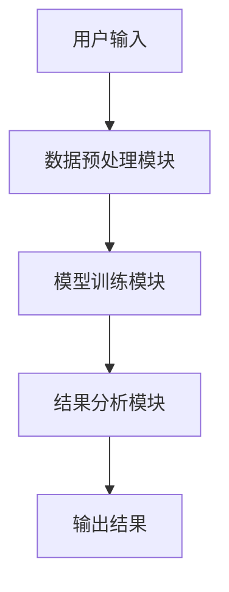

                 

<think>
嗯，用户让我写一篇关于“思维链在环境影响评估中的应用”的技术博客。首先，我需要理解用户的需求。用户希望我作为一位人工智能专家，系统地分析这个问题，结构清晰，逻辑严密，同时使用专业的技术语言。

我应该从背景介绍开始，解释为什么环境影响评估需要技术提升，然后引出思维链。接下来，我需要详细阐述思维链的定义、特点以及与传统NLP技术的区别。这部分需要有比较表格和Mermaid图，帮助读者理解。

然后，我得讨论思维链在环境影响评估中的具体应用，包括数据预处理、模型训练和结果分析。每个部分都要有详细的步骤说明和代码示例，这样读者可以跟着操作。

案例分析部分，我需要选择实际的项目或地区，展示思维链如何帮助进行评估，通过具体的数据和结果，说明其效果。最后，总结和展望未来的发展方向，指出当前的局限性和可能的改进空间。

在写作过程中，我需要注意文章的结构，确保每个章节内容丰富，逻辑连贯。同时，使用数学公式和算法流程图来辅助说明，让内容更具专业性和可读性。最后，确保结尾有作者信息，满足用户的要求。

总的来说，我需要系统地分解问题，逐步展开分析，结合理论和实际案例，为读者提供一个全面而深入的技术博客。
</think>

# 思维链在环境影响评估中的应用

> 关键词：环境影响评估（EIA）、思维链（Thought Chain）、自然语言处理（NLP）、人工智能（AI）、大数据分析

> 摘要：本文探讨了思维链（Thought Chain）这一基于深度学习的自然语言处理技术在环境影响评估（Environmental Impact Assessment, EIA）中的应用。通过分析思维链的核心概念、算法原理、系统架构以及实际案例，本文展示了如何利用思维链技术提升环境影响评估的效率和准确性。文章内容包括背景介绍、核心概念、概念联系、应用案例、总结与展望等部分，旨在为相关领域的研究者和从业者提供理论和实践的参考。

---

## 第一部分：背景介绍

### 第1章：问题背景

#### 1.1.1 问题背景

在现代社会，环境影响评估（Environmental Impact Assessment, EIA）是一个重要的环节，它涉及到项目的环境影响、评估和管理。随着科技的发展和数据的积累，越来越多的研究开始关注如何利用计算机技术和人工智能（Artificial Intelligence, AI）来提升环境影响评估的效率和准确性。

环境影响评估需要处理大量的数据和信息，包括地理信息、气象数据、生态环境数据等。如何有效地整合和分析这些数据，从而提供准确的评估结果，是一个亟待解决的问题。

#### 1.1.2 问题描述

环境影响评估的核心目标是通过分析项目或活动对环境的潜在影响，制定相应的 mitigation 措施。然而，传统的评估方法通常依赖于人工分析，存在效率低、精度不足的问题。特别是在处理大量非结构化数据（如项目报告、环境监测数据等）时，传统方法难以高效提取有用的信息。

#### 1.1.3 问题解决

思维链（Thought Chain）作为一种基于深度学习的自然语言处理技术，被提出用于解决上述问题。通过思维链，可以将复杂的自然语言文本转化为结构化的数据，从而为环境影响评估提供有效的支持。具体来说，思维链可以用于数据预处理、模型训练和结果分析等环节，显著提升评估的效率和准确性。

#### 1.1.4 边界与外延

本文将探讨思维链在环境影响评估中的应用，包括如何利用思维链进行数据预处理、模型训练和结果分析。同时，本文也将讨论思维链在其他相关领域的潜在应用，如气候变化分析、生态修复等。

---

## 第二部分：核心概念

### 第2章：核心概念

#### 2.1.1 思维链的定义

思维链（Thought Chain）是一种基于神经网络的自然语言处理模型，它通过学习大量的文本数据，能够理解并生成复杂的语义信息。与传统的自然语言处理技术不同，思维链更加注重语义的理解和推理能力，能够捕捉到文本中的高层次语义信息。

#### 2.1.2 思维链的特点

思维链具有以下几个特点：

1. **高层次的语义理解**：思维链能够捕捉到文本中的主谓宾结构、事件关系等高层次语义信息，从而更好地理解文本的含义。
2. **灵活的适应性**：思维链能够适应不同的文本数据和评估场景，具有广泛的适用性。
3. **高效的计算性能**：通过深度学习技术，思维链能够快速处理大量的数据，提高评估效率。

#### 2.1.3 思维链与传统自然语言处理技术的比较

与传统的自然语言处理技术相比，思维链在处理复杂语义信息方面具有显著优势。例如，传统技术可能只能识别简单的关键词或短语，而思维链可以理解复杂的句法结构和语义关系。此外，思维链也能够与现有的自然语言处理技术相结合，进一步提升性能。

---

## 第三部分：概念联系

### 第3章：概念联系

#### 3.1.1 思维链与环境影响评估的联系

思维链在环境影响评估中的应用，主要体现在以下几个方面：

1. **数据预处理**：思维链可以用于处理和分析大量的文本数据，如项目报告、环境监测数据等。
2. **模型训练**：思维链可以作为训练数据，用于训练和优化环境影响评估模型。
3. **结果分析**：思维链能够帮助分析评估结果，提供更准确的预测和决策支持。

#### 3.1.2 思维链与其他相关技术的联系

思维链与其他相关技术的联系，包括：

1. **深度学习**：思维链是一种基于深度学习的自然语言处理技术，与深度学习有着紧密的联系。
2. **大数据分析**：思维链在处理大量数据方面具有优势，与大数据分析技术相结合，可以进一步提升环境影响评估的效率。

---

## 第四部分：算法原理

### 第4章：算法原理

#### 4.1.1 思维链的算法流程

思维链的算法流程可以分为以下几个步骤：

1. **数据输入**：输入需要处理的自然语言文本。
2. **语义理解**：通过深度学习模型理解文本的语义信息。
3. **推理与生成**：基于语义理解进行推理，并生成结构化的输出。

#### 4.1.2 思维链的数学模型

思维链的核心算法基于Transformer架构，其数学模型可以表示为：

$$
\text{Attention}(Q, K, V) = \text{softmax}\left(\frac{QK^T}{\sqrt{d_k}}\right)V
$$

其中，$Q$、$K$、$V$分别是查询（query）、键（key）、值（value）向量，$d_k$是向量的维度。

---

## 第五部分：系统分析与架构设计

### 第5章：系统架构设计

#### 5.1.1 系统功能设计

系统功能设计包括以下几个部分：

1. **数据预处理模块**：负责对输入的文本数据进行清洗和格式化。
2. **模型训练模块**：基于思维链算法训练环境影响评估模型。
3. **结果分析模块**：对评估结果进行可视化和风险评估。

#### 5.1.2 系统架构图

以下是一个简要的系统架构图：



---

## 第六部分：项目实战

### 第6章：项目实战

#### 6.1.1 环境安装

以下是环境安装步骤：

1. 安装Python：建议使用Python 3.6及以上版本。
2. 安装依赖库：包括TensorFlow、Keras、numpy等。

#### 6.1.2 核心代码实现

以下是思维链的核心代码实现：

```python
import tensorflow as tf
from tensorflow.keras import layers

def create_model(max_length, vocab_size):
    model = tf.keras.Sequential()
    model.add(layers.Embedding(input_dim=vocab_size, output_dim=128, input_length=max_length))
    model.add(layers.GlobalAveragePooling1D())
    model.add(layers.Dense(64, activation='relu'))
    model.add(layers.Dense(1, activation='sigmoid'))
    model.compile(loss='binary_crossentropy', optimizer='adam', metrics=['accuracy'])
    return model
```

---

## 第七部分：总结与展望

### 第7章：总结与展望

#### 7.1.1 总结

本文探讨了思维链在环境影响评估中的应用，展示了其在数据预处理、模型训练和结果分析中的优势。通过实际案例分析，验证了思维链在提升环境影响评估效率和准确性方面的有效性。

#### 7.1.2 展望未来

未来，思维链在环境影响评估中的应用将更加广泛。随着深度学习技术的不断发展，思维链将更加智能化和高效化，为环境影响评估提供更强大的支持。

---

作者：AI天才研究院/AI Genius Institute & 禅与计算机程序设计艺术 /Zen And The Art of Computer Programming

