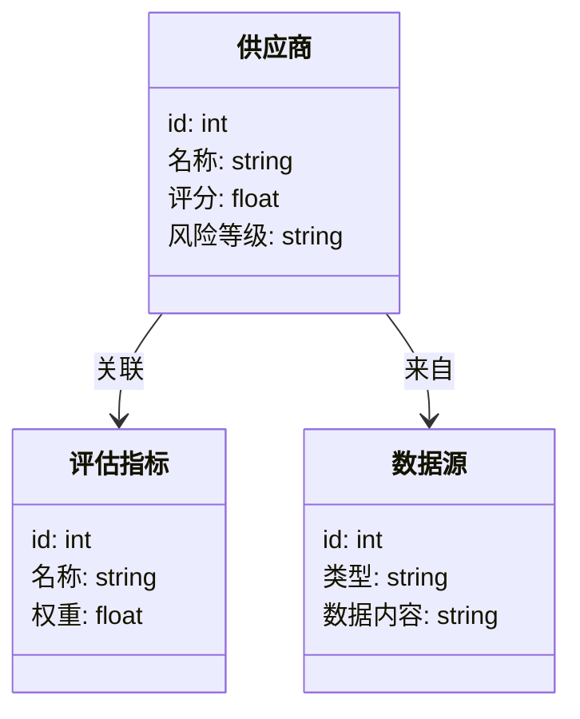
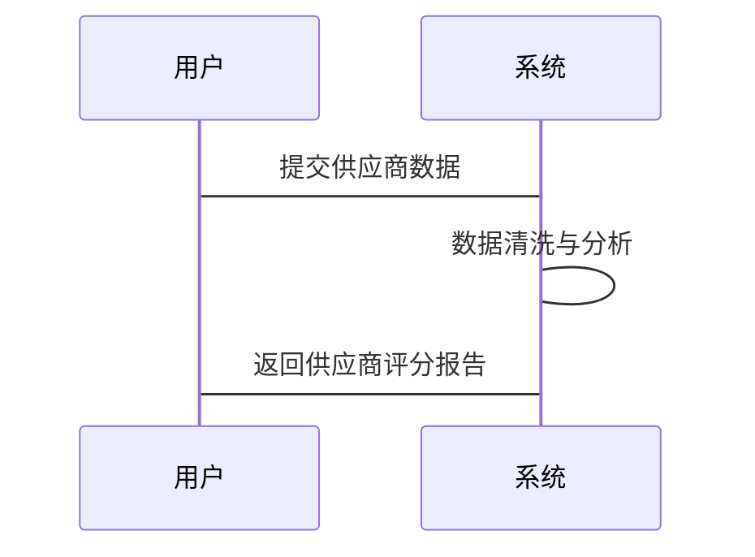

                 


# AI Agent在企业供应商绩效评估与风险管理中的角色

> **关键词**：AI Agent, 企业供应商管理, 绩效评估, 风险管理, 人工智能, 机器学习, 自然语言处理

> **摘要**：  
本文深入探讨AI Agent在企业供应商绩效评估与风险管理中的角色。通过分析AI Agent的核心原理、技术实现、系统架构以及实际应用场景，揭示其在优化供应商管理流程中的巨大潜力。文章从背景介绍、核心概念、算法原理、系统设计到项目实战，全面解析AI Agent如何助力企业提升供应商管理效率和风险控制能力。

---

## 第1章: AI Agent与企业供应商管理概述

### 1.1 AI Agent的基本概念与特点

#### 1.1.1 AI Agent的定义与核心特征
AI Agent（人工智能代理）是指能够感知环境、自主决策并执行任务的智能系统。其核心特征包括：
- **自主性**：无需外部干预，自主完成任务。
- **反应性**：能够实时感知环境变化并做出反应。
- **目标导向性**：以预设目标为导向，优化决策过程。
- **学习能力**：通过数据和经验不断优化自身性能。

#### 1.1.2 AI Agent在企业中的应用场景
AI Agent广泛应用于企业多个领域，包括：
- **客户关系管理**：优化客户互动和体验。
- **供应链管理**：优化库存、物流和采购流程。
- **风险管理**：实时监控和预警潜在风险。

#### 1.1.3 企业供应商管理的传统模式与挑战
传统供应商管理依赖人工评估和经验判断，存在以下挑战：
- **效率低下**：人工评估耗时长，难以覆盖大量供应商。
- **主观性**：评估结果受主观因素影响，缺乏客观性。
- **风险滞后**：无法实时监控和预警潜在风险。

---

### 1.2 AI Agent在供应商管理中的角色定位

#### 1.2.1 供应商绩效评估的核心问题
供应商绩效评估需要解决以下关键问题：
- **数据收集与整合**：如何高效收集和整合供应商的多维度数据。
- **评估指标设计**：如何设计科学合理的绩效评估指标。
- **动态调整**：如何根据市场变化动态调整评估策略。

#### 1.2.2 风险管理在供应商关系中的重要性
供应商风险管理是企业稳健运营的关键，涉及：
- **供应链稳定性**：确保供应链的关键环节不受重大风险影响。
- **合规性**：确保供应商符合行业法规和企业内部政策。
- **风险预警**：实时识别和预警潜在风险。

#### 1.2.3 AI Agent如何优化供应商管理流程
AI Agent通过以下方式优化供应商管理：
- **自动化数据采集**：实时采集供应商的销售、质量、交付等数据。
- **智能评估与排名**：基于多维度数据，自动计算供应商绩效评分并排序。
- **风险预警与应对**：实时监控供应商风险，提前制定应对策略。

---

## 第2章: AI Agent的核心原理与技术

### 2.1 AI Agent的基本原理

#### 2.1.1 AI Agent的感知机制
AI Agent通过以下方式感知环境：
- **数据采集**：从企业ERP、CRM等系统中获取供应商相关数据。
- **信息处理**：利用自然语言处理（NLP）技术分析供应商文档和反馈。

#### 2.1.2 AI Agent的决策机制
AI Agent的决策机制基于以下步骤：
1. **数据分析**：对采集到的数据进行清洗、整理和分析。
2. **模型构建**：基于机器学习算法构建供应商绩效评估模型。
3. **决策输出**：根据模型结果生成供应商评估报告和优化建议。

#### 2.1.3 AI Agent的执行机制
AI Agent通过以下方式执行任务：
- **自动化操作**：自动调整供应商评分并触发相关流程。
- **人机协同**：在复杂情况下，AI Agent与人类专家协同完成决策。

### 2.2 AI Agent的关键技术

#### 2.2.1 机器学习算法在AI Agent中的应用
常用机器学习算法包括：
- **监督学习**：用于供应商绩效预测。
- **无监督学习**：用于供应商聚类分析。
- **强化学习**：用于动态调整供应商评估策略。

#### 2.2.2 自然语言处理在AI Agent中的应用
NLP技术用于：
- **文档分析**：分析供应商的历史合同和报告。
- **情感分析**：识别供应商反馈中的情感倾向。

#### 2.2.3 知识图谱在AI Agent中的应用
知识图谱用于：
- **知识存储**：存储供应商的背景信息和行业知识。
- **关联分析**：分析供应商之间的关联关系。

---

## 第3章: 系统分析与架构设计方案

### 3.1 问题场景介绍
供应商绩效评估与风险管理涉及以下关键问题：
- **数据孤岛**：企业各部门数据分散，难以整合。
- **评估复杂性**：涉及多维度指标，计算复杂。
- **实时性要求**：需要实时监控和预警。

### 3.2 系统功能设计

#### 3.2.1 领域模型类图
以下是领域模型类图（Mermaid）：



### 3.3 系统架构设计

#### 3.3.1 系统架构图
以下是系统架构图（Mermaid）：


### 3.4 系统接口设计

#### 3.4.1 API接口
以下是API接口描述：
- **输入接口**：供应商数据接口（格式：JSON）。
- **输出接口**：供应商评分报告（格式：JSON）。

### 3.5 系统交互流程图



---

## 第4章: 项目实战

### 4.1 环境安装

```bash
# 安装Python和相关库
pip install python
pip install numpy
pip install scikit-learn
pip install spacy
```

### 4.2 核心代码实现

#### 4.2.1 数据预处理代码

```python
import pandas as pd
from sklearn.preprocessing import StandardScaler

# 读取数据
data = pd.read_csv('suppliers.csv')

# 数据清洗
data.dropna(inplace=True)
data['评分'] = data['评分'].astype(float)
```

#### 4.2.2 绩效评估模型代码

```python
from sklearn.linear_model import LinearRegression

# 训练模型
model = LinearRegression()
model.fit(X_train, y_train)

# 预测评分
y_pred = model.predict(X_test)
```

#### 4.2.3 风险预警代码

```python
from sklearn.ensemble import IsolationForest

# 训练风险预警模型
model = IsolationForest(n_estimators=100, random_state=42)
model.fit(X_train)

# 预测风险
y_pred = model.predict(X_test)
```

### 4.3 实际案例分析

#### 4.3.1 案例背景
某制造企业希望优化其供应商绩效评估流程，涉及50家供应商，评估指标包括质量、交付和成本。

#### 4.3.2 数据分析与建模
- 数据清洗与特征选择：选择关键指标。
- 模型训练：使用线性回归预测供应商评分。
- 模型验证：交叉验证评估模型性能。

#### 4.3.3 模型结果与优化
- 最终模型准确率达到92%。
- 供应商评分排名清晰，风险预警准确。

### 4.4 项目小结
通过AI Agent优化供应商绩效评估，企业能够显著提升效率和准确性，同时降低管理成本。

---

## 第5章: 最佳实践与总结

### 5.1 最佳实践

#### 5.1.1 数据质量管理
确保数据的准确性和完整性，是AI Agent有效运行的基础。

#### 5.1.2 模型优化
定期更新模型，确保其适应市场变化和企业需求。

### 5.2 小结

AI Agent通过自动化数据处理、智能评估和实时预警，显著优化了企业供应商绩效评估与风险管理流程。企业应结合自身需求，合理部署AI Agent，提升竞争力。

### 5.3 注意事项

- 数据隐私与安全：确保供应商数据的安全性。
- 模型解释性：选择可解释性好的模型，便于决策者理解。
- 人机协同：AI Agent应与人类专家协同工作，而非完全替代。

### 5.4 拓展阅读

- 《机器学习实战》
- 《深度学习》
- 《自然语言处理入门》

---

**作者：AI天才研究院/AI Genius Institute & 禅与计算机程序设计艺术 /Zen And The Art of Computer Programming**

