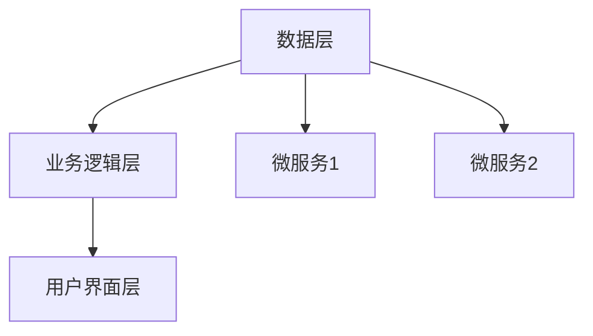
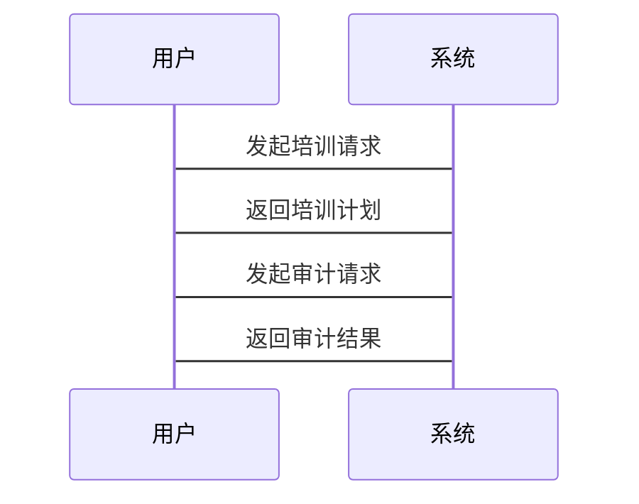

                 


# AI Agent在企业合规培训与审计中的创新应用

> 关键词：AI Agent，企业合规，培训，审计，人工智能，算法，系统架构

> 摘要：本文详细探讨了AI Agent在企业合规培训与审计中的创新应用。通过分析AI Agent的核心概念、算法原理、系统架构，并结合实际案例，展示了AI技术如何提升企业合规效率与准确性。文章还提供了最佳实践建议，帮助企业在数字化转型中更好地应用AI技术。

---

## 第1章: AI Agent与企业合规概述

### 1.1 AI Agent的基本概念

#### 1.1.1 AI Agent的定义与特点
AI Agent（人工智能代理）是一种能够感知环境、做出决策并执行任务的智能系统。它具备以下特点：
- **自主性**：能够在没有外部干预的情况下运行。
- **反应性**：能够根据环境变化实时调整行为。
- **目标导向**：通过设定目标来优化决策过程。
- **学习能力**：通过数据和经验不断优化自身性能。

#### 1.1.2 AI Agent在企业中的作用
AI Agent在企业中可以用于多种场景，例如自动化任务处理、数据分析、风险评估等。在合规领域，AI Agent能够帮助企业高效执行培训与审计任务，提升合规效率。

#### 1.1.3 企业合规的重要性
企业合规是指企业在经营活动中遵守相关法律法规和行业标准。合规不仅是企业合法经营的基础，也是企业风险管理的重要组成部分。随着法律法规的复杂化，传统的人工合规方式效率低下，容易出错，亟需技术手段的支撑。

### 1.2 AI Agent在企业合规中的应用背景

#### 1.2.1 企业合规培训的现状与挑战
传统的合规培训依赖于人工讲解和文档阅读，员工参与度低，效果难以评估。企业需要一种更高效、个性化的培训方式。

#### 1.2.2 企业审计的传统方法与局限性
传统审计方法依赖于人工检查，效率低、成本高，且容易受到主观因素影响。审计范围受限，难以覆盖所有业务场景。

#### 1.2.3 AI技术在合规领域的创新应用
AI技术的引入为合规培训与审计带来了新的可能性。AI Agent能够通过自然语言处理、机器学习等技术，实现智能化的合规管理和风险评估。

### 1.3 本章小结
本章介绍了AI Agent的基本概念及其在企业合规中的重要性，分析了传统合规培训与审计的局限性，并提出了AI技术在合规领域的创新应用方向。

---

## 第2章: AI Agent的核心概念与工作原理

### 2.1 AI Agent的核心概念

#### 2.1.1 AI Agent的感知模块
感知模块负责收集环境中的数据，包括文档、员工行为记录等。通过自然语言处理技术，AI Agent能够理解文本内容并提取关键信息。

#### 2.1.2 AI Agent的决策模块
决策模块基于感知到的信息，结合预设的合规规则，生成决策建议。例如，在审计场景中，AI Agent可以识别潜在的违规行为并提出改进建议。

#### 2.1.3 AI Agent的执行模块
执行模块负责将决策模块的建议转化为具体行动，例如生成培训计划、触发报警机制等。

### 2.2 AI Agent与传统规则引擎的对比

#### 2.2.1 传统规则引擎的特点
传统规则引擎通过预设的规则进行判断，缺乏灵活性和学习能力。例如，传统的合规系统只能处理简单的规则，无法应对复杂场景。

#### 2.2.2 AI Agent的优势与创新
AI Agent结合了机器学习和自然语言处理技术，能够动态优化规则，适应复杂多变的合规要求。例如，AI Agent可以通过历史数据学习，自动调整合规阈值。

#### 2.2.3 AI Agent与传统技术的结合
AI Agent可以与传统规则引擎结合使用，取长补短。例如，在处理简单规则时，仍然依赖传统引擎，而在复杂场景中则启用AI Agent进行深度分析。

### 2.3 AI Agent在合规中的核心要素

#### 2.3.1 数据源的多样性与整合
AI Agent需要整合多种数据源，例如企业文档、员工行为数据、外部法规信息等。通过数据整合，AI Agent能够全面理解企业的合规状况。

#### 2.3.2 知识库的构建与管理
AI Agent需要一个动态更新的知识库，包含最新的法律法规和行业标准。知识库的管理需要结合自然语言处理技术，实现自动化更新。

#### 2.3.3 合规规则的动态更新与优化
AI Agent能够通过机器学习算法，动态优化合规规则。例如，基于历史审计数据，AI Agent可以识别高频违规点，并自动生成优化建议。

### 2.4 本章小结
本章详细介绍了AI Agent的核心概念和工作原理，分析了AI Agent与传统技术的区别，并探讨了其在合规管理中的核心要素。

---

## 第3章: AI Agent的算法原理与数学模型

### 3.1 AI Agent的核心算法

#### 3.1.1 强化学习算法
强化学习是一种通过试错机制优化决策的算法。例如，AI Agent可以在模拟环境中反复尝试，找到最优的合规策略。

#### 3.1.2 监督学习算法
监督学习算法通过标记数据进行训练，例如，AI Agent可以通过分析历史审计数据，学习如何识别潜在的违规行为。

#### 3.1.3 聚类与分类算法
聚类算法用于将相似的合规问题分组，分类算法用于对问题进行标签化管理。例如，AI Agent可以通过分类算法将审计结果分为“合规”和“不合规”两类。

### 3.2 AI Agent的数学模型

#### 3.2.1 强化学习的Q-learning算法
Q-learning算法通过状态-动作-奖励机制优化决策。数学模型如下：
$$ Q(s, a) = Q(s, a) + \alpha (r + \max Q(s', a') - Q(s, a)) $$
其中，\( Q(s, a) \) 表示在状态 \( s \) 下采取动作 \( a \) 的价值，\( \alpha \) 是学习率，\( r \) 是奖励，\( s' \) 是下一个状态。

#### 3.2.2 监督学习的线性回归模型
线性回归模型用于预测合规风险。数学模型如下：
$$ y = \beta_0 + \beta_1 x_1 + \beta_2 x_2 + \cdots + \beta_n x_n $$
其中，\( y \) 是预测的合规风险，\( x_i \) 是输入特征，\( \beta_i \) 是回归系数。

#### 3.2.3 聚类算法的K-means模型
K-means算法用于将合规问题聚类。数学模型如下：
$$ \min_{K} \sum_{i=1}^{K} \sum_{j=1}^{n_i} (x_j - c_i)^2 $$
其中，\( c_i \) 是第 \( i \) 个聚类中心，\( n_i \) 是第 \( i \) 个聚类中的样本数。

### 3.3 本章小结
本章介绍了AI Agent的核心算法，包括强化学习、监督学习和聚类算法，并通过数学公式详细解释了它们的实现原理。

---

## 第4章: AI Agent的系统架构与设计

### 4.1 系统分析与设计

#### 4.1.1 问题场景介绍
企业合规培训与审计系统需要处理海量数据，实时响应员工的培训需求，并快速完成审计任务。

#### 4.1.2 系统功能设计
系统功能包括：
- **知识库管理**：存储法律法规、合规规则等信息。
- **培训模块**：为员工提供个性化的合规培训。
- **审计模块**：自动执行审计任务，生成审计报告。

#### 4.1.3 系统架构设计
系统架构采用分层设计，包括数据层、业务逻辑层和用户界面层。系统采用微服务架构，确保各模块独立运行。

### 4.2 系统架构图


### 4.3 系统接口设计
系统接口包括：
- **培训接口**：接收员工信息，返回个性化培训计划。
- **审计接口**：接收审计请求，返回审计结果。

### 4.4 系统交互图


### 4.5 本章小结
本章详细介绍了AI Agent系统的架构与设计，包括功能模块、架构图和交互图。

---

## 第5章: 项目实战

### 5.1 环境搭建

#### 5.1.1 技术选型
选择Python作为开发语言，使用TensorFlow和Keras框架实现AI算法，采用Django框架开发Web界面。

#### 5.1.2 环境配置
安装必要的库：
```bash
pip install tensorflow numpy scikit-learn django
```

### 5.2 核心代码实现

#### 5.2.1 强化学习算法实现
```python
import numpy as np

class AIAgent:
    def __init__(self, state_space, action_space):
        self.state_space = state_space
        self.action_space = action_space
        self.q_table = np.zeros((state_space, action_space))
    
    def choose_action(self, state, epsilon=0.1):
        if np.random.random() < epsilon:
            return np.random.randint(self.action_space)
        else:
            return np.argmax(self.q_table[state])
    
    def update_q_table(self, state, action, reward, next_state, learning_rate=0.1):
        self.q_table[state, action] += learning_rate * (reward + np.max(self.q_table[next_state]) - self.q_table[state, action])
```

#### 5.2.2 监督学习模型实现
```python
from sklearn.linear_model import LinearRegression

class CompliancePredictor:
    def __init__(self):
        self.model = LinearRegression()
    
    def train(self, X, y):
        self.model.fit(X, y)
    
    def predict(self, X):
        return self.model.predict(X)
```

### 5.3 实际案例分析
通过实际案例分析，展示了AI Agent如何在企业合规培训与审计中发挥作用。例如，AI Agent可以根据员工的历史行为数据，自动生成个性化的培训计划，并在审计过程中实时识别潜在风险。

### 5.4 本章小结
本章通过实际项目案例，展示了AI Agent在企业合规中的应用，详细讲解了核心代码的实现和实际效果。

---

## 第6章: 最佳实践与总结

### 6.1 最佳实践
- **数据质量管理**：确保数据的准确性和完整性。
- **模型优化**：定期更新模型，适应新的法规变化。
- **用户隐私保护**：在处理员工数据时，严格遵守隐私保护要求。

### 6.2 小结
本文详细探讨了AI Agent在企业合规培训与审计中的创新应用，从理论到实践，展示了其在提升企业合规效率和准确性方面的巨大潜力。

### 6.3 注意事项
- **技术选型**：选择适合企业需求的技术方案。
- **团队协作**：AI Agent的开发需要多部门协作。
- **持续优化**：定期评估系统性能并进行优化。

### 6.4 拓展阅读
建议读者进一步阅读以下资料：
- 《机器学习实战》
- 《深入理解强化学习》
- 《企业合规管理指南》

---

## 作者：AI天才研究院 & 禅与计算机程序设计艺术

---

通过以上结构和内容，本文全面系统地介绍了AI Agent在企业合规培训与审计中的创新应用，为企业的数字化转型提供了有益的参考和指导。

