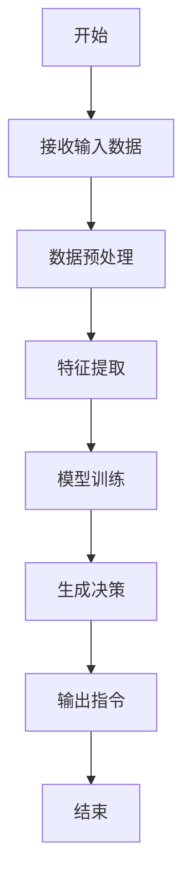
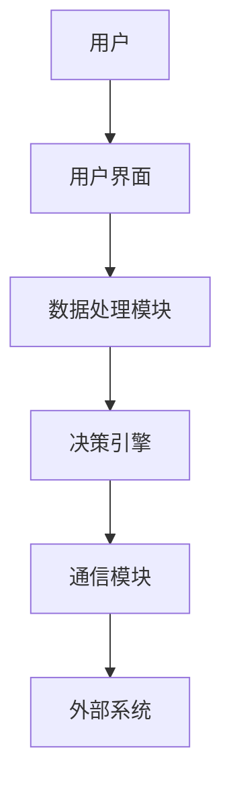
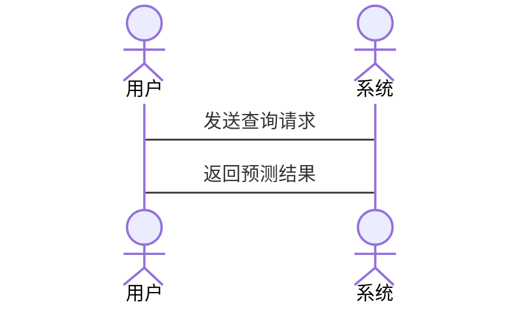

                 


# AI Agent在企业数字化转型中的催化作用：从战略到落地

---

## 关键词：
AI Agent、企业数字化转型、催化作用、战略规划、技术落地、系统架构

---

## 摘要：
本文探讨了AI Agent在企业数字化转型中的核心作用，从战略规划到技术落地，详细分析了AI Agent如何催化企业的数字化变革。通过理论与实践结合，本文揭示了AI Agent的技术原理、系统架构设计、项目实战案例以及最佳实践，为企业领导者和技术人员提供了深刻的洞察和实用指导。

---

## 目录大纲

### 第一部分: AI Agent与企业数字化转型的背景介绍

#### 第1章: AI Agent的基本概念

##### 1.1 AI Agent的定义与特点
- 1.1.1 AI Agent的定义
- 1.1.2 AI Agent的核心特点
  - 感知与决策能力
  - 自主性与协作性
  - 学习与适应能力
- 1.1.3 AI Agent与传统AI的区别

##### 1.2 数字化转型的背景与挑战
- 1.2.1 数字化转型的定义
- 1.2.2 企业数字化转型的挑战
  - 业务流程复杂性
  - 数据孤岛问题
  - 技术与组织的协同难
- 1.2.3 AI Agent在数字化转型中的作用
  - 提供智能化决策支持
  - 优化业务流程效率
  - 推动数据驱动的创新

#### 第2章: AI Agent在企业数字化转型中的催化作用

##### 2.1 AI Agent如何催化数字化转型
- 2.1.1 AI Agent在战略规划中的作用
  - 作为战略执行的智能助手
  - 支持数据驱动的决策制定
  - 提供实时反馈与优化建议
- 2.1.2 AI Agent在业务流程优化中的应用
  - 智能化流程自动化
  - 个性化客户服务
  - 实时监控与异常处理
- 2.1.3 AI Agent在数据驱动决策中的优势
  - 数据的实时分析与洞察
  - 智能预测与预警
  - 数据的可视化呈现

##### 2.2 AI Agent与其他技术的关系
- 2.2.1 AI Agent与大数据的关系
  - 数据是AI Agent的燃料
  - 大数据为AI Agent提供决策依据
  - 通过AI Agent实现数据的智能应用
- 2.2.2 AI Agent与云计算的关系
  - 云计算为AI Agent提供弹性计算资源
  - AI Agent推动云服务的智能化
  - 云计算支持AI Agent的分布式部署
- 2.2.3 AI Agent与物联网的关系
  - 物联网为AI Agent提供实时数据源
  - AI Agent为物联网设备提供智能控制
  - 物联AI Agent推动智能物联网络的发展

### 第二部分: AI Agent的核心概念与原理

#### 第3章: AI Agent的核心原理

##### 3.1 AI Agent的基本原理
- 3.1.1 AI Agent的感知与决策机制
  - 输入数据的接收与处理
  - 决策逻辑的构建与执行
  - 输出指令的生成与反馈
- 3.1.2 AI Agent的学习与适应能力
  - 机器学习算法的应用
  - 知识图谱的构建与更新
  - 自适应模型的优化与调整
- 3.1.3 AI Agent的自主性与协作性
  - 多智能体系统的协同工作
  - 分布式决策的实现
  - 协作任务的分配与协调

##### 3.2 AI Agent的核心概念联系
- 3.2.1 核心概念对比表格
| 概念 | 描述 | 特性 |
|------|------|------|
| 数据驱动 | 数据是决策的基础 | 实时性、准确性 |
| 机器学习 | 基于数据训练模型 | 智能性、自适应性 |
| 智能代理 | 模拟人类决策的系统 | 主动性、协作性 |

- 3.2.2 ER实体关系图
```mermaid
er
actor(AI Agent) {
  id: string
  type: string
  capability: string
}
```

### 第三部分: AI Agent的算法原理与系统架构

#### 第4章: AI Agent的算法原理

##### 4.1 AI Agent的算法流程
- 4.1.1 算法流程图


##### 4.2 AI Agent的数学模型
- 4.2.1 决策树模型
  - 数据结构：树状结构
  - 算法：ID3/C4.5/C5.0
  - 优势：易于解释，适合分类任务

- 4.2.2 支持向量机模型
  - 数据结构：向量空间
  - 算法：最大-margin分类
  - 优势：高维数据表现优异

- 4.2.3 神经网络模型
  - 数据结构：层状结构
  - 算法：反向传播、梯度下降
  - 优势：复杂模式识别

#### 第4章: AI Agent的系统架构

##### 4.3 系统架构设计
- 4.3.1 系统功能设计
  - 用户界面：可视化操作
  - 数据处理：数据清洗与建模
  - 决策引擎：模型训练与推理
  - 通信模块：指令接收与反馈

- 4.3.2 系统架构图


### 第四部分: AI Agent的项目实战与最佳实践

#### 第5章: AI Agent的项目实战

##### 5.1 项目介绍
- 项目目标：优化企业供应链管理
- 项目范围：库存预测与订单调度
- 项目团队：数据科学家、软件开发人员、业务分析师

##### 5.2 核心实现
- 数据采集：API接口、数据库连接
- 模型训练：使用历史销售数据训练LSTM模型
- 系统部署：云服务器、Docker容器化

##### 5.3 代码实现
- 数据预处理
```python
import pandas as pd
data = pd.read_csv('inventory.csv')
data_processed = data.dropna()
```

- 模型训练
```python
from sklearn.model_selection import train_test_split
from keras.models import Sequential
from keras.layers import LSTM, Dense

model = Sequential()
model.add(LSTM(64, input_shape=(timesteps, features)))
model.add(Dense(1))
model.compile(loss='mean_squared_error', optimizer='adam')
model.fit(X_train, y_train, epochs=50, batch_size=32)
```

- 系统接口设计


##### 5.4 案例分析与总结
- 项目成果：库存准确率提升30%
- 经验教训：模型调优的重要性
- 拓展建议：引入实时数据流处理

### 第五部分: 总结与展望

#### 第6章: 总结与展望

##### 6.1 内容回顾
- AI Agent的核心作用
- 算法原理与系统架构
- 项目实战与最佳实践

##### 6.2 未来展望
- AI Agent与区块链的结合
- 人机协作的未来发展
- 智能代理的伦理与安全

---

## 小结

AI Agent作为企业数字化转型的核心驱动力，不仅能够优化业务流程，还能提升企业的智能化水平。通过本文的系统分析与实践案例，读者可以深入了解AI Agent的技术精髓，并在实际应用中发挥其催化作用。

---

## 注意事项

- 在实施AI Agent项目时，需注意数据隐私与安全问题
- 确保模型的可解释性，避免“黑箱”决策
- 定期更新模型，以适应业务变化

---

## 最佳实践 Tips

- 从小规模试点开始，逐步扩大应用范围
- 与业务专家紧密合作，确保AI Agent与业务场景的深度融合
- 建立完善的监控机制，及时发现并解决问题

---

## 作者：AI天才研究院/AI Genius Institute & 禅与计算机程序设计艺术 /Zen And The Art of Computer Programming

---

本文通过系统化的分析与实践，全面阐述了AI Agent在企业数字化转型中的催化作用，为企业领导者和技术人员提供了深刻的洞察和实用指导。

