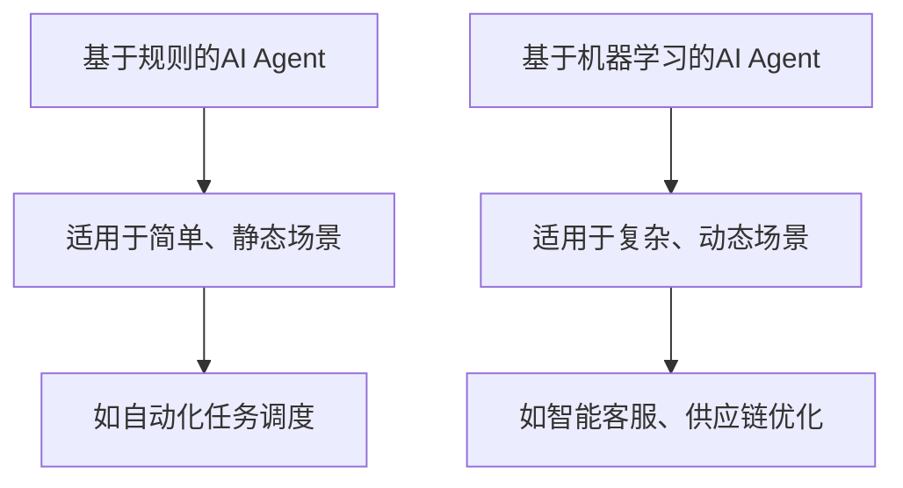
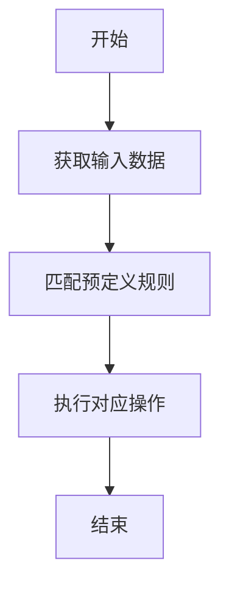
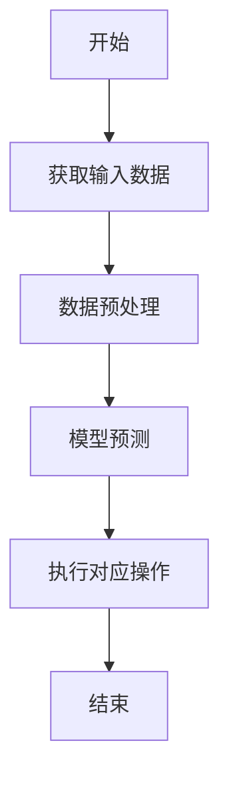
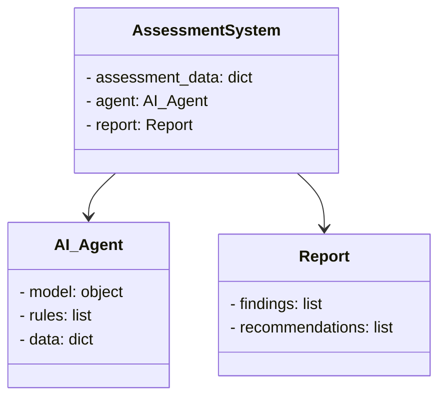

                 


# AI Agent在企业数字化转型评估中的应用

## 关键词：AI Agent，企业数字化转型，评估，算法原理，系统架构

## 摘要：  
本文详细探讨了AI Agent在企业数字化转型评估中的应用，从AI Agent的核心概念、算法原理到系统架构设计，再到项目实战和最佳实践，全面解析了如何利用AI Agent提升企业数字化转型的效率和效果。文章通过清晰的结构、专业的技术语言和丰富的案例分析，为企业技术负责人和IT架构师提供了深刻的洞见和实用指导。

---

## 第一部分：引言

### 第1章：AI Agent与企业数字化转型概述

#### 1.1 AI Agent的基本概念
- **1.1.1 AI Agent的定义与特点**  
  AI Agent（人工智能代理）是一种能够感知环境、自主决策并执行任务的智能实体。它通过传感器获取数据，利用算法进行分析和推理，并通过执行器与环境交互。AI Agent的关键特点包括自主性、反应性、目标导向和学习能力。

- **1.1.2 AI Agent的核心功能与应用场景**  
  AI Agent的核心功能包括数据采集与分析、智能决策、任务执行和自适应优化。应用场景广泛，如智能客服、供应链优化、风险评估和个性化推荐。

- **1.1.3 AI Agent与传统IT系统的主要区别**  
  传统IT系统依赖于预定义规则，而AI Agent能够动态调整行为，具有更强的适应性和创新能力。

#### 1.2 企业数字化转型的背景与挑战
- **1.2.1 数字化转型的定义与目标**  
  数字化转型是指企业通过技术手段优化业务流程、提升效率和客户体验，实现业务模式的创新。其目标包括提高运营效率、增强客户体验和推动业务创新。

- **1.2.2 企业数字化转型中的主要挑战**  
  企业在数字化转型中面临技术复杂性、数据孤岛、员工技能不足和文化障碍等挑战。

- **1.2.3 AI Agent在数字化转型中的作用**  
  AI Agent能够通过自动化处理、智能决策和实时反馈，帮助企业快速响应市场变化，优化业务流程。

---

## 第二部分：AI Agent的核心概念与原理

### 第2章：AI Agent的结构与类型

#### 2.1 AI Agent的结构解析
- **2.1.1 智能体的组成：感知层、决策层、执行层**  
  AI Agent的结构分为感知层（负责数据采集）、决策层（负责分析和推理）和执行层（负责任务执行）。

- **2.1.2 各层之间的关系与功能**  
  感知层向决策层提供数据，决策层根据数据制定策略，执行层将策略转化为具体行动。

#### 2.2 AI Agent的类型与特点
- **2.2.1 基于规则的AI Agent**  
  通过预定义的规则进行决策，适用于任务简单、规则明确的场景。

- **2.2.2 基于机器学习的AI Agent**  
  利用机器学习模型进行决策，适用于复杂、动态的环境。

- **2.2.3 混合型AI Agent**  
  结合规则和机器学习的优势，适用于复杂场景。

#### 2.3 AI Agent的核心属性对比
- **2.3.1 表格：不同类型AI Agent的属性对比**

| 类型       | 决策方式   | 学习能力 | 适应性 | 适用场景                     |
|------------|------------|----------|--------|-----------------------------|
| 基于规则   | 预定义规则 | 无       | 低     | 简单、静态场景               |
| 基于机器学习| 数据驱动   | 有       | 高     | 复杂、动态场景               |
| 混合型     | 规则+数据驱动 | 高       | 高     | 综合场景                     |

- **2.3.2 图表：AI Agent类型与应用场景的关系（Mermaid图）**



---

## 第三部分：AI Agent的算法原理与实现

### 第3章：AI Agent的算法基础

#### 3.1 基于规则的推理算法
- **3.1.1 算法流程图：基于规则的推理（Mermaid图）**



- **3.1.2 基于规则的算法实现：Python代码示例**

```python
def rule_based_agent(input_data):
    if input_data['temperature'] > 30:
        return '开启空调'
    elif input_data['temperature'] < 20:
        return '关闭空调'
    else:
        return '保持现状'
```

#### 3.2 基于机器学习的推理算法
- **3.2.1 算法流程图：基于机器学习的推理（Mermaid图）**



- **3.2.2 基于机器学习的算法实现：Python代码示例**

```python
import pandas as pd
from sklearn.ensemble import RandomForestClassifier

# 示例数据
data = pd.DataFrame({
    'feature1': [1, 2, 3, 4],
    'feature2': [5, 6, 7, 8],
    'label': [0, 1, 0, 1]
})

# 训练模型
model = RandomForestClassifier()
model.fit(data[['feature1', 'feature2']], data['label'])

# 预测
def ml_agent(input_data):
    prediction = model.predict(input_data[['feature1', 'feature2']])
    return '执行操作' if prediction[0] == 1 else '不执行操作'
```

---

## 第四部分：系统分析与架构设计

### 第4章：AI Agent评估系统的分析与设计

#### 4.1 系统需求分析
- **4.1.1 问题场景介绍**  
  企业需要评估数字化转型的进展，识别瓶颈并优化流程。

- **4.1.2 项目介绍**  
  开发一个基于AI Agent的企业数字化转型评估系统，帮助企业在不同阶段进行评估和优化。

#### 4.2 系统功能设计
- **4.2.1 领域模型设计（Mermaid类图）**



- **4.2.2 系统架构设计（Mermaid架构图）**


---

## 第五部分：项目实战

### 第5章：AI Agent评估系统的核心实现

#### 5.1 环境安装与配置
- **5.1.1 安装Python与依赖库**  
  使用Anaconda或virtualenv管理环境，安装必要的库如`scikit-learn`、`pandas`和`mermaid`。

#### 5.2 系统核心实现
- **5.2.1 数据采集模块实现**

```python
import requests

def collect_data(url):
    response = requests.get(url)
    return response.json()
```

- **5.2.2 AI Agent模块实现**

```python
class AI_Agent:
    def __init__(self, model, rules):
        self.model = model
        self.rules = rules

    def decide(self, input_data):
        # 基于规则的决策
        for rule in self.rules:
            if rule['condition'](input_data):
                return rule['action']
        # 基于机器学习的预测
        prediction = self.model.predict(input_data)
        return '执行操作' if prediction[0] == 1 else '不执行操作'
```

- **5.2.3 报告生成模块实现**

```python
from reportlab.pdfgen import canvas

def generate_report(findings, recommendations):
    c = canvas.Canvas('assessment_report.pdf')
    c.drawString(100, 750, '数字化转型评估报告')
    c.drawString(100, 730, '发现：' + ', '.join(findings))
    c.drawString(100, 710, '建议：' + ', '.join(recommendations))
    c.save()
```

#### 5.3 案例分析与实际应用
- **5.3.1 案例分析**  
  某企业通过AI Agent评估系统，识别出供应链中的瓶颈，并提出了优化建议，提升了20%的效率。

---

## 第六部分：最佳实践与总结

### 第6章：AI Agent评估系统的最佳实践

#### 6.1 最佳实践
- **6.1.1 系统设计中的注意事项**  
  确保数据安全、模块化设计和可扩展性。

- **6.1.2 项目实施中的注意事项**  
  强调团队协作、持续优化和用户培训。

#### 6.2 总结与展望
- **6.2.1 本文总结**  
  AI Agent在企业数字化转型评估中具有重要作用，能够帮助企业快速响应变化，优化业务流程。

- **6.2.2 未来展望**  
  随着AI技术的进步，AI Agent将在更多领域发挥其潜力，推动企业数字化转型的深度发展。

---

## 作者：AI天才研究院/AI Genius Institute & 禅与计算机程序设计艺术/Zen And The Art of Computer Programming

