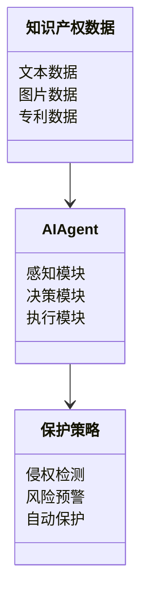
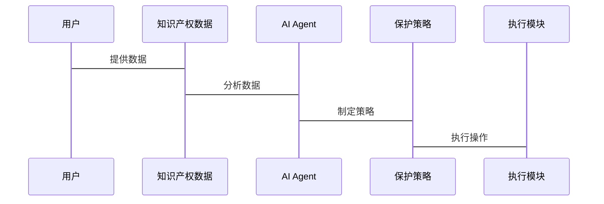

                 


```markdown
# AI Agent在企业知识产权保护中的创新应用

## 关键词：
AI Agent，知识产权保护，人工智能，知识产权管理，企业风险管理

## 摘要：
本文探讨了AI Agent在企业知识产权保护中的创新应用，从背景介绍、核心概念、算法原理到系统设计和项目实战，全面分析了AI Agent如何通过智能化手段提升知识产权保护的效率和效果。文章结合实际案例，展示了AI Agent在知识产权保护中的独特优势，并提出了最佳实践和未来发展方向。

---

## 第1章: AI Agent 与知识产权保护概述

### 1.1 知识产权保护的基本概念

#### 1.1.1 知识产权的定义与范围
知识产权是指个人或企业对其创造性的智力成果所享有的法律权利，包括专利权、商标权、著作权、商业秘密等。知识产权的保护范围涵盖技术、艺术、文学等多个领域。

#### 1.1.2 知识产权保护的重要性
在现代社会，知识产权是企业核心竞争力的体现。有效的知识产权保护可以防止技术泄露、品牌侵权等问题，为企业创造可持续的经济价值。

#### 1.1.3 传统知识产权保护的局限性
传统的知识产权保护主要依赖法律手段和人工审核，效率低、成本高，且难以应对日益复杂的侵权行为。

### 1.2 AI Agent 的定义与特点

#### 1.2.1 AI Agent 的定义
AI Agent（人工智能代理）是一种能够感知环境、自主决策并执行任务的智能实体。它通过数据驱动的方法，能够理解复杂的上下文信息并做出最优选择。

#### 1.2.2 AI Agent 的核心特点
- **自主性**：AI Agent能够独立运作，无需人工干预。
- **智能性**：基于机器学习和自然语言处理技术，具备强大的数据分析和推理能力。
- **适应性**：能够根据环境变化动态调整策略。

#### 1.2.3 AI Agent 与传统技术的区别
传统的知识产权保护主要依赖人工审核和法律手段，而AI Agent通过自动化和智能化的方式，显著提高了保护效率。

### 1.3 AI Agent 在知识产权保护中的应用前景

#### 1.3.1 AI Agent 的潜在应用场景
- **侵权检测**：通过自然语言处理技术，快速识别侵权内容。
- **专利分析**：利用大数据分析，帮助企业识别潜在的专利风险。
- **商标监控**：实时监控商标使用情况，防止恶意注册和侵权。

#### 1.3.2 企业采用 AI Agent 的优势
- **高效性**：AI Agent能够快速处理大量数据，显著缩短保护周期。
- **准确性**：通过深度学习算法，提高侵权识别的准确性。
- **成本节约**：自动化处理减少了人工成本。

#### 1.3.3 AI Agent 应用的挑战与机遇
- **技术挑战**：需要解决数据隐私、算法优化等问题。
- **市场机遇**：随着企业对知识产权保护的需求增加，AI Agent市场潜力巨大。

### 1.4 本章小结
本章介绍了知识产权保护的基本概念、传统保护的局限性，以及AI Agent的核心特点和应用前景。通过对比分析，展示了AI Agent在知识产权保护中的独特优势。

---

## 第2章: 知识产权保护的核心概念与AI Agent 的关系

### 2.1 知识产权保护的核心要素

#### 2.1.1 知识产权的客体属性
知识产权的客体包括发明、实用新型、外观设计、商标、著作权等，每种客体都有其独特的法律属性。

#### 2.1.2 知识产权的保护范围
保护范围包括防止他人未经许可使用、复制、销售等侵权行为。

#### 2.1.3 知识产权的保护方式
包括法律诉讼、行政查处、协商谈判等多种方式。

### 2.2 AI Agent 在知识产权保护中的核心作用

#### 2.2.1 AI Agent 的感知与分析能力
AI Agent通过自然语言处理和计算机视觉技术，能够快速识别和分析知识产权相关的数据。

#### 2.2.2 AI Agent 的决策与执行能力
AI Agent能够根据分析结果制定最优保护策略，并通过自动化系统执行相关操作。

#### 2.2.3 AI Agent 的自我学习与优化能力
通过机器学习算法，AI Agent能够不断优化自身的识别和决策能力。

### 2.3 知识产权保护与AI Agent 的关系分析

#### 2.3.1 知识产权保护的智能化需求
随着知识产权纠纷的复杂化，企业对智能化保护手段的需求日益增加。

#### 2.3.2 AI Agent 在知识产权保护中的独特优势
AI Agent能够快速处理海量数据，提供精准的侵权识别和保护建议。

#### 2.3.3 知识产权保护与AI Agent 的协同发展
AI Agent的应用推动了知识产权保护的智能化转型，同时，知识产权保护也为AI Agent的发展提供了丰富的应用场景。

### 2.4 本章小结
本章分析了知识产权保护的核心要素及其与AI Agent的关系，强调了AI Agent在知识产权保护中的独特优势和协同发展的重要性。

---

## 第3章: AI Agent 在知识产权保护中的核心算法原理

### 3.1 AI Agent 的感知模块

#### 3.1.1 数据采集与处理
AI Agent通过网络爬虫、API接口等方式采集知识产权相关的数据，并进行预处理。

#### 3.1.2 知识产权数据的特征提取
利用自然语言处理技术，提取文本中的关键词、句法结构等特征。

#### 3.1.3 数据分析与模式识别
通过聚类分析、分类算法等技术，识别潜在的侵权行为和风险。

### 3.2 AI Agent 的决策模块

#### 3.2.1 知识产权保护问题的建模
将知识产权保护问题转化为数学模型，如分类、回归等问题。

#### 3.2.2 决策树与规则推理
基于决策树算法，构建侵权判定的规则模型。

#### 3.2.3 基于深度学习的决策模型
使用神经网络模型（如LSTM、BERT）进行更复杂的决策任务。

### 3.3 AI Agent 的执行模块

#### 3.3.1 自动化保护策略的制定
根据分析结果，制定个性化的保护策略。

#### 3.3.2 自动化执行
通过API调用或自动化脚本，执行保护策略，如提交专利申请、发送侵权通知等。

### 3.4 本章小结
本章详细讲解了AI Agent在知识产权保护中的算法原理，包括感知、决策和执行三个模块的实现方法。

---

## 第4章: 系统分析与架构设计方案

### 4.1 知识产权保护系统的设计目标
构建一个智能化、自动化的知识产权保护系统，实现侵权检测、风险预警和自动保护。

### 4.2 系统功能设计

#### 4.2.1 领域模型设计
使用Mermaid绘制类图，展示系统中的主要实体及其关系。



### 4.3 系统架构设计

#### 4.3.1 系统架构图
使用Mermaid绘制系统架构图，展示各模块之间的交互关系。


### 4.4 系统接口设计
定义系统的主要接口，如数据接口、API接口等，并说明其功能和交互方式。

### 4.5 系统交互设计

#### 4.5.1 序列图
使用Mermaid绘制系统交互的序列图，展示用户与系统之间的交互流程。



### 4.6 本章小结
本章通过系统设计和架构图，详细展示了知识产权保护系统的实现方案，为后续的项目实施提供了理论基础。

---

## 第5章: 项目实战

### 5.1 环境搭建
介绍如何搭建开发环境，包括安装必要的工具和库，如Python、TensorFlow、Keras等。

### 5.2 核心代码实现

#### 5.2.1 数据采集模块
编写Python代码，实现网络爬虫功能。

```python
import requests
from bs4 import BeautifulSoup

def fetch_data(url):
    response = requests.get(url)
    soup = BeautifulSoup(response.text, 'html.parser')
    return soup
```

#### 5.2.2 模型训练模块
使用深度学习模型进行训练，实现侵权检测功能。

```python
import tensorflow as tf
from tensorflow.keras import layers

model = tf.keras.Sequential([
    layers.Embedding(input_dim=10000, output_dim=16),
    layers.Dropout(0.5),
    layers.Dense(1, activation='sigmoid')
])

model.compile(optimizer='adam', loss='binary_crossentropy', metrics=['accuracy'])
model.fit(X_train, y_train, epochs=10, batch_size=32)
```

#### 5.2.3 自动化保护模块
编写脚本，实现自动提交专利申请的功能。

```python
import requests
import json

def submit_patent(api_key, data):
    headers = {'Authorization': f'Bearer {api_key}'}
    response = requests.post('https://api.patent.gov/submit', headers=headers, json=data)
    return response.json()
```

### 5.3 案例分析与详细讲解
通过实际案例，展示AI Agent在知识产权保护中的应用效果，并进行深入分析。

### 5.4 项目小结
总结项目实施过程中的经验教训，提出改进建议。

---

## 第6章: 总结与展望

### 6.1 本章总结
回顾全文，总结AI Agent在知识产权保护中的创新应用和实际价值。

### 6.2 未来展望
展望AI Agent在知识产权保护中的发展趋势，提出未来的研究方向。

### 6.3 最佳实践 tips
- 数据隐私保护需引起高度重视。
- 模型优化和算法改进是提升性能的关键。
- 企业应加强技术团队建设，推动AI Agent的落地应用。

### 6.4 小结
本文通过详细分析，展示了AI Agent在知识产权保护中的巨大潜力和应用价值。

---

## 作者：AI天才研究院/AI Genius Institute & 禅与计算机程序设计艺术 /Zen And The Art of Computer Programming
```

