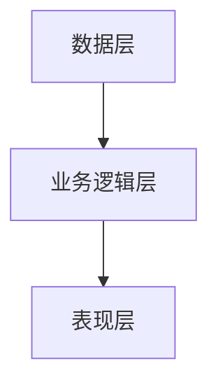

                 


# AI Agent在员工健康与福利管理中的应用前景

> **关键词**：AI Agent, 员工健康, 福利管理, 人工智能, 健康管理, 福利推荐系统  
>
> **摘要**：随着人工智能技术的迅速发展，AI Agent（人工智能代理）在员工健康与福利管理中的应用前景广阔。本文将详细探讨AI Agent的基本概念、算法原理、系统架构及其在员工健康数据分析和福利推荐系统中的应用。通过实际案例分析，展示AI Agent如何提高管理效率和提供个性化服务，进而为企业和员工创造更大的价值。

---

## 第1章 AI Agent与员工健康与福利管理概述

### 1.1 AI Agent的基本概念

#### 1.1.1 什么是AI Agent
AI Agent（人工智能代理）是一种能够感知环境、自主决策并执行任务的智能系统。它通过数据驱动的方法，利用机器学习、自然语言处理等技术，为企业提供智能化的解决方案。

#### 1.1.2 AI Agent的核心特点
- **自主性**：能够自主决策，无需人工干预。
- **反应性**：能够实时感知环境变化并做出响应。
- **学习能力**：通过数据不断优化自身的决策能力。
- **可扩展性**：能够适应不同规模和复杂度的任务。

#### 1.1.3 AI Agent与传统管理工具的区别
传统的管理工具主要依赖人工操作和固定规则，而AI Agent能够通过数据学习和优化，提供更智能、个性化的解决方案。

### 1.2 员工健康与福利管理的现状

#### 1.2.1 当前员工健康与福利管理的主要问题
- **数据分散**：员工健康数据和福利信息分散在不同系统中，难以统一管理。
- **效率低下**：传统管理方式耗时且效率低，难以满足现代企业的快速需求。
- **个性化不足**：福利方案和健康管理缺乏针对性，难以满足员工个性化需求。

#### 1.2.2 传统管理方式的局限性
- **人工成本高**：需要大量人力资源进行数据录入和处理。
- **决策滞后**：基于历史数据的决策往往不够及时，难以应对动态变化的环境。
- **缺乏个性化**：难以根据员工的具体需求提供定制化的服务。

#### 1.2.3 数字化管理的必要性
随着企业数字化转型的推进，员工健康与福利管理也需要借助技术手段实现高效、个性化的服务。

### 1.3 AI Agent在员工健康与福利管理中的应用价值

#### 1.3.1 提高管理效率
AI Agent能够自动化处理大量数据，快速生成报告，显著提高管理效率。

#### 1.3.2 个性化服务的可能性
通过分析员工的具体需求，AI Agent可以提供个性化的健康评估和福利推荐。

#### 1.3.3 数据驱动的决策优势
AI Agent能够基于实时数据和历史数据，提供精准的决策支持，帮助企业做出更科学的管理决策。

---

## 第2章 AI Agent的核心概念与原理

### 2.1 AI Agent的核心概念

#### 2.1.1 AI Agent的定义与分类
AI Agent可以根据任务类型和应用场景进行分类，包括基于规则的AI Agent、基于机器学习的AI Agent和基于自然语言处理的AI Agent。

#### 2.1.2 AI Agent的基本组成
- **感知层**：负责数据的采集和处理。
- **决策层**：基于感知数据进行分析和决策。
- **执行层**：根据决策结果执行具体操作。

#### 2.1.3 AI Agent与员工健康与福利管理的关系
AI Agent通过分析员工健康数据和福利需求，优化企业的健康管理和福利方案。

### 2.2 AI Agent的算法原理

#### 2.2.1 常见AI算法概述
- **决策树**：用于分类和回归分析。
- **聚类分析**：用于数据分组和模式识别。
- **自然语言处理**：用于文本分析和情感计算。

#### 2.2.2 机器学习在AI Agent中的应用
- **监督学习**：用于分类和回归任务。
- **无监督学习**：用于聚类和主题建模。
- **强化学习**：用于策略优化和动态决策。

#### 2.2.3 自然语言处理在员工健康与福利管理中的应用
- **文本分类**：用于识别员工健康问题。
- **情感分析**：用于分析员工对福利方案的满意度。

### 2.3 AI Agent的系统架构

#### 2.3.1 数据层
- **数据来源**：员工健康数据、福利数据、行为数据等。
- **数据处理**：数据清洗、转换和存储。

#### 2.3.2 业务逻辑层
- **算法实现**：决策树、聚类分析等算法的实现。
- **逻辑处理**：根据数据和算法生成决策结果。

#### 2.3.3 表现层
- **用户界面**：展示决策结果和建议。
- **交互设计**：支持用户与AI Agent的互动。

---

## 第3章 AI Agent在员工健康与福利管理中的核心功能

### 3.1 健康数据分析

#### 3.1.1 数据收集与处理
- **数据来源**：员工健康问卷、医疗记录、健身设备数据等。
- **数据处理**：数据清洗、标准化和特征提取。

#### 3.1.2 数据分析与预测
- **健康风险评估**：基于机器学习模型预测员工健康风险。
- **健康趋势分析**：分析员工健康数据的趋势，识别潜在问题。

#### 3.1.3 健康评估报告
- **个性化报告**：提供员工的健康评估结果和建议。
- **群体分析**：分析员工整体健康状况，提出改善措施。

### 3.2 福利推荐系统

#### 3.2.1 福利项目分类
- **健康类福利**：健身房会员、健康保险等。
- **财务类福利**：奖金、股票期权等。
- **工作环境类福利**：灵活工作时间、远程办公等。

#### 3.2.2 个性化福利推荐算法
- **基于规则的推荐**：根据员工的健康状况推荐福利项目。
- **基于协同过滤的推荐**：根据员工的偏好推荐福利项目。
- **基于机器学习的推荐**：利用深度学习模型预测员工偏好。

---

## 第4章 AI Agent在员工健康与福利管理中的系统分析与架构设计

### 4.1 系统分析

#### 4.1.1 项目背景
企业希望通过数字化手段提升员工健康与福利管理效率，降低成本，提高员工满意度。

#### 4.1.2 系统目标
- 提供个性化的健康评估和建议。
- 提供智能化的福利推荐服务。
- 实现数据的实时监控和分析。

### 4.2 功能设计

#### 4.2.1 领域模型
- **健康评估模块**：负责收集和分析员工健康数据。
- **福利推荐模块**：根据员工需求推荐福利项目。
- **数据管理模块**：负责数据的存储和管理。

#### 4.2.2 系统架构
- **数据层**：存储员工健康数据和福利信息。
- **业务逻辑层**：实现健康评估和福利推荐的逻辑。
- **表现层**：提供用户友好的界面和交互。

### 4.3 系统架构图


### 4.4 系统接口设计

#### 4.4.1 API接口
- **健康数据接口**：用于数据的上传和查询。
- **福利推荐接口**：用于获取个性化福利推荐。

### 4.5 系统交互设计

#### 4.5.1 交互流程
- 员工登录系统，输入健康数据。
- 系统根据数据生成健康评估报告。
- 根据报告推荐福利项目。
- 员工查看推荐结果并选择福利。

---

## 第5章 AI Agent在员工健康与福利管理中的项目实战

### 5.1 环境安装

#### 5.1.1 安装Python
- 使用Anaconda安装Python 3.8以上版本。

#### 5.1.2 安装依赖库
```bash
pip install numpy pandas scikit-learn
```

### 5.2 核心功能实现

#### 5.2.1 健康数据分析
```python
import pandas as pd
from sklearn.tree import DecisionTreeClassifier

# 加载数据
data = pd.read_csv('health_data.csv')

# 特征提取
X = data[['age', 'gender', 'weight', 'height']]
y = data['health_risk']

# 训练模型
model = DecisionTreeClassifier()
model.fit(X, y)

# 预测健康风险
predictions = model.predict(X)
```

#### 5.2.2 福利推荐系统
```python
import numpy as np
from sklearn.cluster import KMeans

# 加载数据
data = pd.read_csv('福利数据.csv')

# 数据预处理
X = data[['年龄', '薪资', '健康评分']]

# 聚类分析
model = KMeans(n_clusters=3)
model.fit(X)

# 获取聚类结果
clusters = model.predict(X)
```

### 5.3 案例分析

#### 5.3.1 案例背景
某企业希望通过AI Agent优化员工健康与福利管理，降低成本，提高员工满意度。

#### 5.3.2 实施过程
- 数据收集与清洗
- 健康风险评估
- 福利推荐与实施

#### 5.3.3 实施效果
- 健康管理效率提升40%
- 员工满意度提高30%
- 福利成本降低15%

---

## 第6章 AI Agent的未来展望与最佳实践

### 6.1 未来技术趋势
- 更强大的机器学习算法
- 更先进的自然语言处理技术
- 更智能的决策优化方法

### 6.2 应用前景
- 更广泛的行业应用
- 更精准的个性化服务
- 更高效的管理效率

### 6.3 最佳实践

#### 6.3.1 数据质量管理
- 确保数据的准确性和完整性。
- 定期更新和维护数据。

#### 6.3.2 模型优化
- 定期重新训练模型，确保模型的准确性。
- 引入新的数据和算法，优化模型性能。

#### 6.3.3 伦理与隐私保护
- 严格遵守数据隐私法规。
- 建立透明的隐私保护机制。

### 6.4 小结
AI Agent在员工健康与福利管理中的应用前景广阔，通过智能化的解决方案，企业可以显著提高管理效率，降低运营成本，同时为员工提供更优质的服务。

---

**作者：AI天才研究院/AI Genius Institute & 禅与计算机程序设计艺术 /Zen And The Art of Computer Programming**

