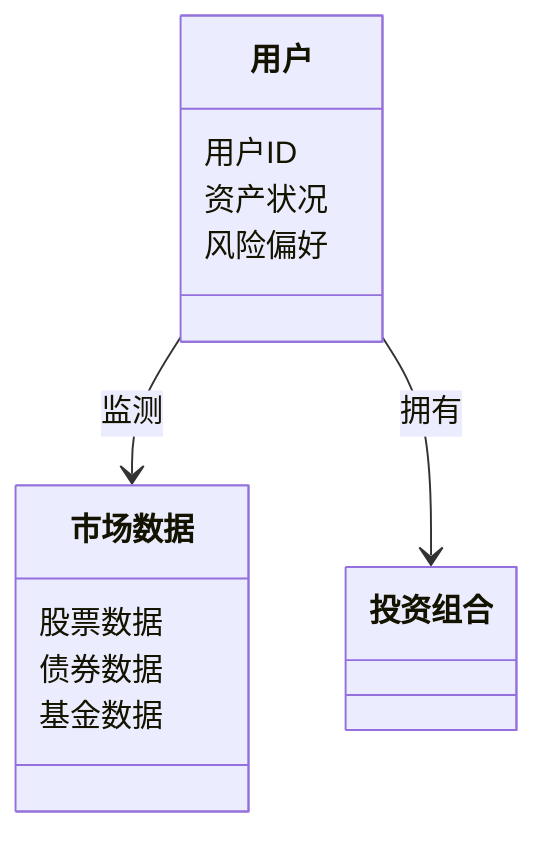
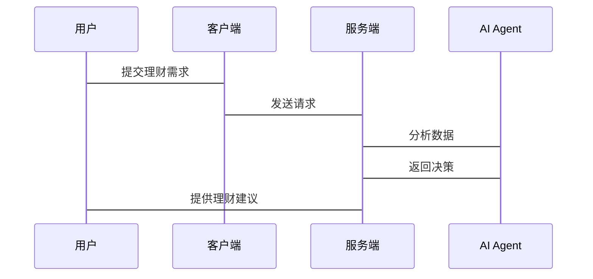

                 


# AI Agent在智能个人理财中的角色

## 关键词：AI Agent，智能理财，个人理财，人工智能，机器学习

## 摘要：AI Agent在智能个人理财中的角色，探讨其在智能理财中的背景、技术基础、核心概念、算法原理及系统架构设计，通过实际案例分析AI Agent如何帮助用户实现智能化的理财管理。

---

## 第1章: AI Agent与智能个人理财的背景介绍

### 1.1 AI Agent的基本概念

#### 1.1.1 AI Agent的定义
AI Agent，即人工智能代理，是一种能够感知环境并采取行动以实现目标的智能实体。在智能个人理财中，AI Agent通常以软件形式存在，能够通过数据输入做出决策并执行任务。

#### 1.1.2 AI Agent的核心特征
- **自主性**：AI Agent能够自主决策，无需人工干预。
- **反应性**：能够实时感知环境变化并做出反应。
- **学习能力**：通过机器学习算法不断优化决策模型。

#### 1.1.3 AI Agent在智能理财中的应用价值
AI Agent能够帮助用户进行资产配置、风险评估、投资组合优化等，显著提升理财效率和准确性。

### 1.2 智能个人理财的背景与现状

#### 1.2.1 传统个人理财的痛点与挑战
- **信息不对称**：传统理财依赖人工分析，效率低且成本高。
- **决策延迟**：市场变化快，传统方法难以及时响应。

#### 1.2.2 智能理财的兴起与发展
- **技术进步**：大数据和人工智能的发展推动智能理财的普及。
- **用户体验提升**：智能理财通过个性化服务提高用户体验。

#### 1.2.3 AI Agent在智能理财中的角色定位
AI Agent作为智能理财的核心，负责数据处理、决策制定和任务执行。

### 1.3 本章小结
本章介绍了AI Agent的基本概念及其在智能理财中的应用价值，分析了传统理财的痛点和智能理财的发展趋势，明确了AI Agent在智能理财中的角色。

---

## 第2章: AI Agent的技术基础

### 2.1 机器学习基础

#### 2.1.1 机器学习的基本概念
机器学习是一种人工智能技术，通过数据训练模型，使其能够进行预测和分类。

#### 2.1.2 常见的机器学习算法
- **决策树**：用于分类和回归。
- **随机森林**：通过集成学习提高准确性。
- **支持向量机（SVM）**：用于分类和回归。

#### 2.1.3 机器学习在理财中的应用
- **风险评估**：通过机器学习模型预测投资风险。
- **资产配置**：根据市场数据优化资产分配。

### 2.2 自然语言处理（NLP）基础

#### 2.2.1 NLP的基本概念
NLP是人工智能的分支，用于处理和理解人类语言。

#### 2.2.2 NLP在理财中的应用
- **文本分析**：分析财经新闻，提取市场信息。
- **用户交互**：通过自然语言理解用户需求。

#### 2.2.3 常见的NLP技术
- **分词**：将文本分割成词语。
- **实体识别**：识别文本中的关键实体。
- **情感分析**：分析文本中的情感倾向。

### 2.3 知识图谱与规则引擎

#### 2.3.1 知识图谱的基本概念
知识图谱是结构化的知识表示，用于存储实体及其关系。

#### 2.3.2 规则引擎的基本概念
规则引擎是一种用于执行基于预定义规则的自动化工具。

#### 2.3.3 知识图谱与规则引擎在理财中的应用
- **知识图谱**：存储金融市场数据和投资策略。
- **规则引擎**：根据市场变化自动触发投资决策。

### 2.4 本章小结
本章介绍了机器学习、NLP和知识图谱等技术在AI Agent中的应用，为后续章节的深入分析奠定了基础。

---

## 第3章: AI Agent在智能理财中的核心概念与联系

### 3.1 AI Agent的核心概念原理

#### 3.1.1 AI Agent的感知模块
感知模块负责收集和处理环境数据，包括市场数据和用户信息。

#### 3.1.2 AI Agent的决策模块
决策模块基于感知数据，利用机器学习模型做出投资决策。

#### 3.1.3 AI Agent的执行模块
执行模块负责将决策转化为具体操作，如买卖股票或调整投资组合。

### 3.2 核心概念属性特征对比表

| 概念       | 智能性 | 交互性 | 自适应性 |
|------------|--------|--------|--------|
| AI Agent   | 高     | 高     | 高     |

### 3.3 ER实体关系图

```mermaid
erd
    图表标题：AI Agent在智能理财中的实体关系图
    用户
    账户
    投资组合
    市场数据
    用户 -> 投资组合 : 拥有
    用户 -> 账户 : 控制
    投资组合 -> 市场数据 : 监测
```

### 3.4 本章小结
本章详细阐述了AI Agent的核心概念及其在智能理财中的工作原理，并通过ER图展示了实体之间的关系。

---

## 第4章: AI Agent的算法原理与实现

### 4.1 基于决策树的理财决策算法

#### 4.1.1 决策树的基本原理
决策树是一种树状结构，用于分类和回归问题。

#### 4.1.2 决策树在理财中的应用
- **风险评估**：通过决策树模型预测投资风险。
- **资产配置**：根据市场数据优化资产分配。

#### 4.1.3 决策树的Python实现

```python
from sklearn.tree import DecisionTreeClassifier
from sklearn.datasets import make_classification

X, y = make_classification(n_samples=100, n_features=2, n_classes=2)
model = DecisionTreeClassifier().fit(X, y)
print(model.predict(X))
```

#### 4.1.4 决策树的数学公式
决策树中的每个节点代表一个特征，分支代表特征的取值，叶子节点代表最终的分类结果。

### 4.2 基于强化学习的投资组合优化算法

#### 4.2.1 强化学习的基本原理
强化学习是一种通过试错机制优化决策模型的技术。

#### 4.2.2 强化学习在理财中的应用
- **投资组合优化**：通过强化学习算法优化投资组合的收益和风险。

#### 4.2.3 强化学习的Python实现

```python
import numpy as np
import gym

env = gym.make('PortfolioOptimization-v0')
env.reset()
while True:
    action = env.action_space.sample()
    obs, reward, done, info = env.step(action)
    if done:
        break
print(reward)
```

#### 4.2.4 强化学习的数学公式
强化学习通过Q-learning算法更新Q值，公式为：
$$ Q(s, a) = Q(s, a) + \alpha (r + \gamma Q(s', a') - Q(s, a)) $$

### 4.3 本章小结
本章详细讲解了决策树和强化学习算法在智能理财中的应用，并通过Python代码和数学公式展示了实现过程。

---

## 第5章: 系统分析与架构设计

### 5.1 问题场景介绍
智能理财系统需要处理大量的市场数据和用户信息，提供个性化的理财建议。

### 5.2 系统功能设计

#### 5.2.1 领域模型


#### 5.2.2 系统架构设计


#### 5.2.3 系统接口设计
- **API接口**：提供RESTful API供客户端调用。
- **数据接口**：与金融数据源对接。

#### 5.2.4 系统交互流程


### 5.3 本章小结
本章从系统设计的角度，详细分析了智能理财系统的架构和交互流程，为实际开发提供了指导。

---

## 作者：AI天才研究院/AI Genius Institute & 禅与计算机程序设计艺术 /Zen And The Art of Computer Programming

---

### 附录：参考文献
- [1] 书籍《机器学习实战》
- [2] 书籍《Python机器学习》
- [3] 书籍《自然语言处理实战》

---

### 拓展阅读
- AI Agent在智能投资中的应用
- 强化学习在金融领域的研究

---

### 最佳实践 tips
1. 在实际应用中，建议结合多种算法优化AI Agent的性能。
2. 定期更新模型以适应市场变化，确保决策的准确性。

---

### 注意事项
- 在使用AI Agent进行理财时，需注意数据隐私和模型的健壮性。
- 投资者应具备基本的金融知识，以辅助AI Agent的决策。

---

### 项目实战总结
通过本章的系统设计和算法实现，可以构建一个高效的智能理财系统，为用户提供个性化的理财服务。

---

以上是完整的《AI Agent在智能个人理财中的角色》技术博客文章，涵盖背景、技术基础、核心概念、算法原理和系统架构设计，内容详实，逻辑清晰，适合技术人员和对智能理财感兴趣的专业人士阅读。

