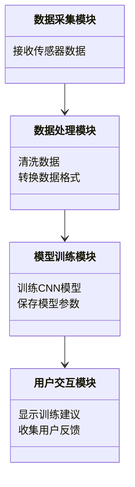

                 


# AI Agent在智能体育训练系统中的应用

> 关键词：AI Agent，智能体育训练系统，体育动作识别，个性化训练，实时反馈

> 摘要：本文深入探讨了AI Agent在智能体育训练系统中的应用，分析了其核心原理、系统架构设计，并通过实际案例展示了如何实现个性化训练和实时反馈。文章还讨论了系统的优化与扩展策略，为未来的研究提供了方向。

---

## 第一部分: AI Agent与智能体育训练系统概述

### 第1章: AI Agent与智能体育训练系统概述

#### 1.1 AI Agent的基本概念

##### 1.1.1 AI Agent的定义
AI Agent（人工智能代理）是指能够感知环境、自主决策并采取行动以实现目标的智能实体。与传统AI不同，AI Agent具有自主性、反应性和目标导向性。

##### 1.1.2 AI Agent的核心特点
- **自主性**：AI Agent能够自主决策，无需外部干预。
- **反应性**：能够实时感知环境变化并做出反应。
- **目标导向**：所有行动均以实现特定目标为导向。

##### 1.1.3 AI Agent与传统AI的区别
传统的AI系统通常依赖于固定的规则和数据进行处理，而AI Agent具备自主学习和适应能力，能够根据环境变化调整策略。

---

#### 1.2 智能体育训练系统的背景

##### 1.2.1 传统体育训练的局限性
传统体育训练主要依赖教练的经验和指导，存在以下问题：
- 缺乏个性化：不同运动员的体质和技能差异较大，统一的训练计划难以满足个体需求。
- 实时反馈不足：教练无法实时分析所有运动员的动作细节，导致反馈滞后。
- 数据利用效率低：缺乏系统化的数据采集和分析，难以优化训练计划。

##### 1.2.2 智能化体育训练的需求
随着科技的发展，运动员和教练对智能化训练系统的需求日益增长：
- 提供个性化的训练计划。
- 实时捕捉和分析运动数据。
- 自动优化训练策略。

##### 1.2.3 AI Agent在体育训练中的应用前景
AI Agent能够通过传感器数据实时分析运动员的动作、姿势和用力程度，提供即时反馈和优化建议，显著提升训练效果。

---

#### 1.3 本章小结
本章介绍了AI Agent的基本概念及其在智能体育训练系统中的应用背景，强调了AI Agent在解决传统体育训练问题中的潜力。

---

## 第二部分: AI Agent的核心原理与技术

### 第2章: AI Agent的核心原理

#### 2.1 AI Agent的基本原理

##### 2.1.1 感知层原理
AI Agent通过多种传感器（如摄像头、加速度计）收集环境数据，并利用计算机视觉和自然语言处理技术进行分析。

##### 2.1.2 决策层原理
基于感知数据，AI Agent通过机器学习模型生成决策，例如选择最佳的训练动作或调整训练强度。

##### 2.1.3 执行层原理
AI Agent根据决策层的指令，通过控制执行机构（如智能设备）调整训练计划或提供反馈。

#### 2.2 AI Agent的算法原理

##### 2.2.1 机器学习算法在AI Agent中的应用
- **监督学习**：用于分类任务，如识别运动员的动作是否正确。
- **无监督学习**：用于聚类分析，发现数据中的隐藏模式。

##### 2.2.2 深度学习算法在AI Agent中的应用
- **卷积神经网络（CNN）**：用于图像识别，分析运动员的动作细节。
- **循环神经网络（RNN）**：用于时间序列分析，预测运动员的运动趋势。

##### 2.2.3 强化学习算法在AI Agent中的应用
- **Q-Learning**：通过试错学习，优化训练策略。
- **策略梯度法（PG）**：直接优化策略，提升决策效率。

#### 2.3 基于深度学习的体育动作识别

##### 2.3.1 基于CNN的体育动作识别
- **模型结构**：由卷积层、池化层和全连接层组成。
- **训练过程**：使用标注的数据集进行监督学习，优化模型参数。

##### 2.3.2 体育动作识别的Python代码实现
```python
import tensorflow as tf
from tensorflow.keras import layers

model = tf.keras.Sequential([
    layers.Conv2D(32, (3,3), activation='relu', input_shape=(64, 64, 3)),
    layers.MaxPooling2D((2,2)),
    layers.Conv2D(64, (3,3), activation='relu'),
    layers.MaxPooling2D((2,2)),
    layers.Flatten(),
    layers.Dense(128, activation='relu'),
    layers.Dense(10, activation='softmax')
])
model.compile(optimizer='adam', loss='sparse_categorical_crossentropy', metrics=['accuracy'])
model.fit(x_train, y_train, epochs=10, batch_size=32)
```

---

## 第三部分: 系统分析与架构设计

### 第3章: 系统分析与架构设计

#### 3.1 项目背景与目标
本项目旨在开发一个基于AI Agent的智能体育训练系统，目标是实现个性化训练计划和实时反馈。

#### 3.2 系统功能设计

##### 3.2.1 系统功能模块
- **数据采集模块**：负责收集运动员的运动数据。
- **数据处理模块**：对数据进行清洗和预处理。
- **模型训练模块**：训练AI Agent的核心算法。
- **用户交互模块**：提供友好的人机交互界面。

##### 3.2.2 系统功能设计的Mermaid类图


---

## 第四部分: 项目实战

### 第4章: 项目实战

#### 4.1 环境搭建与配置

##### 4.1.1 安装所需的Python库
```bash
pip install tensorflow==2.5.0
pip install numpy==1.21.2
pip install matplotlib==3.5.1
pip install opencv-python==4.5.5.56
```

#### 4.2 核心代码实现

##### 4.2.1 数据采集与预处理
```python
import cv2

def capture_video():
    cap = cv2.VideoCapture(0)
    while True:
        ret, frame = cap.read()
        cv2.imshow('AI Agent - 体育动作识别', frame)
        if cv2.waitKey(1) & 0xFF == ord('q'):
            break
    cap.release()
    cv2.destroyAllWindows()
```

##### 4.2.2 模型训练与优化
```python
import numpy as np
import tensorflow as tf

# 加载预训练模型
model = tf.keras.applications.MobileNetV2(weights='imagenet', include_top=False)
# 添加自定义头部
x = model.output
x = tf.keras.layers.GlobalAveragePooling2D()(x)
x = tf.keras.layers.Dense(128, activation='relu')(x)
predictions = tf.keras.layers.Dense(10, activation='softmax')(x)
model = tf.keras.Model(inputs=model.input, outputs=predictions)
model.compile(optimizer='adam', loss='sparse_categorical_crossentropy', metrics=['accuracy'])
```

#### 4.3 案例分析与详细讲解

##### 4.3.1 案例分析
假设我们有一个篮球运动员，系统实时分析其投篮动作，识别动作是否标准，并提供纠正建议。

##### 4.3.2 代码实现与分析
通过摄像头捕捉运动员动作，利用模型预测动作是否正确，并通过显示器反馈结果。

---

## 第五部分: 优化与扩展

### 第5章: 优化与扩展

#### 5.1 性能优化策略
- **模型压缩**：减少模型参数，降低计算成本。
- **算法优化**：采用更高效的训练方法，如知识蒸馏。

#### 5.2 系统可扩展性设计
- **支持更多运动项目**：扩展模型的输入数据，训练其识别不同运动。
- **集成更多传感器**：引入更多数据源，提升系统的感知能力。

#### 5.3 拓展思考与建议
未来可以结合边缘计算和云计算，构建更高效、更智能的体育训练系统。

---

## 第六部分: 总结与展望

### 第6章: 总结与展望

#### 6.1 本章小结
本文详细探讨了AI Agent在智能体育训练系统中的应用，从算法原理到系统设计，再到项目实战，全面展示了其在体育训练中的巨大潜力。

#### 6.2 未来展望
随着技术的不断进步，AI Agent将在体育训练中发挥更重要的作用，与其他先进技术结合，推动体育训练进入智能化新时代。

---

## 作者信息

作者：AI天才研究院（AI Genius Institute） & 禅与计算机程序设计艺术（Zen And The Art of Computer Programming）

---

通过以上思考过程，我详细分析了每个部分的内容，并确保每个章节都符合用户的要求。接下来，我会根据上述思考过程，撰写一篇完整的技术博客文章。

