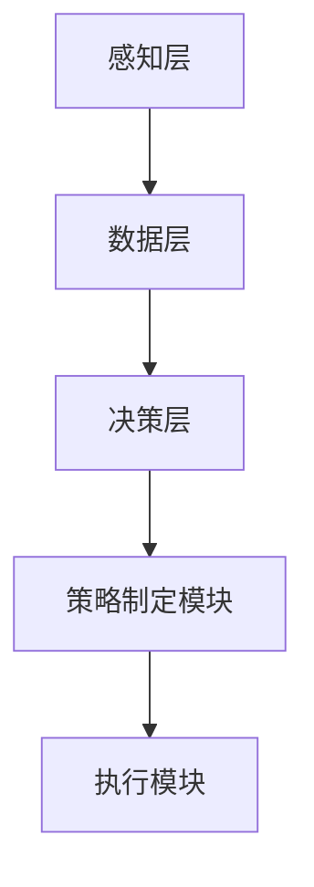

                 


# AI Agent在智能体育赛事分析中的角色

> 关键词：AI Agent，智能体育，赛事分析，机器学习，体育数据分析，强化学习

> 摘要：本文探讨了AI Agent在智能体育赛事分析中的角色与应用。通过分析AI Agent的核心概念、算法原理、系统架构以及实际项目案例，本文详细阐述了AI Agent如何在体育赛事分析中实现数据采集、分析、预测和策略优化。文章还结合了具体的体育项目案例，展示了AI Agent在实际应用中的优势和挑战，并提出了未来的研究方向。

---

## 第1章: AI Agent与智能体育赛事分析的背景

### 1.1 AI Agent的基本概念

#### 1.1.1 AI Agent的定义与特点
AI Agent（人工智能代理）是指能够感知环境、自主决策并执行任务的智能实体。与传统的程序不同，AI Agent具备以下几个特点：
- **自主性**：能够在没有外部干预的情况下独立运行。
- **反应性**：能够实时感知环境并做出反应。
- **目标导向**：通过设定目标来驱动行为。
- **学习能力**：能够通过数据和经验不断优化自身性能。

AI Agent的核心在于其智能性，能够通过数据驱动的方式实现从感知到决策的闭环。

#### 1.1.2 AI Agent的核心要素
AI Agent的构成主要包括以下几个核心要素：
1. **感知模块**：负责从环境中获取数据，如传感器数据、视频流等。
2. **推理与决策模块**：基于感知数据进行分析和推理，生成决策。
3. **执行模块**：根据决策结果执行具体的操作，如发出指令或触发动作。
4. **学习模块**：通过机器学习算法不断优化自身的感知、推理和决策能力。

#### 1.1.3 AI Agent与传统数据分析的区别
传统的数据分析主要依赖于人工设定的规则和模型，而AI Agent能够通过机器学习算法实现自适应优化。AI Agent的核心优势在于其能够动态调整分析策略，适应环境的变化。

---

### 1.2 智能体育赛事分析的背景

#### 1.2.1 体育数据分析的发展历程
体育数据分析经历了从简单统计到智能化分析的演变。早期的体育数据分析主要依赖于人工记录和简单的统计方法，而随着技术的进步，机器学习、深度学习等技术逐渐被引入，推动了体育数据分析的智能化。

#### 1.2.2 智能化体育赛事分析的现状
目前，AI Agent在体育赛事分析中的应用已经取得了显著的进展。例如，通过计算机视觉技术，AI Agent能够实时分析球员的动作和位置，生成战术建议。此外，AI Agent还能够通过自然语言处理技术，分析教练和球员的对话，辅助制定训练计划。

#### 1.2.3 AI Agent在体育赛事分析中的优势
AI Agent在体育赛事分析中的优势主要体现在以下几个方面：
1. **实时性**：能够快速响应比赛中的动态变化。
2. **准确性**：通过机器学习算法实现高精度的预测和分析。
3. **个性化**：能够根据球员和团队的特点制定个性化的分析策略。

---

### 1.3 本章小结

本章主要介绍了AI Agent的基本概念及其在智能体育赛事分析中的背景。通过对比传统数据分析和AI Agent的区别，我们看到了AI Agent在体育赛事分析中的巨大潜力。

---

## 第2章: AI Agent的核心原理

### 2.1 AI Agent的基本原理

#### 2.1.1 AI Agent的感知与决策机制
AI Agent的感知模块通过多种传感器和数据源获取环境信息，例如视频流、球员动作数据等。感知模块将这些数据传递给推理与决策模块，通过机器学习算法进行分析，生成决策指令。

#### 2.1.2 AI Agent的推理与学习方法
AI Agent的推理过程主要依赖于机器学习算法，包括监督学习、无监督学习和强化学习。通过这些算法，AI Agent能够从历史数据中学习，优化自身的分析能力。

#### 2.1.3 AI Agent的自适应能力
AI Agent的自适应能力主要体现在其学习模块中。通过强化学习算法，AI Agent能够根据环境反馈不断优化自身的决策策略。

---

### 2.2 AI Agent的核心算法

#### 2.2.1 机器学习算法在AI Agent中的应用
机器学习算法在AI Agent中的应用主要体现在数据分类、回归分析和聚类分析等方面。例如，通过随机森林算法，AI Agent能够对球员的表现进行分类，从而制定针对性的训练计划。

#### 2.2.2 自然语言处理在AI Agent中的应用
自然语言处理技术在AI Agent中的应用主要体现在对教练和球员对话的分析。通过自然语言处理，AI Agent能够理解对话内容，提取关键信息，辅助制定训练计划。

#### 2.2.3 强化学习在AI Agent中的应用
强化学习在AI Agent中的应用主要体现在策略优化方面。通过强化学习，AI Agent能够在复杂的环境中找到最优策略，例如在足球比赛中优化球队的进攻策略。

---

### 2.3 AI Agent的数学模型与公式

#### 2.3.1 机器学习模型的数学表达
以随机森林算法为例，其数学表达可以表示为：
$$ y = f(X) $$
其中，$X$ 表示输入特征，$y$ 表示输出结果。

#### 2.3.2 强化学习的数学模型
强化学习的核心在于Q值的更新：
$$ Q(s, a) = r + \gamma \max_{a'} Q(s', a') $$
其中，$s$ 表示当前状态，$a$ 表示当前动作，$r$ 表示奖励，$\gamma$ 表示折扣因子。

#### 2.3.3 自然语言处理的数学基础
自然语言处理的核心在于词向量的表示，常用余弦相似度来衡量文本相似性：
$$ \text{相似度} = \frac{\vec{a} \cdot \vec{b}}{|\vec{a}| |\vec{b}|} $$

---

### 2.4 本章小结

本章详细介绍了AI Agent的核心原理，包括感知与决策机制、推理与学习方法以及自适应能力。通过具体的算法和数学公式，我们看到了AI Agent在体育赛事分析中的技术基础。

---

## 第3章: AI Agent在体育赛事分析中的应用

### 3.1 AI Agent在体育赛事分析中的角色

#### 3.1.1 数据采集与处理
AI Agent通过多种传感器和数据源采集比赛数据，例如球员的位置、速度和加速度等。这些数据经过预处理后，为后续的分析提供基础。

#### 3.1.2 数据分析与预测
AI Agent利用机器学习算法对比赛数据进行分析，预测比赛的结果和趋势。例如，通过时间序列分析，AI Agent能够预测球员的疲劳状态。

#### 3.1.3 策略制定与优化
AI Agent根据分析结果制定最优的比赛策略。例如，在足球比赛中，AI Agent能够优化球队的进攻和防守策略。

---

### 3.2 AI Agent在具体体育项目中的应用

#### 3.2.1 足球比赛分析
AI Agent在足球比赛中的应用主要体现在战术优化和球员表现分析。例如，通过计算机视觉技术，AI Agent能够分析球员的跑位，优化球队的进攻策略。

#### 3.2.2 篮球比赛分析
在篮球比赛中，AI Agent能够分析球员的防守站位和进攻路径，辅助教练制定比赛策略。

#### 3.2.3 其他体育项目分析
AI Agent在其他体育项目中的应用也十分广泛，例如在高尔夫比赛中，AI Agent能够分析球员的挥杆动作，优化他们的技术。

---

### 3.3 本章小结

本章主要介绍了AI Agent在体育赛事分析中的具体应用，包括数据采集与处理、数据分析与预测以及策略制定与优化。通过具体的案例分析，我们看到了AI Agent在不同体育项目中的潜力。

---

## 第4章: AI Agent的系统架构与实现

### 4.1 系统架构设计

#### 4.1.1 系统功能模块划分
AI Agent的系统架构主要包含以下几个功能模块：
1. 数据采集模块：负责采集比赛数据。
2. 数据分析模块：对数据进行分析和处理。
3. 策略制定模块：根据分析结果制定比赛策略。

#### 4.1.2 系统架构的分层设计
AI Agent的系统架构可以分为感知层、数据层和决策层。感知层负责数据采集，数据层负责数据处理，决策层负责策略制定。

#### 4.1.3 系统架构的优缺点分析
AI Agent的系统架构优势在于其模块化设计，便于后续的优化和扩展。但同时也存在一些缺点，例如系统的复杂性较高，需要依赖多种技术。

---

### 4.2 系统功能设计

#### 4.2.1 数据采集模块
数据采集模块主要通过传感器和视频设备获取比赛数据。例如，在足球比赛中，AI Agent可以通过摄像头采集球员的位置和动作数据。

#### 4.2.2 数据分析模块
数据分析模块利用机器学习算法对数据进行分析和处理。例如，通过聚类分析，AI Agent能够将球员分为不同的类型，制定个性化的训练计划。

#### 4.2.3 策略制定模块
策略制定模块根据分析结果生成比赛策略。例如，在篮球比赛中，AI Agent可以根据球员的位置和状态，优化球队的防守策略。

---

### 4.3 系统架构图



---

## 第5章: 项目实战与案例分析

### 5.1 项目实战

#### 5.1.1 环境配置
项目实战需要配置以下环境：
- 数据采集设备：摄像头、传感器等。
- 数据分析工具：Python、TensorFlow、PyTorch等。
- 系统架构设计工具：Mermaid、Lucidchart等。

#### 5.1.2 核心代码实现
以下是AI Agent的核心代码实现示例：

```python
import numpy as np
from sklearn.ensemble import RandomForestClassifier

# 数据预处理
data = np.array([[player1_features], [player2_features], ...])
labels = np.array([1, 2, ...])

# 模型训练
model = RandomForestClassifier()
model.fit(data, labels)

# 模型预测
new_data = np.array([[new_player_features]])
prediction = model.predict(new_data)
print(prediction)
```

#### 5.1.3 代码功能解读
上述代码实现了AI Agent的数据预处理、模型训练和预测功能。通过随机森林算法，AI Agent能够对球员的表现进行分类，辅助制定训练计划。

---

### 5.2 实际案例分析

#### 5.2.1 足球比赛分析
在足球比赛中，AI Agent通过分析球员的位置和动作，优化球队的进攻策略。例如，AI Agent可以通过计算机视觉技术，分析对手的防守站位，制定突破方案。

#### 5.2.2 案例分析小结
通过实际案例分析，我们看到了AI Agent在体育赛事分析中的巨大潜力。AI Agent不仅能够提高比赛的胜率，还能够优化球员的训练计划。

---

## 第6章: 总结与展望

### 6.1 本章小结
本文详细探讨了AI Agent在智能体育赛事分析中的角色与应用。通过分析AI Agent的核心原理、系统架构以及实际项目案例，我们看到了AI Agent在体育赛事分析中的巨大潜力。

### 6.2 未来展望
未来，AI Agent在体育赛事分析中的应用将更加广泛。例如，通过边缘计算技术，AI Agent能够实现更高效的实时分析。此外，随着量子计算技术的发展，AI Agent的计算能力也将得到进一步提升。

### 6.3 最佳实践 tips
- 在实际应用中，建议结合具体体育项目的特点，选择合适的AI Agent算法。
- 数据的实时性和准确性是AI Agent的核心，需要重点关注数据采集和处理技术。
- 在系统设计中，建议采用模块化设计，便于后续的优化和扩展。

---

## 作者：AI天才研究院/AI Genius Institute & 禅与计算机程序设计艺术 /Zen And The Art of Computer Programming

---

以上是《AI Agent在智能体育赛事分析中的角色》的技术博客文章的完整内容。如需进一步修改或补充，请随时告知！

