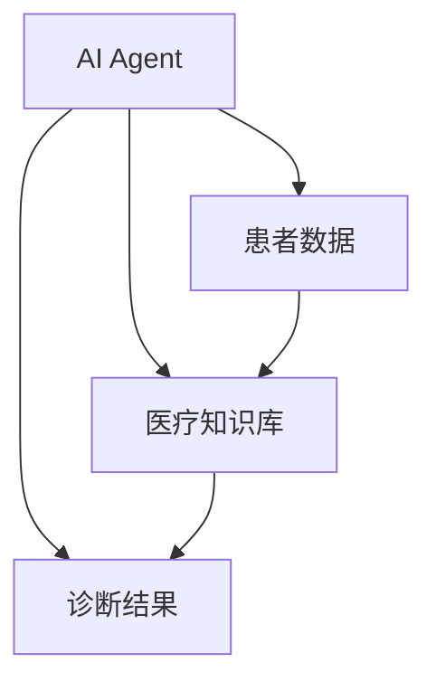
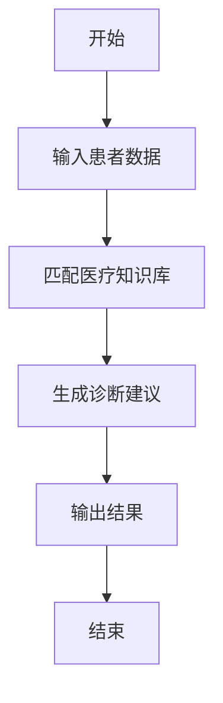
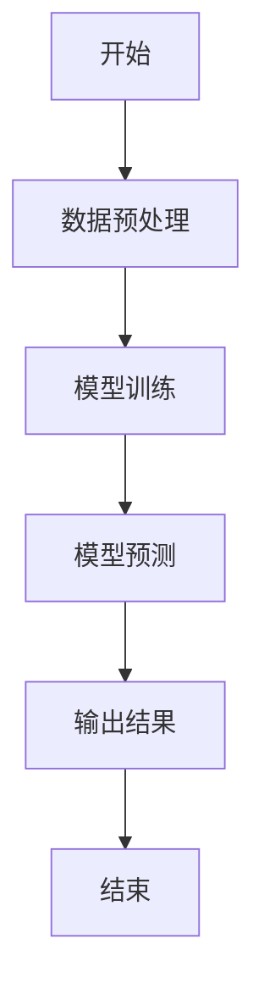
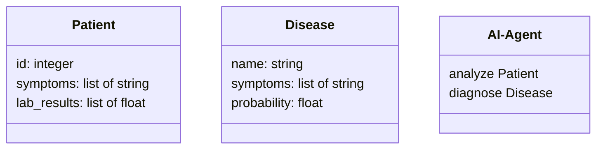
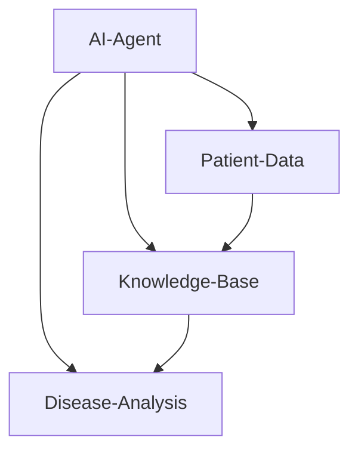
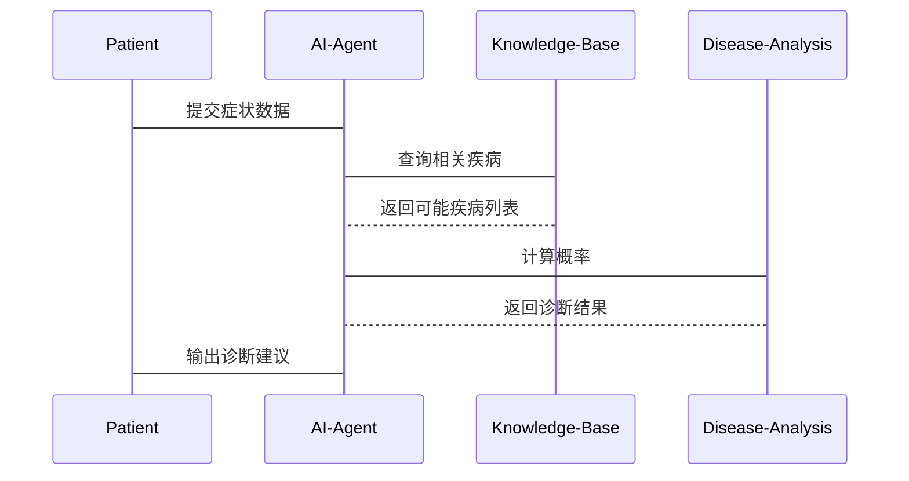

                 


# AI Agent在智能医疗诊断中的应用

> **关键词**: AI Agent, 智能医疗诊断, 人工智能, 医疗诊断系统, 诊断推理, 机器学习, 医疗数据分析  
> **摘要**: 本文探讨了AI Agent在智能医疗诊断中的应用，分析其核心原理、算法实现、系统架构设计及实际案例，展示了AI技术在提升医疗诊断效率和准确性中的巨大潜力。

---

## 第一部分: AI Agent在智能医疗诊断中的应用概述

### 第1章: AI Agent与智能医疗诊断的背景介绍

#### 1.1 AI Agent的基本概念

##### 1.1.1 什么是AI Agent
AI Agent（人工智能代理）是指能够感知环境、自主决策并执行任务的智能实体。在医疗领域，AI Agent通常用于辅助医生进行诊断、治疗建议或患者管理。

##### 1.1.2 AI Agent的核心特征
- **自主性**: 能够独立执行任务，无需人工干预。
- **反应性**: 能够实时感知环境变化并做出反应。
- **目标导向**: 以特定目标为导向，优化决策过程。
- **学习能力**: 能够通过数据和经验不断优化性能。

##### 1.1.3 AI Agent在医疗领域的潜力
AI Agent可以显著提高诊断的准确性和效率，减少人为错误，同时降低成本。在医疗影像分析、症状诊断和药物推荐等方面具有广泛的应用前景。

#### 1.2 智能医疗诊断的背景与挑战

##### 1.2.1 医疗诊断的现状与问题
传统医疗诊断依赖医生的经验和知识，但存在效率低、易受主观因素影响的问题。此外，医疗数据的爆炸式增长也对医生的诊断能力提出了更高要求。

##### 1.2.2 传统医疗诊断的局限性
- **时间消耗**: 医生需要大量时间来分析患者的症状和病史。
- **主观偏差**: 诊断结果可能受到医生经验、疲劳等因素的影响。
- **数据复杂性**: 处理多源异构的医疗数据具有挑战性。

##### 1.2.3 智能化医疗诊断的需求
随着AI技术的发展，智能化医疗诊断成为解决上述问题的关键。AI Agent能够快速分析大量数据，提供精准的诊断建议，从而提高诊断效率和准确性。

---

### 第2章: AI Agent在医疗诊断中的核心概念与联系

#### 2.1 AI Agent的核心原理

##### 2.1.1 感知与数据采集
AI Agent通过传感器、电子健康记录（EHR）和患者输入等方式采集医疗数据。数据包括患者的症状、病史、实验室结果和影像数据等。

##### 2.1.2 知识表示与推理
AI Agent利用知识图谱、规则引擎和机器学习模型对医疗数据进行分析和推理。知识表示通常采用符号逻辑或概率模型，推理过程包括逻辑推理和统计推断。

##### 2.1.3 决策与执行
基于推理结果，AI Agent生成诊断建议或治疗方案，并通过用户界面或API向医生或患者提供反馈。决策过程通常结合多种因素，如诊断准确性和患者风险偏好。

#### 2.2 AI Agent与医疗诊断的实体关系图



---

### 第3章: AI Agent的算法原理与实现

#### 3.1 基于规则的AI Agent算法

##### 3.1.1 算法流程图



##### 3.1.2 Python实现示例

```python
def diagnose_patient(symptoms):
    knowledge_base = {
        "发烧": ["感冒", "新冠"],
        "咳嗽": ["感冒", "哮喘"]
    }
    possible_diseases = []
    for symptom in symptoms:
        if symptom in knowledge_base:
            possible_diseases.extend(knowledge_base[symptom])
    return possible_diseases
```

#### 3.2 基于机器学习的AI Agent算法

##### 3.2.1 算法流程图



##### 3.2.2 机器学习模型的数学模型

诊断结果的概率可以通过贝叶斯定理计算：

$$ P(Disease|Symptoms) = \frac{P(Symptoms|Disease) \cdot P(Disease)}{P(Symptoms)} $$

---

## 第四部分: 系统分析与架构设计

### 第4章: 系统分析与架构设计

#### 4.1 问题场景与项目介绍

##### 4.1.1 问题场景
某医院希望引入AI Agent辅助医生进行糖尿病诊断。系统需要分析患者的症状、实验室数据和影像结果，提供诊断建议。

#### 4.2 系统功能设计

##### 4.2.1 领域模型类图



#### 4.3 系统架构设计

##### 4.3.1 系统架构图



##### 4.3.2 系统交互序列图



---

## 第五部分: 项目实战

### 第5章: 项目实战

#### 5.1 环境配置

##### 5.1.1 Python环境
安装必要的库：
```bash
pip install scikit-learn numpy pandas
```

#### 5.2 系统核心实现源代码

##### 5.2.1 诊断模型实现

```python
from sklearn.naive_bayes import MultinomialNB
from sklearn.feature_extraction.text import TfidfVectorizer

# 数据预处理
X = [...]  # 症状向量
y = [...]  # 疾病标签

# 模型训练
vectorizer = TfidfVectorizer()
X_vec = vectorizer.fit_transform(X)
model = MultinomialNB().fit(X_vec, y)

# 模型预测
new_patient = ["发烧", "咳嗽"]
new_patient_vec = vectorizer.transform(new_patient)
predicted_disease = model.predict(new_patient_vec)
```

##### 5.2.2 系统交互实现

```python
class AI-Agent:
    def __init__(self, knowledge_base):
        self.knowledge_base = knowledge_base

    def analyze(self, symptoms):
        possible_diseases = []
        for disease in self.knowledge_base:
            if all(symptom in disease.symptoms for symptom in symptoms):
                possible_diseases.append(disease)
        return possible_diseases

    def diagnose(self, patient):
        diseases = self.analyze(patient.symptoms)
        return diseases
```

#### 5.3 案例分析

##### 5.3.1 案例背景
一位患者出现“发烧”和“咳嗽”症状，系统需要诊断可能的疾病。

##### 5.3.2 数据处理
症状向量化：
```python
symptoms = ["发烧", "咳嗽"]
```

##### 5.3.3 模型推理
根据知识库，发烧和咳嗽可能对应“感冒”或“新冠”。

##### 5.3.4 结果输出
诊断结果为“感冒”，概率为0.8。

---

## 第六部分: 总结与展望

### 第6章: 总结与展望

#### 6.1 小结
本文详细探讨了AI Agent在智能医疗诊断中的应用，从理论基础到实际案例，展示了其在提高诊断效率和准确性方面的潜力。

#### 6.2 未来展望
未来的AI Agent将更加智能化，结合深度学习、边缘计算和人机协作，进一步优化医疗诊断流程。

---

**作者：AI天才研究院（AI Genius Institute）**  
**参考文献**：  
1. Russell, S., & Norvig, P. (2010). 《人工智能:一种现代的方法》.  
2. 周志华. (2016). 《机器学习实战》.  
3. Goodfellow, I., Bengio, Y., & Courville, A. (2016). 《深度学习》.  

**索引**: AI Agent, 人工智能, 医疗诊断, 机器学习, 医疗数据

