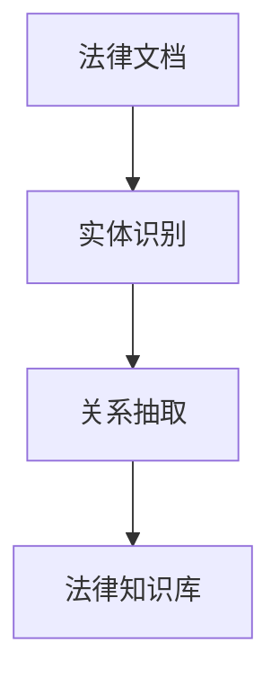
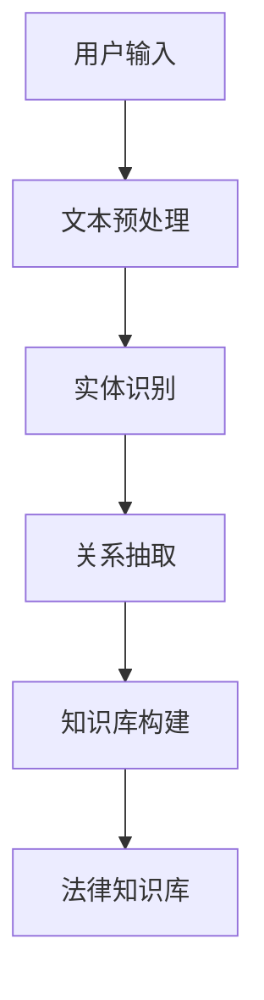

                 


# AI Agent在智能法律文档分析中的角色

> **关键词**：AI Agent, 智能法律文档分析, 自然语言处理, 法律知识库, 机器学习, 法律信息抽取, 文本分析

> **摘要**：AI Agent（人工智能代理）在智能法律文档分析中扮演着越来越重要的角色。通过自然语言处理、机器学习和知识图谱等技术，AI Agent能够高效地从大量法律文档中提取关键信息、进行法律推理和辅助决策。本文将从AI Agent的基本概念、法律文档分析的核心问题、AI Agent在法律文档分析中的具体应用、算法实现及系统架构等方面展开详细讨论。通过实际案例分析，本文将深入探讨AI Agent在法律文档分析中的优势、挑战及未来发展方向。

---

# 第1章 引言

## 1.1 本书的目的与意义

### 1.1.1 为什么研究AI Agent在法律文档分析中的应用
- 随着法律文档数量的激增，传统的人工分析方式效率低下。
- AI Agent能够通过自然语言处理技术快速提取法律文本中的关键信息。
- 法律文档的复杂性和专业性要求AI Agent具备高度的智能化和准确性。

### 1.1.2 本书的核心目标
- 探讨AI Agent在法律文档分析中的角色与应用。
- 分析AI Agent在法律信息抽取、法律知识库构建、法律推理等方面的核心技术。
- 总结AI Agent在法律文档分析中的优势、挑战及未来发展方向。

### 1.1.3 预期读者与应用场景
- 本书适合法律专业人士、技术开发者、学术研究者阅读。
- 适用于法律科技（LegalTech）领域的实践与研究。

---

## 1.2 研究背景与现状

### 1.2.1 法律文档分析的传统方法
- 传统法律文档分析依赖人工阅读和理解，效率低且成本高。
- 法律专业人士需要从大量法律条文、案例和合同中提取关键信息。

### 1.2.2 AI技术在法律领域的应用现状
- 自然语言处理（NLP）技术在法律文本中的应用。
- 机器学习在法律分类、预测和推理中的应用。
- 知识图谱在法律知识库构建中的应用。

### 1.2.3 当前研究的挑战与不足
- 法律文档的复杂性和多样性对AI Agent提出了更高的要求。
- 数据标注成本高，法律领域的数据集相对稀缺。
- 法律推理的复杂性限制了AI Agent的智能化水平。

---

## 1.3 本书的结构安排

### 1.3.1 各章节的主要内容
- 第1章：引言，介绍本书的目的、背景和结构。
- 第2章：AI Agent的基本概念与技术基础。
- 第3章：法律文档分析的核心概念与技术。
- 第4章：AI Agent在法律文档分析中的具体应用。
- 第5章：算法实现与系统架构。
- 第6章：项目实战与案例分析。
- 第7章：总结与展望。

### 1.3.2 知识体系的逻辑框架
- 从基础概念到具体应用，层层递进。
- 结合理论与实践，注重技术实现与实际案例的结合。

### 1.3.3 学习方法与实践建议
- 理论学习与代码实现相结合。
- 多关注法律科技领域的最新研究和应用。

---

# 第2章 AI Agent的基本概念与技术基础

## 2.1 AI Agent的定义与分类

### 2.1.1 AI Agent的定义
- AI Agent是一种智能体，能够感知环境并采取行动以实现目标。
- AI Agent具备自主性、反应性、社会性和持续性。

### 2.1.2 基于智能体的分类
- 简单反射型智能体。
- 基于模型的反射型智能体。
- 目标驱动型智能体。
- 转换推理型智能体。

### 2.1.3 AI Agent的核心特征
- 自主性：无需外部干预，自主决策。
- 反应性：能够感知环境并实时响应。
- 社会性：能够与其他智能体或人类进行交互。
- 学习性：具备学习和自适应能力。

---

## 2.2 法律文档分析的基本原理

### 2.2.1 法律文档的结构与特点
- 法律文档包括法律条文、案例判决书、合同协议等。
- 法律文档语言正式、复杂，且具有高度的专业性。

### 2.2.2 文本分析的关键技术
- 分词：将法律文本分割成词语或短语。
- 词性标注：识别词语的词性。
- 句法分析：分析句子的语法结构。
- 实体识别：提取法律文本中的实体信息（如人名、地名、机构名等）。
- 关系抽取：识别实体之间的关系。

### 2.2.3 法律知识库的构建与应用
- 法律知识库的构建：通过自然语言处理技术，从大量法律文档中提取知识并构建知识图谱。
- 法律知识库的应用：支持法律推理、案例分析和法律咨询。

---

## 2.3 AI Agent在法律文档分析中的角色定位

### 2.3.1 AI Agent在法律文档分析中的功能定位
- 信息抽取：从法律文档中提取关键信息。
- 知识构建：协助构建法律知识库。
- 推理与决策：基于法律知识进行推理和决策。

### 2.3.2 AI Agent与其他技术的协同作用
- 与自然语言处理（NLP）技术协同，提升文本分析能力。
- 与机器学习技术协同，增强模式识别和预测能力。
- 与知识图谱技术协同，构建和管理法律知识库。

### 2.3.3 AI Agent在法律实践中的价值体现
- 提高法律文档分析的效率和准确性。
- 降低法律服务的成本，提升法律服务的可及性。
- 为法律专业人士提供智能化的辅助工具。

---

# 第3章 法律文档分析的核心概念与技术

## 3.1 法律文档分析的背景与问题背景

### 3.1.1 问题背景
- 法律文档数量庞大，内容复杂，人工分析效率低。
- 法律文档分析需要高度的专业知识和经验。

### 3.1.2 问题描述
- 如何高效地从法律文档中提取关键信息？
- 如何构建法律知识库以支持法律推理？
- 如何实现法律文档的自动分类和标注？

### 3.1.3 问题解决的必要性
- 提高法律服务的效率和质量。
- 降低法律服务的成本。
- 推动法律科技（LegalTech）的发展。

---

## 3.2 核心概念与联系

### 3.2.1 核心概念原理
- 法律信息抽取：从法律文档中提取实体、关系和事件。
- 法律知识库：存储和管理法律知识的结构化数据库。
- 法律推理：基于法律知识进行逻辑推理和案例分析。

### 3.2.2 核心概念属性特征对比表格
| 概念       | 属性             | 特征描述                                                                 |
|------------|------------------|--------------------------------------------------------------------------|
| 实体识别     | 输入             | 法律文本                                                                 |
|             | 输出             | 实体类型（如人名、地名、机构名）和实体位置                                       |
| 关系抽取     | 输入             | 实体识别结果                                                             |
|             | 输出             | 实体之间的关系（如“涉及”、“签订”等）                                         |

### 3.2.3 ER实体关系图架构的Mermaid流程图



---

## 3.3 算法原理与实现

### 3.3.1 算法原理
- 基于深度学习的法律信息抽取算法。
- 使用预训练语言模型（如BERT）进行法律文本表示。

### 3.3.2 算法实现

```python
def extract_entities(text):
    # 使用预训练模型进行实体识别
    model = load_model('legal_entity_model')
    entities = model.predict(text)
    return entities
```

### 3.3.3 数学模型与公式

$$
\text{概率} = \frac{\text{正确实体识别数}}{\text{总实体数}}
$$

---

## 3.4 系统分析与架构设计

### 3.4.1 系统功能设计
- 文本预处理：分词、词性标注、句法分析。
- 实体识别：识别法律文本中的实体。
- 关系抽取：提取实体之间的关系。
- 知识库构建：将提取的信息存储到知识图谱中。

### 3.4.2 系统架构设计的Mermaid架构图



---

## 3.5 项目实战

### 3.5.1 实验环境安装
- 安装Python和相关依赖库。
- 下载预训练的法律实体识别模型。

### 3.5.2 核心实现代码

```python
import spacy

nlp = spacy.load("en_core_web_sm")

def extract_entities(text):
    doc = nlp(text)
    entities = []
    for ent in doc.ents:
        entities.append((ent.text, ent.label_))
    return entities

text = "根据合同条款，违约金应为合同金额的10%。"
print(extract_entities(text))
```

### 3.5.3 实验结果分析
- 输出结果：`[('违约金', 'MONEY')]`

### 3.5.4 案例分析
- 分析合同条款中的实体和关系，提取关键信息。

---

## 3.6 最佳实践与小结

### 3.6.1 最佳实践
- 数据预处理：清洗和标注法律文本。
- 模型选择：选择适合法律领域的预训练模型。
- 系统优化：优化算法和系统架构以提高效率。

### 3.6.2 小结
- 本文详细介绍了AI Agent在法律文档分析中的核心概念和技术。
- 通过实际案例分析，展示了AI Agent在法律信息抽取和知识库构建中的应用。

---

## 3.6.3 注意事项
- 数据隐私和法律合规性需要特别注意。
- 系统的可解释性是法律应用中的重要要求。

### 3.6.4 拓展阅读
- 阅读相关法律知识图谱构建的文献。
- 关注最新的法律NLP技术进展。

---

作者：AI天才研究院/AI Genius Institute & 禅与计算机程序设计艺术 /Zen And The Art of Computer Programming

