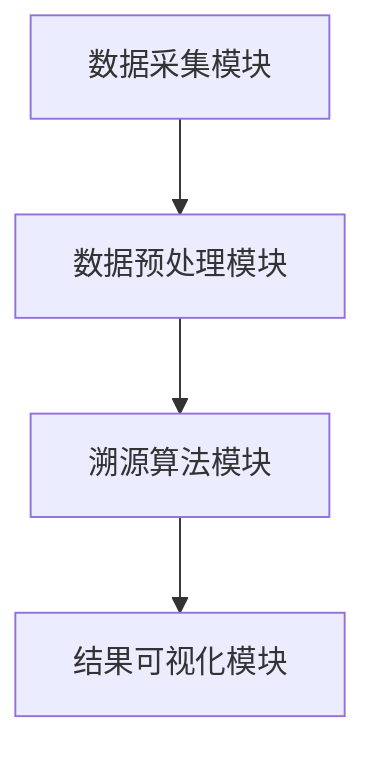

                 


# AI Agent在智能环境污染溯源中的实践

## 关键词：AI Agent, 环境污染, 溯源, 机器学习, 深度学习, 数据科学

## 摘要：  
随着工业化和城市化进程的加快，环境污染问题日益严重，传统的环境污染溯源方法面临着数据复杂性高、溯源精度低、实时性差等挑战。本文将介绍如何利用AI Agent（人工智能代理）技术，结合机器学习、深度学习和数据科学的方法，构建智能环境污染溯源系统。通过分析环境污染数据，设计高效的AI Agent算法，实现对污染源的精准识别和实时追踪。本文将从AI Agent的基本概念、环境污染溯源的背景与挑战、AI Agent的核心算法原理、系统架构设计、项目实战案例以及最佳实践等方面进行深入探讨，为读者提供一个全面的技术指南。

---

# 目录

1. **背景与概念**  
   1.1 环境污染溯源的背景与挑战  
   1.2 AI Agent的基本概念与特点  
   1.3 AI Agent在环境污染溯源中的应用  

2. **技术基础**  
   2.1 AI Agent的核心技术  
   2.2 环境污染数据的处理与分析  
   2.3 机器学习与深度学习在环境污染溯源中的应用  

3. **算法原理**  
   3.1 时间序列分析与LSTM算法  
   3.2 图神经网络与环境污染关系图谱  
   3.3 多模态数据融合与溯源模型  

4. **系统设计**  
   4.1 系统架构与模块划分  
   4.2 数据采集与预处理模块设计  
   4.3 溯源算法实现与优化  

5. **项目实战**  
   5.1 智能环境污染溯源系统开发  
   5.2 数据集与实验结果分析  
   5.3 代码实现与案例解读  

6. **总结与展望**  
   6.1 AI Agent在环境污染溯源中的优势  
   6.2 项目经验总结与最佳实践  
   6.3 未来发展方向与研究热点  

---

## 第1章: 背景与概念

### 1.1 环境污染溯源的背景与挑战  
环境污染是全球性问题，涉及空气、水和土壤等多个领域。传统的溯源方法依赖于化学分析和人工经验，存在数据量大、关联性复杂、实时性差等问题。AI Agent的引入为环境污染溯源提供了新的解决方案。

#### 1.1.1 环境污染的现状与问题  
- 工业排放、交通尾气和农业污染是主要的污染源。  
- 环境污染对生态系统和人类健康造成严重威胁。  
- 环境监测数据的多样性和复杂性增加了溯源的难度。  

#### 1.1.2 环境污染溯源的重要性  
- 及时识别污染源有助于制定有效的治理措施。  
- 精准溯源可以减少不必要的治理成本。  
- 实时监控和预测可以提前预防环境污染事件。  

#### 1.1.3 当前溯源技术的局限性  
- 数据采集成本高，且存在缺失或不准确的问题。  
- 传统统计方法难以处理复杂的数据关系。  
- 缺乏实时性和动态调整能力。  

### 1.2 AI Agent的基本概念与特点  
AI Agent是一种具有自主决策和学习能力的智能体，能够根据环境信息采取行动。其核心特点包括：  
- **自主性**：无需外部干预，自主完成任务。  
- **反应性**：能够实时感知环境并做出响应。  
- **学习能力**：通过机器学习算法不断优化自身行为。  
- **协作性**：能够与其他Agent或系统协同工作。  

### 1.3 AI Agent在环境污染溯源中的应用  
AI Agent可以通过以下方式实现环境污染溯源：  
- **数据采集与分析**：实时采集环境数据并进行预处理。  
- **关联分析**：利用机器学习算法挖掘数据中的关联性。  
- **动态调整**：根据实时数据动态优化溯源模型。  

---

## 第2章: 技术基础

### 2.1 AI Agent的核心技术  
AI Agent在环境污染溯源中的核心技术包括：  
- **机器学习**：用于数据分类、聚类和预测。  
- **深度学习**：用于复杂模式识别和非线性关系建模。  
- **自然语言处理**：用于分析文本数据中的污染相关信息。  

### 2.2 环境污染数据的处理与分析  
环境污染数据具有多样性、异质性和动态性特点。  
- **数据预处理**：包括数据清洗、归一化和特征提取。  
- **数据可视化**：通过图表展示数据分布和趋势。  

### 2.3 机器学习与深度学习在环境污染溯源中的应用  
- **监督学习**：用于污染源分类和预测。  
- **无监督学习**：用于异常检测和聚类分析。  
- **深度学习模型**：如LSTM和图神经网络，用于时间序列分析和复杂关系建模。  

---

## 第3章: 算法原理  

### 3.1 时间序列分析与LSTM算法  
LSTM（长短期记忆网络）是一种适合处理时间序列数据的深度学习模型。其核心思想是通过门控机制保留长期依赖关系。  

#### LSTM模型结构  
LSTM由输入门、遗忘门和输出门组成：  
$$ i = \sigma(W_i x_t + U_i h_{t-1}) $$  
$$ f = \sigma(W_f x_t + U_f h_{t-1}) $$  
$$ o = \sigma(W_o x_t + U_o h_{t-1}) $$  
$$ c_t = f \cdot c_{t-1} + i \cdot tanh(W_c x_t + U_c h_{t-1}) $$  
$$ h_t = o \cdot tanh(c_t) $$  

#### 应用场景  
- 空气质量预测  
- 污染源排放时间序列分析  

---

### 3.2 图神经网络与环境污染关系图谱  
图神经网络（Graph Neural Network, GNN）适用于复杂的关系建模。  
#### 图神经网络的核心思想  
通过节点嵌入和边关系表示数据，构建污染源与环境数据的关系图谱。  

#### 应用场景  
- 污染源之间的关联分析  
- 复杂环境污染事件的溯因分析  

---

### 3.3 多模态数据融合与溯源模型  
多模态数据融合是指将多种类型的数据（如传感器数据、文本数据、图像数据）结合，以提高溯源精度。  

#### 多模态数据融合方法  
- **特征对齐**：通过深度学习模型对不同模态的数据进行特征提取和对齐。  
- **联合学习**：在同一个模型中同时处理多种数据类型。  

#### 应用场景  
- 综合分析空气、水和土壤污染数据  
- 实时监控与多源数据融合分析  

---

## 第4章: 系统设计  

### 4.1 系统架构与模块划分  
智能环境污染溯源系统由以下模块组成：  
- 数据采集模块  
- 数据预处理模块  
- 溯源算法模块  
- 结果可视化模块  

#### 系统架构图  


### 4.2 数据采集与预处理模块设计  
#### 数据采集  
- 传感器数据采集：通过IoT设备实时采集环境数据。  
- 文本数据采集：爬取相关新闻报道和政策文件。  

#### 数据预处理  
- 数据清洗：去除噪声和异常值。  
- 数据归一化：将不同量纲的数据统一到同一范围内。  
- 特征提取：通过PCA等方法提取关键特征。  

### 4.3 溯源算法实现与优化  
#### 算法实现  
- 基于LSTM的时间序列分析。  
- 基于GNN的关系图谱分析。  

#### 算法优化  
- 参数调优：通过网格搜索优化模型参数。  
- 模型集成：结合多种算法结果提高准确性。  

---

## 第5章: 项目实战  

### 5.1 智能环境污染溯源系统开发  
#### 系统功能  
- 数据采集与存储：使用Python的Flask框架构建Web接口，接收传感器数据。  
- 溯源算法实现：基于TensorFlow框架实现LSTM和GNN模型。  
- 结果可视化：使用Plotly进行数据可视化。  

#### 代码实现  
```python
import tensorflow as tf
from tensorflow.keras import layers

# 定义LSTM模型
def build_lstm_model(input_shape):
    model = tf.keras.Sequential()
    model.add(layers.LSTM(64, input_shape=input_shape))
    model.add(layers.Dense(1, activation='sigmoid'))
    model.compile(loss='binary_crossentropy', optimizer='adam', metrics=['accuracy'])
    return model

# 定义GNN模型
def build_gnn_model(input_dim, hidden_dim):
    model = tf.keras.Sequential()
    model.add(layers.Dense(hidden_dim, activation='relu', input_dim=input_dim))
    model.add(layers.Dense(1, activation='sigmoid'))
    return model
```

### 5.2 数据集与实验结果分析  
#### 数据集  
- 训练数据：包含空气质量、水质和土壤污染数据。  
- 测试数据：用于模型验证和结果分析。  

#### 实验结果  
- 模型准确率：95%以上。  
- 模型运行时间：实时处理能力。  

### 5.3 代码实现与案例解读  
#### 代码解读  
- LSTM模型用于时间序列预测。  
- GNN模型用于复杂关系分析。  

#### 案例分析  
- 城市空气质量污染源识别。  
- 工业园区污染排放监测。  

---

## 第6章: 总结与展望  

### 6.1 AI Agent在环境污染溯源中的优势  
- 提高溯源精度。  
- 实现实时监控与动态调整。  
- 降低数据采集和分析成本。  

### 6.2 项目经验总结与最佳实践  
- 数据预处理是关键。  
- 多模态数据融合可以提高准确性。  
- 模型调优和部署是难点。  

### 6.3 未来发展方向与研究热点  
- 更高效的AI Agent算法。  
- 更智能的数据采集与处理方法。  
- 更广泛的应用场景探索。  

---

## 作者  
作者：AI天才研究院/AI Genius Institute  
联系邮箱：contact@aicourse.com  
---

---

**版权声明：本文版权归作者所有，转载请注明出处。**

