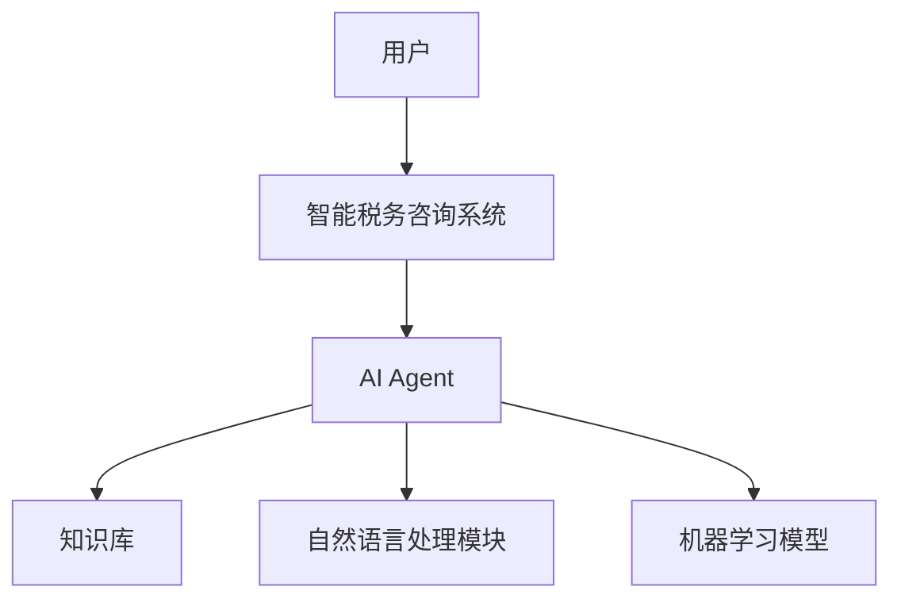
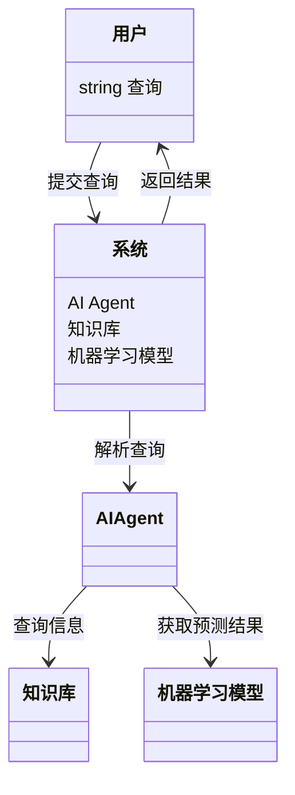
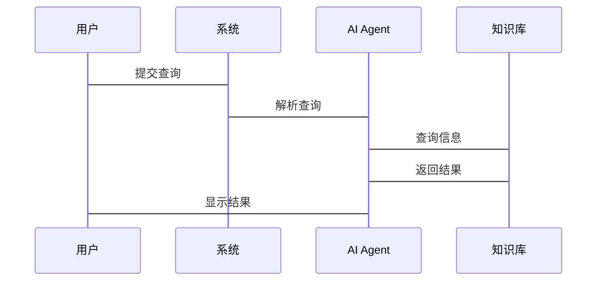

                 


# AI Agent在智能税务咨询中的角色

## 关键词：
AI Agent, 智能税务咨询, 自然语言处理, 知识图谱, 机器学习, 系统架构

## 摘要：
本文探讨AI Agent在智能税务咨询中的应用，分析其技术原理和系统架构，通过实际案例展示其在税务咨询中的优势和潜力。文章从背景、核心概念、算法原理、系统设计到项目实战，全面解析AI Agent如何提升税务咨询服务的效率和准确性。

---

# 第一部分: AI Agent与智能税务咨询的背景与概念

## 第1章: AI Agent与智能税务咨询的背景

### 1.1 AI Agent的基本概念
#### 1.1.1 AI Agent的定义
AI Agent（人工智能代理）是能够感知环境、执行任务并做出决策的智能实体。它通过传感器获取信息，利用计算模型处理数据，并通过执行器采取行动。

#### 1.1.2 AI Agent的核心特征
- **自主性**：无需外部干预，自主决策。
- **反应性**：实时感知环境变化并调整行为。
- **学习能力**：通过数据和反馈不断优化性能。
- **社交能力**：与用户和其他系统进行交互。

#### 1.1.3 AI Agent与传统软件代理的区别
传统软件代理基于规则和流程，而AI Agent具备学习和推理能力，能够处理复杂和不确定性问题。

### 1.2 智能税务咨询的定义与特点
#### 1.2.1 税务咨询的基本概念
税务咨询是为企业或个人提供税务规划、合规建议和问题解答的专业服务。

#### 1.2.2 智能税务咨询的核心优势
- **高效性**：自动化处理大量数据和查询。
- **准确性**：基于机器学习模型提供精准建议。
- **实时性**：即时响应用户需求，提供实时更新的税务信息。

#### 1.2.3 智能税务咨询的应用场景
- **税务合规性检查**：帮助用户确保税务申报的准确性。
- **税务规划**：提供优化的税务策略建议。
- **实时答疑**：即时解答用户的税务问题。

### 1.3 AI Agent在智能税务咨询中的角色
#### 1.3.1 AI Agent在税务咨询中的功能定位
AI Agent作为智能税务咨询系统的核心模块，负责接收用户请求、解析意图、调用知识库，并生成响应。

#### 1.3.2 AI Agent如何提升税务咨询服务的效率
通过自动化处理和智能推理，AI Agent能够快速响应用户需求，显著提高服务效率。

#### 1.3.3 AI Agent在税务咨询中的边界与外延
AI Agent的边界在于其知识库和算法的能力，外延则包括与其他系统的集成和数据源的扩展。

## 第2章: AI Agent与智能税务咨询的核心概念与联系

### 2.1 AI Agent的核心原理
#### 2.1.1 自然语言处理（NLP）在AI Agent中的应用
NLP用于解析用户的自然语言输入，识别意图和实体。

#### 2.1.2 知识图谱与税务咨询的关系
知识图谱构建税务相关知识网络，帮助AI Agent进行推理和决策。

#### 2.1.3 机器学习在税务咨询中的作用
机器学习模型用于模式识别、分类和预测，提升税务咨询的智能化水平。

### 2.2 智能税务咨询的系统架构
#### 2.2.1 系统功能模块划分
- 用户界面（UI）：接收用户输入，展示结果。
- AI Agent模块：解析输入，调用知识库。
- 知识库：存储税务法规、案例和数据。
- 机器学习模型：提供预测和建议。

#### 2.2.2 系统输入与输出的定义
- 输入：用户的自然语言查询。
- 输出：经过处理的税务建议或信息。

#### 2.2.3 系统的核心算法与流程
1. 接收用户输入。
2. 解析意图和实体。
3. 调用知识库或模型。
4. 生成并返回结果。

### 2.3 AI Agent与智能税务咨询的实体关系图


## 第3章: AI Agent在智能税务咨询中的算法原理

### 3.1 基于NLP的意图识别
#### 3.1.1 意图识别的定义与作用
意图识别是通过分析用户的语言，确定其主要需求。

#### 3.1.2 基于深度学习的意图识别模型
使用卷积神经网络（CNN）或循环神经网络（RNN）进行训练。

#### 3.1.3 意图识别的数学模型与公式
$$ P(y|x) = \frac{P(x|y)P(y)}{P(x)} $$

### 3.2 知识图谱构建与推理
#### 3.2.1 知识图谱的构建方法
通过爬取和解析税务法规文本，构建知识网络。

#### 3.2.2 基于知识图谱的推理算法
使用图遍历算法进行路径分析和关联推理。

#### 3.2.3 知识图谱推理的数学模型
$$ score = \sum_{i=1}^{n} w_i \cdot f(x_i) $$

### 3.3 机器学习模型的应用
#### 3.3.1 分类模型在税务咨询中的应用
用于识别税务问题类型和分类建议。

#### 3.3.2 回归模型在税务预测中的应用
用于预测税务负担和优化建议。

---

# 第二部分: 系统分析与架构设计方案

## 第4章: 智能税务咨询系统的系统架构设计

### 4.1 问题场景介绍
用户通过自然语言查询税务问题，系统需快速响应并提供准确建议。

### 4.2 项目介绍
构建一个基于AI Agent的智能税务咨询系统，实现税务问题的自动化处理。

### 4.3 系统功能设计
#### 4.3.1 领域模型（Mermaid类图）


### 4.4 系统架构设计（Mermaid架构图）


### 4.5 系统接口设计
- **输入接口**：用户查询接口。
- **输出接口**：结果展示接口。

### 4.6 系统交互设计（Mermaid序列图）


---

# 第三部分: 项目实战

## 第5章: 项目实战

### 5.1 环境安装
- **Python**：3.8+
- **库依赖**：安装numpy、tensorflow、spacy等。

### 5.2 系统核心实现源代码
```python
class AIAgent:
    def __init__(self):
        self.nlp = spacy.load("en_core_web_sm")
        self.knowledge_base = self._load_knowledge_base()

    def process_query(self, query):
        # 解析意图
        doc = self.nlp(query)
        intent = self._get_intent(doc)
        # 调用知识库或模型
        response = self._generate_response(intent)
        return response

    def _get_intent(self, doc):
        # 简单示例，根据实体识别意图
        entities = [ent.text for ent in doc.ents]
        return entities[0] if entities else "general"

    def _generate_response(self, intent):
        # 简单示例，返回预设响应
        responses = {
            "tax_filing": "您需要准备哪些税务文件？请提供更多信息。",
            "tax_planning": "税务规划建议：建议您咨询专业税务顾问。",
            "general": "您的问题需要更详细的信息，请重新描述。"
        }
        return responses.get(intent, "抱歉，我无法回答您的问题。")

# 使用示例
agent = AIAgent()
print(agent.process_query("我需要提交所得税申报表。"))  # 输出：您需要准备哪些税务文件？
```

### 5.3 代码应用解读与分析
上述代码展示了AI Agent的基本实现，包括自然语言处理和意图识别的简单逻辑。实际应用中需要更复杂的模型和知识库。

### 5.4 实际案例分析和详细讲解剖析
通过具体案例分析AI Agent在税务咨询中的应用，如解析用户查询、调用知识库、生成响应。

### 5.5 项目小结
项目实战展示了AI Agent在智能税务咨询中的潜力和实现方式，为后续优化提供了基础。

---

# 第四部分: 总结与展望

## 第6章: 总结与展望

### 6.1 核心内容回顾
本文详细介绍了AI Agent在智能税务咨询中的应用，从背景、算法到系统设计和项目实战，全面解析了其技术实现。

### 6.2 未来展望
AI Agent在税务咨询中的应用将更加智能化和个性化，结合多模态交互和更强大的知识图谱，提供更高效的解决方案。

### 6.3 最佳实践 tips
- **数据质量**：确保知识库的准确性和完整性。
- **模型优化**：定期更新模型以适应法规变化。
- **用户体验**：设计直观的用户界面和反馈机制。

### 6.4 小结
AI Agent正在改变税务咨询服务的方式，未来将有更广泛的应用场景和更高的效率。

---

# 作者：AI天才研究院 & 禅与计算机程序设计艺术

---

以上是《AI Agent在智能税务咨询中的角色》的完整文章结构，按照用户要求的逻辑一步步展开，确保每个部分都详细且符合要求。

