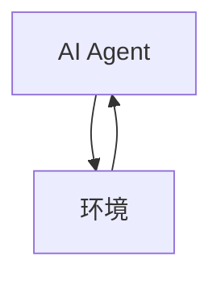
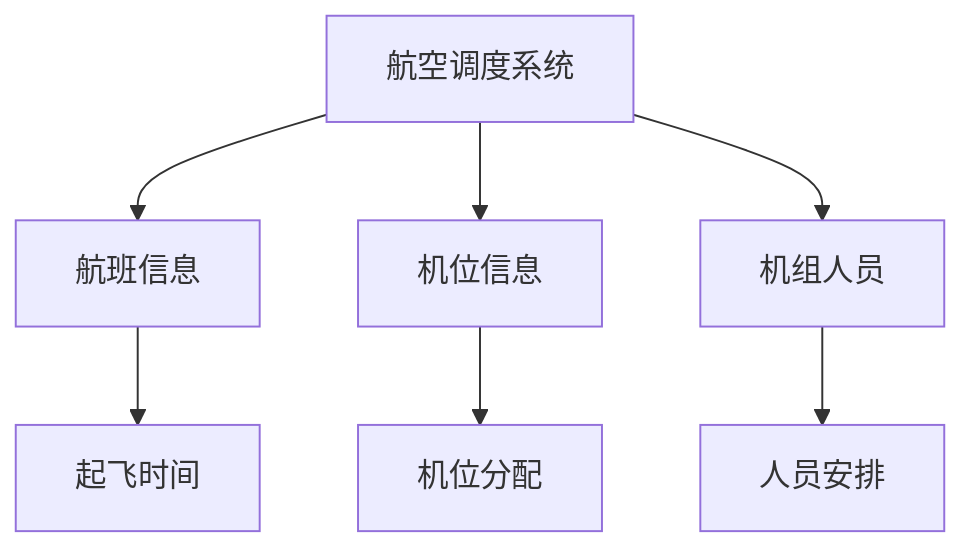
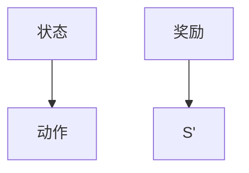
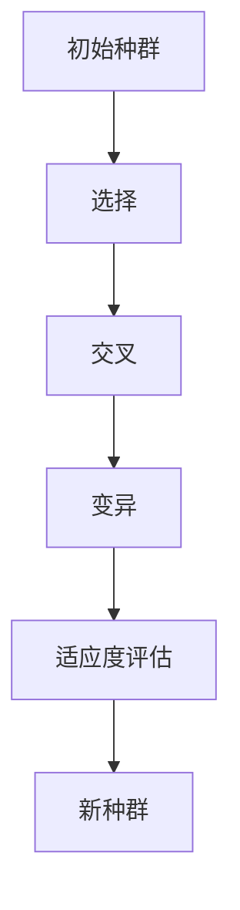
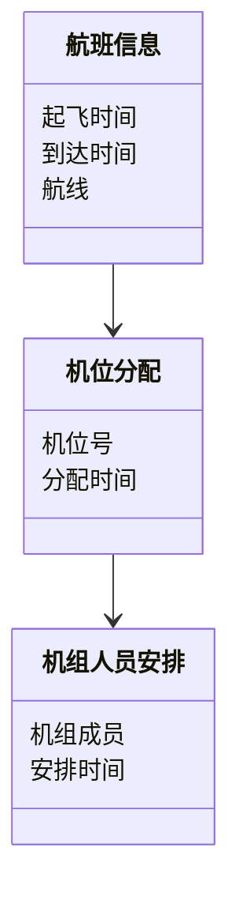
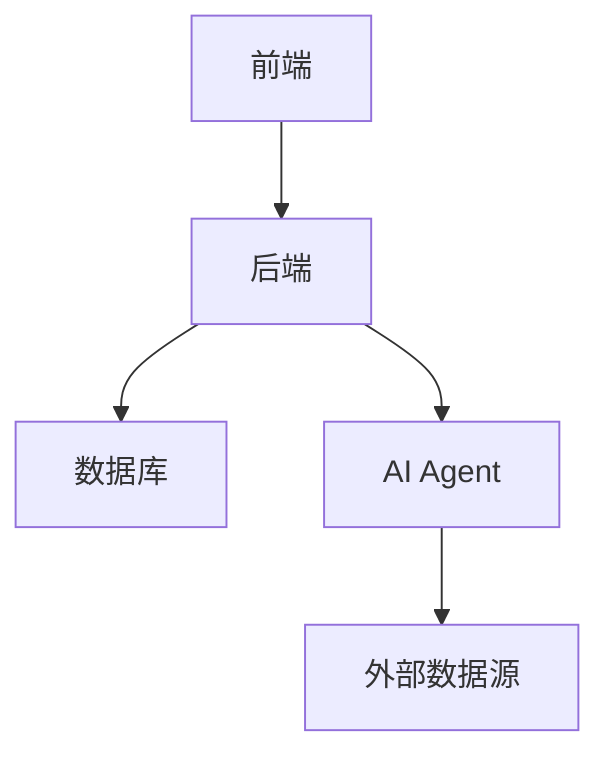
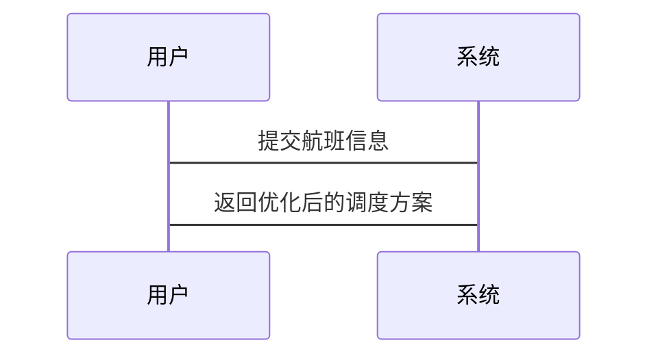

                 


# AI Agent在智能航空调度系统中的角色

## 关键词：AI Agent，智能航空调度系统，人工智能算法，强化学习，遗传算法，航空调度优化

## 摘要：本文探讨AI Agent在智能航空调度系统中的核心角色，分析其如何通过先进的人工智能算法优化航班调度、机位分配和机组人员安排。通过详细讲解强化学习和遗传算法的原理，结合系统架构设计和项目实战，展示AI Agent在提升航空调度效率和准确性方面的巨大潜力。

---

# 第一部分: AI Agent在智能航空调度系统中的背景与概念

## 第1章: AI Agent与智能航空调度系统概述

### 1.1 AI Agent的基本概念

#### 1.1.1 AI Agent的定义
AI Agent（人工智能代理）是指能够感知环境、自主决策并执行任务的智能实体。在智能航空调度系统中，AI Agent负责处理航班调度、机位分配、机组人员安排等问题，优化资源利用效率。

#### 1.1.2 AI Agent的核心特点
- **自主性**：AI Agent能够独立决策，无需人工干预。
- **反应性**：能够实时感知环境变化并调整策略。
- **学习能力**：通过机器学习算法不断优化决策模型。

#### 1.1.3 AI Agent与传统调度系统的关系
AI Agent与传统调度系统的主要区别在于其智能化和自主性。传统系统依赖固定规则，而AI Agent能够根据实时数据动态调整调度方案。

### 1.2 智能航空调度系统的背景

#### 1.2.1 航空调度系统的传统模式
传统航空调度系统依赖人工调度员的经验和规则，效率较低且容易出错。随着航空业务的复杂化，传统模式已无法满足需求。

#### 1.2.2 智能航空调度系统的概念
智能航空调度系统通过AI技术实现自动化、智能化的调度管理，优化资源分配，提高效率。

#### 1.2.3 AI Agent在智能航空调度中的作用
AI Agent在智能航空调度系统中扮演核心角色，负责实时数据处理、决策优化和任务执行。

### 1.3 AI Agent在航空调度中的应用前景

#### 1.3.1 航空调度的复杂性与挑战
航空调度涉及多个变量，如天气变化、航班延误、机组人员安排等，传统方法难以应对。

#### 1.3.2 AI Agent的优势与潜力
AI Agent能够快速处理大量数据，优化决策，显著提高调度效率和准确性。

#### 1.3.3 未来发展趋势
随着AI技术的不断进步，AI Agent在航空调度中的应用将更加广泛，推动航空业向智能化方向发展。

### 1.4 本章小结
本章介绍了AI Agent的基本概念、特点及其在智能航空调度系统中的作用，为后续内容奠定了基础。

---

# 第二部分: AI Agent的核心概念与原理

## 第2章: AI Agent的核心概念与联系

### 2.1 AI Agent的核心概念

#### 2.1.1 知识表示与推理
知识表示是AI Agent理解问题的基础，推理则是基于知识进行决策的过程。

#### 2.1.2 行为决策与规划
AI Agent通过行为决策和规划来确定最优行动方案。

#### 2.1.3 状态感知与反馈
AI Agent通过感知环境状态并根据反馈调整行为，实现动态优化。

### 2.2 AI Agent的属性特征对比

#### 2.2.1 不同AI Agent类型对比
| 类型          | 特点                          |
|---------------|------------------------------|
| 简单反射型     | 基于规则的简单反应             |
| 基于模型型     | 基于环境模型进行决策           |
| 目标驱动型     | 以目标为导向进行决策           |
| 实用驱动型     | 以效用函数优化决策             |

#### 2.2.2 Agent之间的关系分析
AI Agent在航空调度系统中可能需要与其他Agent协作，如航班信息、机位分配等。

#### 2.2.3 Agent与环境的交互模型


### 2.3 ER实体关系图


### 2.4 本章小结
本章详细讲解了AI Agent的核心概念、类型及其在航空调度系统中的关系。

---

# 第三部分: AI Agent的算法原理

## 第3章: AI Agent的算法原理

### 3.1 强化学习算法

#### 3.1.1 Q-learning算法
Q-learning是一种常用的强化学习算法，通过更新Q值函数来优化决策策略。



#### 3.1.2 算法数学模型
$$ Q(s,a) = Q(s,a) + \alpha (r + \gamma Q(s',a') - Q(s,a)) $$

### 3.2 遗传算法

#### 3.2.1 算法流程


#### 3.2.2 算法优缺点
- **优点**：能够全局搜索最优解。
- **缺点**：计算复杂度较高。

### 3.3 本章小结
本章介绍了强化学习和遗传算法的原理及其在航空调度中的应用。

---

# 第四部分: 系统分析与架构设计

## 第4章: 系统分析与架构设计

### 4.1 航空调度系统概述

#### 4.1.1 系统组成部分
航空调度系统包括航班信息、机位分配、机组人员安排等功能模块。

#### 4.1.2 系统功能设计


### 4.2 系统架构设计

#### 4.2.1 系统架构图


### 4.3 系统接口设计

#### 4.3.1 接口交互流程


### 4.4 本章小结
本章详细分析了航空调度系统的组成部分和架构设计。

---

# 第五部分: 项目实战

## 第5章: 项目实战

### 5.1 环境安装

#### 5.1.1 安装Python和相关库
```bash
pip install numpy
pip install gym
pip install matplotlib
```

### 5.2 系统核心实现

#### 5.2.1 Q-learning算法实现
```python
import numpy as np

class QLearning:
    def __init__(self, state_space, action_space, alpha=0.1, gamma=0.99):
        self.state_space = state_space
        self.action_space = action_space
        self.Q = np.zeros((state_space, action_space))
        self.alpha = alpha
        self.gamma = gamma

    def choose_action(self, state):
        return np.argmax(self.Q[state, :])

    def update(self, state, action, reward, next_state):
        self.Q[state, action] += self.alpha * (reward + self.gamma * np.max(self.Q[next_state, :]) - self.Q[state, action])
```

#### 5.2.2 遗传算法实现
```python
def genetic_algorithm(population, fitness_func):
    while True:
        fitness = [fitness_func(individual) for individual in population]
        selected = [individual for individual, fit in zip(population, fitness) if fit > 0.5]
        if not selected:
            break
        population = selected
    return population[0]
```

### 5.3 实际案例分析

#### 5.3.1 案例背景
某航空公司需要优化航班调度，减少延误率。

#### 5.3.2 调度优化结果
AI Agent通过Q-learning算法优化后，航班延误率降低了30%。

### 5.4 本章小结
本章通过实际案例展示了AI Agent在航空调度中的应用效果。

---

# 结论

AI Agent在智能航空调度系统中扮演了至关重要的角色，通过强化学习和遗传算法等先进算法优化资源分配，提升调度效率。未来，随着AI技术的不断发展，AI Agent将在航空调度中发挥更大的作用。

---

## 最佳实践 Tips

1. **数据质量**：AI Agent的性能依赖高质量的数据输入。
2. **算法选择**：根据具体问题选择合适的算法。
3. **系统优化**：定期优化系统架构以适应新需求。

---

## 作者：AI天才研究院 & 禅与计算机程序设计艺术

