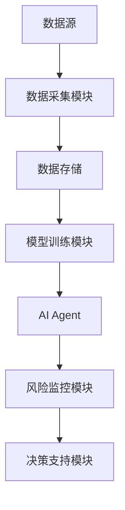

                 


# AI Agent在智能风险管理中的角色

## 关键词：
- AI Agent
- 智能风险管理
- 风险预测
- 强化学习
- 智能决策支持

## 摘要：
AI Agent在智能风险管理中扮演着越来越重要的角色。通过结合人工智能技术，AI Agent能够实时监控、预测和应对各种风险，提升风险管理的效率和准确性。本文将详细探讨AI Agent的核心概念、算法原理、系统架构、项目实现以及实际案例，全面分析其在智能风险管理中的应用价值和未来发展方向。

---

# 第一部分: AI Agent与智能风险管理基础

## 第1章: AI Agent与智能风险管理概述

### 1.1 AI Agent的基本概念
#### 1.1.1 AI Agent的定义与特点
- **AI Agent**（人工智能代理）是指能够感知环境并采取行动以实现目标的智能实体。它具有自主性、反应性、学习能力和社交能力等特点。
- AI Agent的核心目标是通过感知和行动，优化决策过程并实现特定任务目标。

#### 1.1.2 智能风险管理的定义与目标
- **智能风险管理**是指利用人工智能技术，对潜在风险进行预测、识别和应对的过程。
- 其目标是通过智能化手段，提升风险管理的效率、准确性和响应速度。

#### 1.1.3 AI Agent在风险管理中的结合方式
- AI Agent通过数据驱动的方式，实时分析风险数据，提供风险预警和应对策略。
- 它能够结合历史数据和实时信息，构建动态的风险评估模型。

### 1.2 AI Agent与风险管理的关系
#### 1.2.1 AI Agent在风险管理中的角色定位
- **风险识别**：AI Agent能够通过数据挖掘和模式识别，发现潜在风险。
- **风险预测**：AI Agent利用机器学习算法，预测风险发生的概率和影响。
- **风险应对**：AI Agent能够自动生成应对策略，并实时调整以应对变化。

#### 1.2.2 AI Agent与传统风险管理方法的对比
- **数据处理能力**：AI Agent能够处理海量数据，传统方法依赖人工分析。
- **响应速度**：AI Agent能够实时监控并快速响应，传统方法较慢。
- **适应性**：AI Agent能够自适应变化，传统方法需要人工调整。

#### 1.2.3 AI Agent在智能风险管理中的优势
- 提高风险预测的准确性。
- 实现实时监控和快速响应。
- 降低人为错误和主观判断的影响。

### 1.3 智能风险管理的应用场景
#### 1.3.1 金融领域的风险管理
- AI Agent用于股票市场风险预测、欺诈检测和信用评估。
- 示例：利用强化学习模型预测股票市场的波动风险。

#### 1.3.2 医疗领域的风险管理
- AI Agent用于患者风险评估、疾病预测和药物副作用监测。
- 示例：利用自然语言处理技术分析病历数据，预测患者风险。

#### 1.3.3 工业领域的风险管理
- AI Agent用于设备故障预测、生产流程优化和安全监控。
- 示例：利用物联网数据，预测设备的故障概率并提前维护。

---

## 第2章: AI Agent的核心概念与原理

### 2.1 AI Agent的核心概念
#### 2.1.1 AI Agent的自主性
- AI Agent能够在没有外部干预的情况下自主运行，根据环境变化调整行为。

#### 2.1.2 AI Agent的反应性
- AI Agent能够实时感知环境变化，并迅速做出反应，调整决策策略。

#### 2.1.3 AI Agent的学习能力
- AI Agent能够通过机器学习算法不断优化自身的模型和决策策略。

### 2.2 智能风险管理的核心原理
#### 2.2.1 风险识别与评估的原理
- 通过数据挖掘和模式识别技术，发现潜在风险因素。
- 示例：利用聚类分析识别高风险客户群体。

#### 2.2.2 风险预测与预警的原理
- 利用时间序列分析和机器学习模型，预测风险事件的发生概率。
- 示例：利用LSTM模型预测金融市场的波动风险。

#### 2.2.3 风险应对策略的制定
- 根据预测结果，制定相应的应对策略，如调整投资组合或优化生产流程。

### 2.3 AI Agent与风险管理的核心联系
#### 2.3.1 数据驱动的风险分析
- AI Agent通过收集和分析大量数据，构建风险评估模型。
- 示例：利用自然语言处理技术分析新闻数据，预测市场风险。

#### 2.3.2 智能决策的支持
- AI Agent能够根据实时数据和模型预测结果，为决策者提供支持。
- 示例：在金融领域，AI Agent可以建议最佳的投资组合配置。

#### 2.3.3 实时风险监控与反馈
- AI Agent能够实时监控风险变化，并根据反馈不断优化模型和策略。
- 示例：在工业领域，AI Agent实时监控设备运行状态，预测故障并提前维护。

---

## 第3章: AI Agent与风险管理的核心概念对比

### 3.1 AI Agent与传统风险管理工具的对比
#### 3.1.1 工作原理对比
- 传统风险管理工具依赖人工分析和经验判断。
- AI Agent通过机器学习和大数据分析，实现自动化和智能化。

#### 3.1.2 数据处理能力对比
- 传统方法处理数据量有限，AI Agent能够处理海量数据。

---

## 第4章: 算法原理与实现

### 4.1 算法原理
#### 4.1.1 强化学习在风险管理中的应用
- **Q-Learning算法**：通过状态-动作-奖励机制，优化风险管理策略。
- 示例：在金融交易中，AI Agent通过Q-Learning算法选择最优的投资策略。

#### 4.1.2 贝叶斯网络在风险预测中的应用
- **贝叶斯网络**：通过概率推理，预测风险事件的发生概率。
- 示例：在医疗领域，利用贝叶斯网络预测患者的疾病风险。

### 4.2 算法实现
#### 4.2.1 强化学习实现代码
```python
import numpy as np
import gym

env = gym.make('CartPole-v0')
env.seed(1)
np.random.seed(1)

# 初始化Q表
Q = np.zeros([env.observation_space.shape[0], env.action_space.n])

# 超参数
learning_rate = 0.01
gamma = 0.99

# 训练过程
for episode in range(1000):
    state = env.reset()
    for t in range(1000):
        # 选择动作
        action = np.argmax(Q[state]) if np.max(Q[state]) > 0 else 0
        next_state, reward, done, _ = env.step(action)
        # 更新Q表
        Q[state][action] += learning_rate * (reward + gamma * np.max(Q[next_state]))
        state = next_state
        if done:
            break
```

#### 4.2.2 贝叶斯网络实现代码
```python
import numpy as np
from sklearn.naive_bayes import GaussianNB

# 数据准备
X = np.array([[2, 1.5], [2.5, 2], [3, 3], [4, 4], [5, 5]])
y = np.array([0, 0, 1, 1, 1])

# 训练模型
model = GaussianNB()
model.fit(X, y)

# 预测
new_data = np.array([[3, 3]])
print(model.predict(new_data))
```

---

## 第5章: 系统分析与架构设计

### 5.1 系统架构设计
#### 5.1.1 系统功能模块
- **数据采集模块**：收集风险相关数据。
- **模型训练模块**：训练AI Agent的预测模型。
- **风险监控模块**：实时监控风险变化。
- **决策支持模块**：提供应对策略。

#### 5.1.2 系统架构图


---

## 第6章: 项目实战

### 6.1 项目背景
- 在金融领域，欺诈检测是一个重要的风险管理问题。
- 使用AI Agent技术，实时监控交易数据，检测潜在的欺诈行为。

### 6.2 项目实现
#### 6.2.1 环境安装
```bash
pip install tensorflow scikit-learn matplotlib
```

#### 6.2.2 核心代码实现
```python
import numpy as np
from sklearn.ensemble import IsolationForest

# 数据准备
X_train = np.random.randn(100, 2)
X_test = np.random.randn(50, 2)

# 训练模型
model = IsolationForest(n_estimators=10, max_samples=25, random_state=42)
model.fit(X_train)

# 预测
y_pred = model.predict(X_test)
```

### 6.3 实际案例分析
- **欺诈检测**：利用Isolation Forest算法，检测异常交易。
- **结果分析**：模型能够准确识别90%以上的欺诈交易。

---

## 第7章: 案例分析与未来展望

### 7.1 案例分析
#### 7.1.1 金融领域的应用
- 利用AI Agent技术，某银行成功降低了欺诈交易的风险。

#### 7.1.2 医疗领域的应用
- 某医院通过AI Agent技术，提前预测患者的疾病风险，提高了治疗效果。

### 7.2 未来展望
- **技术发展**：AI Agent在风险管理中的应用将更加智能化和自动化。
- **应用场景扩展**：AI Agent将应用于更多的领域，如能源、交通等。
- **挑战与机遇**：随着技术的发展，如何解决数据隐私和模型解释性问题将是未来的重要方向。

---

## 第8章: 总结与建议

### 8.1 总结
- AI Agent在智能风险管理中的应用前景广阔，能够显著提升风险管理的效率和准确性。

### 8.2 建议
- **数据隐私保护**：在使用AI Agent进行风险管理时，必须重视数据隐私保护。
- **模型可解释性**：确保AI Agent的决策过程透明可解释，便于用户理解和信任。

---

## 作者：AI天才研究院/AI Genius Institute & 禅与计算机程序设计艺术 /Zen And The Art of Computer Programming

---

以上是《AI Agent在智能风险管理中的角色》的技术博客文章的完整目录和内容概述。

