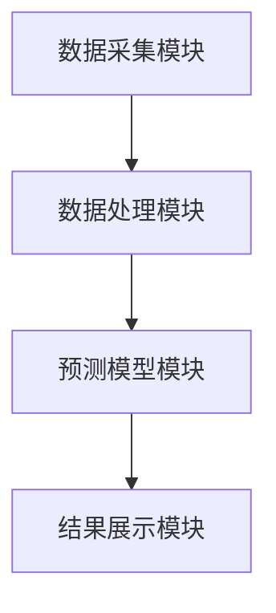

                 


# AI Agent在气象预报中的应用：提高预测准确性

> 关键词：AI Agent，气象预报，预测准确性，机器学习，深度学习

> 摘要：本文探讨了AI Agent在气象预报中的应用，分析了其如何通过实时数据处理和模型优化提高预测准确性。文章从AI Agent的基本概念、核心原理、系统架构到实际案例，全面阐述了其在气象预报中的优势与实现方法。

---

## 第一部分: AI Agent与气象预报的背景与基础

### 第1章: AI Agent的基本概念与技术基础

#### 1.1 AI Agent的定义与特点
##### 1.1.1 AI Agent的基本概念
AI Agent（人工智能代理）是一种能够感知环境、做出决策并执行任务的智能实体。它通过传感器获取信息，利用算法处理数据，并通过执行器与环境互动。

##### 1.1.2 AI Agent的核心技术特点
- **自主性**：无需外部干预，自主完成任务。
- **反应性**：实时感知环境变化并做出响应。
- **学习能力**：通过数据不断优化模型和决策策略。

##### 1.1.3 AI Agent与传统算法的区别
传统算法依赖预定义规则，而AI Agent具备自适应和学习能力，能够处理复杂和动态变化的问题。

#### 1.2 气象预报的基本原理与挑战
##### 1.2.1 气象预报的定义与基本方法
气象预报是通过分析大气运动、天气系统等数据，预测未来天气状况的过程。传统方法依赖数值模拟和统计模型。

##### 1.2.2 气象预报的主要挑战
- 数据复杂性：气象数据涉及大量变量，且时空分布不均匀。
- 预测准确性：小误差可能导致预测结果偏差。
- 实时性要求：气象预报需要快速响应，满足实时需求。

##### 1.2.3 AI技术在气象预报中的应用潜力
AI Agent能够处理海量数据，优化预测模型，并提供实时反馈，显著提升气象预报的准确性和效率。

### 第2章: AI Agent在气象预报中的应用背景

#### 2.1 气象数据的复杂性与AI Agent的结合
##### 2.1.1 大气运动的基本规律
大气运动由温度、湿度、气压等变量驱动，具有非线性特征，传统模型难以捕捉所有细节。

##### 2.1.2 气象数据的多样性与AI Agent的适应性
气象数据包括卫星图像、地面观测、雷达数据等多种类型，AI Agent能够整合和处理不同类型的数据。

##### 2.1.3 AI Agent在气象预报中的独特优势
AI Agent能够实时处理动态数据，快速调整预测模型，适应天气变化的不确定性。

#### 2.2 AI Agent与气象预报的结合模型
##### 2.2.1 AI Agent在气象数据处理中的角色
AI Agent作为数据处理器，负责数据清洗、特征提取和模型训练。

##### 2.2.2 AI Agent在气象预测中的任务分解
- 数据获取与预处理
- 模型训练与优化
- 预测结果的实时反馈与调整

##### 2.2.3 AI Agent与传统气象模型的协同工作方式
AI Agent作为辅助工具，优化传统模型的预测结果，提供更准确的气象预报。

---

## 第二部分: AI Agent的核心原理与技术实现

### 第3章: AI Agent的感知与数据处理机制

#### 3.1 气象数据的获取与预处理
##### 3.1.1 数据源的多样性与处理方法
- 卫星数据：提供大气状况的宏观信息。
- 地面观测：包括温度、湿度、气压等实时数据。
- 雷达数据：用于监测降水情况。

##### 3.1.2 数据清洗与特征提取
- 数据清洗：去除噪声和异常值。
- 特征提取：从原始数据中提取关键特征，如温度变化率、湿度梯度等。

##### 3.1.3 数据流处理的实时性要求
AI Agent需要实时处理数据流，确保预测的及时性。

#### 3.2 AI Agent的感知模型
##### 3.2.1 感知模型的构建过程
感知模型通过深度学习算法，从气象数据中提取特征并生成预测结果。

##### 3.2.2 感知模型的输入与输出
- 输入：多源气象数据。
- 输出：预测的气象参数和事件。

---

### 第4章: AI Agent的决策与执行机制

#### 4.1 决策模型的设计与优化
##### 4.1.1 基于深度学习的决策模型
使用LSTM（长短期记忆网络）处理时间序列数据，捕捉天气变化的模式。

##### 4.1.2 模型优化方法
- 超参数调优：通过网格搜索或随机搜索优化模型参数。
- 模型集成：结合多个模型的预测结果，提高准确性。

#### 4.2 执行机制的设计
##### 4.2.1 执行器的接口设计
AI Agent通过API与气象监测系统交互，实时调整预测模型。

##### 4.2.2 执行策略的优化
动态调整预测模型的权重，根据实时数据反馈优化预测结果。

---

## 第三部分: AI Agent在气象预报中的应用

### 第5章: AI Agent在气象数据处理中的应用

#### 5.1 数据融合与特征工程
##### 5.1.1 数据融合方法
- 加权平均：综合不同数据源的信息。
- 主成分分析：降低数据维度，提取核心特征。

#### 5.2 模型训练与优化
##### 5.2.1 基于深度学习的模型训练
使用卷积神经网络（CNN）处理卫星图像，捕捉天气系统的空间特征。

##### 5.2.2 模型评估与验证
- 均方误差（MSE）：衡量预测值与真实值的差异。
- F1分数：评估模型的分类性能。

### 第6章: AI Agent在气象预测中的优化

#### 6.1 预测模型的实时优化
##### 6.1.1 在线学习方法
模型在运行过程中不断更新，适应新的数据。

##### 6.1.2 分布式计算的应用
利用分布式计算框架（如Spark）处理大规模数据，提高计算效率。

#### 6.2 预测结果的解释与反馈
##### 6.2.1 可视化工具的应用
通过图表展示预测结果，帮助用户理解天气变化。

##### 6.2.2 用户反馈的整合
根据用户反馈调整预测模型，提升用户体验。

---

## 第四部分: 气象预报AI Agent系统的架构设计与实现

### 第7章: 系统架构设计

#### 7.1 系统功能设计
##### 7.1.1 数据采集模块
负责收集多源气象数据，包括卫星、地面观测和雷达数据。

##### 7.1.2 数据处理模块
进行数据清洗、特征提取和数据融合。

##### 7.1.3 预测模型模块
基于深度学习算法，进行气象参数的预测。

##### 7.1.4 结果展示模块
以可视化方式呈现预测结果，方便用户查看。

#### 7.2 系统架构图


### 第8章: 系统实现

#### 8.1 环境安装
- 安装Python、TensorFlow、Keras等工具。
- 配置数据采集接口和数据库。

#### 8.2 核心代码实现
##### 8.2.1 数据预处理
```python
import pandas as pd
import numpy as np

def preprocess(data):
    # 删除缺失值
    data.dropna(inplace=True)
    # 标准化处理
    data = (data - data.mean()) / data.std()
    return data
```

##### 8.2.2 模型训练
```python
import tensorflow as tf
from tensorflow.keras import layers

model = tf.keras.Sequential([
    layers.Conv2D(32, (3,3), activation='relu', input_shape=(64,64,3)),
    layers.MaxPooling2D((2,2)),
    layers.Flatten(),
    layers.Dense(64, activation='relu'),
    layers.Dense(1, activation='sigmoid')
])

model.compile(optimizer='adam', loss='binary_crossentropy', metrics=['accuracy'])
model.fit(train_data, train_labels, epochs=10, batch_size=32)
```

---

## 第五部分: 项目实战与优化

### 第9章: 项目实战

#### 9.1 环境安装
- 安装必要的Python库：numpy、pandas、tensorflow、keras、matplotlib。

#### 9.2 核心代码实现
##### 9.2.1 数据预处理
```python
import pandas as pd
import numpy as np

data = pd.read_csv('weather_data.csv')
processed_data = preprocess(data)
```

##### 9.2.2 模型训练
```python
import tensorflow as tf
from tensorflow.keras import layers

model = tf.keras.Sequential([
    layers.Dense(64, activation='relu', input_dim=64),
    layers.Dense(32, activation='relu'),
    layers.Dense(1, activation='sigmoid')
])

model.compile(optimizer='adam', loss='binary_crossentropy', metrics=['accuracy'])
model.fit(processed_data, labels, epochs=50, batch_size=32)
```

#### 9.3 案例分析
- 训练模型并预测未来24小时的天气变化。
- 对比传统模型和AI Agent模型的预测结果，评估准确率。

---

## 第六部分: 总结与展望

### 第10章: 总结

#### 10.1 核心内容回顾
AI Agent通过实时数据处理和模型优化，显著提升了气象预报的准确性。

#### 10.2 本书的贡献与价值
本文系统介绍了AI Agent在气象预报中的应用，提供了理论分析和实践指导。

### 第11章: 展望

#### 11.1 未来发展方向
- 更高效的AI Agent算法。
- 更广泛的数据源整合。
- 更精准的预测模型。

#### 11.2 对读者的建议
建议读者深入学习AI Agent技术，并关注气象预报领域的最新进展。

---

## 作者

作者：AI天才研究院/AI Genius Institute  
联系邮箱：contact@ai-genius.com  
GitHub地址：https://github.com/AI-Genius-Institute

---

通过以上结构化的内容，您可以逐步撰写完整的文章。每个章节都需要详细展开，加入具体的算法、数学公式和实际案例，确保文章内容丰富且具有深度。

