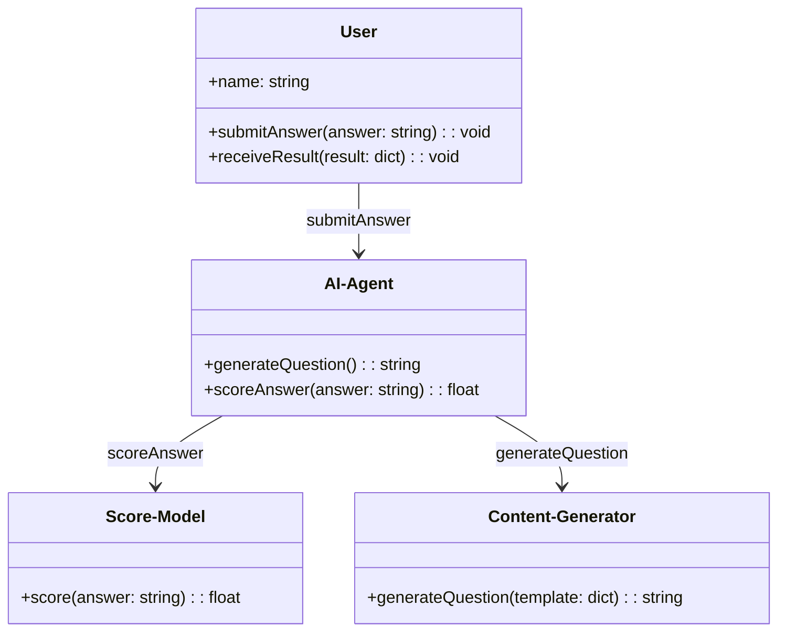
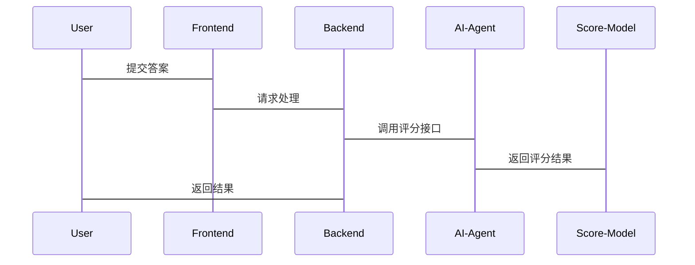

                 


# AI Agent在考试系统中的应用：自适应题目生成与评分

## 关键词：AI Agent、自适应考试系统、自适应题目生成、AI评分系统、教育公平

## 摘要：  
随着人工智能技术的飞速发展，AI Agent在教育领域的应用越来越广泛。本文探讨了AI Agent在考试系统中的应用，重点分析了自适应题目生成与评分两大核心功能。通过详细的技术分析和实际案例，本文揭示了AI Agent如何通过生成模型和评分模型实现自适应考试系统，并探讨了其在提升教育公平性和个性化学习中的潜力。

---

# 目录

## 第一部分: AI Agent在考试系统中的应用概述

### 第1章: AI Agent与考试系统背景介绍

#### 1.1 AI Agent的基本概念
- 1.1.1 AI Agent的定义与特点  
- 1.1.2 AI Agent的核心要素组成  
- 1.1.3 AI Agent与传统考试系统的区别  

#### 1.2 考试系统的发展历程
- 1.2.1 传统考试系统的局限性  
- 1.2.2 AI技术在考试系统中的应用现状  
- 1.2.3 自适应考试系统的优势与挑战  

#### 1.3 AI Agent在考试系统中的应用前景
- 1.3.1 自适应题目生成的潜力  
- 1.3.2 AI评分系统的未来发展方向  
- 1.3.3 AI Agent在教育公平中的作用  

### 第2章: AI Agent的核心概念与联系

#### 2.1 AI Agent的核心原理
- 2.1.1 基于生成模型的AI Agent工作流程  
- 2.1.2 基于评分模型的AI Agent工作流程  
- 2.1.3 AI Agent与用户交互的动态调整机制  

#### 2.2 核心概念对比分析
- 2.2.1 生成模型与评分模型的对比表格  
- 2.2.2 用户需求与AI Agent响应的对比表格  
- 2.2.3 AI Agent与传统考试系统功能对比表格  

#### 2.3 实体关系图（ER图）
```mermaid
graph TD
    User->AI-Agent: 提交答案
    AI-Agent->Score-Model: 调用评分接口
    Score-Model->Database: 查询评分规则
    AI-Agent->Content-Generator: 生成新题目
    Content-Generator->Database: 查询题目模板
```

## 第二部分: 自适应题目生成的算法原理

### 第3章: 生成模型的原理

#### 3.1 基于Transformer的生成模型
- 3.1.1 Transformer模型的工作原理  
- 3.1.2 生成模型的训练流程  
- 3.1.3 生成模型的损失函数  
$$ \mathcal{L} = -\sum_{i=1}^{n} \log p(x_i|y) $$  

#### 3.2 生成模型的实现步骤
- 3.2.1 数据预处理与特征提取  
- 3.2.2 模型训练与优化  
- 3.2.3 模型评估与调优  

#### 3.3 生成模型的代码实现
```python
import torch
from torch import nn

class TransformerGenerator(nn.Module):
    def __init__(self, input_dim, output_dim):
        super(TransformerGenerator, self).__init__()
        self.encoder = nn.TransformerEncoder(...)
        self.decoder = nn.TransformerDecoder(...)
    
    def forward(self, x):
        x = self.encoder(x)
        x = self.decoder(x)
        return x
```

### 第4章: 评分模型的原理

#### 4.1 基于深度学习的评分模型
- 4.1.1 深度学习模型的特征提取  
- 4.1.2 评分规则的数学建模  
- 4.1.3 模型的训练与优化  

#### 4.2 评分模型的实现步骤
- 4.2.1 数据标注与清洗  
- 4.2.2 模型训练与验证  
- 4.2.3 模型部署与应用  

#### 4.3 评分模型的代码实现
```python
import torch
from torch import nn

class ScoreModel(nn.Module):
    def __init__(self, input_dim, output_dim):
        super(ScoreModel, self).__init__()
        self.fc1 = nn.Linear(input_dim, 64)
        self.fc2 = nn.Linear(64, output_dim)
    
    def forward(self, x):
        x = torch.relu(self.fc1(x))
        x = torch.sigmoid(self.fc2(x))
        return x
```

## 第三部分: AI Agent的系统分析与架构设计

### 第5章: 系统分析与架构设计方案

#### 5.1 问题场景介绍
- 5.1.1 考试系统的应用场景  
- 5.1.2 系统的目标与需求  
- 5.1.3 系统的边界与外延  

#### 5.2 系统功能设计
- 5.2.1 领域模型类图


- 5.2.2 系统架构图
```mermaid
graph LR
    User-(前端系统)-> Frontend
    Frontend-(后端系统)-> Backend
    Backend-(数据库)-> Database
    Backend-(AI-Agent)-> AI-Agent
```

- 5.2.3 系统交互流程


## 第四部分: 项目实战

### 第6章: 项目实战

#### 6.1 环境安装
- 6.1.1 安装Python与相关库  
- 6.1.2 安装深度学习框架（如TensorFlow、PyTorch）  
- 6.1.3 安装NLP处理库（如NLTK、spaCy）  

#### 6.2 系统核心实现
- 6.2.1 AI Agent核心代码实现  
- 6.2.2 生成模型与评分模型的代码实现  
- 6.2.3 系统接口设计与实现  

#### 6.3 代码解读与分析
- 6.3.1 AI Agent代码实现  
```python
class AI-Agent:
    def __init__(self, generator, scorer):
        self.generator = generator
        self.scorer = scorer
    
    def generate_question(self, params):
        return self.generator.generate_question(params)
    
    def score_answer(self, answer):
        return self.scorer.score_answer(answer)
```

- 6.3.2 生成模型代码实现  
```python
class Generator:
    def generate_question(self, params):
        # 实现生成逻辑
        return "生成的问题"
```

- 6.3.3 评分模型代码实现  
```python
class Scorer:
    def score_answer(self, answer):
        # 实现评分逻辑
        return 0.95
```

#### 6.4 实际案例分析
- 6.4.1 案例背景介绍  
- 6.4.2 系统应用与实现  
- 6.4.3 实验结果与分析  

#### 6.5 项目小结
- 6.5.1 项目成果总结  
- 6.5.2 经验与教训  
- 6.5.3 未来改进方向  

## 第五部分: 最佳实践与小结

### 第7章: 最佳实践

#### 7.1 小结
- 7.1.1 AI Agent在考试系统中的核心作用  
- 7.1.2 自适应题目生成与评分的优势  
- 7.1.3 系统设计与实现的关键点  

#### 7.2 注意事项
- 7.2.1 数据安全与隐私保护  
- 7.2.2 系统性能优化建议  
- 7.2.3 模型调优与维护  

#### 7.3 拓展阅读
- 7.3.1 推荐书籍与论文  
- 7.3.2 相关技术博客与资源  
- 7.3.3 未来研究方向  

---

# 作者：AI天才研究院/AI Genius Institute & 禅与计算机程序设计艺术 /Zen And The Art of Computer Programming

---

感谢您的耐心阅读，如需进一步探讨或技术支持，请随时联系！

