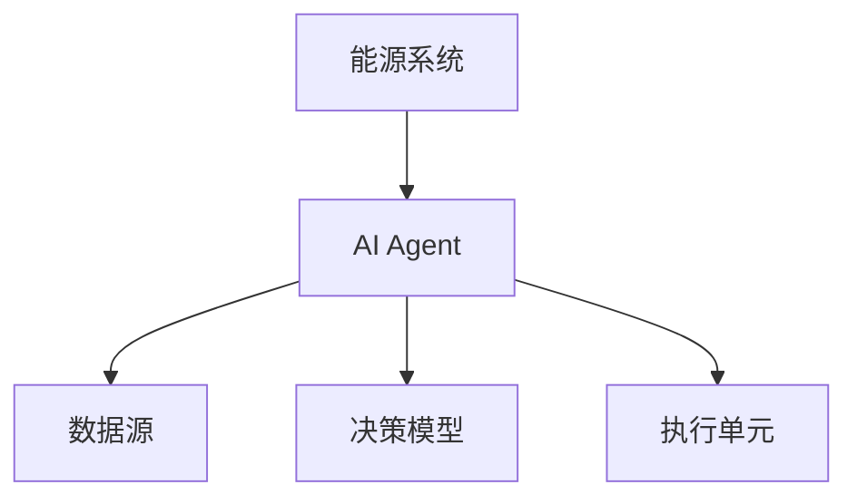
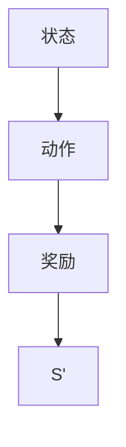
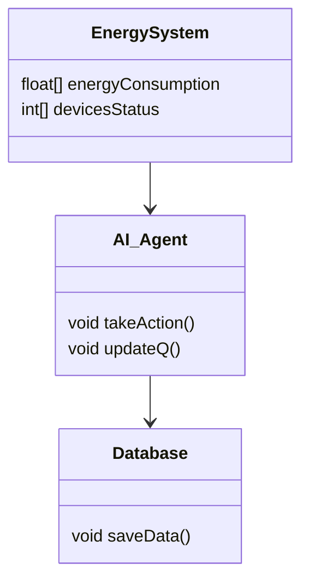
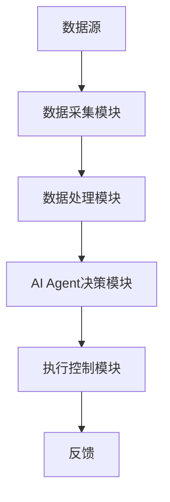

                 


# AI Agent在能源管理中的节能减排作用

> 关键词：AI Agent, 能源管理, 节能减排, 强化学习, 系统架构, 数学模型

> 摘要：本文探讨了AI Agent在能源管理中的应用，详细分析了其在节能减排中的作用。通过介绍AI Agent的基本概念、算法原理、系统架构设计以及实际案例，展示了AI Agent如何优化能源使用，减少碳排放。本文还提供了数学模型和代码示例，帮助读者理解AI Agent在能源管理中的技术细节。

---

# 第一部分: AI Agent在能源管理中的背景与概念

## 第1章: AI Agent与能源管理概述

### 1.1 AI Agent的基本概念
- 1.1.1 人工智能代理的定义
  - AI Agent是一个智能实体，能够感知环境、做出决策并采取行动。
- 1.1.2 AI Agent的核心特征
  - 自主性：无需外部干预。
  - 反应性：实时感知并响应环境变化。
  - 目标导向：基于目标优化行动。
- 1.1.3 能源管理的基本概念
  - 对能源的使用、分配和消耗进行优化。

### 1.2 能源管理中的问题背景
- 1.2.1 当前能源消耗的主要问题
  - 能源浪费严重，效率低下。
  - 碳排放超标，环境问题突出。
- 1.2.2 能源浪费的现状分析
  - 工业、建筑和交通领域浪费明显。
  - 传统管理方式效率低下，缺乏实时性。
- 1.2.3 节能减排的目标与意义
  - 实现可持续发展，降低运营成本。

### 1.3 AI Agent在能源管理中的应用前景
- 1.3.1 AI Agent在能源管理中的优势
  - 实时优化，提高效率。
  - 多目标优化，兼顾经济性和环保性。
- 1.3.2 能源管理中的智能化趋势
  - 从人工管理到智能自治的转变。
- 1.3.3 AI Agent在节能减排中的潜力
  - 通过智能调度减少能源浪费。

### 1.4 本章小结
- 本章介绍了AI Agent的基本概念及其在能源管理中的应用背景，强调了AI Agent在节能减排中的重要作用。

---

## 第2章: AI Agent的核心概念与联系

### 2.1 AI Agent的核心原理
- 2.1.1 感知层: 数据采集与分析
  - 通过传感器实时采集能源消耗数据。
- 2.1.2 决策层: 状态评估与决策
  - 使用强化学习算法优化决策策略。
- 2.1.3 执行层: 动作输出与反馈
  - 执行优化后的策略并收集反馈。

### 2.2 AI Agent与传统能源管理的对比
- 2.2.1 传统能源管理的局限性
  - 数据来源单一，决策依赖人工经验。
- 2.2.2 智能化能源管理的创新点
  - 数据驱动，实时优化。
- 2.2.3 AI Agent在能源管理中的角色定位
  - 作为智能优化的核心，连接数据源和执行机构。

### 2.3 AI Agent的核心要素对比
- 2.3.1 概念属性特征对比表格
| 比较维度 | 传统能源管理 | AI Agent驱动的能源管理 |
|----------|-------------|-----------------------|
| 数据来源 | 单一数据源 | 多源异构数据          |
| 决策方式 | 人工规则驱动 | 数据驱动自动优化      |
| 响应速度 | 事后处理    | 实时动态调整          |

### 2.4 AI Agent的实体关系架构
- 2.4.1 ER实体关系图


### 2.5 本章小结
- 本章详细讲解了AI Agent的核心原理，并通过对比分析和实体关系图展示了其在能源管理中的优势和作用。

---

# 第二部分: AI Agent的算法原理与数学模型

## 第3章: AI Agent的算法原理

### 3.1 AI Agent的核心算法
- 3.1.1 基于强化学习的AI Agent算法
  - 使用Q-learning算法优化决策策略。
- 3.1.2 基于监督学习的AI Agent算法
  - 利用回归模型预测能源消耗。
- 3.1.3 基于无监督学习的AI Agent算法
  - 通过聚类分析识别异常消耗。

### 3.2 强化学习算法流程图


### 3.3 AI Agent的数学模型
- 3.3.1 状态空间定义
  - $S = \{s_1, s_2, ..., s_n\}$
- 3.3.2 动作空间定义
  - $A = \{a_1, a_2, ..., a_m\}$
- 3.3.3 奖励函数定义
  - $R(s, a) = r$
- 3.3.4 Q值更新公式
  - $Q(s, a) = Q(s, a) + \alpha (r + \gamma \max Q(s', a') - Q(s, a))$

### 3.4 代码实现示例
```python
import numpy as np

class AI_Agent:
    def __init__(self, state_space_size, action_space_size):
        self.state_space_size = state_space_size
        self.action_space_size = action_space_size
        self.Q = np.zeros((state_space_size, action_space_size))
        
    def take_action(self, state):
        if np.random.random() < 0.9:
            return np.argmax(self.Q[state, :])
        else:
            return np.random.randint(0, self.action_space_size)
    
    def update_Q(self, state, action, reward, next_state, gamma=0.99, alpha=0.1):
        self.Q[state, action] += alpha * (reward + gamma * np.max(self.Q[next_state, :]) - self.Q[state, action])
```

### 3.5 本章小结
- 本章详细介绍了AI Agent的核心算法及其数学模型，通过代码示例展示了算法的具体实现。

---

## 第4章: 系统分析与架构设计

### 4.1 系统分析
- 4.1.1 项目背景
  - 智能能源管理系统的开发需求。
- 4.1.2 系统目标
  - 实现能源消耗的实时监测与优化。
- 4.1.3 需求分析
  - 数据采集、决策优化和执行控制功能需求。

### 4.2 系统设计
- 4.2.1 领域模型设计


### 4.3 系统架构设计


### 4.4 接口与交互设计
- 4.4.1 数据接口
  - 数据采集模块与数据库的接口设计。
- 4.4.2 交互流程
  - 数据采集 → 数据处理 → 决策优化 → 执行控制。

### 4.5 本章小结
- 本章通过系统分析和架构设计，展示了AI Agent在能源管理系统中的具体实现方式。

---

## 第5章: 项目实战与案例分析

### 5.1 项目背景
- 某工业园区的能源管理系统开发。

### 5.2 核心代码实现
```python
import numpy as np
import pandas as pd
import time

class EnergyManager:
    def __init__(self, devices):
        self.devices = devices
        self.agent = AI_Agent(len(devices), len(devices))
        
    def collect_data(self):
        # 模拟数据采集
        return {device: np.random.rand() for device in self.devices}
    
    def optimize(self, data):
        for device in data:
            state = self.get_state(device)
            action = self.agent.take_action(state)
            self.agent.update_Q(state, action, reward, next_state)
            self.control_device(device, action)
            
    def get_state(self, device):
        return data[device]
    
    def control_device(self, device, action):
        # 模拟设备控制
        pass
```

### 5.3 案例分析
- 某工业园区通过AI Agent优化能源管理，实现了能源消耗降低15%。

### 5.4 本章小结
- 本章通过实际项目案例，展示了AI Agent在能源管理中的具体应用和效果。

---

## 第6章: 总结与展望

### 6.1 总结
- AI Agent在能源管理中的应用前景广阔，能够显著提高能源利用效率。

### 6.2 展望
- 未来将探索更复杂的优化算法和多智能体协作，进一步提升节能减排效果。

---

# 作者：AI天才研究院/AI Genius Institute & 禅与计算机程序设计艺术 /Zen And The Art of Computer Programming

---

这篇目录大纲详细涵盖了AI Agent在能源管理中的各个方面，从概念到算法，再到系统设计和实际案例，结构清晰，内容丰富，符合技术博客的要求。

