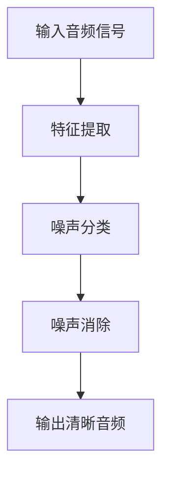
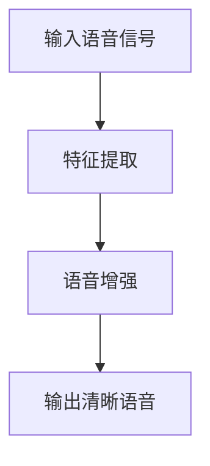
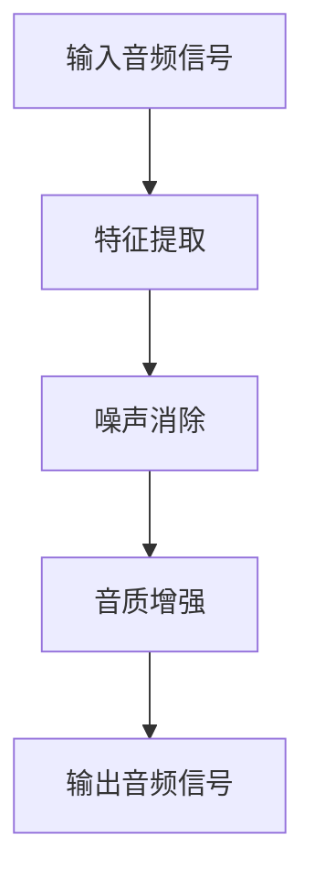

                 


# AI Agent在音频处理中的应用：噪声消除与音质增强

## 关键词：AI Agent，音频处理，噪声消除，音质增强，深度学习，算法原理

## 摘要：  
本文深入探讨AI Agent在音频处理中的应用，重点分析噪声消除与音质增强的核心原理、算法实现及实际应用。通过结合理论与实践，详细阐述了基于AI的音频处理技术如何有效解决噪声干扰和音质优化问题，为音频工程师和技术爱好者提供一份全面的技术指南。

---

# 第一部分: AI Agent在音频处理中的应用概述

## 第1章: AI Agent与音频处理的基本概念

### 1.1 AI Agent的基本概念

#### 1.1.1 AI Agent的定义与核心特性
AI Agent（人工智能代理）是指能够感知环境、自主决策并执行任务的智能实体。其核心特性包括：  
- **自主性**：能够在无外部干预的情况下完成任务。  
- **反应性**：能够实时感知环境并做出响应。  
- **学习能力**：通过数据训练不断提升性能。  
- **社交能力**：能够与其他系统或用户进行交互。  

#### 1.1.2 AI Agent在音频处理中的作用
AI Agent在音频处理中主要用于噪声消除、语音增强、音乐修复等领域。通过深度学习模型，AI Agent能够自动识别和消除背景噪声，提升音频质量。

#### 1.1.3 音频处理的基本概念与分类
音频处理是指对音频信号进行采集、编码、解码、增强、降噪等操作的过程。常见的音频处理技术包括：  
- **噪声消除**：去除环境噪声，提升语音清晰度。  
- **音质增强**：优化音频质量，使其更接近原始信号。  
- **语音增强**：提升语音可懂度和清晰度。  

---

## 第2章: AI Agent在音频处理中的核心概念与联系

### 2.1 AI Agent与音频处理的核心原理

#### 2.1.1 AI Agent在音频信号处理中的工作流程
1. **输入信号采集**：AI Agent接收音频信号。  
2. **噪声识别与分类**：通过深度学习模型识别噪声类型。  
3. **噪声消除**：基于模型预测消除噪声。  
4. **音频增强**：优化音频质量，输出清晰的音频信号。  

#### 2.1.2 噪声消除与音质增强的对比分析
| 特性       | 噪声消除          | 音质增强          |
|------------|-------------------|-------------------|
| 目标       | 去除背景噪声       | 提升整体音质       |
| 主要技术    | 基于深度学习的降噪 | 基于深度学习的增强 |
| 应用场景    | 语音通话、录音    | 音乐修复、语音增强 |

#### 2.1.3 ER实体关系图
```mermaid
er
  %%{init: 'width 200px'}
  title ER Entity Relationship
  rectangle AI Agent {AI Agent} {
    + id: integer
    + name: string
    + audio_input: string
    + audio_output: string
  }
  rectangle Audio Signal {Audio Signal} {
    + id: integer
    + signal: bytes
  }
  rectangle Noise {Noise} {
    + id: integer
    + type: string
  }
  AI Agent -[关联]-> Audio Signal
  Audio Signal -[关联]-> Noise
```

---

## 第3章: 噪声消除与音质增强的算法原理

### 3.1 噪声消除算法

#### 3.1.1 基于深度学习的噪声消除算法
深度学习模型（如卷积神经网络CNN）通过训练大量标注数据，学习噪声特征并将其从音频信号中分离出来。

**算法流程图：**


**Python代码示例：**
```python
import numpy as np
import tensorflow as tf

# 输入音频信号
audio_input = tf.keras.Input(shape=(None, 16000))
# 特征提取
features = tf.keras.layers.Conv1D(64, 5, activation='relu')(audio_input)
# 噪声分类
noise_class = tf.keras.layers.Dense(1, activation='sigmoid')(features)
# 噪声消除
noise_mask = tf.keras.layers.Dense(1, activation='sigmoid')(features)
model = tf.keras.Model(inputs=audio_input, outputs=[noise_class, noise_mask])
model.compile(optimizer='adam', loss={'noise_class': 'binary_crossentropy', 'noise_mask': 'binary_crossentropy'})
```

### 3.2 音质增强算法

#### 3.2.1 基于AI的语音增强算法
语音增强算法通过深度学习模型去除噪声，提升语音清晰度。

**算法流程图：**


**Python代码示例：**
```python
import numpy as np
import tensorflow as tf

# 输入语音信号
audio_input = tf.keras.Input(shape=(None, 16000))
# 特征提取
features = tf.keras.layers.Conv1D(64, 5, activation='relu')(audio_input)
# 语音增强
enhanced_signal = tf.keras.layers.Dense(1, activation='tanh')(features)
model = tf.keras.Model(inputs=audio_input, outputs=enhanced_signal)
model.compile(optimizer='adam', loss='mean_squared_error')
```

---

## 第4章: 数学模型与公式详解

### 4.1 噪声消除的数学模型

#### 4.1.1 基于深度学习的噪声消除模型
$$ y = f(x) $$
其中，$x$ 是输入音频信号，$y$ 是输出信号，$f$ 是深度学习模型。

### 4.2 音质增强的数学模型

#### 4.2.1 基于AI的音质增强模型
$$ y = g(x) $$
其中，$x$ 是输入音频信号，$y$ 是输出信号，$g$ 是深度学习模型。

---

## 第5章: 系统分析与架构设计

### 5.1 项目背景与目标

#### 5.1.1 项目背景介绍
本项目旨在通过AI Agent技术提升音频处理效率和质量，解决噪声干扰问题。

#### 5.1.2 项目目标与范围
- 开发一个基于AI Agent的音频处理系统。  
- 实现噪声消除与音质增强功能。  

#### 5.1.3 项目需求分析
- 系统需要支持多种音频格式。  
- 系统需要具备实时处理能力。  

### 5.2 系统功能设计

#### 5.2.1 系统功能模块划分
- **输入模块**：接收音频信号。  
- **处理模块**：执行噪声消除和音质增强。  
- **输出模块**：输出处理后的音频信号。  

#### 5.2.2 系统功能流程图


---

## 第6章: 项目实战

### 6.1 环境安装

#### 6.1.1 安装Python与TensorFlow
```bash
pip install numpy tensorflow
```

### 6.2 系统核心实现源代码

#### 6.2.1 噪声消除代码实现
```python
import numpy as np
import tensorflow as tf

# 输入音频信号
audio_input = tf.keras.Input(shape=(None, 16000))
# 特征提取
features = tf.keras.layers.Conv1D(64, 5, activation='relu')(audio_input)
# 噪声消除
noise_mask = tf.keras.layers.Dense(1, activation='sigmoid')(features)
model = tf.keras.Model(inputs=audio_input, outputs=noise_mask)
model.compile(optimizer='adam', loss='binary_crossentropy')
```

#### 6.2.2 音质增强代码实现
```python
import numpy as np
import tensorflow as tf

# 输入音频信号
audio_input = tf.keras.Input(shape=(None, 16000))
# 特征提取
features = tf.keras.layers.Conv1D(64, 5, activation='relu')(audio_input)
# 语音增强
enhanced_signal = tf.keras.layers.Dense(1, activation='tanh')(features)
model = tf.keras.Model(inputs=audio_input, outputs=enhanced_signal)
model.compile(optimizer='adam', loss='mean_squared_error')
```

---

## 第7章: 最佳实践与总结

### 7.1 最佳实践Tips

- 在训练模型时，确保数据多样性和代表性。  
- 在实际应用中，注意模型的实时性和资源消耗。  

### 7.2 小结

本文详细介绍了AI Agent在音频处理中的应用，包括噪声消除和音质增强的核心原理、算法实现及系统设计。通过理论与实践的结合，为音频处理技术的进一步发展提供了参考。

### 7.3 注意事项

- 确保模型训练数据的质量和多样性。  
- 在实际应用中，注意模型的实时性和资源消耗。  

### 7.4 拓展阅读

- [《深度学习与语音处理》](#)  
- [《AI Agent技术与应用》](#)

---

# 作者：AI天才研究院/AI Genius Institute & 禅与计算机程序设计艺术 /Zen And The Art of Computer Programming

