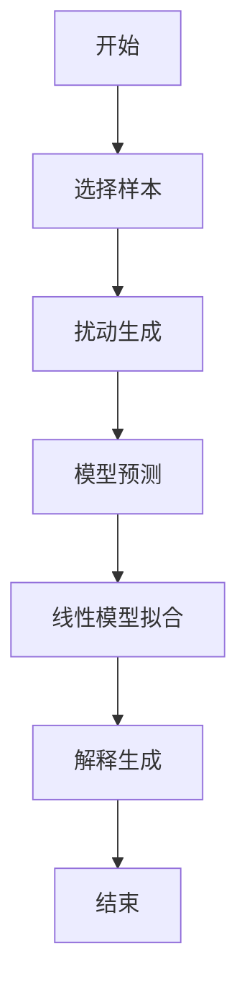
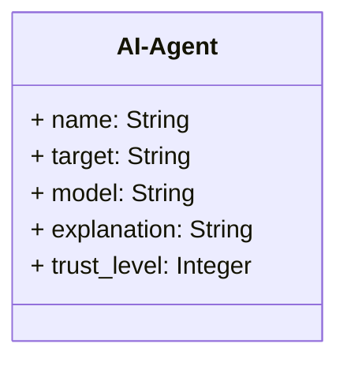
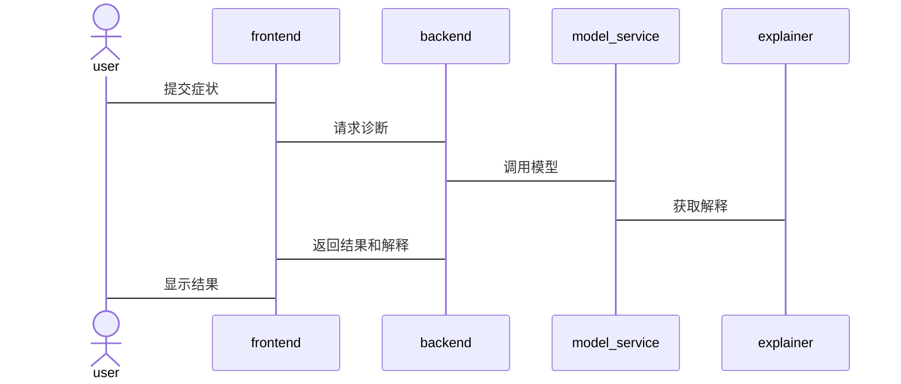

                 


# AI Agent的可解释性设计原则

> 关键词：AI Agent、可解释性、设计原则、算法原理、系统架构、伦理与法律

> 摘要：AI Agent的可解释性设计是当前人工智能领域的重要研究方向。本文从AI Agent的基本概念出发，探讨了可解释性设计的核心原则，分析了可解释性算法的实现原理，并结合实际案例，展示了如何在系统设计中实现可解释性。文章最后总结了可解释性设计的实践经验和未来发展方向。

---

# 第一部分: AI Agent的可解释性设计基础

## 第1章: AI Agent的基本概念与背景

### 1.1 AI Agent的定义与特点

#### 1.1.1 AI Agent的基本概念
AI Agent（人工智能代理）是指能够感知环境并采取行动以实现目标的智能实体。它可以是一个软件程序、机器人或其他智能系统，通过与环境交互来完成特定任务。

#### 1.1.2 AI Agent的核心特点
1. **自主性**：AI Agent能够在没有外部干预的情况下自主决策。
2. **反应性**：能够实时感知环境并做出反应。
3. **目标导向**：所有行动都围绕实现特定目标展开。
4. **学习能力**：能够通过经验改进自身性能。

#### 1.1.3 AI Agent与传统AI的区别
AI Agent不仅是一个静态的模型或算法，而是一个动态的、能够与环境交互的实体。它需要在复杂环境中完成任务，因此对实时性和适应性要求更高。

---

### 1.2 可解释性的重要性

#### 1.2.1 可解释性在AI系统中的必要性
可解释性是指AI系统的决策过程能够被人类理解和验证。在AI Agent中，可解释性是确保用户信任、保证系统透明性以及满足伦理和法律要求的关键因素。

#### 1.2.2 可解释性对用户信任的影响
用户只有在理解AI Agent的决策过程后，才能真正信任它。缺乏可解释性的AI系统可能导致用户不信任，进而影响系统的应用和推广。

#### 1.2.3 可解释性在伦理和法律中的作用
在医疗、金融等领域，AI Agent的决策可能直接影响用户的生活和财产。可解释性是确保这些决策符合伦理和法律要求的基础。

---

### 1.3 AI Agent的可解释性挑战

#### 1.3.1 可解释性的定义与边界
可解释性并不意味着AI Agent的所有决策都必须完全透明，而是需要在一定程度上让用户或开发者理解其决策逻辑。

#### 1.3.2 AI Agent复杂性对可解释性的挑战
复杂的AI算法（如深度神经网络）通常缺乏可解释性，这使得AI Agent的决策过程难以被人类理解。

#### 1.3.3 伦理和法律对可解释性的要求
许多行业和国家都对AI系统的可解释性提出了明确要求。例如，欧盟的《人工智能法案》就要求AI系统在特定情况下提供可解释的决策过程。

---

## 第2章: 可解释性设计的核心概念与联系

### 2.1 可解释性设计的原理

#### 2.1.1 可解释性设计的基本原理
可解释性设计的核心是通过简化模型、增加透明度或提供解释工具，使得AI Agent的决策过程能够被人类理解和验证。

#### 2.1.2 可解释性与模型复杂性的关系
模型复杂性越高，通常可解释性越低。因此，在设计AI Agent时需要在模型性能和可解释性之间找到平衡点。

#### 2.1.3 可解释性与用户需求的匹配
不同的用户群体对可解释性的需求不同。例如，普通用户可能只需要简单的解释，而开发者则需要更详细的模型内部信息。

---

### 2.2 核心概念对比分析

#### 2.2.1 可解释性与透明性的对比
- **透明性**：指系统内部过程的可见性。
- **可解释性**：指系统决策过程的可理解性。
- 区别：透明性更关注过程的可见性，而可解释性更关注过程的可理解性。

#### 2.2.2 可解释性与公平性的对比
- **公平性**：指系统决策不偏袒任何特定群体。
- **可解释性**：指系统决策过程的可理解性。
- 关系：可解释性是实现公平性的基础，因为只有理解决策过程，才能发现潜在的偏见。

#### 2.2.3 可解释性与可追溯性的对比
- **可追溯性**：指系统决策可以被追踪和验证。
- **可解释性**：指系统决策过程可以被理解。
- 关系：可追溯性依赖于可解释性，因为只有理解决策过程，才能实现有效的追溯。

---

### 2.3 可解释性设计的ER实体关系图

```mermaid
er
actor
  name
  role
  action
  explanation
  trust_level
```

---

## 第3章: 可解释性设计的算法原理

### 3.1 常见的可解释性算法

#### 3.1.1 LIME解释方法
LIME（Local Interpretable Model-agnostic Explanations）是一种通过局部线性近似来解释模型决策的方法。

```python
import lime
from lime import lime
from lime.lime_model import LimeModel

# 示例代码：使用LIME解释一个模型的预测结果
def lime_explanation(X, model):
    explainer = LimeModel(model)
    explanation = explainer.explain(X)
    return explanation
```

#### 3.1.2 SHAP值解释方法
SHAP（SHapley Additive exPlanations）是一种基于Shapley值的解释方法，用于衡量每个特征对模型预测的贡献。

```python
import shap
from sklearn.model import model

# 示例代码：使用SHAP解释一个模型的预测结果
def shap_explanation(X, model):
    explainer = shap.Explainer(model)
    shap_values = explainer(X)
    return shap_values
```

#### 3.1.3 敏感性分析方法
敏感性分析通过改变输入特征的值，观察模型输出的变化，从而判断特征的重要性。

### 3.2 LIME算法的实现流程



---

## 第4章: 可解释性设计的系统分析与架构设计

### 4.1 系统分析与设计

#### 4.1.1 问题场景介绍
以医疗诊断AI Agent为例，设计一个可解释性系统，帮助医生理解AI的诊断过程。

#### 4.1.2 系统功能设计



#### 4.1.3 系统架构设计


#### 4.1.4 系统接口设计
- 输入接口：用户输入症状和病史。
- 输出接口：AI Agent的诊断结果和解释。

#### 4.1.5 系统交互流程图



---

## 第5章: 可解释性设计的项目实战

### 5.1 项目实战

#### 5.1.1 环境安装
```bash
pip install lime shap
```

#### 5.1.2 核心代码实现

```python
def main():
    import lime
    import shap

    # 示例代码：LIME解释
    def lime_explanation(X, model):
        explainer = LimeModel(model)
        explanation = explainer.explain(X)
        return explanation

    # 示例代码：SHAP解释
    def shap_explanation(X, model):
        explainer = shap.Explainer(model)
        shap_values = explainer(X)
        return shap_values

    if __name__ == "__main__":
        main()
```

#### 5.1.3 代码应用解读与分析
通过上述代码，我们可以实现对AI Agent决策过程的解释。LIME和SHAP提供了不同的解释方法，用户可以根据需求选择合适的方法。

#### 5.1.4 实际案例分析
以医疗诊断为例，AI Agent可以根据患者的症状和病史，提供诊断建议，并通过LIME或SHAP解释其决策过程。

---

## 第6章: 可解释性设计的最佳实践与总结

### 6.1 最佳实践 tips

1. **简化模型**：在保证性能的前提下，选择可解释性更强的模型。
2. **结合多种解释方法**：根据需求选择合适的解释工具。
3. **注重用户体验**：将解释信息以用户友好的方式呈现。
4. **遵循伦理和法律要求**：确保AI Agent的决策过程符合相关法规。

### 6.2 小结
可解释性设计是AI Agent设计中的重要原则。通过简化模型、选择合适的解释工具和优化用户交互，我们可以提高AI Agent的透明度和用户信任。

### 6.3 注意事项
- 不要过度简化模型，影响性能。
- 确保解释信息的准确性和及时性。
- 定期更新解释方法，以适应模型的改进。

### 6.4 拓展阅读
推荐阅读《可解释的人工智能：模型、方法与应用》（Explainable Artificial Intelligence: Models, Methods, and Applications）。

---

# 作者：AI天才研究院/AI Genius Institute & 禅与计算机程序设计艺术 /Zen And The Art of Computer Programming

