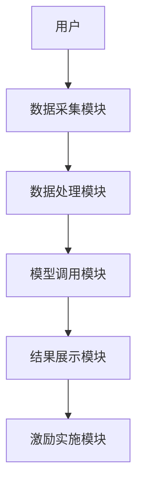

                 

# AI辅助企业创新文化培养：创新活动参与度分析与激励机制

## 关键词：人工智能，企业创新，参与度分析，激励机制，数据挖掘

## 摘要：本文章探讨了如何利用人工智能技术分析企业创新活动的参与度，并设计有效的激励机制来提升员工的创新积极性。通过数据挖掘和机器学习方法，文章提出了一套系统化的解决方案，帮助企业建立科学的创新评估体系和激励策略，从而促进企业整体创新能力的提升。

---

# 第1章: 引言

## 1.1 企业创新文化的重要性

### 1.1.1 创新文化的核心作用

创新是企业持续发展的核心动力。在当今快速变化的商业环境中，企业必须不断引入新技术、新产品和新理念，才能在竞争中立于不败之地。创新文化能够激发员工的创造力和主动性，形成一个有利于创新的组织氛围。

### 1.1.2 AI在创新管理中的潜力

人工智能技术为企业创新管理提供了新的可能性。通过分析大量数据，AI可以帮助企业识别创新趋势、评估创新活动的参与度，并制定个性化的激励策略。AI的应用能够提高创新管理的效率和精准度，为企业的创新活动提供有力支持。

### 1.1.3 本书的研究目标

本书旨在探讨如何利用人工智能技术分析企业创新活动的参与度，并设计有效的激励机制。通过理论分析和实践案例，本书为企业的创新文化建设提供系统化的解决方案，帮助企业提升创新能力和竞争力。

---

## 1.2 问题背景与挑战

### 1.2.1 创新活动参与度低的原因

企业在创新过程中常常面临参与度不足的问题。员工缺乏创新意识、激励不足、资源分配不均等因素都可能导致创新活动的参与度低下。此外，传统管理方法难以有效捕捉和分析员工的创新行为，进一步限制了创新活动的开展。

### 1.2.2 激励机制设计的难点

传统的激励机制往往过于笼统，难以针对不同员工的特点制定个性化的激励策略。同时，激励机制的设计需要结合企业的实际运营情况，考虑员工的需求、能力和行为特征，这对管理者的知识和能力提出了较高的要求。

### 1.2.3 AI技术的应用前景

AI技术在数据分析、模式识别和个性化推荐等方面具有显著优势。通过AI技术，企业可以实时收集和分析员工的创新行为数据，识别潜在的创新者，并制定针对性的激励策略。这不仅提高了创新管理的效率，还能够显著提升员工的创新积极性。

---

## 1.3 本书结构与方法论

### 1.3.1 核心概念与框架

本书将围绕创新活动参与度分析和激励机制设计这两个核心概念展开。首先，介绍创新活动参与度的分析方法，包括数据采集、特征工程和模型构建等内容。然后，探讨激励机制的设计理论和实现方法，包括需求分析、模型设计和系统实现等步骤。

### 1.3.2 方法论概述

本书采用理论分析与实践相结合的方法，通过案例分析和算法实现，深入探讨AI在创新管理中的应用。书中不仅介绍相关的理论知识，还提供具体的代码实现和系统设计，帮助读者将理论知识应用于实际场景。

### 1.3.3 实战项目介绍

本书的最后一章将通过一个完整的项目实战，展示如何利用AI技术构建创新活动参与度分析与激励机制的系统。通过该项目，读者可以掌握从需求分析到系统实现的整个过程，提升实际操作能力。

---

# 第2章: 创新活动参与度分析方法

## 2.1 数据采集与处理

### 2.1.1 数据来源与特征

创新活动的参与度分析需要多源数据的支持，包括员工的行为数据、项目数据、绩效数据等。这些数据可以通过企业的管理系统、协作工具和绩效评估系统等渠道获取。数据的特征包括时间性、多样性、动态性等。

### 2.1.2 数据清洗与预处理

在进行数据分析之前，需要对原始数据进行清洗和预处理。这包括处理缺失值、异常值和重复数据，确保数据的完整性和准确性。预处理步骤还包括数据转换和特征提取，为后续的模型构建提供高质量的数据支持。

### 2.1.3 数据分析基础

数据分析是创新活动参与度分析的核心步骤。通过统计分析、数据可视化和机器学习等方法，可以识别出员工的创新行为模式和参与度特征。例如，可以通过聚类分析将员工分为不同的群体，分析不同群体的创新行为差异。

---

## 2.2 参与度分析模型

### 2.2.1 模型构建与选择

创新活动参与度的分析模型需要能够准确反映员工的创新行为。常用的模型包括回归模型、分类模型和聚类模型等。选择模型时需要考虑数据的特征、模型的复杂度和实际应用的需求。

### 2.2.2 特征工程与选择

特征工程是模型构建的关键步骤。通过对数据进行特征提取、特征选择和特征变换，可以提高模型的预测精度和解释能力。例如，可以通过主成分分析（PCA）减少特征的维度，或者通过逻辑回归分析特征的重要性。

### 2.2.3 模型训练与优化

在模型训练过程中，需要使用训练数据对模型进行参数优化和模型调优。可以通过交叉验证和网格搜索等方法找到最佳的模型参数。同时，还需要对模型的性能进行评估，包括准确率、召回率和F1分数等指标。

---

## 2.3 参与度预测与优化

### 2.3.1 预测方法与策略

创新活动参与度的预测可以通过机器学习算法实现。常用的算法包括支持向量机（SVM）、随机森林和神经网络等。选择合适的算法并进行参数优化是提高预测精度的关键。

### 2.3.2 模型评估与验证

模型的评估和验证是确保模型可靠性的必要步骤。可以通过混淆矩阵、ROC曲线和AUC值等指标评估模型的性能。同时，还需要进行交叉验证和留出验证，确保模型的泛化能力。

### 2.3.3 结果分析与优化

通过对模型的预测结果进行分析，可以识别出创新活动的关键影响因素，并制定针对性的优化策略。例如，可以根据模型的预测结果调整激励机制，激励员工积极参与创新活动。

---

# 第3章: 激励机制设计与AI应用

## 3.1 激励机制设计理论

### 3.1.1 激励理论基础

激励机制的设计需要基于激励理论，包括需求层次理论、双因素理论和期望理论等。了解员工的需求和动机是设计有效激励机制的基础。

### 3.1.2 激励机制的类型

激励机制可以分为内在激励和外在激励两种类型。内在激励包括工作成就感和自我实现等，外在激励包括奖金、晋升和荣誉称号等。不同类型的激励机制适用于不同的员工和场景。

### 3.1.3 激励机制设计的原则

设计激励机制时需要遵循公平性、个性化和及时性等原则。激励机制需要公平合理，满足员工的个性化需求，并在适当的时候给予激励。

---

## 3.2 激励机制模型构建

### 3.2.1 模型构建方法

激励机制的模型构建需要结合企业的实际情况和员工的需求。可以通过问卷调查、数据分析和专家访谈等方法收集数据，构建激励机制的模型。

### 3.2.2 激励因素分析

通过因子分析等方法，可以识别出影响员工创新行为的关键激励因素。例如，薪酬、职业发展和工作环境等都是重要的激励因素。

### 3.2.3 模型属性对比

不同激励机制模型在属性和效果上存在差异。需要根据企业的实际情况选择最合适的模型，并进行属性对比和优化。

---

## 3.3 AI驱动的激励优化

### 3.3.1 数据驱动的激励策略

通过AI技术，可以实时分析员工的创新行为数据，制定数据驱动的激励策略。例如，可以根据员工的创新贡献动态调整激励方案。

### 3.3.2 AI在激励机制中的应用

AI技术在激励机制中的应用包括个性化推荐、动态调整和效果评估等。通过AI技术，可以实现激励机制的智能化和个性化，提高激励的效果。

### 3.3.3 激励机制的动态调整

激励机制需要根据员工的行为和企业的需求进行动态调整。AI技术可以帮助企业实时监测员工的创新行为，及时调整激励策略。

---

## 3.4 激励机制的AI实现

### 3.4.1 激励模型的算法实现

激励机制的AI实现需要选择合适的算法，如协同过滤、深度学习和强化学习等。算法的选择需要考虑数据的特征和模型的复杂度。

### 3.4.2 激励机制的系统设计

激励机制的系统设计需要包括数据采集、模型构建和激励实施等功能模块。系统设计需要考虑模块之间的交互和数据的流通。

### 3.4.3 激励机制的优化与调整

通过AI技术，可以实时优化激励机制，提高激励的效果。例如，可以根据员工的实时行为动态调整激励方案。

---

# 第4章: 项目实战——创新活动参与度分析与激励机制系统

## 4.1 项目背景与目标

### 4.1.1 项目背景

本项目旨在利用AI技术构建一个创新活动参与度分析与激励机制的系统。通过系统的建设和应用，帮助企业提升员工的创新积极性，促进企业创新能力的提升。

### 4.1.2 项目目标

项目的总体目标是构建一个智能化的创新管理平台，实现创新活动参与度的分析和激励机制的自动化。具体目标包括数据采集、模型构建和系统实现等。

---

## 4.2 项目实施步骤

### 4.2.1 环境搭建

项目实施的第一步是环境搭建，包括安装必要的软件和工具，如Python、TensorFlow和Scikit-learn等。同时，还需要搭建数据存储和计算的环境，确保项目的顺利进行。

### 4.2.2 数据采集与处理

数据采集是项目实施的关键步骤。需要从企业的管理系统中获取员工的创新行为数据，包括项目参与度、贡献度和绩效数据等。数据采集后，需要进行清洗和预处理，确保数据的准确性和完整性。

### 4.2.3 模型实现

模型实现是项目的核心部分。需要根据项目的需求选择合适的算法，如逻辑回归、随机森林和神经网络等。通过数据的训练和优化，构建创新活动参与度分析和激励机制的模型。

### 4.2.4 系统实现

系统实现是将模型部署到实际应用中的过程。需要设计系统的功能模块，包括数据输入、模型调用和结果展示等。系统实现需要考虑用户体验和性能优化，确保系统的稳定性和高效性。

### 4.2.5 项目总结与优化

项目实施完成后，需要对项目进行总结和优化。通过对项目的反思，找出存在的问题和改进的空间，为后续的项目实施提供参考。

---

## 4.3 系统架构设计

### 4.3.1 系统功能设计

系统的功能设计需要满足创新活动参与度分析和激励机制的需求。主要包括数据采集、模型调用、结果展示和激励实施等功能模块。

### 4.3.2 系统架构图

系统架构图展示了系统的组成部分和模块之间的关系。通过架构图，可以清晰地了解系统的结构和功能流程。

### 4.3.3 系统接口设计

系统接口设计需要考虑模块之间的交互和数据的流通。通过定义清晰的接口规范，可以确保模块之间的协作和数据的共享。

---

## 4.4 项目小结

通过本项目的实施，我们成功构建了一个基于AI的创新活动参与度分析与激励机制的系统。该系统不仅可以帮助企业实时分析员工的创新行为，还可以根据分析结果动态调整激励策略，显著提升员工的创新积极性和企业的创新能力。

---

# 第5章: 总结与展望

## 5.1 本书总结

本书系统地探讨了AI在企业创新文化培养中的应用，包括创新活动参与度的分析和激励机制的设计。通过理论分析和项目实战，本书为企业的创新管理提供了系统化的解决方案。

## 5.2 未来展望

随着AI技术的不断发展，其在企业创新管理中的应用将更加广泛和深入。未来的研究方向包括更复杂的模型设计、更个性化的激励策略和更智能化的管理系统。同时，还需要进一步探索AI技术在创新文化培养中的其他应用领域。

---

作者：AI天才研究院/AI Genius Institute & 禅与计算机程序设计艺术 /Zen And The Art of Computer Programming

---

通过以上步骤，我们可以系统地构建一个基于AI的创新活动参与度分析与激励机制的系统，帮助企业提升创新能力和竞争力。

