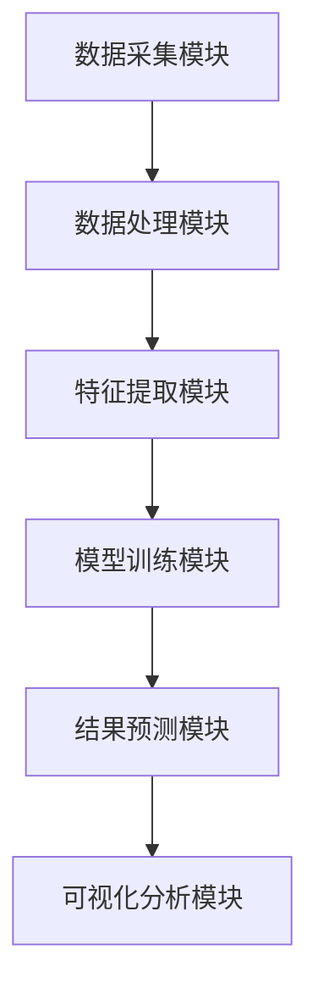

                 


# AI辅助企业并购协同效应评估：整合路径规划与效果预测

> 关键词：AI, 企业并购, 协同效应, 整合路径规划, 效果预测

> 摘要：本文深入探讨了AI技术在企业并购协同效应评估中的应用，分析了协同效应的定义、类型及其影响因素，并详细介绍了基于AI的协同效应预测算法。通过构建系统化的整合路径规划模型，提出了协同效应预测的系统架构设计，并通过实际案例展示了AI辅助企业并购协同效应评估的实现过程。最后，本文总结了AI在企业并购中的应用优势，并展望了未来的发展方向。

---

# 第一部分: 背景与概念

## 第1章: 企业并购协同效应评估的背景与问题

### 1.1 企业并购的定义与核心要素

#### 1.1.1 企业并购的基本概念
企业并购（Mergers and Acquisitions, M&A）是指一家企业与其他企业合并或收购其资产或股权的过程。并购的核心目的是通过整合资源、优化资产配置和提升竞争力来实现企业价值的最大化。

#### 1.1.2 并购的核心要素与关键问题
企业并购涉及多个关键要素，包括：
- **战略目标**：并购是否符合企业的长期战略规划？
- **协同效应**：并购后能否实现资源互补和效率提升？
- **风险控制**：并购过程中是否存在法律、财务或经营风险？
- **整合路径**：并购后的整合计划是否可行且高效？

#### 1.1.3 协同效应的定义与分类
协同效应（Synergy）是指并购后企业整体价值超过并购双方单独价值之和的现象。其主要分类包括：
- **运营协同**：通过整合生产、供应链和管理流程降低成本。
- **市场协同**：通过扩大市场覆盖和客户群体提升收入。
- **财务协同**：通过优化资本结构和降低融资成本提升财务表现。

### 1.2 协同效应评估的必要性

#### 1.2.1 协同效应对企业价值的影响
协同效应是企业并购成功的关键因素之一。通过协同效应，企业可以实现价值增值，提升股东回报。

#### 1.2.2 传统协同效应评估方法的局限性
传统协同效应评估方法通常依赖于主观判断和经验分析，存在以下问题：
- 数据不足或不准确。
- 分析方法单一，缺乏动态性和系统性。
- 难以量化协同效应的具体来源和贡献。

#### 1.2.3 AI技术在协同效应评估中的优势
AI技术通过大数据分析和机器学习算法，能够帮助企业更准确地预测协同效应，优化整合路径。其优势包括：
- 数据驱动的精准分析。
- 自动化模型的动态预测能力。
- 高效的决策支持能力。

### 1.3 AI辅助企业并购的背景与趋势

#### 1.3.1 AI技术在企业并购中的应用现状
随着AI技术的快速发展，越来越多的企业开始采用AI辅助并购决策。AI技术在企业估值、风险评估和整合规划等方面发挥着重要作用。

#### 1.3.2 企业并购协同效应评估的智能化需求
企业并购过程复杂且风险高，协同效应评估需要更加智能化和精准化。AI技术能够帮助企业更好地识别协同效应的来源，优化整合路径。

#### 1.3.3 未来趋势与挑战
未来，AI技术在企业并购中的应用将更加广泛和深入。然而，数据隐私、模型解释性和算法可信赖性等问题仍需进一步解决。

---

## 第2章: 协同效应评估的核心概念与理论基础

### 2.1 协同效应的理论框架

#### 2.1.1 协同效应的构成要素
协同效应的实现需要多个要素的协同作用，包括：
- 人力资源整合。
- 组织结构优化。
- 业务流程整合。

#### 2.1.2 协同效应的分类与影响因素
协同效应可以分为运营协同、市场协同和财务协同。影响协同效应的因素包括：
- 行业特性。
- 企业规模。
- 资源互补性。

#### 2.1.3 协同效应的量化方法
协同效应的量化可以通过以下方法实现：
- **收益法**：通过预测协同后的收益增量来评估协同效应。
- **成本法**：通过减少整合后的成本支出来评估协同效应。

### 2.2 AI在协同效应评估中的作用

#### 2.2.1 数据驱动的协同效应分析
AI技术通过大数据分析，能够从海量数据中提取有价值的信息，帮助评估协同效应的潜力。

#### 2.2.2 AI算法在协同效应预测中的应用
机器学习算法（如随机森林、神经网络）可以用于预测协同效应的实现程度。

#### 2.2.3 协同效应评估的模型构建
基于AI的协同效应评估模型通常包括数据预处理、特征提取、模型训练和结果预测四个阶段。

### 2.3 协同效应评估的核心要素

#### 2.3.1 数据来源与特征提取
数据来源包括财务数据、业务数据和市场数据。特征提取需要关注关键指标，如收入增长率、成本节约率等。

#### 2.3.2 模型输入与输出的关系
模型输入包括企业规模、行业特性、资源互补性等特征，输出是协同效应的预测值。

#### 2.3.3 协同效应的动态变化分析
协同效应在并购后可能会随着时间的推移而变化，需要动态监控和调整评估模型。

---

## 第3章: 协同效应预测的算法原理

### 3.1 协同效应预测的基本原理

#### 3.1.1 数据预处理与特征工程
数据预处理包括数据清洗和特征提取。特征工程需要选择与协同效应相关的特征，如收入增长率、成本节约率等。

#### 3.1.2 模型训练与优化
模型训练需要使用训练数据，通过交叉验证选择最优模型参数。

#### 3.1.3 模型预测与结果分析
模型预测协同效应的实现程度，并通过实际数据进行验证和优化。

---

### 3.2 基于机器学习的协同效应预测算法

#### 3.2.1 算法选择与实现
常用的机器学习算法包括线性回归、随机森林和神经网络。选择合适的算法需要考虑数据特征和业务需求。

#### 3.2.2 算法实现步骤
1. 数据预处理：清洗数据，提取特征。
2. 模型训练：选择算法，训练模型。
3. 模型验证：使用验证数据评估模型性能。
4. 模型预测：预测协同效应，分析结果。

#### 3.2.3 模型优化与调参
通过网格搜索或随机搜索等方法优化模型参数，提升预测精度。

---

### 3.3 协同效应预测的数学模型

#### 3.3.1 线性回归模型
$$ y = \beta_0 + \beta_1x_1 + \beta_2x_2 + \dots + \beta_nx_n $$

其中，$y$ 表示协同效应，$x_i$ 表示各特征变量，$\beta_i$ 表示回归系数。

#### 3.3.2 随机森林模型
随机森林是一种基于决策树的集成学习方法，能够处理高维数据和非线性关系。

---

## 第4章: 协同效应预测的系统架构设计

### 4.1 系统功能设计

#### 4.1.1 功能模块划分
系统功能模块包括数据采集、特征提取、模型训练、结果预测和可视化分析。

#### 4.1.2 系统功能流程
1. 数据采集：从数据库中获取企业并购相关数据。
2. 特征提取：提取与协同效应相关的特征。
3. 模型训练：训练协同效应预测模型。
4. 结果预测：预测协同效应，生成报告。
5. 可视化分析：通过图表展示预测结果和分析报告。

#### 4.1.3 系统功能实现
通过Python和机器学习库（如scikit-learn、XGBoost）实现系统功能。

---

### 4.2 系统架构设计

#### 4.2.1 系统架构图


#### 4.2.2 模块交互流程
1. 数据采集模块：从数据库中获取并购数据。
2. 数据处理模块：清洗数据，处理缺失值。
3. 特征提取模块：提取与协同效应相关的特征。
4. 模型训练模块：训练协同效应预测模型。
5. 结果预测模块：预测协同效应，生成报告。
6. 可视化分析模块：通过图表展示预测结果。

---

## 第5章: 项目实战

### 5.1 环境搭建与数据准备

#### 5.1.1 环境搭建
安装必要的Python库，如pandas、numpy、scikit-learn、xgboost等。

#### 5.1.2 数据来源与数据集
数据来源包括企业并购案例数据库和公开的财务数据。

#### 5.1.3 数据预处理
清洗数据，处理缺失值和异常值。

---

### 5.2 系统核心实现

#### 5.2.1 数据采集模块
编写代码从数据库中获取并购数据。

```python
import pandas as pd

# 数据采集模块
def fetch_merger_data():
    # 假设数据库连接已建立
    data = pd.read_sql("SELECT * FROM merger_data", con)
    return data
```

#### 5.2.2 特征提取模块
从数据中提取与协同效应相关的特征。

```python
def extract_features(data):
    features = data[['revenue_growth', 'cost_saving', 'market_share']]
    return features
```

#### 5.2.3 模型训练模块
使用随机森林算法训练协同效应预测模型。

```python
from sklearn.ensemble import RandomForestRegressor

def train_model(features, target):
    model = RandomForestRegressor(n_estimators=100, random_state=42)
    model.fit(features, target)
    return model
```

#### 5.2.4 结果预测模块
使用训练好的模型预测协同效应。

```python
def predict_synergy(model, new_features):
    predictions = model.predict(new_features)
    return predictions
```

---

### 5.3 实际案例分析

#### 5.3.1 案例介绍
以某企业并购案例为例，展示如何应用上述算法进行协同效应预测。

#### 5.3.2 数据分析与结果解读
通过数据分析和结果解读，验证模型的预测能力。

#### 5.3.3 项目总结
总结项目实现的关键步骤和经验教训。

---

## 第6章: 总结与展望

### 6.1 总结

#### 6.1.1 核心内容回顾
本文深入探讨了AI技术在企业并购协同效应评估中的应用，提出了基于机器学习的协同效应预测算法，并通过实际案例展示了系统的实现过程。

#### 6.1.2 实际应用中的注意事项
在实际应用中，需要注意数据质量和模型解释性等问题。

---

### 6.2 未来展望

#### 6.2.1 技术发展
未来，随着AI技术的不断发展，协同效应评估将更加精准和动态。

#### 6.2.2 应用拓展
AI技术在企业并购中的应用将更加广泛，涵盖企业估值、风险评估和整合规划等多个领域。

---

## 作者：AI天才研究院/AI Genius Institute & 禅与计算机程序设计艺术 /Zen And The Art of Computer Programming

---

以上是文章的完整内容，涵盖了企业并购协同效应评估的背景、核心概念、算法原理、系统架构设计和项目实战等部分。通过本文，读者可以全面了解AI技术在企业并购中的应用，掌握协同效应预测的实现方法，并能够在实际项目中加以应用。

