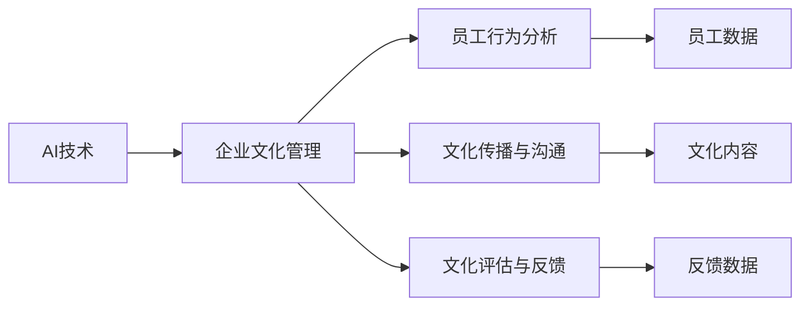
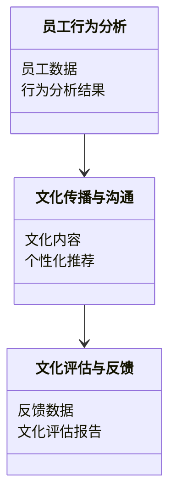
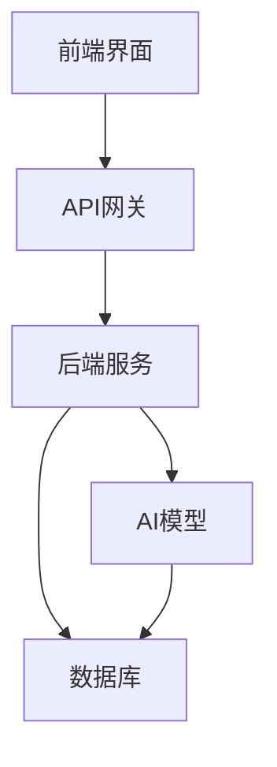
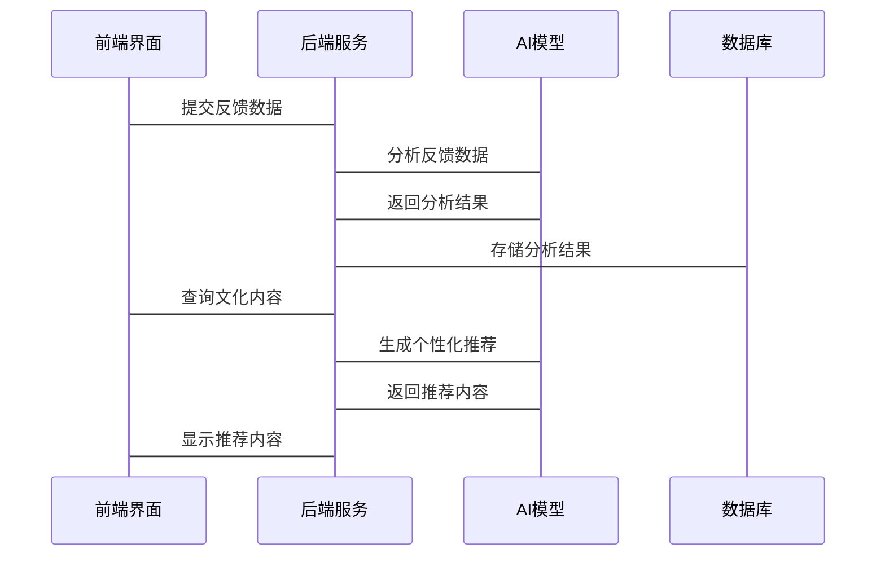

                 


# AI驱动的企业创新文化培养与管理

## 关键词：人工智能，企业文化管理，企业创新文化，数据驱动决策，机器学习，自然语言处理

## 摘要：  
本文探讨了人工智能技术如何驱动企业创新文化的发展与管理。从AI技术在企业文化管理中的应用原理，到具体算法的实现，再到系统的架构设计，最后结合实际案例，全面分析AI在企业创新文化培养中的潜力与挑战。通过详细的技术分析和实际应用，本文旨在为企业管理者和技术人员提供理论支持和实践指导，以推动企业创新文化在AI时代的高效发展。

---

## 第一部分：背景介绍

### 第1章：AI驱动的企业创新文化概述

#### 1.1 什么是AI驱动的企业创新文化  
- **定义**：AI驱动的企业创新文化是指通过人工智能技术来优化、管理和推动企业文化的创新与演进。  
- **从传统到AI驱动的演进**：从依赖人工管理到数据驱动的智能化管理，AI技术为企业文化注入了新的活力。  
- **AI在企业文化管理中的核心作用**：通过数据分析、自动化决策和个性化体验提升企业文化的传播、创新和执行能力。  

#### 1.2 AI驱动企业文化管理的背景与现状  
- **企业创新文化的重要性**：企业文化是企业成功的关键因素，创新文化更是企业在竞争中保持优势的核心。  
- **AI技术对企业文化管理的影响**：AI技术的应用使得企业文化管理更加精准、高效和个性化。  
- **当前AI在企业文化管理中的应用现状**：包括员工行为分析、团队协作优化、文化评估等领域的应用实例。  

#### 1.3 AI驱动企业文化管理的优势与挑战  
- **优势**：  
  - 提高效率与精准度：AI技术能够快速分析大量数据，帮助企业识别文化问题并提供解决方案。  
  - 数据驱动的决策支持：通过数据挖掘和机器学习，企业能够做出更科学的决策。  
  - 个性化员工体验：AI技术能够根据员工的特点提供个性化的文化体验，增强员工的参与感和归属感。  
- **挑战**：  
  - 技术与文化的融合难度：如何将AI技术与企业文化管理相结合，需要跨学科的知识和经验。  
  - 数据隐私与伦理问题：AI技术的应用需要处理大量员工数据，如何保护数据隐私和避免伦理问题是一个重要挑战。  

#### 1.4 本书的核心内容与目标  
- **研究范围**：本书将探讨AI技术在企业文化管理中的具体应用，包括技术原理、系统设计和实际案例。  
- **目标读者**：企业管理人员、技术人员、AI研究人员和对企业文化管理感兴趣的专业人士。  
- **核心目标**：通过理论与实践相结合的方式，探索AI技术如何推动企业创新文化的培养与管理。  

---

## 第二部分：AI驱动企业创新文化的核心概念与联系

### 第2章：AI技术与企业文化管理的核心概念

#### 2.1 AI技术在企业文化管理中的应用原理  
- **自然语言处理（NLP）在企业沟通中的应用**：通过分析员工的邮件、聊天记录等文本数据，识别情感倾向、关键词和主题，从而了解员工的满意度和文化倾向。  
- **机器学习在员工行为分析中的应用**：通过员工的行为数据（如工作效率、参与度等），使用机器学习模型预测员工的行为趋势，优化团队协作。  
- **数据挖掘在企业文化评估中的作用**：通过分析企业的文化数据，识别文化问题并提出改进建议。  

#### 2.2 AI驱动企业文化管理的核心要素  
- **员工行为分析**：通过AI技术分析员工的行为数据，识别潜在的问题和机会。  
- **文化传播与沟通**：利用AI技术优化企业文化的传播方式，例如通过个性化推荐系统向员工推送文化相关内容。  
- **文化评估与反馈**：通过AI技术对企业文化进行实时评估，并根据反馈不断优化文化管理策略。  

#### 2.3 AI技术与企业文化管理的关系  
- **表格对比**：以下是一个对比AI技术与传统企业文化管理的表格：  

| **核心要素** | **传统企业文化管理** | **AI驱动企业文化管理** |  
|--------------|-----------------------|-------------------------|  
| 数据来源    | 主要依赖员工反馈       | 结合数据与AI分析         |  
| 分析方式    | 人工分析               | 数据挖掘与机器学习       |  
| 决策速度    | 较慢                   | 快速且精准               |  
| 个性化程度  | 较低                   | 高                      |  

- **实体关系图**：以下是一个简单的实体关系图，展示AI技术与企业文化管理的核心要素之间的关系：  



---

## 第三部分：AI驱动企业文化管理的算法原理

### 第3章：AI技术的核心算法与实现

#### 3.1 情感分析算法  
- **算法原理**：情感分析是一种NLP技术，用于判断文本中表达的情感倾向（正面、负面或中性）。  
- **实现步骤**：  
  1. 数据预处理：清洗和分词文本数据。  
  2. 特征提取：提取文本中的关键词和情感词汇。  
  3. 模型训练：使用机器学习算法（如支持向量机、随机森林或深度学习模型）进行训练。  
  4. 情感分类：对新的文本进行情感预测。  
- **数学模型**：以下是情感分析中常用的分类模型：  

  $$ \text{概率} = \frac{\text{特征词出现次数}}{\text{总词汇数}} $$  

- **Python代码实现**：以下是情感分析的简单Python代码示例：  

  ```python
  from sklearn.feature_extraction.text import TfidfVectorizer
  from sklearn.svm import SVC

  # 数据预处理
  corpus = ["I love this product!", "I hate this product!"]
  vectorizer = TfidfVectorizer()
  X = vectorizer.fit_transform(corpus)

  # 模型训练
  model = SVC()
  model.fit(X, [1, 0])

  # 情感分类
  new_corpus = ["This company is great!"]
  X_new = vectorizer.transform(new_corpus)
  print(model.predict(X_new))
  ```

- **案例分析**：通过分析员工的反馈文本，判断员工对企业文化的满意度。  

#### 3.2 主题建模算法  
- **算法原理**：主题建模是一种NLP技术，用于发现文本中的主题分布。  
- **实现步骤**：  
  1. 数据预处理：清洗和分词文本数据。  
  2. 特征提取：提取文本中的关键词和主题词汇。  
  3. 模型训练：使用主题建模算法（如LDA、LSA）进行训练。  
  4. 主题发现：输出文本的主题分布。  
- **数学模型**：以下是主题建模中常用的LDA模型：  

  $$ \text{概率} = \prod_{i=1}^{n} \frac{\text{主题词出现次数}}{\text{总词汇数}} $$  

- **Python代码实现**：以下是主题建模的简单Python代码示例：  

  ```python
  from sklearn.decomposition import LatentDirichletAllocation
  import pandas as pd

  # 数据预处理
  corpus = pd.Series(["This is a sample text.", "Another sample text."])

  # 模型训练
  lda = LatentDirichletAllocation(n_components=2, random_state=0)
  X = lda.fit_transform(corpus)

  # 主题发现
  for topic in lda.components_:
      print(" ".join([word for word, prob in zip(vectorizer.get_feature_names(), topic)]))
  ```

- **案例分析**：通过分析员工的反馈文本，发现企业文化中的主要主题。  

---

## 第四部分：系统分析与架构设计方案

### 第4章：系统设计与架构

#### 4.1 问题场景介绍  
- **问题描述**：企业希望通过AI技术优化企业文化管理，包括员工行为分析、文化传播与沟通、文化评估与反馈等。  
- **边界与外延**：系统将专注于内部员工数据的分析，不涉及外部数据。  

#### 4.2 系统功能设计  
- **领域模型**：以下是企业文化管理的领域模型：  



#### 4.3 系统架构设计  
- **系统架构图**：以下是系统的整体架构图：  



#### 4.4 系统接口设计  
- **接口描述**：  
  - 前端接口：员工可以通过前端界面提交反馈和查询文化内容。  
  - 后端接口：AI模型通过API接口与后端服务交互，返回分析结果和评估报告。  

#### 4.5 系统交互流程  
- **交互流程图**：以下是系统的交互流程图：  



---

## 第五部分：项目实战

### 第5章：AI驱动企业文化管理的实践

#### 5.1 项目环境安装  
- **工具安装**：安装Python、Jupyter Notebook、Scikit-learn、NLTK等工具。  

#### 5.2 核心代码实现  
- **员工行为分析**：通过机器学习算法分析员工的工作效率和参与度。  
- **文化评估与反馈**：通过主题建模算法分析员工的反馈文本，生成文化评估报告。  

#### 5.3 项目案例分析  
- **案例分析**：通过一个具体案例，展示如何利用AI技术优化企业文化管理。  

#### 5.4 项目小结  
- **经验总结**：总结项目中的经验和教训，提出改进建议。  

---

## 第六部分：最佳实践与总结

### 第6章：最佳实践与注意事项

#### 6.1 最佳实践  
- **数据隐私保护**：在处理员工数据时，必须遵守数据隐私法律法规，确保数据的安全性。  
- **技术与文化的结合**：在应用AI技术时，需要充分考虑企业的文化特点，避免技术与文化的脱节。  
- **持续优化**：根据反馈不断优化AI模型和企业文化管理策略，保持系统的高效性和准确性。  

#### 6.2 小结  
- **总结**：AI技术为企业文化管理提供了新的可能性，通过数据分析和智能化决策，企业能够更高效地推动创新文化的培养与管理。  

#### 6.3 注意事项  
- **数据质量问题**：确保数据的准确性和完整性，避免因数据问题导致分析结果偏差。  
- **技术实现难度**：AI技术的实现需要专业的技术团队支持，企业在应用时需要充分考虑技术实现的难度和成本。  

#### 6.4 拓展阅读  
- **推荐阅读**：建议读者进一步阅读相关书籍和论文，深入理解AI技术在企业文化管理中的应用。  

---

## 作者：AI天才研究院/AI Genius Institute & 禅与计算机程序设计艺术 /Zen And The Art of Computer Programming

