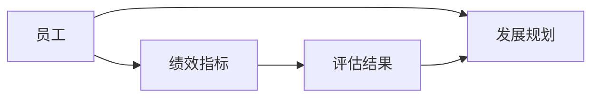
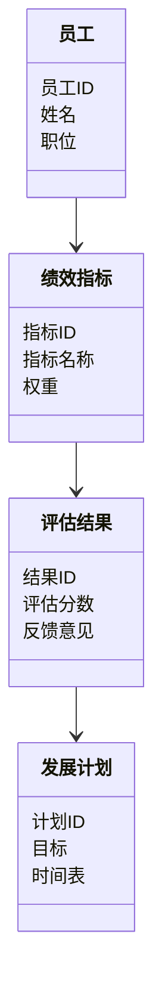
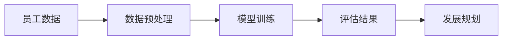
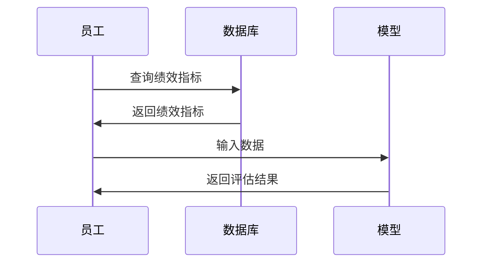

                 


# AI驱动的企业员工绩效评估与发展规划

## 关键词：
AI, 绩效评估, 职业发展, 机器学习, 自然语言处理, 系统设计

## 摘要：
本文系统地探讨了人工智能在企业员工绩效评估与职业发展规划中的应用。从基础概念到算法实现，再到系统设计和实际案例，全面分析了AI技术如何优化传统绩效评估和职业发展流程。通过数学模型、系统架构和项目实战的详细讲解，展示了如何利用AI提升企业管理效率和员工发展。

---

# 目录大纲

## 第一部分：AI驱动的企业员工绩效评估与发展规划概述

### 第1章：AI驱动的员工绩效评估与发展规划概述

#### 1.1 问题背景与必要性
- 1.1.1 传统绩效评估的局限性
  - 数据收集困难
  - 主观性高
  - 反馈延迟
- 1.1.2 企业发展的新挑战
  - 业务复杂化
  - 人才需求多样化
  - 高效决策需求
- 1.1.3 AI技术的引入与优势
  - 提高评估客观性
  - 实现实时反馈
  - 个性化发展规划

#### 1.2 核心概念与联系
- 1.2.1 核心概念原理
  - 绩效评估：基于数据的客观评价
  - 职业发展：个性化路径设计
- 1.2.2 核心概念属性特征对比表格
  | 特性 | 传统方法 | AI驱动方法 |
  |------|----------|------------|
  | 数据源 | 主观评价 | 结构化数据 |
  | 反馈时间 | 事后 | 实时 |
  | 可扩展性 | 低 | 高 |
- 1.2.3 ER实体关系图架构的 Mermaid 流程图



## 第二部分：AI驱动的员工绩效评估与发展规划的算法原理

### 第2章：AI驱动的员工绩效评估与发展规划的算法原理

#### 2.1 算法原理讲解
- 2.1.1 机器学习算法
  - 线性回归
  - 支持向量机
  - 神经网络
- 2.1.2 自然语言处理（NLP）技术
  - 情感分析
  - 文本分类
  - 实体识别
- 2.1.3 时间序列分析
  - ARIMA模型
  - LSTM网络

#### 2.2 数学模型和公式
- 2.2.1 线性回归模型
  $$ y = \beta_0 + \beta_1x + \epsilon $$
- 2.2.2 神经网络模型
  $$ \text{激活函数} = \sigma(wx + b) $$
  其中，σ表示sigmoid函数，w为权重，b为偏置。

#### 2.3 详细讲解与举例说明
- 2.3.1 机器学习算法的实现
  - 线性回归用于预测员工绩效
- 2.3.2 NLP技术的实际应用
  - 分析员工反馈文本的情绪
- 2.3.3 时间序列分析的案例
  - 预测员工未来表现

## 第三部分：系统分析与架构设计方案

### 第3章：系统分析与架构设计方案

#### 3.1 问题场景介绍
- 3.1.1 绩效评估的场景
  - 数据收集与处理
  - 模型训练与验证
- 3.1.2 发展规划的场景
  - 目标设定
  - 路径设计

#### 3.2 系统功能设计
- 3.2.1 领域模型 Mermaid 类图



#### 3.3 系统架构设计 Mermaid 架构图



#### 3.4 系统接口设计
- 3.4.1 API接口
  - GET /employee/{id}：获取员工信息
  - POST /performance：提交绩效评估结果

#### 3.5 系统交互 Mermaid 序列图



## 第四部分：项目实战

### 第4章：AI驱动的员工绩效评估与发展规划系统实现

#### 4.1 环境安装
- 安装Python和相关库：
  ```bash
  pip install scikit-learn numpy pandas
  ```

#### 4.2 系统核心实现源代码

```python
import pandas as pd
from sklearn.linear_model import LinearRegression

# 数据预处理
data = pd.read_csv('performance_data.csv')
X = data[['sales', 'attendance']]
y = data['score']

# 模型训练
model = LinearRegression()
model.fit(X, y)

# 预测结果
print(model.predict([[100, 90]]))
```

#### 4.3 代码应用解读与分析
- 数据预处理：清洗和转换数据
- 模型训练：使用线性回归算法
- 结果预测：基于输入数据预测绩效

#### 4.4 实际案例分析
- 分析销售团队的数据，展示模型如何预测绩效

#### 4.5 项目小结
- 强调代码实现的关键点和注意事项

## 第五部分：案例分析

### 第5章：实际案例分析与经验总结

#### 5.1 行业案例分析
- 销售团队的绩效评估
- 研发团队的发展规划

#### 5.2 系统实施经验
- 数据隐私保护
- 模型泛化能力

## 第六部分：总结

### 第6章：总结与未来展望

#### 6.1 总结
- AI技术的优势
- 企业发展的新方向

#### 6.2 未来展望
- AI与企业文化的结合
- 更多算法和技术的引入

## 附录
- 术语表
- 工具安装指南
- 代码片段

---

作者：AI天才研究院 & 禅与计算机程序设计艺术

