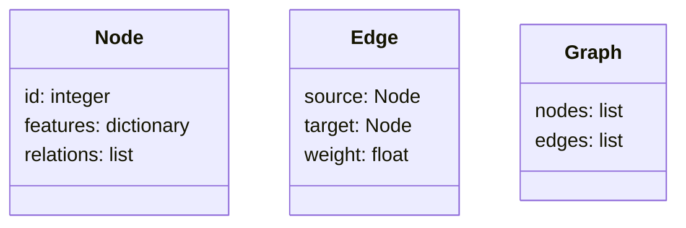
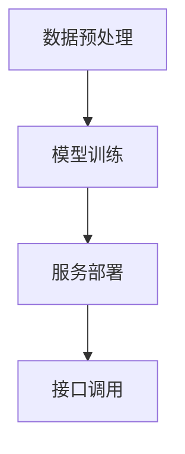
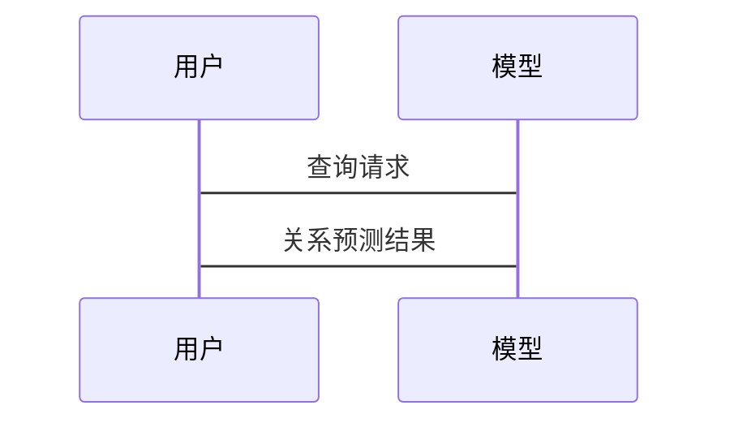

                 


# 第一部分: 企业AI Agent的图神经网络应用概述

# 第1章: AI Agent与图神经网络概述

## 1.1 AI Agent的基本概念
### 1.1.1 AI Agent的定义与特点
AI Agent（人工智能代理）是指在企业中能够感知环境、自主决策并执行任务的智能实体。其特点包括自主性、反应性、目标导向性和社会性。

### 1.1.2 AI Agent在企业中的应用场景
AI Agent在企业中的应用包括智能客服、推荐系统、供应链优化、风险管理等领域，能够提升企业的效率和决策能力。

### 1.1.3 图神经网络的核心概念
图神经网络是一种处理图结构数据的深度学习方法，通过建模节点间的关系，能够捕捉数据的复杂关联性。

## 1.2 图神经网络的背景与优势
### 1.2.1 图结构数据的特性
图结构数据具有节点、边和权重等元素，能够表示实体之间的复杂关系。

### 1.2.2 图神经网络的独特优势
图神经网络能够处理非结构化数据，捕捉复杂的语义关系，并具有强大的泛化能力。

### 1.2.3 企业复杂关系建模的挑战与机遇
企业中的复杂关系建模需要处理多维、动态和不确定性的数据，而图神经网络能够提供高效的解决方案。

## 1.3 本章小结
本章介绍了AI Agent和图神经网络的基本概念，分析了企业复杂关系建模的背景和挑战，为后续内容奠定了基础。

---

# 第二部分: 图神经网络的核心原理与算法

# 第2章: 图神经网络的基本原理

## 2.1 图结构与节点表示
### 2.1.1 图的基本概念与表示方法
图由节点和边组成，节点代表实体，边表示实体之间的关系。图的表示方法包括邻接矩阵、边列表和邻接表。

### 2.1.2 节点表示的特征提取
节点表示需要提取其自身的属性特征和与邻居节点的关系特征。

### 2.1.3 边与关系的权重计算
边的权重反映了节点之间关系的强弱，可以通过多种方式计算，如余弦相似度或注意力机制。

## 2.2 图神经网络的数学模型
### 2.2.1 图卷积网络（GCN）的基本公式
$$ y = \sigma(A X X^T) $$
其中，A是邻接矩阵，X是节点特征矩阵，σ是激活函数。

### 2.2.2 图注意力网络（GAT）的核心公式
$$ \alpha_{ij} = \text{softmax}(e^{f(x_i, x_j)}) $$
其中，α是注意力权重，f是注意力计算函数。

### 2.2.3 图神经网络的算法流程
1. 初始化节点特征向量。
2. 计算邻接矩阵。
3. 执行图卷积或注意力操作。
4. 输出节点表示。

## 2.3 图神经网络的算法实现
### 2.3.1 基于GCN的图神经网络实现
```python
import torch
class GCN(torch.nn.Module):
    def __init__(self, input_dim, hidden_dim):
        super(GCN, self).__init__()
        self.A = torch.randn(n_nodes, n_nodes)  # 邻接矩阵
        self.W = torch.randn(input_dim, hidden_dim)  # 权重矩阵
    def forward(self, X):
        X = torch.mm(X, self.W)  # 线性变换
        X = torch.mm(self.A, X)  # 图卷积
        X = torch.relu(X)  # 激活函数
        return X
```

### 2.3.2 基于GAT的图神经网络实现
```python
import torch
class GAT(torch.nn.Module):
    def __init__(self, input_dim, hidden_dim):
        super(GAT, self).__init__()
        self.W = torch.randn(input_dim, hidden_dim)  # 权重矩阵
        self.A = torch.randn(hidden_dim, hidden_dim)  # 注意力矩阵
    def forward(self, X):
        X = torch.mm(X, self.W)  # 线性变换
        attention = torch.mm(X, self.A)  # 计算注意力
        attention_weights = torch.softmax(attention, dim=1)  # 软最大
        X = torch.mm(X, attention_weights)  # 加权求和
        return X
```

## 2.4 图神经网络的性能分析
### 2.4.1 计算复杂度
图神经网络的时间复杂度主要取决于图的大小和模型的深度。

### 2.4.2 模型的可扩展性
通过并行计算和分布式训练，图神经网络可以在大规模图上进行高效训练。

## 2.5 本章小结
本章详细讲解了图神经网络的核心原理，包括图结构、节点表示、边权重计算以及GCN和GAT的实现方法。

---

# 第三部分: 企业复杂关系建模的系统架构

# 第3章: 企业复杂关系建模的系统分析

## 3.1 问题场景分析
### 3.1.1 企业关系网络的复杂性
企业中的关系网络包括组织结构、供应链、客户关系等，具有复杂性和动态性。

### 3.1.2 关系建模的目标与挑战
关系建模的目标是发现潜在的关联性，挑战包括数据稀疏性、噪声干扰和计算效率。

### 3.1.3 图神经网络在关系建模中的应用价值
图神经网络能够捕捉复杂关系，提供高精度的建模结果。

## 3.2 系统功能设计
### 3.2.1 领域模型设计（Mermaid类图）


### 3.2.2 系统架构设计（Mermaid架构图）


## 3.3 系统接口设计
### 3.3.1 数据接口
- 输入：图结构数据
- 输出：节点表示

### 3.3.2 模型接口
- 输入：查询请求
- 输出：关系预测结果

## 3.4 系统交互设计（Mermaid序列图）


## 3.5 本章小结
本章分析了企业复杂关系建模的系统架构，设计了领域模型和系统架构，并详细描述了系统接口和交互流程。

---

# 第四部分: 企业AI Agent的图神经网络应用实践

# 第4章: 项目实战

## 4.1 环境安装与配置
### 4.1.1 安装依赖
```bash
pip install torch networkx
```

### 4.1.2 配置运行环境
- Python版本：3.8+
- GPU支持：建议使用NVIDIA GPU加速

## 4.2 核心代码实现
### 4.2.1 数据加载
```python
import networkx as nx
def load_graph():
    G = nx.Graph()
    G.add_nodes_from([...])
    G.add_edges_from([...])
    return G
```

### 4.2.2 模型训练
```python
model = GAT(input_dim=10, hidden_dim=5)
optimizer = torch.optim.Adam(model.parameters(), lr=0.01)
loss_fn = torch.nn.MSELoss()
for epoch in range(100):
    outputs = model(X)
    loss = loss_fn(outputs, y_true)
    loss.backward()
    optimizer.step()
```

## 4.3 实际案例分析
### 4.3.1 应用场景
以企业供应链优化为例，利用图神经网络建模供应商、生产环节和客户之间的关系，优化资源配置。

### 4.3.2 案例分析
- 数据准备：构建供应链的图结构。
- 模型训练：训练图神经网络，预测关键节点。
- 结果分析：评估模型性能，优化供应链流程。

## 4.4 本章小结
本章通过实际案例展示了图神经网络在企业AI Agent中的应用，详细描述了项目实施的全过程。

---

# 第五部分: 总结与展望

# 第5章: 总结与展望

## 5.1 最佳实践
### 5.1.1 数据预处理
- 数据清洗：去除噪声数据。
- 特征工程：提取有意义的特征。

### 5.1.2 模型调优
- 超参数优化：调整学习率、批量大小。
- 模型选择：对比不同图神经网络的性能。

## 5.2 小结
图神经网络在企业AI Agent中的应用前景广阔，能够有效解决复杂关系建模的问题。

## 5.3 注意事项
- 数据隐私：注意保护企业数据。
- 模型解释性：提高模型的可解释性。

## 5.4 拓展阅读
推荐阅读《Graph Neural Networks: A Review of Methods, Applications, and Open Challenges》。

## 5.5 本章小结
本章总结了全书的主要内容，提出了最佳实践建议，并展望了未来的研究方向。

---

# 作者：AI天才研究院/AI Genius Institute & 禅与计算机程序设计艺术 /Zen And The Art of Computer Programming

---

**关键词：企业AI Agent，图神经网络，复杂关系建模，图卷积网络（GCN），图注意力网络（GAT），深度学习**

**摘要：**  
本文系统阐述了企业AI Agent的图神经网络应用，重点探讨了如何利用图神经网络建模复杂关系。通过详细讲解图神经网络的核心原理、系统架构和项目实战，本文为读者提供了从理论到实践的全面指导。

