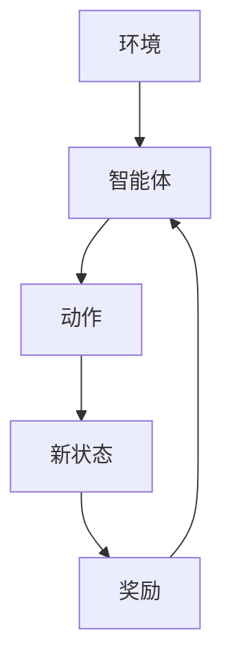
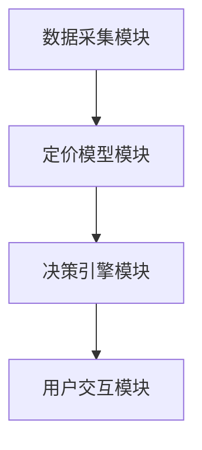
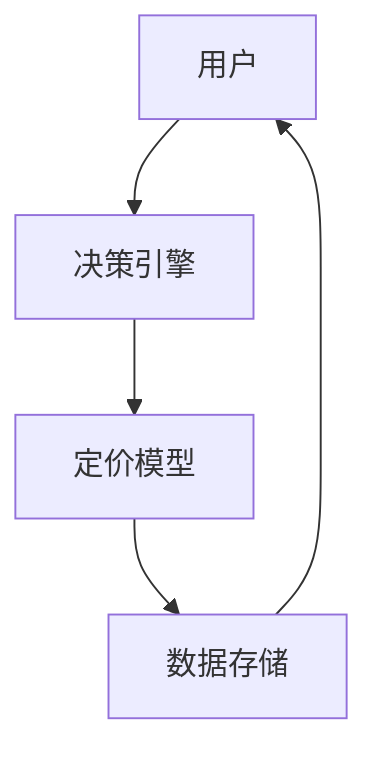

                 


# 《企业AI Agent的强化学习在动态定价策略中的应用》

> 关键词：企业AI Agent，强化学习，动态定价策略，数学模型，系统架构设计，项目实战

> 摘要：本文详细探讨了企业AI Agent如何利用强化学习优化动态定价策略。通过分析动态定价的背景与挑战，阐述了强化学习的核心原理及其在定价策略中的应用。文章还深入讲解了动态定价的数学模型、系统架构设计，通过项目实战展示了AI Agent在动态定价中的实际应用效果，最后总结了研究成果并展望了未来的发展方向。

---

## 第一部分: AI Agent与强化学习基础

### 第1章: AI Agent与强化学习概述

#### 1.1 AI Agent的基本概念

- **定义与特点**：AI Agent是一种能够感知环境、自主决策并执行任务的智能体，具备学习、推理和自适应能力。企业AI Agent可以用于自动化决策、优化资源配置和提升效率。
  
- **强化学习的核心原理**：强化学习通过智能体与环境的交互，学习最优策略。智能体通过动作改变环境状态，并获得奖励或惩罚，逐步优化决策过程。状态、动作、奖励是强化学习的三大核心要素。

- **AI Agent在企业中的应用价值**：企业AI Agent可应用于动态定价、供应链优化、风险管理等领域，通过实时数据处理和决策优化，提升企业竞争力。

#### 1.2 强化学习的核心原理

- **强化学习的基本框架**：强化学习由智能体、环境、状态、动作和奖励构成。智能体通过与环境互动，不断调整策略，以最大化累计奖励。
  
- **状态、动作、奖励的定义**：状态是环境的当前情况，动作是智能体的选择，奖励是对动作的反馈。例如，在动态定价中，状态可能是当前价格和市场反馈，动作是调整价格，奖励是收入的变化。

- **策略与价值函数的介绍**：策略定义智能体选择动作的概率分布，价值函数评估状态的价值。Q-learning通过Q值函数学习最优策略，DQN结合深度神经网络和经验回放机制，提升学习效率。

### 第2章: 动态定价策略的背景与挑战

#### 2.1 动态定价的定义与特点

- **定义与特点**：动态定价指根据市场环境和用户行为实时调整价格，具有实时性、数据驱动性和灵活性的特点。
  
- **动态定价与静态定价的对比**：动态定价适应市场变化，而静态定价固定不变。动态定价适用于需求波动大的产品或服务，如电商、交通行业。

- **动态定价在企业中的应用场景**：动态定价广泛应用于电商促销、交通票务、酒店预订等领域，帮助企业优化收益管理。

#### 2.2 动态定价的挑战

- **市场波动的影响**：市场环境变化快，影响定价策略的有效性。
  
- **用户行为的复杂性**：用户需求和偏好多样，增加了定价策略的复杂性。
  
- **数据依赖性与实时性要求**：动态定价依赖实时数据，对系统响应速度和数据处理能力要求高。

### 第3章: AI Agent在动态定价中的应用

#### 3.1 AI Agent与动态定价的结合

- **AI Agent在动态定价中的角色**：AI Agent作为决策者，实时分析市场数据和用户行为，优化定价策略。
  
- **强化学习在动态定价中的优势**：强化学习通过试错学习，找到最优定价策略，适应动态市场环境。

- **动态定价策略的实时优化能力**：AI Agent利用强化学习，实时调整价格，平衡收益和销量。

#### 3.2 动态定价策略的核心要素

- **数据驱动的定价模型**：基于历史数据和市场反馈，构建定价模型，预测需求和价格敏感性。
  
- **基于用户行为的定价策略**：分析用户行为特征，制定个性化定价策略，提升用户体验和收益。
  
- **市场环境的实时反馈机制**：通过实时数据反馈，调整定价策略，适应市场变化。

---

## 第二部分: 强化学习算法原理与实现

### 第4章: 强化学习算法原理

#### 4.1 基础强化学习算法

- **Q-learning算法**：Q-learning通过Q值函数学习最优策略，适用于离散动作空间。公式为：
  $$ Q(s, a) = Q(s, a) + \alpha (r + \gamma \max Q(s', a') - Q(s, a)) $$

- **Deep Q-Networks (DQN)**：DQN结合神经网络和经验回放机制，适用于高维状态空间。损失函数为：
  $$ \mathbb{E}[(r + \gamma Q(s', \pi(s')) - Q(s, a))^2] $$

- **策略梯度方法（Policy Gradient）**：通过优化策略直接寻找最优动作分布，适用于连续动作空间。

#### 4.2 强化学习的核心公式

- **Q-learning的更新公式**：
  $$ Q(s, a) = Q(s, a) + \alpha (r + \gamma \max Q(s', a') - Q(s, a)) $$

- **DQN的网络结构与损失函数**：
  - 网络结构：输入层（状态）→ 隐藏层 → 输出层（Q值）
  - 损失函数：
    $$ \mathbb{E}[(r + \gamma Q(s', \pi(s')) - Q(s, a))^2] $$

#### 4.3 强化学习的流程图



---

## 第三部分: 动态定价策略的数学模型

### 第5章: 动态定价策略的数学模型

#### 5.1 需求预测模型

- **线性回归模型**：预测需求量与价格的关系，形式为：
  $$ Q = aP + b $$

- **博弈论模型**：模拟市场竞争，分析价格调整对市场份额的影响。

#### 5.2 收益最大化模型

- **收益函数**：收益 = 价格 × 数量，目标函数为：
  $$ \max R = P \times Q $$

- **约束条件**：市场容量、成本、竞争者的定价策略。

#### 5.3 数学模型的优化

- **动态优化模型**：使用动态规划方法，逐步优化定价策略。

---

## 第四部分: 系统分析与架构设计

### 第6章: 系统分析与架构设计

#### 6.1 系统模块设计

- **数据采集模块**：实时收集市场数据和用户行为数据。
- **定价模型模块**：构建需求预测和收益最大化模型。
- **决策引擎模块**：基于强化学习优化定价策略。
- **用户交互模块**：展示定价结果并反馈用户。

#### 6.2 系统架构图



#### 6.3 接口设计与交互流程图



---

## 第五部分: 项目实战

### 第7章: 项目实战

#### 7.1 环境安装与配置

- **安装Python环境**：使用Anaconda或virtualenv，安装numpy、tensorflow、keras等库。
- **数据集准备**：收集市场数据和用户行为数据，进行预处理和特征提取。

#### 7.2 核心代码实现

```python
import numpy as np
import tensorflow as tf

class DQN:
    def __init__(self, state_size, action_size):
        self.state_size = state_size
        self.action_size = action_size
        self.gamma = 0.99
        self.epsilon = 1.0
        self.epsilon_min = 0.01
        self.epsilon_decay = 0.995
        self.batch_size = 64
        self.memory = []
        self.model = self.build_model()

    def build_model(self):
        model = tf.keras.Sequential([
            tf.keras.layers.Dense(32, activation='relu', input_dim=self.state_size),
            tf.keras.layers.Dense(32, activation='relu'),
            tf.keras.layers.Dense(self.action_size, activation='linear')
        ])
        model.compile(optimizer='adam', loss='mean_squared_error')
        return model

    def remember(self, state, action, reward, next_state):
        self.memory.append((state, action, reward, next_state))

    def act(self, state):
        if np.random.random() < self.epsilon:
            return np.random.randint(self.action_size)
        state = np.array([state])
        predictions = self.model.predict(state)
        return np.argmax(predictions[0])

    def replay(self):
        if len(self.memory) < self.batch_size:
            return
        minibatch = np.random.choice(self.memory, self.batch_size)
        states = np.array([t[0] for t in minibatch])
        actions = np.array([t[1] for t in minibatch])
        rewards = np.array([t[2] for t in minibatch])
        next_states = np.array([t[3] for t in minibatch])
        targets = rewards + self.gamma * np.amax(self.model.predict(next_states), axis=1)
        targets = np.clip(targets, -1, 1)
        self.model.fit(states, targets, epochs=1, verbose=0)
        self.epsilon = max(self.epsilon * self.epsilon_decay, self.epsilon_min)
```

#### 7.3 案例分析与效果解读

- **案例分析**：通过实际数据训练DQN模型，优化动态定价策略。
- **效果解读**：与传统定价方法对比，展示AI Agent在动态定价中的优势。

---

## 第六部分: 总结与展望

### 第8章: 总结与展望

#### 8.1 总结

- **主要观点回顾**：企业AI Agent通过强化学习优化动态定价策略，提升收益和用户体验。
- **研究成果的总结**：本文通过理论分析和案例实践，验证了AI Agent在动态定价中的有效性。

#### 8.2 未来研究方向

- **多智能体协同定价**：研究多个AI Agent协同优化定价策略。
- **强化学习的可解释性**：提升强化学习模型的可解释性，便于实际应用。
- **边缘计算与动态定价**：结合边缘计算技术，提升定价策略的实时性和响应速度。

#### 8.3 最佳实践 tips

- **数据质量的重要性**：确保数据的准确性和实时性。
- **模型调参技巧**：合理设置超参数，提升模型性能。
- **系统安全性建议**：保护数据隐私，确保系统安全性。

---

## 附录

### 附录A: 强化学习技术文档

- [强化学习入门指南](https://example.com/rl-guide)
- [DQN算法实现细节](https://example.com/dqn-details)

### 附录B: 参考文献

- [1] Sutton, R. S., & Barto, A. G. (2018). Reinforcement learning: An introduction.
- [2] Mnih, V., et al. (2015). Human-level control through deep reinforcement learning.

---

## 作者

作者：AI天才研究院 & 禅与计算机程序设计艺术

