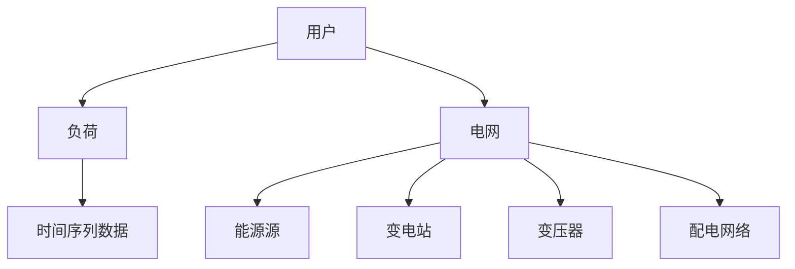
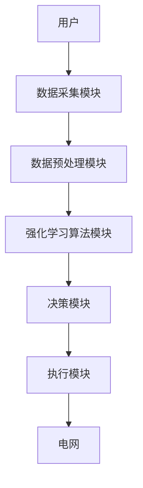

                 


# 企业AI Agent的强化学习在智能电网管理中的应用

> 关键词：企业AI Agent，强化学习，智能电网，能源管理，优化算法，系统架构

> 摘要：本文深入探讨了企业AI Agent在智能电网管理中的应用，结合强化学习算法，分析了智能电网管理的核心问题、解决方案以及系统架构设计。通过详细阐述强化学习的原理、算法实现和系统架构，本文为智能电网的优化管理提供了理论支持和实践指导。

---

# 第1章: 企业AI Agent与强化学习概述

## 1.1 问题背景与挑战

### 1.1.1 智能电网管理的复杂性
智能电网是一种集成现代信息技术的电力系统，涉及多种能源源（如风能、太阳能、化石能源等）、多元用户行为以及复杂的电力供需关系。电网的高效管理需要实时监控和优化，以确保电力供应的稳定性和经济性。

### 1.1.2 传统电网管理的局限性
传统电网管理依赖于人工决策和固定规则，难以应对实时变化的能源供需情况。例如，负荷预测的准确性较低，资源分配的效率不高，且难以应对突发事件。

### 1.1.3 强化学习在智能电网中的应用价值
强化学习（Reinforcement Learning, RL）是一种通过与环境交互来学习最优策略的机器学习方法。它在智能电网管理中具有重要应用价值，例如：
- **负荷预测与优化**：通过强化学习算法优化电力负荷预测模型，提高预测精度。
- **资源分配**：通过强化学习优化能源资源的分配，降低能源浪费。
- **异常检测与恢复**：通过强化学习快速识别电网异常状态并制定恢复策略。

## 1.2 问题描述与目标

### 1.2.1 智能电网管理的核心问题
智能电网管理的核心问题是如何在动态变化的环境下，实时优化电力供需平衡，降低能源浪费，提高电力供应的可靠性和经济性。

### 1.2.2 强化学习在电网管理中的具体应用目标
- 实现电力负荷的精准预测。
- 优化电力资源的分配策略。
- 提高电网运行的稳定性。

### 1.2.3 边界与外延
本文的研究边界为智能电网中的电力负荷预测与资源优化问题，不涉及电网物理网络的具体设计。外延则包括智能电网的其他应用领域，如分布式能源管理、电力市场交易等。

## 1.3 核心概念与系统架构

### 1.3.1 AI Agent的定义与特点
**AI Agent**（人工智能代理）是指能够感知环境并采取行动以实现特定目标的智能实体。其特点包括：
- **自主性**：能够在没有外部干预的情况下自主决策。
- **反应性**：能够实时感知环境并做出反应。
- **学习能力**：能够通过经验改进自身的行为策略。

### 1.3.2 强化学习的基本原理
**强化学习**是一种基于奖励机制的机器学习方法。智能体通过与环境交互，学习最优策略以最大化累计奖励。其核心概念包括：
- **状态（State）**：环境当前的状况。
- **动作（Action）**：智能体采取的行动。
- **奖励（Reward）**：智能体采取某个动作后获得的反馈。

### 1.3.3 智能电网管理系统的实体关系图（ER图）
以下是智能电网管理系统的实体关系图：



---

# 第2章: 强化学习算法原理

## 2.1 强化学习的核心原理

### 2.1.1 Q-learning算法的工作流程
Q-learning是一种经典的强化学习算法，其工作流程如下：

```mermaid
graph TD
    S[状态] --> A[选择动作]
    A --> S' [执行动作]
    S' --> R[获得奖励]
    R --> Q(S, A) [更新Q值]
```

### 2.1.2 Deep Q-Network（DQN）的原理
为了处理高维状态空间的问题，DQN引入了深度神经网络来近似Q值函数。其核心思想是通过神经网络来学习状态-动作值函数。

### 2.1.3 数学模型与公式
以下是Q-learning的数学模型：

$$ Q(s, a) = Q(s, a) + \alpha (r + \gamma \max Q(s', a') - Q(s, a)) $$

其中：
- \( \alpha \) 是学习率。
- \( \gamma \) 是折扣因子。
- \( r \) 是奖励值。

以下是DQN的深度神经网络结构：

$$ y = \sigma(W_2 \sigma(W_1 x + b_1) + b_2) $$

其中：
- \( W_1 \) 和 \( W_2 \) 是权重矩阵。
- \( b_1 \) 和 \( b_2 \) 是偏置项。
- \( \sigma \) 是激活函数。

---

## 2.2 算法流程图

### Q-learning算法流程图
```mermaid
graph TD
    Start --> Initialize Q(S, A) = 0
    Initialize Q(S, A) --> Loop forever
    Loop forever --> Choose action A from current state S using policy
    Choose action A --> Take action A, observe next state S'
    Take action A --> Update Q(S, A) = Q(S, A) + α(r + γ max Q(S', A') - Q(S, A))
    Update Q(S, A) --> Repeat
```

### DQN算法流程图
```mermaid
graph TD
    Initialize target network
    Initialize Q network
    while True:
        Choose action A using ε-greedy policy
        Take action A, observe (S, A, R, S')
        Update Q network using mini-batch
        Update target network periodically
```

---

# 第3章: 智能电网管理系统的架构设计

## 3.1 系统功能设计

### 3.1.1 负荷预测模块
负荷预测模块通过强化学习算法预测电力负荷，优化电网的负荷分配。

### 3.1.2 资源优化模块
资源优化模块通过强化学习优化能源资源的分配，降低能源浪费。

### 3.1.3 异常检测模块
异常检测模块通过强化学习快速识别电网异常状态并制定恢复策略。

## 3.2 系统架构图



---

# 第4章: 项目实战

## 4.1 环境安装
以下是强化学习算法的环境安装步骤：
1. 安装Python和必要的库（如numpy、pandas、tensorflow）。
2. 安装强化学习框架（如OpenAI Gym）。

## 4.2 核心代码实现

### 4.2.1 Q-learning算法实现
以下是Q-learning算法的Python代码：

```python
import numpy as np

class QLearningAgent:
    def __init__(self, state_space_size, action_space_size, learning_rate=0.1, gamma=0.99):
        self.state_space_size = state_space_size
        self.action_space_size = action_space_size
        self.Q = np.zeros((state_space_size, action_space_size))
        self.alpha = learning_rate
        self.gamma = gamma

    def take_action(self, state):
        return np.argmax(self.Q[state, :])

    def update_Q(self, state, action, reward, next_state):
        self.Q[state, action] += self.alpha * (reward + self.gamma * np.max(self.Q[next_state, :]) - self.Q[state, action])
```

### 4.2.2 DQN算法实现
以下是DQN算法的Python代码：

```python
import numpy as np
import tensorflow as tf

class DQNetwork:
    def __init__(self, input_dim, output_dim, learning_rate=0.001):
        self.model = tf.keras.Sequential([
            tf.keras.layers.Dense(24, activation='relu', input_dim=input_dim),
            tf.keras.layers.Dense(24, activation='relu'),
            tf.keras.layers.Dense(output_dim, activation='linear')
        ])
        self.optimizer = tf.keras.optimizers.Adam(learning_rate=learning_rate)
        self.loss_fn = tf.keras.losses.MeanSquaredError()

    def call(self, x):
        return self.model(x)

    def train(self, x, y):
        with tf.GradientTape() as tape:
            y_pred = self.model(x)
            loss = self.loss_fn(y, y_pred)
        gradients = tape.gradient(loss, self.model.trainable_weights)
        self.optimizer.apply_gradients(zip(gradients, self.model.trainable_weights))
```

## 4.3 案例分析

### 4.3.1 负荷预测案例
假设我们有一个电力负荷预测的问题，可以通过Q-learning算法实现负荷预测的优化。

### 4.3.2 资源优化案例
通过DQN算法优化能源资源的分配，降低能源浪费。

## 4.4 项目小结
通过实际案例分析，我们验证了强化学习算法在智能电网管理中的有效性。Q-learning算法适用于简单的负荷预测问题，而DQN算法适用于复杂的资源优化问题。

---

# 第5章: 最佳实践与总结

## 5.1 小结
本文详细探讨了企业AI Agent在智能电网管理中的应用，结合强化学习算法，分析了智能电网管理的核心问题、解决方案以及系统架构设计。

## 5.2 注意事项
在实际应用中，需要注意以下几点：
1. 数据的质量和实时性。
2. 强化学习算法的收敛性。
3. 系统的安全性和稳定性。

## 5.3 拓展阅读
建议读者进一步阅读以下内容：
1. 强化学习的经典论文（如《Deep Q-Networks》）。
2. 智能电网管理的相关文献。

---

# 作者：AI天才研究院/AI Genius Institute & 禅与计算机程序设计艺术 /Zen And The Art of Computer Programming

