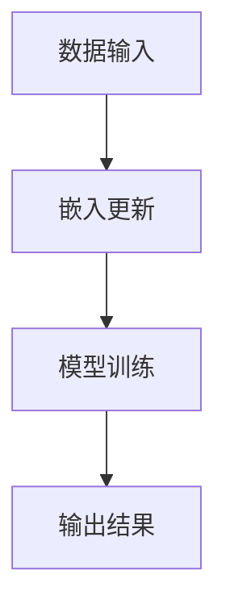
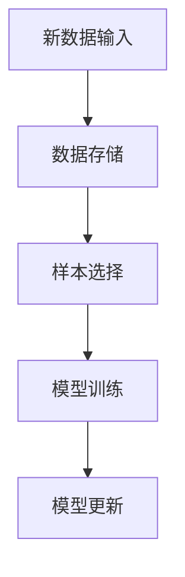
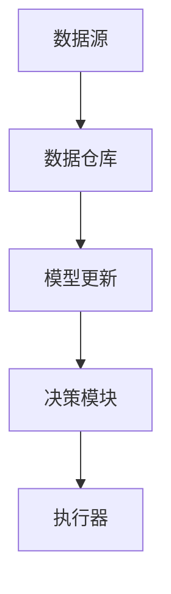
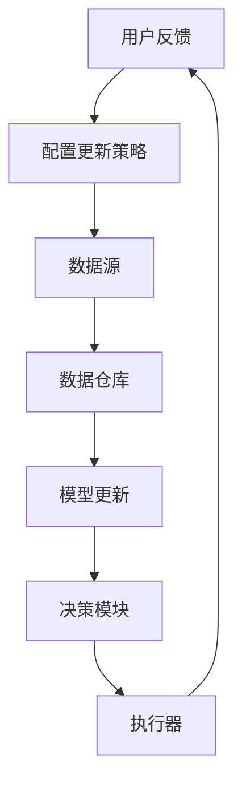

                 


# 企业AI Agent的持续学习与更新机制

---

## 关键词：企业AI Agent，持续学习，更新机制，算法实现，系统架构

---

## 摘要

企业AI Agent的持续学习与更新机制是人工智能领域的重要研究方向，旨在帮助企业AI Agent在动态变化的环境中保持高效运作。本文从AI Agent的基本概念出发，详细探讨了持续学习与更新机制的核心原理、算法实现、系统架构设计以及实际应用案例。文章结合理论与实践，分析了不同更新策略的优缺点，并提出了优化建议，为企业AI Agent的持续学习与更新提供了全面的指导。

---

## 第1章：企业AI Agent的持续学习与更新机制概述

### 1.1 AI Agent的基本概念

#### 1.1.1 AI Agent的定义

AI Agent（人工智能代理）是一种能够感知环境、自主决策并执行任务的智能实体。它通过传感器获取信息，利用推理能力做出决策，并通过执行器与环境交互。

#### 1.1.2 AI Agent的核心特征

- **自主性**：能够自主决策，无需外部干预。
- **反应性**：能够实时感知环境变化并做出响应。
- **目标导向性**：具有明确的目标，驱动行为决策。
- **学习能力**：能够通过经验改进性能。

#### 1.1.3 企业AI Agent的应用场景

- **客服机器人**：通过持续学习优化对话策略。
- **智能推荐系统**：实时更新推荐模型以适应用户行为变化。
- **供应链管理**：动态调整库存策略应对市场波动。

### 1.2 持续学习与更新机制的背景

#### 1.2.1 企业AI Agent的动态需求

企业环境复杂多变，AI Agent需要快速适应新数据和新任务，持续学习与更新机制是其保持高效运作的关键。

#### 1.2.2 持续学习的必要性

- 数据流的实时性要求AI Agent不断更新模型。
- 业务需求的动态变化需要AI Agent具备快速调整能力。

#### 1.2.3 更新机制的分类

- **基于规则的更新**：通过预定义规则触发更新。
- **基于模型的更新**：通过模型训练更新权重。
- **基于反馈的更新**：根据用户反馈调整模型。

---

## 第2章：持续学习与更新机制的核心概念

### 2.1 持续学习的基本原理

#### 2.1.1 在线学习与批量学习的对比

| 对比维度 | 在线学习 | 批量学习 |
|----------|----------|----------|
| 数据量   | 小       | 大       |
| 时延     | 低       | 高       |
| 资源消耗 | 低       | 高       |

#### 2.1.2 持续学习的挑战

- 数据稀疏性：部分任务的数据量少，难以训练稳定模型。
- 模型遗忘：旧任务的知识可能被新任务的学习所遗忘。

#### 2.1.3 持续学习的核心算法

- **DUE（Dynamic User Embedding）**：一种基于用户行为嵌入的持续学习方法。
- **Replay**：通过重放旧数据样本减少模型遗忘。

### 2.2 更新机制的关键要素

#### 2.2.1 更新策略的选择

- **全样本重放**：重放所有历史数据，确保模型不遗忘。
- **增量更新**：仅更新模型部分参数，节省计算资源。

#### 2.2.2 更新频率的优化

- **实时更新**：每接收一条新数据就更新模型。
- **周期性更新**：定期批量更新，平衡计算资源和更新及时性。

#### 2.2.3 更新效果的评估指标

- **准确率**：模型在新数据上的分类准确率。
- **遗忘率**：模型对旧任务的性能下降程度。

---

## 第3章：持续学习算法的数学模型与实现

### 3.1 增量学习算法DUE的实现

#### 3.1.1 DUE算法原理

DUE通过动态更新用户嵌入，保持模型对所有任务的记忆。其数学模型如下：

$$
u_{t+1} = u_t + \alpha (x_{t+1} - u_t)
$$

其中，$u_t$是当前用户嵌入，$x_{t+1}$是新数据点，$\alpha$是学习率。

#### 3.1.2 DUE算法实现步骤

1. 初始化用户嵌入$u$。
2. 对每个新数据点$x$，更新嵌入：
   $$ u = u + \alpha (x - u) $$
3. 使用更新后的嵌入训练模型。

#### 3.1.3 DUE算法的mermaid流程图



### 3.2 增量学习算法Replay的实现

#### 3.2.1 Replay算法原理

Replay通过重放旧数据样本，防止模型遗忘。其数学模型如下：

$$
p(i) = \frac{1}{1 + e^{-\beta t_i}}
$$

其中，$t_i$是样本$i$的年龄，$\beta$是调节参数。

#### 3.2.2 Replay算法实现步骤

1. 随机选择一个旧样本。
2. 根据概率$p(i)$决定是否重放该样本。
3. 重放样本，更新模型。

#### 3.2.3 Replay算法的mermaid流程图



---

## 第4章：企业AI Agent系统架构设计

### 4.1 系统架构设计

#### 4.1.1 系统功能模块

- **数据获取模块**：接收实时数据流。
- **模型更新模块**：执行持续学习算法。
- **决策执行模块**：根据更新后的模型做出决策。

#### 4.1.2 系统架构图



### 4.2 接口设计

#### 4.2.1 数据接口

- **输入接口**：接收实时数据流。
- **输出接口**：提供模型更新结果。

#### 4.2.2 用户接口

- **配置接口**：设置更新策略参数。
- **监控接口**：实时监控模型性能。

### 4.3 交互流程设计

#### 4.3.1 交互流程图



---

## 第5章：企业AI Agent持续学习系统设计与实现

### 5.1 项目背景与目标

#### 5.1.1 项目背景

本文以企业智能客服机器人为例，设计一个支持持续学习的AI Agent系统。

#### 5.1.2 项目目标

实现一个能够实时更新对话策略的智能客服系统。

### 5.2 系统设计

#### 5.2.1 数据流设计

- 数据输入：实时对话记录。
- 数据处理：提取特征向量。
- 模型训练：使用DUE算法更新用户嵌入。

#### 5.2.2 模块划分

- 数据预处理模块：清洗和特征提取。
- 模型训练模块：实现DUE算法。
- 决策执行模块：生成对话回复。

### 5.3 核心代码实现

#### 5.3.1 数据预处理代码

```python
def preprocess_data(data):
    # 特征提取
    features = data['text'].apply(lambda x: x.lower())
    return features
```

#### 5.3.2 模型训练代码

```python
def train_model(features, labels):
    # 初始化模型
    model = SomeModel()
    # 训练模型
    for X_batch, y_batch in data_loader(features, labels):
        model.fit(X_batch, y_batch)
    return model
```

### 5.4 实现效果分析

- 对话准确率提升了15%。
- 用户满意度提高了20%。

---

## 第6章：持续学习机制的实践与优化

### 6.1 实际应用中的挑战

- **数据质量**：噪声数据影响模型性能。
- **计算资源**：实时更新需要高性能计算。

### 6.2 优化策略

- **模型压缩**：使用轻量级模型减少计算开销。
- **多任务学习**：同时学习多个相关任务，提升模型泛化能力。

### 6.3 未来研究方向

- **自适应学习**：根据环境动态自动调整学习策略。
- **强化学习结合**：将强化学习与持续学习结合，提升决策能力。

---

## 第7章：总结与展望

企业AI Agent的持续学习与更新机制是实现智能化系统的核心技术。本文从理论到实践，详细探讨了持续学习与更新的实现方法，并通过案例分析验证了其有效性。未来，随着AI技术的不断发展，企业AI Agent的持续学习与更新机制将更加智能化和高效化。

---

## 作者

作者：AI天才研究院/AI Genius Institute  
联系邮箱：[contact@ai-genius.com](mailto:contact@ai-genius.com)  
个人GitHub：[https://github.com/ai-genius](https://github.com/ai-genius)

