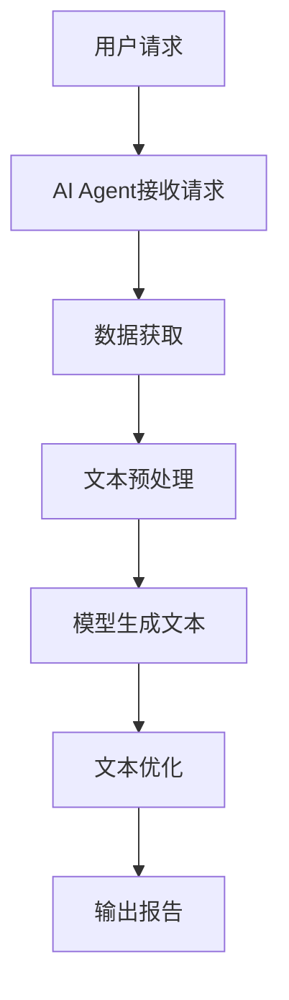
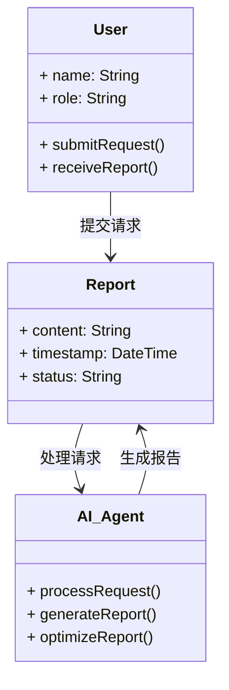
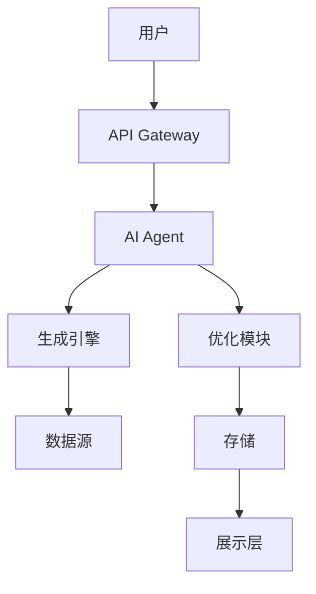
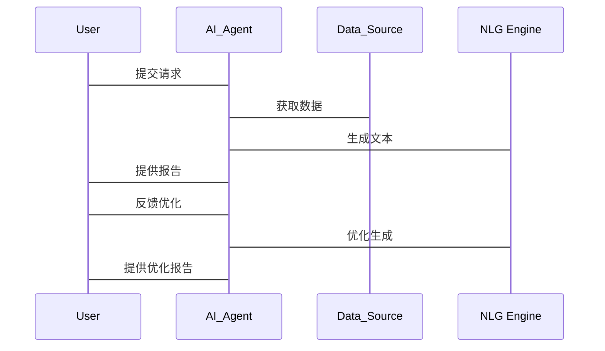

                 


# 企业AI Agent的自然语言生成(NLG)报告系统

> 关键词：AI Agent, 自然语言生成, 企业报告系统, 生成模型, 报告自动化, 人机协作

> 摘要：本文详细探讨了企业AI Agent驱动的自然语言生成(NLG)报告系统的设计与实现。通过分析问题背景、核心概念、算法原理、系统架构以及项目实战，结合数学公式、mermaid图和实际案例，系统性地阐述了如何利用AI Agent和NLG技术提升企业报告系统的效率与智能化水平。本文旨在为企业技术人员和管理人员提供理论与实践相结合的指导，助力企业实现智能化报告生成。

---

## 第一部分: 企业AI Agent的自然语言生成(NLG)报告系统背景介绍

### 第1章: 问题背景与描述

#### 1.1 问题背景
企业报告系统在现代商业环境中扮演着至关重要的角色，从财务分析、市场报告到项目管理，各类报告都需要准确、及时地生成和分析。然而，传统的报告系统存在以下主要问题：

- **效率低下**：手动编写报告耗时耗力，且容易出错。
- **一致性不足**：不同部门或人员生成的报告格式和内容可能存在不一致。
- **缺乏智能化**：报告内容依赖人工判断，难以快速响应数据变化。
- **数据孤岛**：各部门之间的数据分散，难以实现数据的统一利用。

#### 1.2 问题描述
AI Agent（人工智能代理）与自然语言生成（NLG）技术的结合为企业报告系统的智能化提供了新的可能性。AI Agent能够理解上下文、执行任务并进行人机交互，而NLG技术则能够将结构化数据转化为自然流畅的文本。然而，现有系统在以下几个方面仍存在挑战：

- **生成质量**：如何确保生成的文本既准确又符合语境要求。
- **实时性**：如何快速响应数据变化并生成实时报告。
- **可解释性**：生成的报告需要具备可追溯性和可解释性。

### 第2章: 问题解决与系统边界

#### 2.1 问题解决方法
AI Agent驱动的NLG报告系统通过以下方式解决问题：
- **数据驱动**：利用企业内部数据构建模型，确保生成报告的准确性。
- **自动化生成**：AI Agent自动分析数据并生成报告，提升效率。
- **人机协作**：结合人工校对和优化，确保报告质量。

#### 2.2 系统边界与外延
系统的边界主要集中在以下几个方面：
- **输入边界**：系统接收结构化数据和非结构化数据。
- **输出边界**：生成的报告输出到指定的展示平台或存储系统。
- **交互边界**：支持用户与AI Agent的交互，包括任务分配和结果确认。

---

## 第二部分: 核心概念与联系

### 第3章: 核心概念原理

#### 3.1 AI Agent的核心原理
- **定义与特征**：
  AI Agent是一种智能代理，能够感知环境、执行任务并与其他系统或用户交互。其核心特征包括自主性、反应性、目标导向和社会能力。
- **决策机制**：
  AI Agent通过状态感知、目标设定和行动选择来完成任务。例如，基于当前数据状态，AI Agent决定是否触发报告生成。

#### 3.2 自然语言生成(NLG)的核心原理
- **基本概念**：
  NLG是指将结构化数据转化为自然语言文本的过程，涉及文本规划、生成和优化三个阶段。
- **关键技术**：
  包括模板生成、统计模型和深度学习模型（如Transformer）。生成过程中需要考虑语法、语义和语境。

### 第4章: 核心概念属性对比与ER实体关系图

#### 4.1 核心概念属性对比
| **属性**       | **AI Agent**                | **NLG**                     |
|----------------|------------------------------|------------------------------|
| **输入类型**   | 结构化数据、用户指令         | 结构化数据                   |
| **输出类型**   | 行动、报告、交互反馈        | 自然语言文本                 |
| **核心功能**   | 数据分析、任务执行、交互    | 文本生成、优化                |
| **依赖性**     | 高，依赖数据和任务目标      | 中，依赖生成模型和数据       |

#### 4.2 ER实体关系图
```mermaid
erd
  title 实体关系图
  User: 用户
    员工、管理层
  Report: 报告
    包括报告内容、生成时间等
  AI_Agent: AI代理
    包括数据接口、生成引擎
  Data_Source: 数据源
    包括数据库、API等
  Action: 行动
    包括生成报告、反馈优化
  Relation: 关系
    User --> AI_Agent: 请求代理
    AI_Agent --> Data_Source: 获取数据
    AI_Agent --> Report: 生成报告
    Report --> User: 提供报告
```

---

## 第三部分: 算法原理讲解

### 第5章: 算法原理与流程

#### 5.1 算法原理
- **文本预处理**：
  对输入数据进行清洗、格式化和语义分析，确保生成文本的质量。
- **模型训练**：
  使用深度学习模型（如BERT、GPT）进行预训练和微调，优化生成效果。
- **生成策略**：
  根据上下文和任务目标，选择合适的生成策略，如贪心算法或采样方法。

#### 5.2 算法流程


---

### 第6章: 数学模型与公式

#### 6.1 概率模型
- **条件概率**：
  $$ P(\text{文本生成}|D) = \prod_{i=1}^n P(y_i | y_{i-1}, D) $$
  其中，$D$表示输入数据，$y_i$表示生成的第$i$个词。

#### 6.2 损失函数
- **交叉熵损失**：
  $$ \text{Loss} = -\sum_{i=1}^n \log P(y_i | y_{i-1}, D) $$

#### 6.3 优化算法
- **Adam优化器**：
  使用Adam优化器对模型参数进行优化，学习率设为$0.001$：
  $$ \theta_{t+1} = \theta_t - \eta \nabla_{\theta} \text{Loss} $$

---

## 第四部分: 系统分析与架构设计方案

### 第7章: 问题场景介绍

#### 7.1 项目介绍
本项目旨在开发一个AI Agent驱动的NLG报告系统，实现企业数据的自动化报告生成。系统将集成自然语言生成、数据处理和人机交互功能，支持多种报告类型和定制化需求。

### 第8章: 系统功能设计

#### 8.1 领域模型


### 第9章: 系统架构设计

#### 9.1 系统架构图


#### 9.2 接口设计
- **输入接口**：
  - `POST /api/v1/request`：接收用户的请求。
- **输出接口**：
  - `GET /api/v1/report/{id}`：获取生成的报告。

### 第10章: 交互流程

#### 10.1 交互流程图


---

## 第五部分: 项目实战

### 第11章: 环境安装与核心实现

#### 11.1 环境安装
- 安装Python 3.8及以上版本。
- 安装依赖库：`pip install transformers pytorch`

#### 11.2 核心代码实现

```python
from transformers import AutoTokenizer, AutoModelForCausalLM
import torch

class NLGReportGenerator:
    def __init__(self, model_name="facebook/m2olama"):
        self.tokenizer = AutoTokenizer.from_pretrained(model_name)
        self.model = AutoModelForCausalLM.from_pretrained(model_name)
    
    def generate_report(self, data):
        inputs = self.tokenizer(data, return_tensors="pt")
        with torch.no_grad():
            outputs = self.model.generate(inputs.input_ids, max_length=500)
        return self.tokenizer.decode(outputs[0], skip_special_tokens=True)
```

---

## 第六部分: 最佳实践与总结

### 第12章: 总结与注意事项

- **小结**：
  本文详细探讨了企业AI Agent驱动的NLG报告系统的各个方面，从理论到实践，系统性地展示了如何利用AI技术提升企业报告系统的智能化水平。

- **注意事项**：
  - 确保数据质量和多样性，避免模型偏见。
  - 定期更新模型，适应数据变化。
  - 优化人机交互体验，提升用户满意度。

### 第13章: 拓展阅读

- 推荐阅读：
  - 《生成式人工智能：算法与应用》
  - 《自然语言处理实战：模型与算法》

---

# 作者：AI天才研究院/AI Genius Institute & 禅与计算机程序设计艺术 /Zen And The Art of Computer Programming

---

**注**：以上内容仅为目录大纲，具体实施时需要根据实际需求进行调整和补充。

