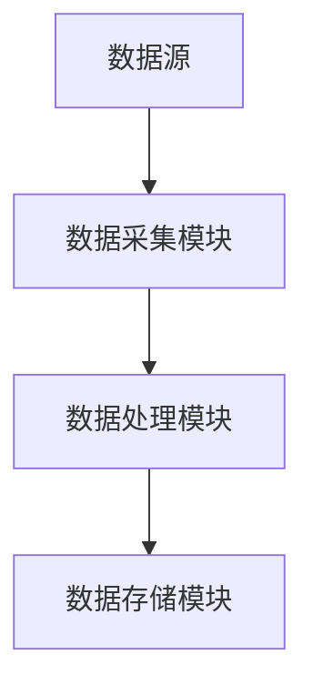

                 


# 企业数据管理：AI Agent训练数据的收集与处理

---

## 关键词：企业数据管理，AI Agent，数据收集，数据处理，机器学习，数据清洗，数据质量

---

## 摘要

本文详细探讨了企业数据管理中AI Agent训练数据的收集与处理的关键问题。通过分析数据收集与处理的核心概念、算法原理、系统架构设计以及实际项目案例，本文为读者提供了从理论到实践的全面指导。文章不仅介绍了数据收集与处理的基本原理，还深入探讨了如何利用这些技术提升AI Agent的性能，同时结合实际案例，展示了如何在企业环境中有效实施这些技术。

---

## 第1章: 企业数据管理与AI Agent概述

### 1.1 企业数据管理的背景与挑战

#### 1.1.1 数据在企业中的重要性

数据是企业的核心资产之一。在当今数字化时代，数据驱动决策已经成为企业成功的关键因素。企业通过收集和分析数据，可以更好地理解市场趋势、优化运营流程、提升客户体验，并制定更有效的业务策略。

#### 1.1.2 传统数据管理的局限性

传统的数据管理方法往往依赖于手动操作，存在效率低、成本高、数据孤岛等问题。此外，随着企业规模的扩大，数据量急剧增长，传统的数据管理方法难以应对海量数据的挑战。

#### 1.1.3 AI Agent的定义与特点

AI Agent（人工智能代理）是一种能够感知环境、自主决策并执行任务的智能实体。AI Agent的核心能力包括数据感知、学习推理、决策执行和自适应优化。AI Agent的应用场景广泛，包括智能客服、自动化交易、智能监控等。

---

### 1.2 AI Agent训练数据的核心作用

#### 1.2.1 数据在AI Agent训练中的地位

AI Agent的性能高度依赖于训练数据的质量和数量。高质量的数据可以提升AI Agent的学习效果，使其能够更好地理解和适应复杂环境。

#### 1.2.2 数据质量对AI Agent性能的影响

数据质量直接影响AI Agent的训练效果。低质量的数据可能导致模型偏差、误判或过拟合，从而降低AI Agent的性能。

#### 1.2.3 数据收集与处理的挑战与解决方案

数据收集与处理的挑战包括数据源多样化、数据格式复杂、数据噪声干扰等问题。解决方案包括数据清洗、数据增强、数据标准化等技术。

---

### 1.3 企业数据管理的现状与趋势

#### 1.3.1 数据管理技术的发展历程

从早期的文件存储到数据库管理，再到现代的大数据平台，数据管理技术经历了多次变革。随着AI技术的普及，数据管理技术也在不断进化，以满足AI Agent的需求。

#### 1.3.2 AI技术对企业数据管理的影响

AI技术的应用推动了数据管理的智能化和自动化。通过AI技术，企业可以更高效地收集、处理和分析数据，从而提升数据管理的效率和效果。

#### 1.3.3 未来数据管理的趋势

未来的数据管理将更加注重数据的实时性、智能化和安全性。随着AI技术的进一步发展，数据管理将更加依赖自动化工具和智能算法。

---

## 1.4 本章小结

本章介绍了企业数据管理的重要性和AI Agent的核心作用。通过分析数据收集与处理的挑战和解决方案，读者可以理解为什么数据管理在AI Agent的应用中如此关键。

---

## 第2章: 数据收集与处理的核心概念

### 2.1 数据收集的基本原理

#### 2.1.1 数据来源的分类

数据来源可以分为内部数据和外部数据。内部数据包括企业的业务数据，如销售记录、客户信息等；外部数据包括公开数据、社交媒体数据等。

#### 2.1.2 数据收集的方法与工具

数据收集的方法包括数据库查询、API调用、网络爬取等。常用工具包括数据库管理系统（如MySQL）、API接口开发工具（如Postman）、网络爬虫工具（如Scrapy）。

#### 2.1.3 数据收集的流程

数据收集的流程包括数据源识别、数据采集、数据预处理等步骤。数据预处理包括数据清洗、数据转换等。

---

### 2.2 数据处理的核心原理

#### 2.2.1 数据清洗的必要性

数据清洗是去除噪声数据、重复数据和无效数据的过程。通过数据清洗，可以提高数据的质量和一致性。

#### 2.2.2 数据转换与标准化

数据转换包括数据格式转换、数据归一化等。数据标准化是为了确保不同数据源的数据具有可比性。

#### 2.2.3 数据增强与特征工程

数据增强是通过增加数据的多样性和复杂性来提高模型的泛化能力。特征工程是通过提取和构建有用的特征来提升模型的性能。

---

### 2.3 数据质量与评估标准

#### 2.3.1 数据质量的定义与评估指标

数据质量包括准确性、完整性、一致性、及时性等指标。准确的数据是真实反映业务的；完整的数据没有缺失；一致的数据格式统一；及时的数据是新鲜的。

#### 2.3.2 数据清洗的常见方法

数据清洗的方法包括去除噪声数据、填充缺失值、去除重复数据等。这些方法可以有效提升数据的质量。

#### 2.3.3 数据质量对AI Agent性能的影响

高质量的数据可以提升AI Agent的学习效果和决策能力。低质量的数据可能导致模型性能下降，甚至出现错误的决策。

---

### 2.4 本章小结

本章详细讲解了数据收集与处理的核心概念，包括数据来源的分类、数据清洗的方法、数据质量的评估标准等。通过这些知识，读者可以更好地理解如何收集和处理高质量的数据。

---

## 第3章: 数据收集与处理的算法原理

### 3.1 数据清洗算法

#### 3.1.1 基于规则的数据清洗算法

基于规则的清洗算法通过预定义的规则来识别和处理数据中的噪声。例如，可以通过正则表达式来清洗文本数据中的特殊字符。

#### 3.1.2 基于统计的数据清洗算法

基于统计的清洗算法通过分析数据的分布和统计特征来识别异常值。例如，可以通过均值、中位数等统计指标来处理缺失值。

#### 3.1.3 基于机器学习的数据清洗算法

基于机器学习的清洗算法通过训练模型来识别和处理数据中的异常值。例如，可以使用聚类算法来识别数据中的异常值。

---

### 3.2 数据转换与标准化算法

#### 3.2.1 数据标准化的数学模型

数据标准化的公式为：  
$$ z = \frac{x - \mu}{\sigma} $$  
其中，$\mu$ 是数据的均值，$\sigma$ 是数据的标准差。

#### 3.2.2 数据归一化的实现方法

数据归一化的公式为：  
$$ y = \frac{x - \min(x)}{\max(x) - \min(x)} $$  
其中，$\min(x)$ 和 $\max(x)$ 分别是数据的最小值和最大值。

#### 3.2.3 数据转换的Python代码实现

```python
import pandas as pd
from sklearn.preprocessing import StandardScaler

# 数据标准化
scaler = StandardScaler()
data_standard = scaler.fit_transform(data)

# 数据归一化
data_minmax = (data - data.min()) / (data.max() - data.min())
```

---

### 3.3 数据增强与特征工程算法

#### 3.3.1 数据增强的基本原理

数据增强通过增加数据的多样性和复杂性来提高模型的泛化能力。例如，可以通过旋转、翻转、缩放等操作来增强图像数据。

#### 3.3.2 特征工程的核心步骤

特征工程的步骤包括特征选择、特征提取、特征构建等。特征选择是通过筛选重要特征来降低维度；特征提取是通过降维技术（如PCA）来提取关键特征；特征构建是通过组合现有特征来构建新的特征。

#### 3.3.3 特征选择的数学模型

特征选择的常用方法包括基于统计的特征选择（如卡方检验）和基于模型的特征选择（如Lasso回归）。

---

### 3.4 本章小结

本章详细讲解了数据清洗、数据转换和数据增强的算法原理，并通过Python代码展示了这些算法的实现过程。读者可以通过这些内容理解如何利用算法来提升数据的质量和特征的表达能力。

---

## 第4章: 数据管理系统架构与设计

### 4.1 系统功能设计

#### 4.1.1 数据采集模块

数据采集模块负责从各种数据源中采集数据。数据源可以是数据库、API、文件等。

#### 4.1.2 数据处理模块

数据处理模块负责对采集到的数据进行清洗、转换和增强。通过这些处理，可以将原始数据转化为适合AI Agent训练的数据集。

#### 4.1.3 数据存储模块

数据存储模块负责将处理后的数据存储到数据库或数据仓库中，以便后续的分析和使用。

---

### 4.2 系统架构设计

#### 4.2.1 分层架构设计

分层架构将系统划分为数据采集层、数据处理层和数据存储层。每一层负责不同的功能，便于系统的扩展和维护。

#### 4.2.2 微服务架构设计

微服务架构将系统功能分解为多个独立的服务，每个服务负责特定的功能。例如，数据采集服务、数据处理服务、数据存储服务等。

#### 4.2.3 数据流的实体关系图



---

### 4.3 系统接口设计

#### 4.3.1 数据采集接口

数据采集接口负责与各种数据源进行交互。例如，通过API接口采集外部数据。

#### 4.3.2 数据处理接口

数据处理接口负责接收数据并进行清洗、转换和增强。通过这些接口，可以灵活地处理不同类型的数据。

#### 4.3.3 数据存储接口

数据存储接口负责将处理后的数据存储到数据库或数据仓库中。例如，使用ORM工具（如Django ORM）进行数据库操作。

---

### 4.4 本章小结

本章详细讲解了数据管理系统的架构设计，包括功能设计、架构设计和接口设计。通过这些设计，可以构建一个高效、灵活的数据管理系统。

---

## 第5章: 项目实战与最佳实践

### 5.1 项目实战

#### 5.1.1 环境安装

需要安装Python、Pandas、Scikit-learn、Jupyter Notebook等工具。可以通过pip命令安装这些库。

#### 5.1.2 系统核心实现源代码

```python
import pandas as pd
from sklearn.preprocessing import StandardScaler

# 数据标准化
def data_standardization(data):
    scaler = StandardScaler()
    return scaler.fit_transform(data)

# 数据归一化
def data_minmax(data):
    return (data - data.min()) / (data.max() - data.min())

# 数据增强
def data_augmentation(data):
    # 示例：旋转数据
    augmented_data = []
    for x in data:
        augmented_data.append(x)
        augmented_data.append(x * 0.9)
    return augmented_data
```

#### 5.1.3 代码应用解读与分析

通过上述代码，可以实现数据的标准化、归一化和增强。数据标准化用于处理数值型数据，数据归一化用于处理范围型数据，数据增强用于增加数据的多样性。

#### 5.1.4 实际案例分析

以一个简单的客户数据分析项目为例，展示如何通过数据收集与处理技术提升AI Agent的性能。

---

### 5.2 最佳实践

#### 5.2.1 数据管理的注意事项

- 数据安全：确保数据的保密性和完整性。
- 数据备份：定期备份数据，防止数据丢失。
- 数据监控：实时监控数据的质量和状态。

#### 5.2.2 项目小结

通过实际项目的实施，读者可以更好地理解数据收集与处理技术的应用。同时，通过不断优化数据处理流程，可以提升AI Agent的性能和效果。

---

## 5.3 本章小结

本章通过实际项目案例展示了数据收集与处理技术的应用，并总结了项目实施中的经验和教训。通过这些内容，读者可以更好地理解如何在实际中应用这些技术。

---

## 作者：AI天才研究院/AI Genius Institute & 禅与计算机程序设计艺术 /Zen And The Art of Computer Programming

