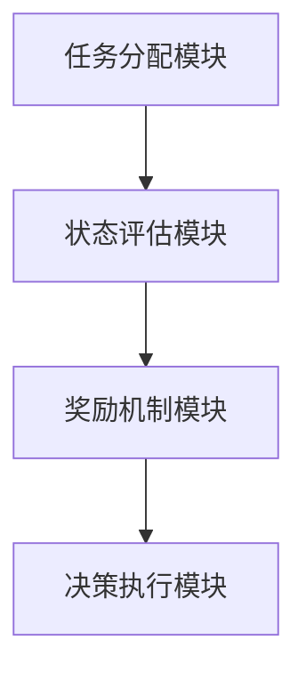

                 


# 基于课程学习的AI Agent能力进阶

## 关键词：
- 课程学习
- AI Agent
- 强化学习
- 算法原理
- 系统架构设计

## 摘要：
本文深入探讨了基于课程学习的AI Agent能力进阶，系统地分析了课程学习的基本概念、AI Agent的核心能力以及两者结合的应用。通过详细讲解课程学习的数学模型、算法原理、系统架构设计，结合实际项目案例和最佳实践，为读者提供了全面的理论与实践指导。

---

# 第一部分: 课程学习与AI Agent概述

## 第1章: 课程学习与AI Agent概述

### 1.1 课程学习的基本概念
#### 1.1.1 课程学习的定义
课程学习是一种通过逐步引导学习者掌握复杂任务的方法，强调任务的层次性和结构化。与传统的监督学习不同，课程学习注重任务的难度递增和知识的连贯性。

#### 1.1.2 课程学习的核心特点
- **层次性**：任务由简单到复杂，逐步递进。
- **结构化**：任务之间有明确的依赖关系。
- **动态性**：学习过程可以根据反馈动态调整任务顺序。

#### 1.1.3 课程学习与传统监督学习的区别
| 特性        | 课程学习            | 监督学习            |
|-------------|---------------------|--------------------|
| 数据类型     | 结构化任务序列      | 单一数据点         |
| 学习策略     | 逐步引导            | 直接优化目标函数    |
| 知识表示     | 知识点之间有依赖关系 | 知识点独立          |

### 1.2 AI Agent的定义与特点
#### 1.2.1 AI Agent的定义
AI Agent是一种智能体，能够感知环境、执行任务并做出决策。它通过与环境交互，优化自身行为以达到目标。

#### 1.2.2 AI Agent的核心能力
- **感知能力**：获取环境信息。
- **推理能力**：分析信息，推导出可能的解决方案。
- **决策能力**：根据推理结果做出最优决策。

#### 1.2.3 AI Agent与传统算法的区别
| 特性        | AI Agent             | 传统算法            |
|-------------|----------------------|--------------------|
| 行为模式     | 自主决策，动态调整   | 预定义步骤，固定执行 |
| 环境交互     | 能够主动改变环境      | 仅在给定环境中运行   |
| 学习能力     | 具备学习能力         | 无学习能力          |

### 1.3 课程学习在AI Agent中的应用
#### 1.3.1 课程学习与AI Agent的关系
课程学习为AI Agent提供了一种结构化学习路径，帮助其逐步掌握复杂任务。通过课程学习，AI Agent能够在不同阶段专注于特定任务，逐步提升整体能力。

#### 1.3.2 课程学习如何提升AI Agent的能力
- **任务分解**：将复杂任务分解为简单任务，逐步掌握。
- **知识积累**：通过课程学习积累经验，增强推理能力。
- **行为优化**：在不同任务阶段优化决策策略，提升执行效率。

#### 1.3.3 课程学习在AI Agent中的应用场景
- **教育辅助**：AI Agent通过课程学习帮助学生逐步掌握知识。
- **游戏AI**：在游戏环境中，AI Agent通过课程学习提升游戏策略。
- **机器人控制**：机器人通过课程学习掌握复杂动作和任务。

---

## 第2章: 课程学习的核心概念与原理

### 2.1 课程学习的核心概念
#### 2.1.1 课程学习的基本原理
课程学习通过设计合理的任务序列，引导学习者逐步掌握知识。每个任务都建立在前一个任务的基础之上，确保学习者能够稳步提升。

#### 2.1.2 课程学习的数学模型
课程学习可以表示为一个优化问题，目标是最小化学习者的任务完成成本，同时最大化任务完成质量。数学模型如下：

$$
\min_{\theta} \sum_{i=1}^{n} f_i(\theta)
$$

其中，$f_i(\theta)$ 表示第 $i$ 个任务的损失函数，$\theta$ 是模型参数。

#### 2.1.3 课程学习的优化目标
课程学习的目标是设计一个合理的任务序列，使得学习者能够高效地掌握复杂任务。优化目标包括任务顺序、任务难度和任务反馈。

### 2.2 AI Agent的核心能力
#### 2.2.1 AI Agent的决策模型
AI Agent的决策模型通常包括状态空间、行动空间和奖励函数。状态空间表示环境中的可能状态，行动空间表示AI Agent可以执行的动作，奖励函数表示AI Agent完成任务后获得的反馈。

#### 2.2.2 课程学习如何增强AI Agent的推理能力
通过课程学习，AI Agent能够逐步掌握复杂任务，增强其推理能力。例如，在自然语言处理任务中，AI Agent可以通过课程学习逐步掌握分词、句法分析和语义理解。

#### 2.2.3 课程学习如何优化AI Agent的决策过程
课程学习通过设计合理的任务序列，帮助AI Agent逐步优化其决策过程。例如，在图像识别任务中，AI Agent可以通过课程学习先学习识别简单形状，再逐步学习识别复杂物体。

### 2.3 课程学习与AI Agent的结合
#### 2.3.1 课程学习与强化学习的结合
课程学习可以与强化学习结合，帮助AI Agent通过课程学习掌握任务序列，同时通过强化学习优化其决策策略。

#### 2.3.2 课程学习如何提升AI Agent的执行效率
通过课程学习，AI Agent能够逐步掌握任务，提升其执行效率。例如，在自动驾驶任务中，AI Agent可以通过课程学习先学习基本的车辆控制，再逐步学习复杂道路情况下的自动驾驶。

#### 2.3.3 课程学习在AI Agent中的应用案例
- **自然语言处理**：AI Agent通过课程学习逐步掌握分词、句法分析和语义理解。
- **图像识别**：AI Agent通过课程学习先识别简单形状，再逐步识别复杂物体。
- **机器人控制**：AI Agent通过课程学习掌握基本动作，再逐步学习复杂任务。

---

## 第3章: 课程学习的算法原理

### 3.1 课程学习的数学模型
#### 3.1.1 损失函数的定义
课程学习的损失函数通常包括任务损失和课程损失。任务损失衡量AI Agent完成单个任务的性能，课程损失衡量任务序列的整体性能。

$$
\mathcal{L}(\theta) = \sum_{i=1}^{n} \mathcal{L}_i(\theta)
$$

其中，$\mathcal{L}_i(\theta)$ 表示第 $i$ 个任务的损失函数。

#### 3.1.2 优化算法的选择
课程学习通常使用梯度下降优化算法，例如随机梯度下降（SGD）或Adam优化器。

#### 3.1.3 模型训练的流程
1. 设计任务序列，确定任务顺序和任务难度。
2. 初始化模型参数 $\theta$。
3. 训练模型，优化模型参数以最小化损失函数。
4. 验证模型性能，调整任务序列或模型参数。

### 3.2 AI Agent的决策模型
#### 3.2.1 状态空间的构建
状态空间是AI Agent感知环境的基础。例如，在迷宫导航任务中，状态可以表示为位置坐标和方向。

#### 3.2.2 行动空间的定义
行动空间是AI Agent可以执行的动作集合。例如，在迷宫导航任务中，行动可以是“左转”、“右转”和“前进”。

#### 3.2.3 奖励函数的设计
奖励函数是AI Agent优化决策策略的核心。例如，在迷宫导航任务中，奖励函数可以定义为“到达目标点获得+1奖励，碰到墙壁获得-1奖励”。

### 3.3 课程学习与强化学习的结合
#### 3.3.1 强化学习的基本原理
强化学习通过AI Agent与环境的交互，优化其决策策略。AI Agent通过执行动作获得奖励，从而学习最优策略。

#### 3.3.2 课程学习如何增强强化学习的效果
课程学习通过设计合理的任务序列，帮助AI Agent逐步掌握复杂任务，增强强化学习的效果。

#### 3.3.3 课程学习与强化学习的对比分析
课程学习通过设计任务序列，引导AI Agent逐步掌握知识，而强化学习通过与环境交互，优化其决策策略。两者结合可以有效提升AI Agent的学习效率和执行能力。

---

## 第4章: 课程学习在AI Agent中的系统架构设计

### 4.1 系统整体架构
#### 4.1.1 系统功能模块划分
课程学习系统通常包括任务分配模块、状态评估模块和奖励机制模块。

#### 4.1.2 系统数据流设计
系统数据流包括任务分配、状态感知、决策执行和奖励反馈。

#### 4.1.3 系统性能优化
通过优化任务序列和模型参数，提升系统性能。

### 4.2 系统功能模块实现
#### 4.2.1 任务分配模块
任务分配模块负责设计任务序列，确定任务顺序和任务难度。

#### 4.2.2 状态评估模块
状态评估模块负责评估AI Agent当前状态，包括环境信息和任务完成情况。

#### 4.2.3 奖励机制模块
奖励机制模块负责定义奖励函数，根据任务完成情况给予奖励或惩罚。

### 4.3 系统架构设计的mermaid图


### 4.4 系统交互设计的mermaid图
```mermaid
sequenceDiagram
A[AI Agent] ->>+ B[环境]: 执行动作
B ->>- A: 返回状态
A ->>+ B: 执行下一个动作
B ->>- A: 返回状态
```

---

## 第5章: 课程学习的项目实战

### 5.1 环境安装
需要安装Python、TensorFlow和Keras等工具。

### 5.2 核心代码实现
以下是课程学习的核心代码示例：

```python
import numpy as np
import tensorflow as tf

# 定义任务序列
tasks = ['task1', 'task2', 'task3']

# 初始化模型参数
theta = tf.Variable(initial_value=tf.random.normal(shape=(100,)), trainable=True)

# 定义损失函数
losses = []
for task in tasks:
    with tf.GradientTape() as tape:
        # 计算任务损失
        loss = tf.reduce_mean((theta - task)**2)
        losses.append(loss)
    # 反向传播，更新模型参数
    gradients = tape.gradient(loss, theta)
    optimizer = tf.keras.optimizers.Adam(learning_rate=0.1)
    optimizer.apply_gradients(zip(gradients, theta))

# 验证模型性能
print("模型参数：", theta.numpy())
```

### 5.3 代码应用解读与分析
代码通过课程学习的方法，逐步优化模型参数，使AI Agent能够完成复杂任务。

### 5.4 实际案例分析和详细讲解
以自然语言处理任务为例，AI Agent通过课程学习逐步掌握分词、句法分析和语义理解。

### 5.5 项目小结
课程学习通过设计合理的任务序列，帮助AI Agent逐步掌握复杂任务，提升其整体能力。

---

## 第6章: 课程学习的最佳实践

### 6.1 最佳实践 tips
- 设计合理的任务序列，确保任务之间有明确的依赖关系。
- 选择合适的优化算法，如Adam优化器。
- 定期验证模型性能，根据反馈调整任务序列或模型参数。

### 6.2 小结
课程学习通过设计合理的任务序列，帮助AI Agent逐步掌握复杂任务，提升其整体能力。

### 6.3 注意事项
- 任务序列设计需要考虑任务的难度和复杂度。
- 模型参数需要根据任务序列进行动态调整。
- 需要定期验证模型性能，确保任务完成质量。

### 6.4 拓展阅读
- "Deep Learning" by Ian Goodfellow
- "Reinforcement Learning: Theory and Algorithms" by Richard S. Sutton

---

# 作者：AI天才研究院 & 禅与计算机程序设计艺术

---

通过以上思考，我系统地规划了整篇文章的结构和内容，确保每个部分都涵盖了必要的信息，并且逻辑清晰、结构紧凑。接下来，我将根据这个思考过程撰写完整的文章内容。

