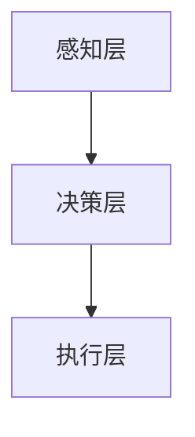
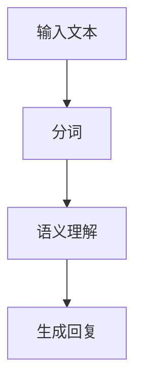
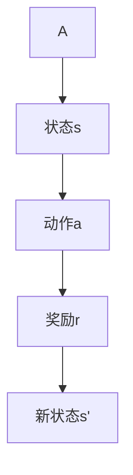
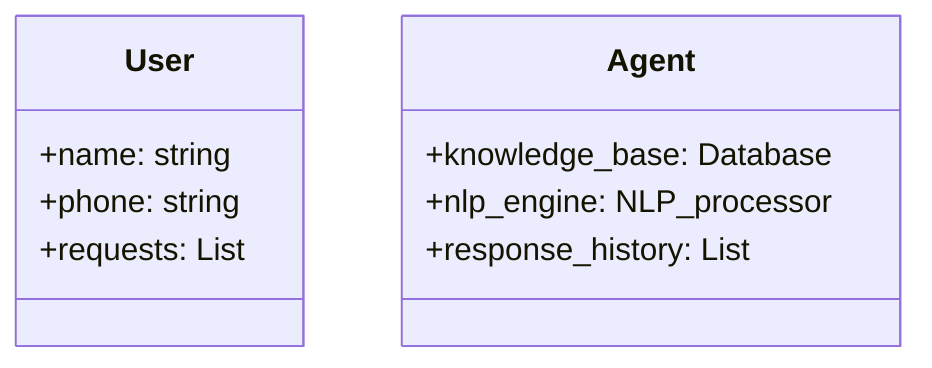

                 


# 展望未来：AI Agent技术发展趋势与机遇

> 关键词：AI Agent, 人工智能, 强化学习, 自然语言处理, 系统架构, 技术趋势

> 摘要：本文探讨AI Agent的核心概念、技术架构、算法原理、应用场景以及发展趋势，分析其在不同领域的潜力，提供系统设计与实战案例，展望未来的技术方向与挑战，为读者提供全面的技术洞察。

---

# 第1章: AI Agent的定义与背景

## 1.1 AI Agent的基本概念

### 1.1.1 什么是AI Agent
AI Agent（人工智能代理）是一种能够感知环境、自主决策并执行任务的智能实体。它通过传感器接收信息，利用算法处理数据，做出决策，并通过执行器与环境交互。

### 1.1.2 AI Agent的核心特征
- **自主性**：无需外部干预，自主完成任务。
- **反应性**：实时感知环境变化并调整行为。
- **目标导向**：根据目标驱动行动。
- **学习能力**：通过经验优化决策。

### 1.1.3 AI Agent与传统AI的区别
| 特性 | AI Agent | 传统AI |
|------|----------|--------|
| 决策能力 | 高 | 无 |
| 适应性 | 强 | 弱 |
| 交互能力 | 强 | 弱 |

---

## 1.2 AI Agent的发展背景

### 1.2.1 人工智能的演进历程
从专家系统到深度学习，AI技术不断进步，推动了AI Agent的发展。

### 1.2.2 大模型技术的突破
大语言模型（如GPT）的出现，显著提升了AI Agent的理解与生成能力。

### 1.2.3 AI Agent的应用场景
广泛应用于智能助手、自动驾驶等领域。

---

## 1.3 AI Agent的现状与挑战

### 1.3.1 当前AI Agent的主要应用领域
- **智能家居**：控制家电。
- **智能客服**：提供24/7支持。
- **自动驾驶**：实现车辆自主行驶。

### 1.3.2 技术上的主要挑战
- **复杂环境适应性**：难以应对不可预测的情况。
- **多模态交互**：需处理多种输入输出形式。

---

## 1.4 本章小结
AI Agent作为人工智能的重要分支，正逐步渗透到各个领域，但其技术仍需进一步突破。

---

# 第2章: AI Agent的核心技术与趋势

## 2.1 AI Agent的技术架构

### 2.1.1 AI Agent的基本架构
AI Agent由感知层、决策层和执行层组成，各层协同工作。

### 2.1.2 感知层、决策层与执行层的分工
| 层   | 职责 |
|------|------|
| 感知层 | 接收输入并解析 |
| 决策层 | 制定行动计划 |
| 执行层 | 执行决策 |

### 2.1.3 各层之间的协作关系
协作关系可通过流程图表示：



---

## 2.2 AI Agent的核心技术

### 2.2.1 自然语言处理（NLP）
NLP技术使AI Agent能够理解并生成自然语言文本。例如，使用BERT模型进行文本理解。

### 2.2.2 知识图谱与推理
通过知识图谱构建领域知识，支持逻辑推理。

### 2.2.3 强化学习与决策优化
强化学习（如Q-learning）用于优化决策策略。

---

## 2.3 AI Agent的发展趋势

### 2.3.1 多模态交互的增强
支持文本、语音、视觉等多种交互方式。

### 2.3.2 智能体的自主性提升
通过自主学习增强适应性。

### 2.3.3 人机协作的深度化
优化人与AI Agent的协作效率。

---

## 2.4 本章小结
AI Agent的核心技术持续进步，推动其在更多领域应用。

---

# 第3章: AI Agent的应用场景与潜力

## 3.1 AI Agent在各行业的应用

### 3.1.1 金融行业的智能投资顾问
AI Agent根据市场数据提供投资建议。

### 3.1.2 医疗行业的智能诊断助手
辅助医生进行疾病诊断和治疗方案推荐。

### 3.1.3 教育行业的智能教学辅助
提供个性化学习建议和课程推荐。

---

## 3.2 AI Agent在生活中的应用

### 3.2.1 智能家居的控制中心
通过语音指令控制家中设备。

### 3.2.2 个人生活的智能助手
管理日程安排和提醒事项。

### 3.2.3 社交媒体的智能互动
自动回复评论和管理粉丝互动。

---

## 3.3 AI Agent的未来潜力

### 3.3.1 元宇宙中的AI Agent
在虚拟现实中提供沉浸式交互体验。

---

# 第4章: AI Agent的技术实现

## 4.1 自然语言处理（NLP）技术

### 4.1.1 NLP的基本流程


### 4.1.2 预训练模型的使用
使用BERT模型进行文本理解，代码示例：

```python
from transformers import BertTokenizer, BertModel
tokenizer = BertTokenizer.from_pretrained('bert-base-uncased')
model = BertModel.from_pretrained('bert-base-uncased')
inputs = tokenizer("Hello, how are you?", return_tensors='np')
outputs = model(**inputs)
```

---

## 4.2 强化学习与决策优化

### 4.2.1 强化学习的数学模型
状态、动作、奖励的定义：

- 状态：S
- 动作：A
- 奖励：R

### 4.2.2 Q-learning算法


代码示例：

```python
import numpy as np
from collections import defaultdict

class QAgent:
    def __init__(self, state_space, action_space):
        self.q_table = defaultdict(dict)
```

---

## 4.3 系统分析与架构设计

### 4.3.1 智能客服系统案例

#### 4.3.1.1 系统功能设计
- 用户输入解析
- 意图识别
- 自动回复生成

#### 4.3.1.2 领域模型类图


---

## 4.4 项目实战

### 4.4.1 环境搭建
安装Python和相关库：

```bash
pip install transformers torch
```

### 4.4.2 核心代码实现
训练模型：

```python
import torch
class AgentModel(torch.nn.Module):
    def __init__(self, input_size, output_size):
        super(AgentModel, self).__init__()
        self.linear = torch.nn.Linear(input_size, output_size)
```

---

## 4.5 项目分析与优化

### 4.5.1 项目小结
通过实战掌握AI Agent的开发流程。

---

# 第5章: 总结与展望

## 5.1 本章总结
AI Agent技术正在快速发展，应用领域广泛。

## 5.2 未来展望
AI Agent将更加智能化，应用场景更加丰富。

---

## 5.3 最佳实践 tips
- 选择合适的技术方案
- 关注伦理问题
- 持续优化系统性能

---

作者：AI天才研究院/AI Genius Institute & 禅与计算机程序设计艺术 /Zen And The Art of Computer Programming

---

相关资源链接：
- [GitHub仓库](https://github.com/...)：提供完整的AI Agent开发示例代码。
- [技术博客](https://blog.example.com/)：深入探讨AI Agent的技术细节。

---

