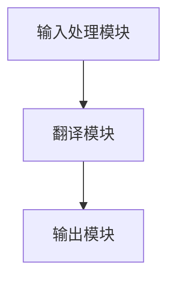
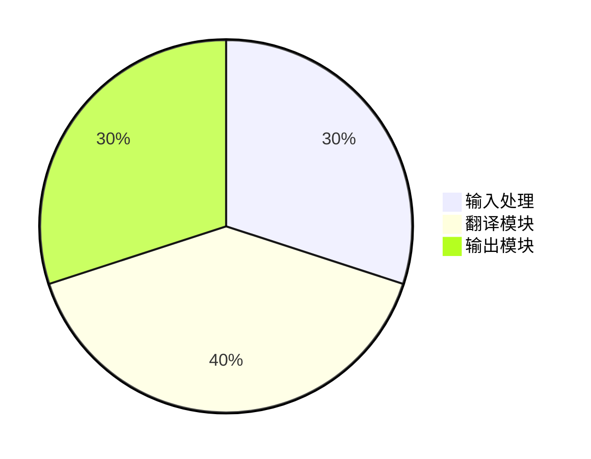
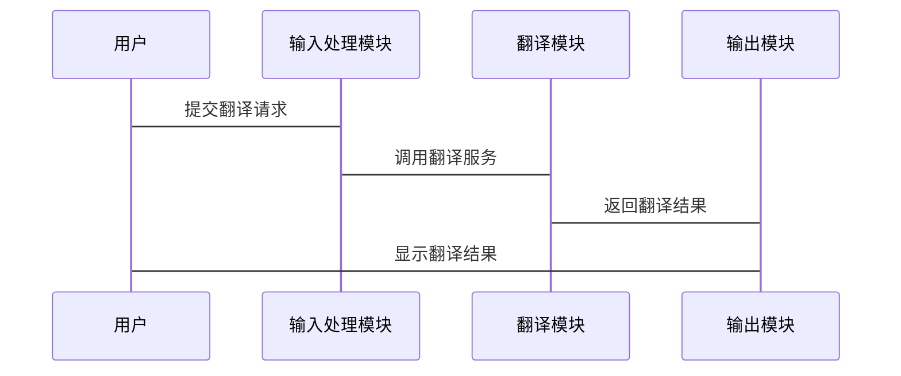

                 


# 开发具有多语言翻译能力的AI Agent

> 关键词：AI Agent，多语言翻译，神经机器翻译，对话生成模型，系统架构设计

> 摘要：本文详细探讨了如何开发具有多语言翻译能力的AI Agent，从基本概念到算法原理，再到系统设计和项目实战，全面解析了实现这一目标的关键技术与方法。通过深入分析多语言翻译的核心原理和AI Agent的功能架构，本文为读者提供了一套完整的开发思路与实践指南。

---

# 第一部分: AI Agent与多语言翻译概述

## 第1章: AI Agent的基本概念

### 1.1 AI Agent的定义与特点

#### 1.1.1 AI Agent的定义
AI Agent（人工智能代理）是一种能够感知环境、自主决策并执行任务的智能实体。它通过传感器获取信息，利用计算模型处理信息，并通过执行器与环境交互。AI Agent的核心目标是帮助用户完成特定任务，提升效率与体验。

#### 1.1.2 AI Agent的核心特点
- **自主性**：AI Agent能够自主决策，无需外部干预。
- **反应性**：能够实时感知环境变化并做出响应。
- **学习能力**：通过数据与反馈不断优化自身性能。
- **可扩展性**：支持多种功能模块的扩展与集成。

#### 1.1.3 AI Agent与传统程序的区别
AI Agent与传统程序的主要区别在于其智能性和自主性。传统程序基于固定的规则执行任务，而AI Agent能够通过学习与推理动态调整行为，适应复杂环境的变化。

---

### 1.2 多语言翻译的背景与挑战

#### 1.2.1 多语言翻译的需求背景
在全球化背景下，跨语言交流的需求日益增长。多语言翻译技术能够帮助用户克服语言障碍，提升沟通效率。然而，不同语言的语法结构、文化背景和表达习惯的差异使得翻译任务具有很高的挑战性。

#### 1.2.2 多语言翻译的技术挑战
- **语言复杂性**：不同语言的语法结构差异大，翻译需要考虑语境与文化因素。
- **数据稀疏性**：某些语言的训练数据不足，影响翻译模型的性能。
- **实时性要求**：在AI Agent中，翻译任务需要快速响应，这对计算效率提出了更高要求。

#### 1.2.3 当前多语言翻译的现状与趋势
当前，基于深度学习的多语言翻译技术已取得显著进展。主流技术包括神经机器翻译（NMT）和大语言模型（如GPT）驱动的翻译。未来，多语言翻译将更加注重实时性、准确性与用户体验。

---

### 1.3 AI Agent与多语言翻译的结合

#### 1.3.1 AI Agent在多语言翻译中的作用
AI Agent作为多语言翻译的核心载体，负责接收输入、调用翻译模型并输出结果。它能够通过上下文理解用户意图，提供更准确的翻译服务。

#### 1.3.2 多语言翻译对AI Agent能力的要求
- **多模态处理能力**：能够同时处理文本、语音等多种输入形式。
- **上下文理解能力**：能够分析上下文信息，提供更精准的翻译结果。
- **实时计算能力**：能够在短时间内完成翻译任务，满足用户需求。

#### 1.3.3 本章小结
本章介绍了AI Agent的基本概念，分析了多语言翻译的技术挑战与现状，并探讨了AI Agent在多语言翻译中的作用与能力要求。

---

# 第二部分: 多语言翻译的核心概念与原理

## 第2章: 多语言翻译的实现原理

### 2.1 多语言翻译的实现流程

#### 2.1.1 分词与句法分析
翻译的第一步是将输入文本进行分词和句法分析。分词将文本划分为单词或短语，句法分析则确定句子的结构与语法关系。

#### 2.1.2 语义理解与上下文处理
通过语义理解，翻译系统能够提取文本的主要意思，并结合上下文信息生成更准确的翻译结果。

#### 2.1.3 翻译生成与优化
基于语义理解的结果，翻译系统生成候选翻译，并通过优化算法提升翻译质量。

---

### 2.2 常见多语言翻译模型对比

#### 2.2.1 统计机器翻译（SMT）
- **定义**：基于统计语言模型的翻译方法。
- **优缺点**：翻译质量稳定，但对稀有语言支持较差。

#### 2.2.2 神经机器翻译（NMT）
- **定义**：基于深度学习的端到端翻译模型。
- **优缺点**：翻译质量高，但需要大量计算资源。

#### 2.2.3 基于大语言模型的翻译
- **定义**：利用预训练的大语言模型（如GPT）进行翻译。
- **优缺点**：能够生成自然流畅的翻译，但训练成本高。

#### 2.2.4 对比表格
| 模型类型       | 优缺点                                   |
|----------------|----------------------------------------|
| 统计机器翻译   | 翻译质量稳定，但对稀有语言支持较差       |
| 神经机器翻译   | 翻译质量高，需要大量计算资源             |
| 基于大模型     | 生成自然流畅，训练成本高                 |

---

### 2.3 多语言翻译中的语言模型选择

#### 2.3.1 单语言模型 vs 多语言模型
- **单语言模型**：专为单一语言设计，翻译质量高但不支持多语言。
- **多语言模型**：支持多种语言，但翻译质量可能略逊于单语言模型。

#### 2.3.2 预训练模型的适用性分析
- **适用场景**：需要支持多种语言的翻译任务。
- **不适用场景**：对翻译质量要求极高且只涉及少数语言的场景。

#### 2.3.3 模型性能对比与优化建议
通过对比不同模型的性能，建议在实际应用中优先选择多语言模型，并根据具体需求进行微调优化。

---

# 第三部分: AI Agent的算法原理与数学模型

## 第3章: 多语言翻译的算法原理

### 3.1 神经机器翻译模型（NMT）

#### 3.1.1 NMT的基本原理
NMT基于Transformer架构，通过自注意力机制捕捉文本中的语义关系，实现端到端的翻译。

#### 3.1.2 Transformer架构的数学模型
$$ \text{Transformer}(x) = \text{FFN}(\text{Self-Attention}(x)) $$

其中，Self-Attention表示自注意力机制，FFN表示前馈网络。

#### 3.1.3 注意力机制的实现细节
注意力机制通过计算输入序列中每个位置的权重，确定其对当前翻译结果的贡献程度。

$$ \text{Attention}(Q, K, V) = \text{softmax}\left(\frac{QK^T}{\sqrt{d_k}}\right)V $$

其中，$Q$、$K$、$V$分别为查询、键和值向量，$d_k$为键的维度。

---

### 3.2 对话生成模型（GPT系列）

#### 3.2.1 GPT模型的结构与特点
GPT模型基于Transformer的解码器架构，通过自回归方式生成文本。

#### 3.2.2 梯度下降与参数优化
使用Adam优化器进行参数优化，学习率调整策略采用学习率衰减。

#### 3.2.3 多语言对话生成的策略
通过多语言预训练和任务特定微调，提升模型在多语言对话生成中的表现。

---

### 3.3 多语言翻译的数学公式

#### 3.3.1 Transformer模型的公式推导
$$ \text{嵌入层}(x) = x + \text{Positional Encoding}(x) $$

#### 3.3.2 注意力机制的计算公式
$$ \text{Attention}(Q, K, V) = \text{softmax}\left(\frac{QK^T}{\sqrt{d_k}}\right)V $$

#### 3.3.3 损失函数与优化目标
使用交叉熵损失函数进行优化，目标是最小化生成的翻译结果与真实结果之间的差异。

$$ \mathcal{L} = -\sum_{i=1}^n \text{log}(p(y_i|x)) $$

---

# 第四部分: AI Agent的系统架构与实现

## 第4章: 多语言翻译的系统架构设计

### 4.1 系统功能设计

#### 4.1.1 功能模块划分
- **输入处理模块**：接收用户输入并进行预处理。
- **翻译模块**：调用翻译模型完成翻译任务。
- **输出模块**：将翻译结果返回给用户。

#### 4.1.2 功能流程图


---

### 4.2 系统架构设计

#### 4.2.1 系统架构图


#### 4.2.2 接口设计
- **输入接口**：支持文本输入和语音输入。
- **输出接口**：支持文本输出和语音输出。

#### 4.2.3 交互流程


---

## 第5章: 项目实战

### 5.1 环境安装与配置

#### 5.1.1 安装Python与依赖库
```bash
pip install torch transformers
```

#### 5.1.2 下载预训练模型
使用Hugging Face提供的多语言翻译模型。

---

### 5.2 系统核心实现

#### 5.2.1 翻译模块实现
```python
from transformers import AutoTokenizer, AutoModelForSeq2Seq

tokenizer = AutoTokenizer.from_pretrained("facebook/m2m-100")
model = AutoModelForSeq2Seq.from_pretrained("facebook/m2m-100")

def translate(text, src_lang, tgt_lang):
    inputs = tokenizer(text, src_lang=src_lang, tgt_lang=tgt_lang)
    outputs = model.generate(**inputs)
    return tokenizer.decode(outputs[0], skip_special_tokens=True)
```

---

### 5.3 代码应用与案例分析

#### 5.3.1 实际案例
将英文句子翻译成中文：
```python
text = "Hello, how are you?"
src_lang = "en"
tgt_lang = "zh"
print(translate(text, src_lang, tgt_lang))  # 输出："你好，你怎么样？"
```

#### 5.3.2 优化与调整
通过调整模型参数和优化翻译流程，提升翻译速度与准确率。

---

## 第6章: 最佳实践与总结

### 6.1 最佳实践 tips
- **选择合适的模型**：根据具体需求选择单语言或多语言模型。
- **优化计算资源**：通过并行计算和模型剪枝优化性能。
- **关注用户体验**：提供友好的交互界面和反馈机制。

### 6.2 小结
本文详细探讨了开发具有多语言翻译能力的AI Agent的关键技术与实现方法，从算法原理到系统设计，为读者提供了一套完整的开发思路。

### 6.3 注意事项
在实际应用中，需注意模型的训练成本与计算资源限制，确保系统在实际场景中的稳定运行。

### 6.4 拓展阅读
建议进一步学习多语言模型的微调方法和高效推理技术。

---

# 作者：AI天才研究院/AI Genius Institute & 禅与计算机程序设计艺术 /Zen And The Art of Computer Programming

