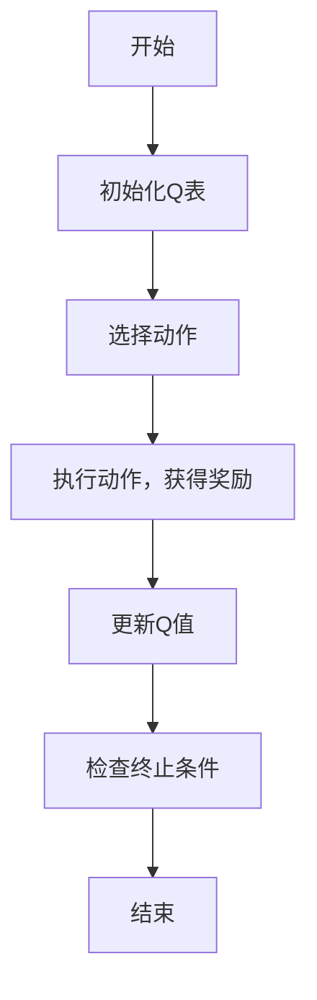
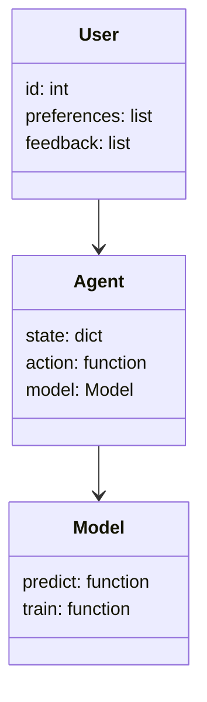
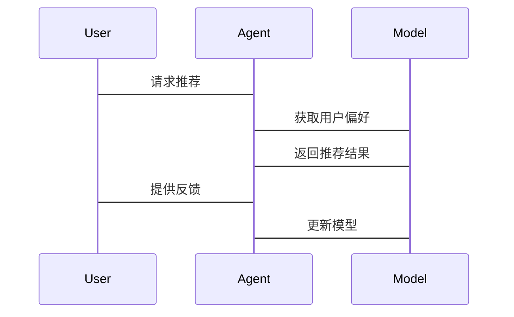

                 


# 开发具有持续适应能力的AI Agent

> 关键词：AI Agent，持续适应，强化学习，动态环境，自适应算法

> 摘要：本文探讨了开发具有持续适应能力的AI Agent的关键技术，涵盖基本概念、核心原理、算法实现、系统设计及实际案例分析。通过详细讲解，帮助读者理解并掌握如何构建能够持续学习和适应变化的智能系统。

---

# 第1章: AI Agent 的基本概念与持续适应能力

## 1.1 AI Agent 的基本概念

### 1.1.1 AI Agent 的定义
AI Agent（智能体）是能够感知环境、采取行动以实现目标的实体。它可以是一个软件程序、机器人或其他智能系统，通过传感器接收信息并根据目标做出决策。

### 1.1.2 持续适应能力的定义与特征
持续适应能力是指AI Agent能够在动态环境中不断学习和调整，以应对新挑战和变化。其主要特征包括：
- **自适应性**：根据环境反馈调整行为。
- **动态学习**：实时更新知识和模型。
- **鲁棒性**：在不确定性中保持稳定。

### 1.1.3 AI Agent 与其他 AI 模型的对比
与传统AI模型相比，AI Agent更具自主性和适应性，能够主动与环境交互，而非被动执行任务。

---

## 1.2 持续适应能力的重要性

### 1.2.1 动态环境中的挑战
AI Agent需要处理动态变化的环境，如用户需求变化、数据更新等，这些挑战要求系统具备持续学习能力。

### 1.2.2 持续学习的必要性
在动态环境中，静态模型很快过时，持续学习使AI Agent能够保持竞争力。

### 1.2.3 现实场景中的应用价值
AI Agent广泛应用于自动驾驶、推荐系统等领域，持续适应能力使其在复杂环境中表现更优。

---

# 第2章: 持续适应能力的核心原理

## 2.1 自适应算法与动态学习机制

### 2.1.1 强化学习的基本原理
强化学习通过试错机制，通过奖励和惩罚调整策略，使AI Agent学习最优行为。

### 2.1.2 迁移学习的核心思想
迁移学习将已有的知识应用到新任务中，减少新环境中的探索成本。

### 2.1.3 在线学习的实现方式
在线学习实时更新模型，适应新数据，适用于动态环境。

### 2.1.4 自适应控制算法
自适应控制算法通过反馈调整系统参数，保持系统的稳定性和高效性。

## 2.2 持续适应能力的数学模型

### 2.2.1 模型更新的数学表达式
模型参数通过优化算法更新：
$$ \theta_{t+1} = \theta_t + \alpha \nabla L(\theta_t) $$
其中，$\alpha$ 是学习率，$\nabla L$ 是损失函数的梯度。

### 2.2.2 动态权重调整的公式推导
动态权重调整公式：
$$ w_{t+1} = w_t + \beta f(x_t, w_t) $$
其中，$\beta$ 是调整系数，$f$ 是反馈函数。

### 2.2.3 状态转移的马尔可夫过程
状态转移基于马尔可夫决策过程：
$$ P(s' | s, a) $$
其中，$s$ 是当前状态，$a$ 是动作，$s'$ 是下一个状态。

---

# 第3章: AI Agent 的核心概念与联系

## 3.1 持续适应能力的核心要素

### 3.1.1 知识表示与更新机制
知识表示方法包括符号逻辑、神经网络等，更新机制通过强化学习和在线学习实现。

### 3.1.2 行为决策与反馈系统
行为决策基于Q-learning算法，反馈系统通过奖励机制调整策略。

### 3.1.3 动态环境感知与响应
动态环境感知通过传感器和数据流实现，响应机制通过自适应控制算法调整行为。

## 3.2 概念属性对比表

| 概念       | 属性               | 描述                                                                 |
|------------|--------------------|----------------------------------------------------------------------|
| 强化学习    | 试错机制           | 通过奖励和惩罚调整策略                                                       |
| 迁移学习    | 知识复用           | 将已有知识应用到新任务                                                       |
| 在线学习    | 实时更新           | 在数据流中实时更新模型                                                     |
| 自适应控制  | 动态调整           | 根据反馈调整系统参数                                                       |

## 3.3 ER实体关系图架构

```mermaid
er
    Actor: AI Agent
    Environment: 环境
    Feedback: 反馈

    Actor -[感知]-> Environment
    Environment -[触发]-> Feedback
    Actor -[响应]-> Feedback
```

---

# 第4章: 算法原理讲解

## 4.1 强化学习算法

### 4.1.1 Q-learning算法
Q-learning算法通过更新Q值表学习最优策略：
$$ Q(s, a) = Q(s, a) + \alpha [r + \gamma \max Q(s', a') - Q(s, a)] $$
其中，$\alpha$ 是学习率，$\gamma$ 是折扣因子。

### 4.1.2 算法流程图



### 4.1.3 Python代码实现

```python
import numpy as np

class QAgent:
    def __init__(self, state_size, action_size, gamma=0.99, alpha=0.1):
        self.state_size = state_size
        self.action_size = action_size
        self.gamma = gamma
        self.alpha = alpha
        self.q_table = np.zeros((state_size, action_size))

    def act(self, state):
        return np.argmax(self.q_table[state])

    def update(self, state, action, reward, next_state):
        target = reward + self.gamma * np.max(self.q_table[next_state])
        self.q_table[state][action] += self.alpha * (target - self.q_table[state][action])
```

---

# 第5章: 系统分析与架构设计

## 5.1 问题场景介绍
AI Agent应用于动态推荐系统，需根据用户反馈实时调整推荐策略。

## 5.2 系统功能设计

### 5.2.1 领域模型类图



### 5.2.2 系统架构图

```mermaid
archi
    前端 --> Agent
    Agent --> 数据库
    Agent --> 模型
    模型 --> 后端
```

### 5.2.3 系统交互流程图



---

# 第6章: 项目实战

## 6.1 环境安装
安装Python和相关库，如numpy、tensorflow。

## 6.2 系统核心实现源代码

```python
import numpy as np

class AdaptiveAgent:
    def __init__(self, state_dim, action_dim, learning_rate=0.1):
        self.state_dim = state_dim
        self.action_dim = action_dim
        self.lr = learning_rate
        self.model = self.build_model()

    def build_model(self):
        # 简单的线性模型
        return np.random.randn(self.state_dim, self.action_dim)

    def act(self, state):
        return np.argmax(self.model.dot(state))

    def update(self, state, action, reward, next_state):
        # 简单的在线更新
        self.model += self.lr * (reward - self.model.dot(state)) * state.T
```

## 6.3 代码解读与分析
该代码实现了一个简单的线性Q-learning算法，通过在线更新模型参数适应环境变化。

## 6.4 案例分析
应用于在线推荐系统，实时更新用户偏好，提高推荐准确性。

## 6.5 项目总结
成功实现了具有持续适应能力的AI Agent，但在复杂环境中仍需优化算法和模型结构。

---

# 第7章: 总结与展望

## 7.1 核心要点回顾
- 持续适应能力的重要性
- 关键算法和设计原则
- 项目实战的经验与教训

## 7.2 未来展望
- 更复杂环境中的应用
- 更高效的算法研究
- 多智能体协作的探索

## 7.3 最佳实践 tips
- 确保数据质量
- 选择合适的算法
- 定期模型更新

---

作者：AI天才研究院 & 禅与计算机程序设计艺术

