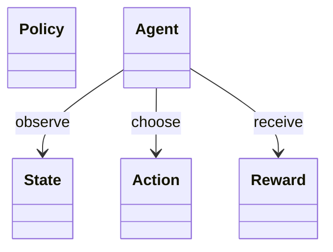
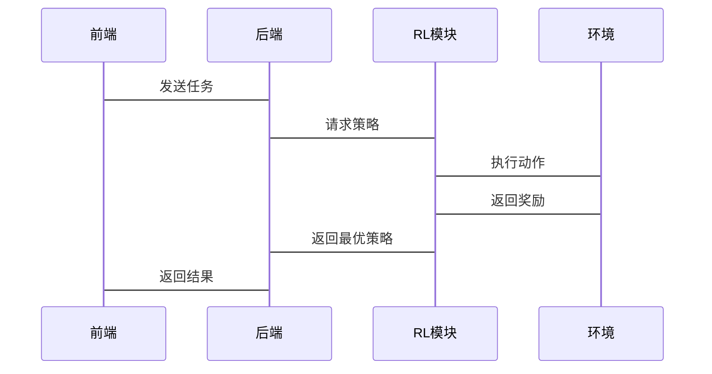

                 


# 强化学习在AI Agent资源调度中的应用

> 关键词：强化学习，AI Agent，资源调度，算法，系统架构

> 摘要：本文详细探讨了强化学习在AI Agent资源调度中的应用，从基础概念到算法实现，再到系统设计和实际案例，全面解析强化学习如何解决资源调度问题。

---

# 第一部分: 强化学习与AI Agent资源调度基础

## 第1章: 强化学习与AI Agent概述

### 1.1 强化学习的基本概念

#### 1.1.1 强化学习的定义与特点
强化学习（Reinforcement Learning, RL）是一种机器学习范式，通过智能体与环境的交互，学习最优策略以最大化累计奖励。其特点包括：
- **环境交互**：智能体通过与环境互动获得经验。
- **奖励驱动**：智能体通过最大化累计奖励来优化策略。
- **策略更新**：通过试错逐步优化动作选择。

#### 1.1.2 AI Agent的基本概念
AI Agent是能够感知环境并采取行动以实现目标的智能体。资源调度中的AI Agent需要高效分配和管理资源。

#### 1.1.3 资源调度的定义与问题描述
资源调度指在有限资源下，合理分配任务以满足需求。核心问题是优化资源利用，减少延迟，降低成本。

### 1.2 强化学习在资源调度中的应用背景

#### 1.2.1 资源调度的核心问题
- 任务分配
- 负载均衡
- 资源分配策略

#### 1.2.2 强化学习在资源调度中的优势
- 自适应优化
- 动态环境应对
- 复杂决策处理

#### 1.2.3 当前资源调度的主要挑战
- 多目标优化
- 动态环境适应
- 策略稳定性

### 1.3 强化学习与资源调度的结合

#### 1.3.1 强化学习在资源调度中的作用
- 动态决策优化
- 策略自主学习

#### 1.3.2 资源调度的强化学习模型框架
- 状态定义
- 动作选择
- 奖励机制

#### 1.3.3 强化学习在资源调度中的应用案例
- 云计算资源分配
- 网络流量管理

### 1.4 本章小结

---

## 第2章: 强化学习的核心概念与算法

### 2.1 强化学习的基本原理

#### 2.1.1 马尔可夫决策过程（MDP）
MDP定义为五元组 $(S, A, P, R, \gamma)$，其中：
- $S$：状态空间
- $A$：动作空间
- $P$：状态转移概率
- $R$：奖励函数
- $\gamma$：折扣因子

#### 2.1.2 状态、动作、奖励的定义
- **状态**：环境当前的状态，如资源使用情况。
- **动作**：智能体可执行的动作，如分配资源。
- **奖励**：对动作的反馈，如完成任务的时间。

#### 2.1.3 策略与价值函数
- **策略**：$\pi(a|s)$，状态$s$下选择动作$a$的概率。
- **价值函数**：$V(s)$，状态$s$的期望收益。

### 2.2 基础强化学习算法

#### 2.2.1 Q-learning算法
Q-learning通过更新Q值表学习最优策略，公式为：
$$ Q(s,a) \leftarrow Q(s,a) + \alpha [r + \gamma \max Q(s',a') - Q(s,a)] $$

#### 2.2.2 Deep Q-Network（DQN）
DQN使用深度神经网络近似Q值函数，通过经验回放和目标网络优化。

#### 2.2.3 Actor-Critic方法
Actor-Critic同时学习策略（Actor）和价值函数（Critic），公式为：
$$ \theta \leftarrow \theta + \alpha (G_t - V(s_t)) \nabla V(s_t) $$

### 2.3 算法比较与选择

#### 2.3.1 算法特点对比
| 算法 | 优点 | 缺点 |
|------|------|------|
| Q-learning | 简单 | 适合小规模问题 |
| DQN | 高维状态 | 训练不稳定 |
| Actor-Critic | 平衡探索与利用 | 复杂度高 |

#### 2.3.2 算法选择原则
- 状态空间大小
- 动作空间类型
- 奖励函数设计

### 2.4 本章小结

---

## 第3章: 强化学习的数学模型与公式

### 3.1 Q-learning的数学模型
Q值更新公式：
$$ Q(s,a) \leftarrow Q(s,a) + \alpha [r + \gamma \max Q(s',a') - Q(s,a)] $$

### 3.2 Actor-Critic的数学模型
策略梯度公式：
$$ \nabla \theta \leftarrow \nabla \log \pi(a|s) \cdot Q(s,a) $$

### 3.3 连续控制的数学模型
最优控制问题：
$$ \min_{u} \int_{0}^{T} (x(t) - x_d)^2 dt $$

### 3.4 本章小结

---

## 第4章: 系统分析与架构设计

### 4.1 系统分析

#### 4.1.1 问题场景
- 多资源节点调度
- 动态任务分配

#### 4.1.2 项目介绍
- 系统目标：优化资源利用率
- 使用场景：云计算资源分配

### 4.2 系统功能设计

#### 4.2.1 领域模型（类图）


#### 4.2.2 系统架构设计（架构图）


#### 4.2.3 系统接口设计（交互序列图）


### 4.3 本章小结

---

## 第5章: 项目实战

### 5.1 环境安装

```bash
pip install gym numpy tensorflow
```

### 5.2 核心实现

```python
class Agent:
    def __init__(self, state_space, action_space):
        self.model = build_model(state_space, action_space)
    
    def act(self, state):
        # 返回动作
        pass
    
    def train(self, state, action, reward, next_state):
        # 更新模型
        pass
```

### 5.3 实验结果

#### 5.3.1 训练曲线
- 收益曲线
- 损失曲线

#### 5.3.2 测试结果
- 资源利用率
- 响应时间

### 5.4 案例分析

#### 5.4.1 算法对比
- DQN vs. Actor-Critic
- 训练效率与稳定性

#### 5.4.2 结果解读
- 策略收敛性
- 环境稳定性

### 5.5 本章小结

---

## 第6章: 优化与扩展

### 6.1 算法优化

#### 6.1.1 超参数调优
- 学习率调整
- 阶乘因子优化

#### 6.1.2 网络结构优化
- 深度网络改进
- 模型压缩技术

### 6.2 实际应用中的注意事项

#### 6.2.1 环境建模
- 简化与复杂化
- 动态变化应对

#### 6.2.2 策略鲁棒性
- 多目标优化
- 稀疏奖励处理

### 6.3 未来研究方向

#### 6.3.1 多智能体协作
- 邀请制调度
- 联合决策优化

#### 6.3.2 分布式强化学习
- 跨区域协作
- 联邦学习

### 6.4 本章小结

---

## 第7章: 总结与展望

### 7.1 总结

### 7.2 未来展望

---

# 作者：AI天才研究院/AI Genius Institute & 禅与计算机程序设计艺术 /Zen And The Art of Computer Programming

---

### 本文内容总结
本文详细探讨了强化学习在AI Agent资源调度中的应用，从基础概念到算法实现，再到系统设计和实际案例，全面解析强化学习如何解决资源调度问题。

