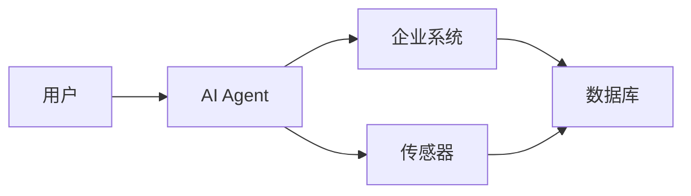
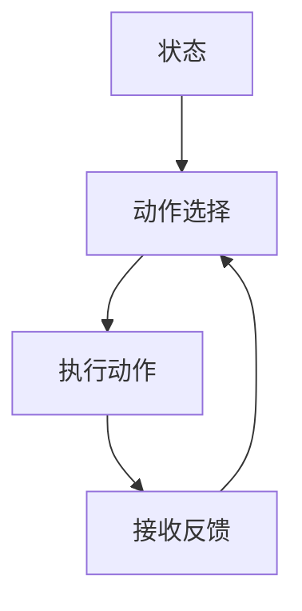
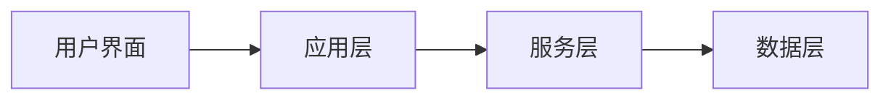
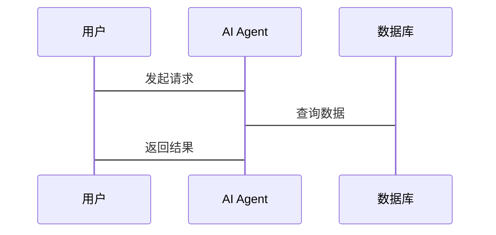

                 


# 成功企业级AI Agent应用案例分析

> 关键词：企业级AI Agent、人工智能、机器学习、系统架构、数字化转型、案例分析

> 摘要：本文详细分析了企业级AI Agent的成功应用案例，探讨了其核心概念、算法原理、系统架构及最佳实践。通过实际案例，揭示了AI Agent在企业中的巨大价值和应用潜力。

---

## 第1章：企业级AI Agent概述

### 1.1 什么是AI Agent
AI Agent，即人工智能代理，是一种能够感知环境、自主决策并执行任务的智能系统。它具备以下基本特征：
- **自主性**：无需外部干预，自主完成任务。
- **反应性**：能实时感知环境变化并做出响应。
- **目标导向**：基于明确的目标采取行动。
- **学习能力**：通过数据和经验优化自身性能。

与传统自动化相比，AI Agent不仅能够执行预设任务，还能根据环境反馈动态调整策略，展现出更强的适应性和智能性。

### 1.2 企业级AI Agent的背景
随着数字化转型的深入推进，企业面临着提高效率、降低成本、优化决策的迫切需求。AI Agent凭借其智能化和自动化能力，成为企业数字化转型的重要工具。其主要应用场景包括：
- **流程自动化**：优化企业内部流程，提升效率。
- **智能客服**：提供24/7的客户支持服务。
- **预测分析**：基于历史数据预测市场趋势和潜在风险。

企业级AI Agent的核心价值在于其能够显著提升企业运营效率，降低成本，并通过智能化决策为企业创造更大价值。

### 1.3 成功案例分析
国内外有许多成功的AI Agent应用案例，例如：
- **案例1：某电商企业的智能客服系统**，通过AI Agent实现自动响应客户咨询，大幅降低了人力成本。
- **案例2：某制造业企业的生产优化系统**，利用AI Agent实时监控生产线，预测并解决潜在故障，提高了生产效率。

通过分析这些案例，我们可以总结出成功的关键因素，包括明确的业务目标、合适的技术选型和持续的数据优化。

---

## 第2章：AI Agent的核心概念与联系

### 2.1 AI Agent的核心原理
AI Agent的工作流程通常包括三个主要模块：
1. **感知模块**：通过传感器或API获取环境数据。
2. **决策模块**：基于感知数据和预设策略做出决策。
3. **执行模块**：根据决策结果执行具体操作。

### 2.2 核心概念对比表
下表对比了不同AI Agent的关键特征：

| 特征            | 企业级AI Agent       | 个人级AI Agent       |
|-----------------|----------------------|----------------------|
| 应用场景         | 企业内部流程优化     | 个人任务自动化       |
| 数据需求         | 高                   | 低                   |
| 复杂度           | 高                   | 低                   |
| 部署环境         | 企业内网             | 个人设备             |

### 2.3 实体关系图
以下是一个简单的实体关系图，展示了AI Agent在企业中的主要交互对象：



---

## 第3章：AI Agent算法原理

### 3.1 基础算法
AI Agent的实现依赖于多种算法，主要包括：
- **监督学习**：通过标记数据训练模型。
- **强化学习**：通过试错机制优化决策策略。
- **无监督学习**：从无标记数据中发现模式。

### 3.2 DQN算法
DQN（Deep Q-Network）是一种常用的强化学习算法，适用于离线训练。其流程如下：



以下是DQN算法的Python代码示例：

```python
class DQN:
    def __init__(self):
        self.model = self.build_model()
        self.memory = []

    def build_model(self):
        # 构建神经网络模型
        pass

    def remember(self, state, action, reward, next_state):
        # 存储经验
        pass

    def act(self, state):
        # 选择动作
        pass

    def replay(self):
        # 回放经验并训练模型
        pass
```

### 3.3 数学模型
DQN算法的核心公式包括：
- **Q-learning公式**：
  $$ Q(s, a) = Q(s, a) + \alpha (r + \max_{a'} Q(s', a') - Q(s, a)) $$
- **目标网络更新公式**：
  $$ \theta_{target} = \theta_{main} + \epsilon $$

---

## 第4章：系统分析与架构设计

### 4.1 问题场景介绍
以某制造企业的生产优化为例，AI Agent需要实时监控生产线状态，预测并解决潜在故障。

### 4.2 功能设计
系统功能模块包括：
- **感知模块**：实时采集设备数据。
- **决策模块**：分析数据并做出优化决策。
- **执行模块**：执行优化指令。

### 4.3 架构设计
以下是系统架构图：



### 4.4 接口设计
系统主要接口包括：
- **API接口**：与其他系统进行数据交互。
- **用户界面**：供用户查看和控制AI Agent。

### 4.5 交互流程
以下是交互流程图：



---

## 第5章：项目实战

### 5.1 环境安装
需要安装以下库：
- Python 3.8+
- TensorFlow 2.0+
- OpenAI API

### 5.2 核心代码实现
以下是AI Agent的核心代码：

```python
import tensorflow as tf
from tensorflow.keras import layers

class AI-Agent:
    def __init__(self):
        self.model = self.build_model()

    def build_model(self):
        model = tf.keras.Sequential([
            layers.Dense(64, activation='relu'),
            layers.Dense(1, activation='sigmoid')
        ])
        return model

    def train(self, states, actions, rewards):
        # 实现训练逻辑
        pass
```

### 5.3 案例分析
以某制造业企业的案例为例，AI Agent通过实时数据分析，优化了生产流程，降低了能耗。

### 5.4 项目小结
项目成功实现了AI Agent在生产优化中的应用，验证了其在企业级环境中的有效性。

---

## 第6章：最佳实践与未来趋势

### 6.1 成功经验总结
成功的AI Agent应用需要：
- 明确的业务目标
- 充足的数据支持
- 持续的优化迭代

### 6.2 未来趋势
未来，AI Agent将更加智能化和自主化，应用场景也将更加广泛。

### 6.3 小结
企业级AI Agent的应用潜力巨大，值得进一步探索和实践。

---

## 附录：拓展阅读

- 推荐书籍：《深度学习》（Ian Goodfellow）
- 推荐工具：TensorFlow、Keras

---

作者：AI天才研究院/AI Genius Institute & 禅与计算机程序设计艺术 /Zen And The Art of Computer Programming

---

通过以上结构，本文详细分析了企业级AI Agent的应用案例，涵盖了从基础概念到实际应用的全过程，为读者提供了全面的知识和实用的指导。

