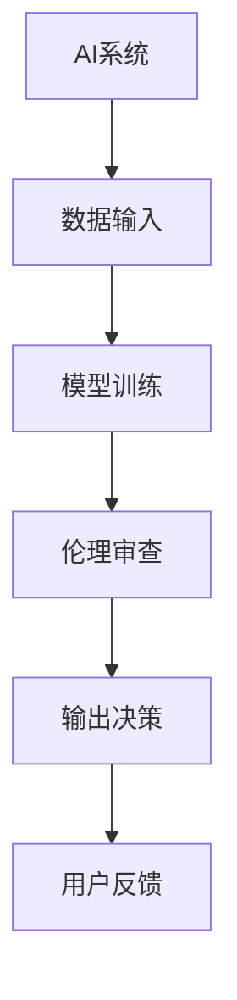
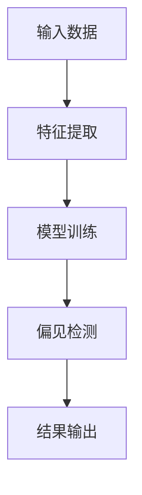
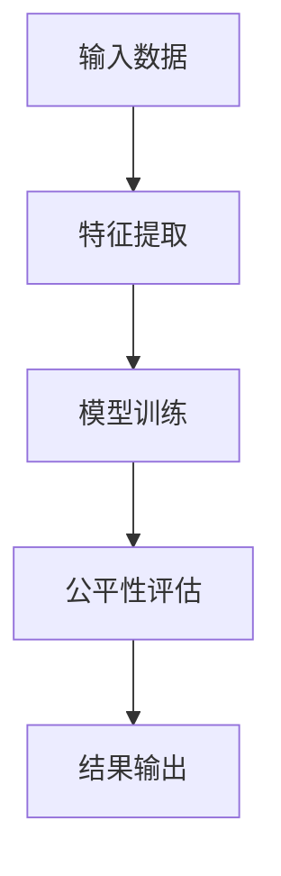
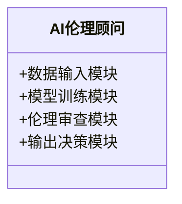
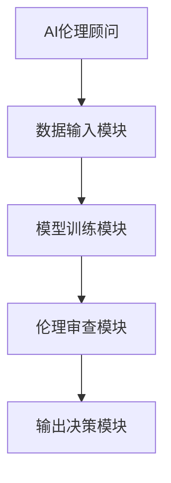
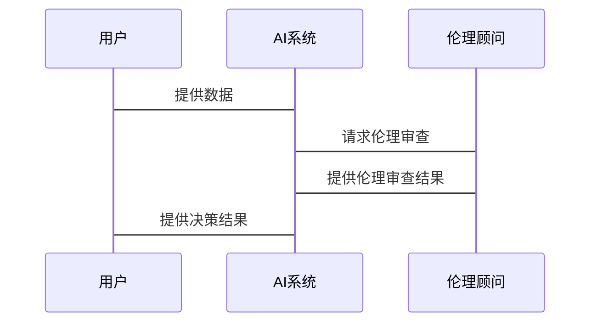

                 


# 构建企业级AI伦理顾问：确保AI应用的道德合规

## 关键词：AI伦理，企业级AI，伦理顾问，道德合规，AI系统设计，伦理审查

## 摘要：随着人工智能技术的快速发展，企业AI应用的伦理问题日益突出。本文旨在探讨如何构建企业级AI伦理顾问，确保AI系统的道德合规。通过分析AI伦理的核心概念、算法原理和系统架构，结合实际案例，提供一份详细的构建指南。

---

# 第1章：AI伦理与企业应用的背景介绍

## 1.1 AI伦理的核心概念

### 1.1.1 问题背景与问题描述

随着AI技术的广泛应用，企业面临越来越多的伦理挑战。例如，数据隐私、算法偏见和透明性等问题，可能导致法律风险和公众信任的丧失。AI伦理顾问的目标是帮助企业识别和解决这些伦理问题，确保AI应用的合规性。

### 1.1.2 AI应用中的伦理问题

- 数据隐私：AI系统可能收集和处理大量个人数据，如何确保数据的安全和隐私？
- 算法公平性：AI算法可能引入偏见，导致不公平的决策。
- 透明性：AI系统的决策过程是否透明，能否被解释？

### 1.1.3 企业级AI伦理顾问的目标与边界

目标：帮助企业在AI开发和应用过程中，识别和解决伦理问题，确保合规性。

边界：AI伦理顾问不直接参与业务决策，而是提供伦理审查和建议。

---

## 1.2 企业AI应用的伦理挑战

### 1.2.1 数据隐私与安全

企业需要确保数据的收集、存储和使用符合相关法律法规。例如，GDPR要求企业明确数据处理的目的，并获得用户同意。

### 1.2.2 AI算法的公平性与偏见

AI算法可能基于训练数据中的偏见，导致不公平的决策。例如，招聘系统可能因为训练数据中的性别偏见，导致女性候选人被不公平地筛选。

### 1.2.3 透明性与可解释性

AI系统的决策过程需要透明，以便用户和监管机构能够理解并信任系统。

---

## 1.3 AI伦理与企业合规的结合

### 1.3.1 伦理框架的构建

企业需要制定伦理框架，明确AI应用的道德标准和合规要求。

### 1.3.2 企业责任与合规要求

企业需要遵守相关法律法规，如GDPR、CCPA等，确保AI应用的合规性。

### 1.3.3 伦理顾问的定位与作用

AI伦理顾问是企业内部的伦理审查机构，负责对AI应用进行伦理评估和建议。

---

## 1.4 本章小结

本章介绍了AI伦理的核心概念和企业AI应用的伦理挑战。企业需要构建伦理框架，确保AI应用的道德合规。AI伦理顾问在其中起到关键作用，帮助企业在AI开发和应用过程中，识别和解决伦理问题。

---

# 第2章：AI伦理顾问的核心概念与联系

## 2.1 核心概念的原理与属性

### 2.1.1 伦理框架的属性对比表

| 属性 | 描述 |
|------|------|
| 适用范围 | 数据隐私、算法公平性等 |
| 评估标准 | 透明性、可解释性、合规性 |
| 实施方式 | 嵌入式伦理审查、事后审计 |

### 2.1.2 AI伦理顾问的实体关系图



---

## 2.2 AI伦理与技术的实体关系图


---

# 第3章：AI伦理顾问的算法原理与数学模型

## 3.1 伦理审查的算法流程

### 3.1.1 偏见检测算法



### 3.1.2 公平性评估算法



## 3.2 偏见检测的数学模型

### 3.2.1 基于概率的偏见检测

$$P(bias) = \frac{count\_positive}{total\_samples}$$

### 3.2.2 基于统计的公平性评估

$$fairness = \frac{TP\_positive - TP\_negative}{TP\_positive + TP\_negative}$$`

---

## 3.3 算法实现的Python代码示例

### 偏见检测代码示例

```python
def detect_bias(data):
    # 数据预处理
    features = preprocess(data)
    # 模型训练
    model = train_model(features)
    # 偏见检测
    bias_score = calculate_bias(model, features)
    return bias_score
```

### 公平性评估代码示例

```python
def assess_fairness(model, test_data):
    # 数据分割
    X_train, X_test, y_train, y_test = split_data(test_data)
    # 模型评估
    fairness_score = evaluate_fairness(model, X_test, y_test)
    return fairness_score
```

---

## 3.4 本章小结

本章详细讲解了AI伦理顾问的算法原理，包括偏见检测和公平性评估的数学模型和代码实现。通过这些算法，企业可以检测和评估AI系统的伦理风险。

---

# 第4章：企业级AI伦理顾问的系统

## 4.1 系统分析与架构设计

### 4.1.1 领域模型设计



### 4.1.2 系统架构设计



### 4.1.3 系统接口设计

- 数据输入接口：接受训练数据和测试数据。
- 模型训练接口：训练AI模型。
- 伦理审查接口：对模型进行伦理审查。
- 输出决策接口：输出模型决策结果。

### 4.1.4 系统交互流程



---

## 4.2 项目实战

### 4.2.1 环境安装

安装必要的Python库，如`numpy`, `scikit-learn`, `mermaid`等。

### 4.2.2 核心实现代码

```python
def main():
    # 数据预处理
    data = load_data()
    features = preprocess(data)
    # 模型训练
    model = train_model(features)
    # 伦理审查
    bias_score = detect_bias(model, features)
    fairness_score = assess_fairness(model, features)
    # 输出结果
    print("偏见分数:", bias_score)
    print("公平性分数:", fairness_score)

if __name__ == "__main__":
    main()
```

### 4.2.3 实际案例分析

例如，分析一个招聘系统中的性别偏见问题，使用AI伦理顾问进行伦理审查和建议。

---

## 4.3 本章小结

本章详细介绍了企业级AI伦理顾问系统的架构设计和项目实战。通过系统化的架构设计和实际案例分析，展示了如何构建和应用AI伦理顾问系统。

---

# 第5章：企业级AI伦理顾问的最佳实践

## 5.1 最佳实践 tips

- 定期进行伦理审查，确保AI系统的合规性。
- 建立跨学科团队，涵盖数据科学家、伦理学家和法律专家。
- 使用开源工具和库，降低开发成本。

## 5.2 小结

企业级AI伦理顾问是确保AI应用道德合规的关键工具。通过构建和应用AI伦理顾问系统，企业可以有效识别和解决AI应用中的伦理问题，提升公众信任和品牌形象。

## 5.3 注意事项

- 确保数据的隐私和安全。
- 定期更新伦理审查标准，适应法律法规的变化。
- 建立用户反馈机制，及时发现和解决伦理问题。

## 5.4 拓展阅读

推荐阅读相关书籍和论文，深入了解AI伦理的理论和实践。

---

# 作者：AI天才研究院 & 禅与计算机程序设计艺术

---

通过以上思考，我逐步构建了文章的目录结构，并详细阐述了每一章的核心内容。希望这篇文章能为您提供有价值的见解和指导。

