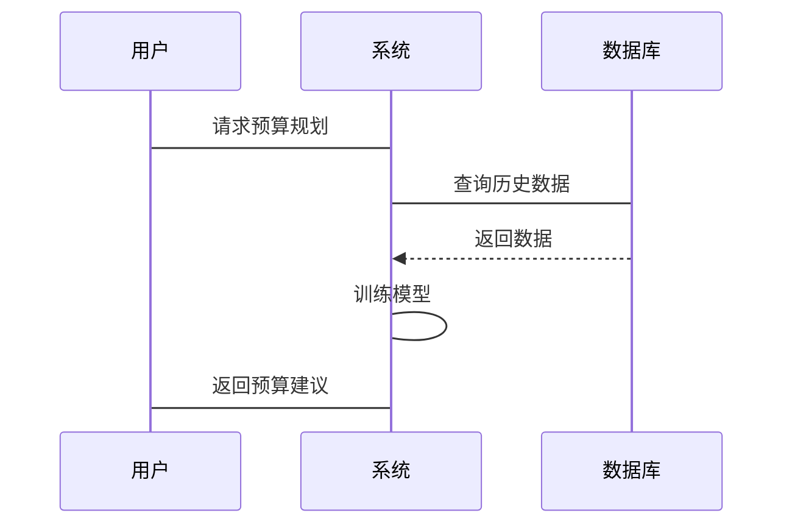

                 


# 构建企业级AI财务顾问：智能预算规划与投资建议

## 关键词
- 企业级AI财务顾问
- 智能预算规划
- 投资建议
- 机器学习
- 系统架构设计
- 数据驱动决策

## 摘要
本文详细探讨了构建企业级AI财务顾问系统的核心技术与实现方案。从背景介绍到核心概念，从算法原理到系统架构设计，从项目实战到最佳实践，全面解析如何利用人工智能技术实现智能预算规划与投资建议。本文适合财务总监、IT架构师、数据科学家及企业管理人员阅读，旨在为企业级AI财务系统的构建提供理论支持与实践指导。

---

## 第一部分: 企业级AI财务顾问概述

## 第1章: AI财务顾问的背景与价值

### 1.1 企业级AI财务顾问的背景
#### 1.1.1 传统财务顾问的局限性
传统财务顾问依赖人工分析，存在效率低、主观性强、难以处理大规模数据等问题。企业财务部门需要更高效、更精准的工具来支持决策。

#### 1.1.2 AI技术在财务领域的应用潜力
AI技术（如机器学习、自然语言处理）在财务数据分析、预测和决策支持方面展现出巨大潜力，能够帮助财务顾问提高效率和准确性。

#### 1.1.3 企业级AI财务顾问的核心价值
企业级AI财务顾问通过自动化分析和预测，提供实时、精准的预算规划和投资建议，帮助企业优化资源配置、降低风险、提升盈利能力。

### 1.2 问题背景与描述
#### 1.2.1 企业财务规划中的常见问题
企业在预算制定和执行过程中常面临数据不全、预测不准、资源分配不合理等问题，影响企业财务健康。

#### 1.2.2 投资决策中的关键挑战
投资决策需要考虑市场波动、经济周期等多种因素，传统方法难以实时动态调整，容易导致决策失误。

#### 1.2.3 传统财务模型的局限性
传统财务模型依赖历史数据和假设，难以应对复杂多变的市场环境，且模型更新和维护成本较高。

### 1.3 问题解决与边界
#### 1.3.1 AI技术如何解决财务问题
AI技术通过大数据分析、机器学习算法和自然语言处理，帮助财务顾问快速获取信息、分析数据、预测趋势，提供科学决策支持。

#### 1.3.2 企业级AI财务顾问的边界与外延
AI财务顾问主要聚焦于预算规划和投资建议，不涉及企业的具体业务操作，但可以与其他企业系统（如ERP）集成，提供更全面的财务支持。

#### 1.3.3 核心概念与要素组成
企业级AI财务顾问系统的核心要素包括：数据采集、数据分析、模型构建、用户交互和结果输出。

---

## 第2章: 智能预算规划与投资建议的核心概念

### 2.1 核心概念与原理
#### 2.1.1 智能预算规划的定义与特点
智能预算规划是基于AI技术的预算制定和优化过程，具有实时性、动态性和精准性的特点。

#### 2.1.2 投资建议的生成机制
投资建议是基于市场数据、财务指标和风险评估生成的，具有个性化和动态调整的特点。

#### 2.1.3 AI模型在财务分析中的应用
AI模型通过分析历史数据和市场趋势，预测未来财务表现，为预算规划和投资决策提供支持。

### 2.2 核心概念对比分析
#### 2.2.1 智能预算规划与传统预算规划对比
| 特性            | 智能预算规划          | 传统预算规划          |
|-----------------|----------------------|----------------------|
| 数据来源        | 结构化与非结构化数据 | 主要依赖历史数据      |
| 分析效率        | 高效实时            | 低效滞后            |
| 预测准确性      | 更高                 | 较低                 |

#### 2.2.2 投资建议与传统投资分析对比
| 特性            | AI投资建议          | 传统投资分析          |
|-----------------|----------------------|----------------------|
| 分析速度        | 实时快速            | 需要人工分析          |
| 数据处理能力  | 处理海量数据        | 数据量有限            |
| 预测能力        | 更精准               | 较依赖经验            |

#### 2.2.3 数据驱动决策与经验驱动决策对比
| 特性            | 数据驱动决策        | 经验驱动决策          |
|-----------------|----------------------|----------------------|
| 依据            | 数据分析            | 专家经验              |
| 适用场景        | 大数据环境          | 数据有限或不完整      |
| 可靠性          | 较高                 | 较低                 |

### 2.3 系统架构与ER关系图
#### 2.3.1 系统实体关系图（Mermaid）


---

## 第3章: 智能预算规划的算法原理

### 3.1 算法原理概述
#### 3.1.1 基于机器学习的预算预测
使用回归算法（如线性回归、随机森林）预测未来收入和支出，帮助制定预算计划。

#### 3.1.2 时间序列分析
利用ARIMA模型或LSTM网络分析历史数据，预测未来财务表现。

#### 3.1.3 数据预处理与特征工程
对原始数据进行清洗、归一化和特征提取，为模型训练提供高质量数据。

### 3.2 算法实现与代码示例
#### 3.2.1 使用Python实现线性回归模型
```python
import numpy as np
from sklearn.linear_model import LinearRegression

# 示例数据
X = np.array([[1], [2], [3], [4], [5]])
y = np.array([2, 4, 5, 4, 6])

# 训练模型
model = LinearRegression()
model.fit(X, y)

# 预测
print(model.predict([[6]]))  # 输出：[[7.4]]
```

#### 3.2.2 机器学习算法的数学模型
线性回归的数学模型为：
$$y = mx + b$$
其中，$m$ 是斜率，$b$ 是截距。

---

## 第4章: 投资建议生成的算法原理

### 4.1 基于深度学习的投资分析
使用LSTM网络分析股票价格走势，生成投资建议。

### 4.2 风险评估与优化
通过蒙特卡洛模拟评估投资组合的风险，并优化投资组合。

### 4.3 算法实现与代码示例
#### 4.3.1 使用Keras实现LSTM模型
```python
import numpy as np
from keras.models import Sequential
from keras.layers import LSTM, Dense

# 示例数据
X_train = np.random.randn(100, 1, 1)
y_train = np.random.randn(100, 1)

# 模型构建
model = Sequential()
model.add(LSTM(64, input_shape=(1, 1)))
model.add(Dense(1))
model.compile(loss='mean_squared_error', optimizer='adam')

# 训练
model.fit(X_train, y_train, epochs=10, batch_size=32)
```

---

## 第5章: 系统分析与架构设计方案

### 5.1 问题场景介绍
企业财务部门需要实时监控财务数据，快速生成预算和投资建议。

### 5.2 系统功能设计
#### 5.2.1 用户管理
- 用户注册与登录
- 权限管理

#### 5.2.2 数据录入
- 财务数据上传
- 数据清洗与预处理

#### 5.2.3 预算分析
- 收入预测
- 支出预测
- 预算调整

#### 5.2.4 投资建议生成
- 市场趋势分析
- 投资组合优化
- 风险评估

### 5.3 系统架构设计
#### 5.3.1 分层架构
- 数据层：负责数据的存储与管理
- 业务逻辑层：负责数据处理与模型计算
- 表现层：负责用户交互与结果展示

#### 5.3.2 接口设计
- API接口：供其他系统调用
- 数据接口：与企业ERP系统对接

#### 5.3.3 交互流程图（Mermaid）


---

## 第6章: 项目实战

### 6.1 环境安装
- 安装Python、TensorFlow、Keras等工具

### 6.2 核心代码实现
#### 6.2.1 数据预处理
```python
import pandas as pd
from sklearn.preprocessing import StandardScaler

data = pd.read_csv('financial_data.csv')
scaler = StandardScaler()
scaled_data = scaler.fit_transform(data)
```

#### 6.2.2 模型训练与预测
```python
from sklearn.ensemble import RandomForestRegressor

model = RandomForestRegressor(n_estimators=100)
model.fit(scaled_data[:, :-1], scaled_data[:, -1])
```

### 6.3 实际案例分析
以某公司为例，展示如何利用AI财务顾问系统进行预算规划和投资建议。

---

## 第7章: 最佳实践与小结

### 7.1 小结
企业级AI财务顾问系统通过AI技术提升财务规划和投资决策的效率与准确性，为企业创造价值。

### 7.2 注意事项
- 数据质量是关键
- 模型需要持续优化
- 注意数据隐私和安全

### 7.3 拓展阅读
推荐相关书籍和论文，进一步深入学习AI在财务领域的应用。

---

## 作者：AI天才研究院/AI Genius Institute & 禅与计算机程序设计艺术 /Zen And The Art of Computer Programming

---

以上是文章的详细大纲和内容，希望对您有所帮助！

