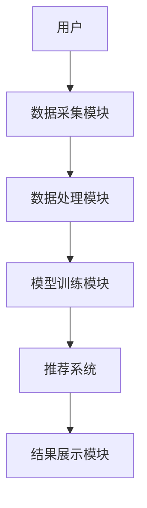

                 


# 零售业AI Agent：个性化推荐与客户洞察

> 关键词：零售业、AI Agent、个性化推荐、客户洞察、人工智能、深度学习、协同过滤

> 摘要：本文深入探讨了AI Agent在零售业中的应用，特别是个性化推荐和客户洞察方面。通过详细分析AI Agent的核心概念、算法原理、系统架构及项目实战，本文为零售业的数字化转型提供了理论支持和实践指导。从背景介绍到系统实现，再到案例分析，本文为读者全面解读了如何利用AI技术提升零售业的竞争力。

---

## 第一章：零售业AI Agent的背景与现状

### 1.1 零售业的数字化转型

#### 1.1.1 零售业的定义与特点
零售业是指直接向最终消费者销售商品或服务的行业。其特点包括：
- 面向最终消费者
- 销售商品或服务
- 强调客户体验
- 需要快速响应市场变化

#### 1.1.2 数字化转型对零售业的影响
随着互联网和人工智能技术的发展，零售业正在经历从传统模式向数字化模式的转变。这种转型带来了以下变化：
- 数据驱动的决策
- 个性化服务的普及
- 供应链效率的提升
- 客户体验的优化

#### 1.1.3 AI Agent在零售业中的应用现状
AI Agent（智能代理）通过自动化决策和个性化推荐，正在改变零售业的游戏规则。目前的应用包括：
- 智能推荐系统
- 客户行为分析
- 库存优化
- 营销自动化

---

### 1.2 AI Agent在零售业中的作用

#### 1.2.1 AI Agent的定义与特点
AI Agent是一种能够感知环境、自主决策并执行任务的智能系统。其特点包括：
- 智能性：能够理解和分析数据
- 自主性：无需人工干预
- 反应性：能够实时响应变化
- 学习性：能够通过数据优化自身

#### 1.2.2 AI Agent在零售业中的应用场景
- **个性化推荐**：通过分析用户行为和偏好，提供个性化的产品推荐。
- **客户洞察**：通过数据挖掘和分析，深入了解客户的需求和行为。
- **库存管理**：通过预测销售趋势，优化库存配置。
- **营销自动化**：通过自动化营销策略，提升客户转化率。

#### 1.2.3 AI Agent与传统推荐系统的区别
| 特性                | AI Agent推荐系统 | 传统推荐系统 |
|---------------------|------------------|--------------|
| 数据来源            | 结构化与非结构化数据 | 主要依赖结构化数据 |
| 决策能力            | 自主决策          | 需要人工干预 |
| 学习能力            | 能够自适应优化    | 需要手动调整 |
| 适用场景            | 复杂场景          | 简单场景      |

---

### 1.3 个性化推荐与客户洞察的重要性

#### 1.3.1 个性化推荐的定义与特点
个性化推荐是根据用户的偏好和行为，提供定制化的产品或服务推荐。其特点包括：
- 高度针对性
- 提升客户满意度
- 增加销售额

#### 1.3.2 客户洞察的定义与方法
客户洞察是对客户行为、偏好和需求的深入分析。常用方法包括：
- 数据挖掘
- 统计分析
- 机器学习

#### 1.3.3 个性化推荐与客户洞察的结合
通过结合个性化推荐和客户洞察，零售业可以实现：
- 更精准的客户定位
- 更高效的营销策略
- 更高的客户忠诚度

---

## 第二章：零售业AI Agent的核心概念

### 2.1 AI Agent的核心原理

#### 2.1.1 数据采集与处理
AI Agent需要从多种渠道采集数据，包括：
- 用户行为数据
- 销售数据
- 市场数据

数据处理步骤包括：
1. 数据清洗：去除无效数据
2. 数据转换：将数据转换为适合分析的形式
3. 数据存储：将数据存储在数据库中

#### 2.1.2 数据分析与挖掘
通过数据分析和挖掘，AI Agent能够发现数据中的模式和趋势。常用技术包括：
- 描述性分析：总结数据的基本特征
- 预测性分析：预测未来趋势
- 对比性分析：比较不同数据集的差异

#### 2.1.3 智能决策与执行
AI Agent通过分析数据，生成决策并执行任务。例如：
- 自动调整价格
- 自动推荐产品
- 自动优化库存

---

### 2.2 个性化推荐算法

#### 2.2.1 协同过滤算法
协同过滤是一种基于用户行为的推荐算法。分为两种类型：
1. **基于用户的协同过滤**：通过寻找与当前用户行为相似的用户，推荐他们喜欢的产品。
2. **基于物品的协同过滤**：通过分析用户对物品的偏好，推荐相似的物品。

#### 2.2.2 基于内容的推荐算法
基于内容的推荐算法通过分析产品的属性，推荐与当前产品相似的产品。例如：
- 推荐同一类别的产品
- 推荐相似特征的产品

#### 2.2.3 混合推荐算法
混合推荐算法结合了协同过滤和基于内容的推荐算法。例如：
- 使用协同过滤找到相似用户，再基于内容推荐具体产品。

---

### 2.3 客户洞察的实现方法

#### 2.3.1 客户画像的构建
客户画像是通过数据分析构建的客户形象。构建步骤包括：
1. 数据采集：收集客户的基本信息和行为数据
2. 数据分析：通过聚类分析等技术，将客户分成不同的群体
3. 画像绘制：根据分析结果，绘制客户画像

#### 2.3.2 客户行为分析
客户行为分析是对客户在不同阶段的行为进行分析。例如：
- 客户在浏览商品时的行为
- 客户在下单时的行为
- 客户在支付时的行为

#### 2.3.3 客户分群与细分
客户分群是将客户分成不同的群体，以便进行针对性的营销。例如：
- 根据消费金额分群
- 根据购买频率分群
- 根据购买偏好分群

---

## 第三章：零售业AI Agent的算法原理

### 3.1 协同过滤算法

#### 3.1.1 基于用户的协同过滤
基于用户的协同过滤算法通过寻找与当前用户相似的用户，推荐他们喜欢的产品。数学公式如下：
$$ sim(u, v) = \frac{\sum_{i=1}^{n} (r_{u,i} - \bar{r}_u)(r_{v,i} - \bar{r}_v)}{\sqrt{\sum_{i=1}^{n} (r_{u,i} - \bar{r}_u)^2} \cdot \sqrt{\sum_{i=1}^{n} (r_{v,i} - \bar{r}_v)^2}} $$
其中，$sim(u, v)$ 表示用户 $u$ 和用户 $v$ 的相似度，$\bar{r}_u$ 表示用户 $u$ 的平均评分。

---

### 3.2 基于深度学习的推荐算法

#### 3.2.1 矩阵分解
矩阵分解是一种常用的推荐算法。其核心思想是将用户-物品评分矩阵分解为两个低维矩阵。数学公式如下：
$$ R = P \cdot Q^T $$
其中，$R$ 是用户-物品评分矩阵，$P$ 是用户特征矩阵，$Q$ 是物品特征矩阵。

#### 3.2.2 自然语言处理在推荐中的应用
自然语言处理（NLP）可以用于分析产品的描述文本，提取关键词并生成推荐。例如，使用Word2Vec对产品描述进行嵌入表示。

#### 3.2.3 图神经网络在推荐中的应用
图神经网络通过构建用户-物品交互图，利用图结构信息进行推荐。例如，使用Graph Convolutional Network（GCN）进行推荐。

---

## 第四章：零售业AI Agent的系统设计与实现

### 4.1 系统架构设计

#### 4.1.1 系统功能设计
系统功能包括：
1. 数据采集与处理
2. 模型训练与优化
3. 系统实现与测试

#### 4.1.2 系统架构图


#### 4.1.3 系统接口设计
系统接口包括：
1. 数据接口：与数据库交互
2. 用户接口：与前端交互
3. 第三方接口：与支付平台等第三方服务交互

---

### 4.2 项目实战

#### 4.2.1 环境安装
需要安装的环境包括：
- Python 3.8+
- TensorFlow 2.0+
- Scikit-learn 0.20+

#### 4.2.2 核心实现代码
以下是协同过滤算法的实现代码：
```python
def user_based_collaborative_filtering(user_id, data):
    # 计算用户相似度
    similarities = {}
    for user in data:
        if user != user_id:
            similarity = calculate_similarity(user_id, user, data)
            similarities[user] = similarity
    # 找出最相似的用户
    similar_users = sorted(similarities.items(), key=lambda x: -x[1])
    # 推荐产品
    recommendations = []
    for user in similar_users:
        for product in data[user]:
            if product not in recommendations:
                recommendations.append(product)
    return recommendations
```

---

## 第五章：零售业AI Agent的案例分析与总结

### 5.1 案例分析
通过一个实际的零售场景案例，分析AI Agent在个性化推荐和客户洞察中的应用。例如：
- 某电商公司通过AI Agent技术，实现了个性化推荐和客户分群，显著提升了销售额和客户满意度。

### 5.2 总结与展望
- **总结**：AI Agent在零售业中的应用前景广阔，能够显著提升企业的竞争力。
- **展望**：未来，随着技术的不断发展，AI Agent在零售业中的应用将更加智能化和个性化。

---

## 作者：AI天才研究院/AI Genius Institute & 禅与计算机程序设计艺术 /Zen And The Art of Computer Programming

