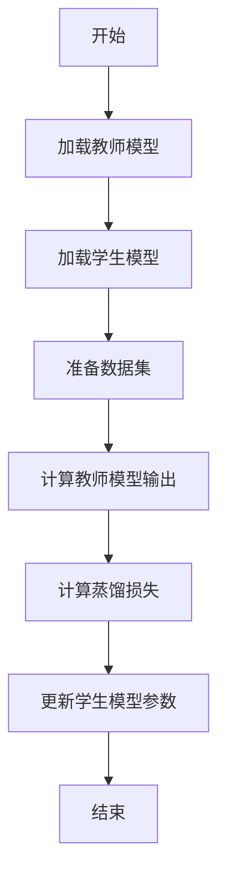
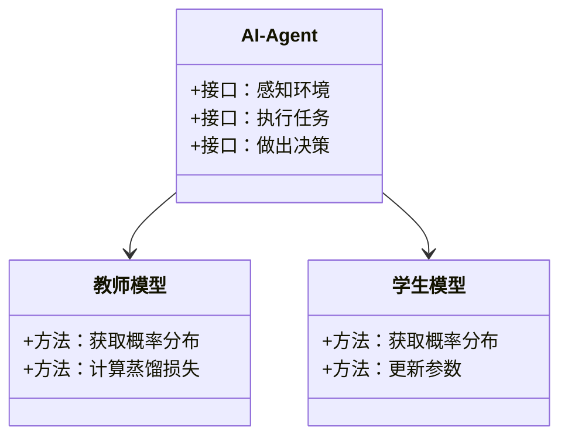

                 


# AI Agent 的知识蒸馏：从大型 LLM 到轻量级模型

> **关键词：** 知识蒸馏，AI Agent，大型语言模型，轻量级模型，模型压缩

> **摘要：**  
> 本文深入探讨了AI Agent中知识蒸馏技术的核心原理、实现方法及其在从大型语言模型（LLM）到轻量级模型的应用。文章首先介绍了知识蒸馏的基本概念和背景，接着分析了知识蒸馏的核心原理和算法实现，包括教师模型与学生模型的交互、蒸馏损失函数的计算等。随后，文章从系统架构和项目实战的角度，详细讲解了如何将知识蒸馏技术应用于AI Agent的开发中，并通过具体案例分析了其在实际场景中的应用效果。最后，本文总结了知识蒸馏的优势与挑战，并展望了其未来的发展方向。

---

# 第一部分: 知识蒸馏概述

## 第1章: 知识蒸馏的概念与背景

### 1.1 什么是知识蒸馏
知识蒸馏是一种将大型模型（如大型语言模型）的知识迁移到更小、更轻量级模型的技术。通过蒸馏过程，学生模型可以继承教师模型的特征和能力，同时保持较小的模型规模和较低的计算成本。

### 1.2 知识蒸馏的背景与意义
随着深度学习模型的不断发展，大型语言模型（如GPT-3、GPT-4）在自然语言处理领域展现出强大的能力。然而，这些模型通常参数量巨大、计算资源消耗高，难以在资源受限的环境中（如移动设备、边缘计算设备）实时部署和运行。

知识蒸馏技术为解决这一问题提供了有效的途径。通过蒸馏，可以将大型模型的知识迁移到轻量级模型中，使其在资源受限的环境中依然能够保持较高的性能。

### 1.3 AI Agent 的基本概念
AI Agent是一种能够感知环境、执行任务并做出决策的智能体。它可以理解为一个具备自主性、反应性、目标导向的智能系统，广泛应用于自然语言处理、机器人控制、推荐系统等领域。

### 1.4 知识蒸馏在AI Agent中的应用
在AI Agent中，知识蒸馏主要用于将大型语言模型的知识迁移到轻量级模型中。这种技术可以帮助AI Agent在资源受限的环境中高效运行，同时保持较高的任务执行能力。

---

## 第2章: 知识蒸馏的核心概念与原理

### 2.1 知识蒸馏的核心原理
知识蒸馏的核心思想是通过教师模型（大型模型）指导学生模型（轻量级模型）学习。教师模型提供概率分布的指导，学生模型通过模仿教师模型的输出来学习。

### 2.2 知识蒸馏的关键技术
- **教师模型与学生模型：** 教师模型通常是一个预训练的大型模型，而学生模型是一个参数较少的轻量级模型。
- **蒸馏过程：** 通过优化蒸馏损失函数，使学生模型的输出概率分布尽可能接近教师模型的输出概率分布。

### 2.3 知识蒸馏的实现步骤
1. **准备数据集：** 选择一个适合目标任务的数据集。
2. **选择教师模型和学生模型：** 教师模型通常是一个已经训练好的大型模型，学生模型是一个轻量级模型。
3. **计算蒸馏损失：** 根据教师模型和学生模型的输出，计算蒸馏损失。
4. **优化学生模型：** 使用蒸馏损失对学生模型进行优化。

### 2.4 知识蒸馏的数学公式
蒸馏损失函数通常基于KL散度（Kullback-Leibler divergence）计算，公式如下：
$$
\text{KL}(P||Q) = \sum_{i} P(i) \log \frac{P(i)}{Q(i)}
$$
其中，$P$ 是教师模型的输出概率分布，$Q$ 是学生模型的输出概率分布。

---

## 第3章: 知识蒸馏的算法实现

### 3.1 知识蒸馏的算法流程图
以下是一个简单的知识蒸馏算法流程图（使用Mermaid表示）：


### 3.2 知识蒸馏的Python实现示例
以下是一个简单的知识蒸馏实现示例（使用PyTorch）：
```python
import torch
import torch.nn as nn
import torch.optim as optim

# 定义教师模型和学生模型
class TeacherModel(nn.Module):
    def __init__(self):
        super(TeacherModel, self).__init__()
        self.fc = nn.Linear(10, 5)

    def forward(self, x):
        return self.fc(x)

class StudentModel(nn.Module):
    def __init__(self):
        super(StudentModel, self).__init__()
        self.fc = nn.Linear(10, 5)

    def forward(self, x):
        return self.fc(x)

# 加载教师模型和学生模型
teacher_model = TeacherModel()
student_model = StudentModel()

# 定义蒸馏损失函数
def distillation_loss(teacher_logits, student_logits, temperature):
    teacher_probs = torch.softmax(teacher_logits / temperature, dim=1)
    student_probs = torch.softmax(student_logits / temperature, dim=1)
    loss = torch.sum(teacher_probs * torch.log(teacher_probs / student_probs))
    return loss

# 定义优化器
optimizer = optim.SGD(student_model.parameters(), lr=0.01)

# 训练过程
for epoch in range(100):
    # 前向传播
    teacher_output = teacher_model(inputs)
    student_output = student_model(inputs)
    # 计算蒸馏损失
    loss = distillation_loss(teacher_output, student_output, temperature=2)
    # 反向传播和优化
    optimizer.zero_grad()
    loss.backward()
    optimizer.step()
```

---

## 第4章: 系统分析与架构设计

### 4.1 AI Agent 的系统架构
以下是一个AI Agent的系统架构图（使用Mermaid表示）：


### 4.2 知识蒸馏的系统实现
1. **数据准备：** 选择适合目标任务的数据集。
2. **模型选择：** 选择一个合适的教师模型和学生模型。
3. **蒸馏过程：** 通过优化蒸馏损失函数，使学生模型的输出概率分布尽可能接近教师模型的输出概率分布。

---

## 第5章: 项目实战

### 5.1 环境安装
要运行以下代码，需要安装以下库：
```bash
pip install torch
pip install mermaid
```

### 5.2 代码实现
以下是一个简单的知识蒸馏实现示例（使用PyTorch）：
```python
import torch
import torch.nn as nn
import torch.optim as optim

# 定义教师模型和学生模型
class TeacherModel(nn.Module):
    def __init__(self):
        super(TeacherModel, self).__init__()
        self.fc = nn.Linear(10, 5)

    def forward(self, x):
        return self.fc(x)

class StudentModel(nn.Module):
    def __init__(self):
        super(StudentModel, self).__init__()
        self.fc = nn.Linear(10, 5)

    def forward(self, x):
        return self.fc(x)

# 加载教师模型和学生模型
teacher_model = TeacherModel()
student_model = StudentModel()

# 定义蒸馏损失函数
def distillation_loss(teacher_logits, student_logits, temperature):
    teacher_probs = torch.softmax(teacher_logits / temperature, dim=1)
    student_probs = torch.softmax(student_logits / temperature, dim=1)
    loss = torch.sum(teacher_probs * torch.log(teacher_probs / student_probs))
    return loss

# 定义优化器
optimizer = optim.SGD(student_model.parameters(), lr=0.01)

# 训练过程
for epoch in range(100):
    # 前向传播
    teacher_output = teacher_model(inputs)
    student_output = student_model(inputs)
    # 计算蒸馏损失
    loss = distillation_loss(teacher_output, student_output, temperature=2)
    # 反向传播和优化
    optimizer.zero_grad()
    loss.backward()
    optimizer.step()
```

### 5.3 案例分析
假设我们有一个分类任务，目标是将图像分类为5个类别。教师模型是一个大型卷积神经网络（CNN），而学生模型是一个轻量级的CNN。通过知识蒸馏，学生模型可以在保持较低计算成本的同时，达到与教师模型相当的分类性能。

---

## 第6章: 总结与展望

### 6.1 本章小结
知识蒸馏是一种有效的技术，可以将大型语言模型的知识迁移到轻量级模型中。通过蒸馏过程，学生模型可以在保持较小的模型规模和较低的计算成本的同时，继承教师模型的特征和能力。

### 6.2 知识蒸馏的优势与挑战
- **优势：** 知识蒸馏可以显著降低模型的计算成本，同时保持较高的任务执行能力。
- **挑战：** 知识蒸馏的效果依赖于教师模型的质量和蒸馏过程的优化。

### 6.3 未来的发展方向
未来，知识蒸馏技术可能会在以下几个方面取得进一步的发展：
1. **多任务蒸馏：** 研究如何将多个任务的知识迁移到单一模型中。
2. **自适应蒸馏：** 研究如何根据任务需求自适应地选择蒸馏策略。
3. **模型压缩：** 研究如何进一步压缩模型规模，同时保持较高的性能。

---

# 作者：AI天才研究院/AI Genius Institute & 禅与计算机程序设计艺术 /Zen And The Art of Computer Programming

---

### **最佳实践 tips**
- 在实际应用中，建议先选择一个合适的教师模型和学生模型。
- 确保数据质量，选择适合目标任务的数据集。
- 通过实验验证蒸馏过程的效果，逐步优化蒸馏温度和其他超参数。

通过本文的详细讲解，读者可以深入了解知识蒸馏的核心原理和实现方法，并将其应用到实际的AI Agent开发中。

