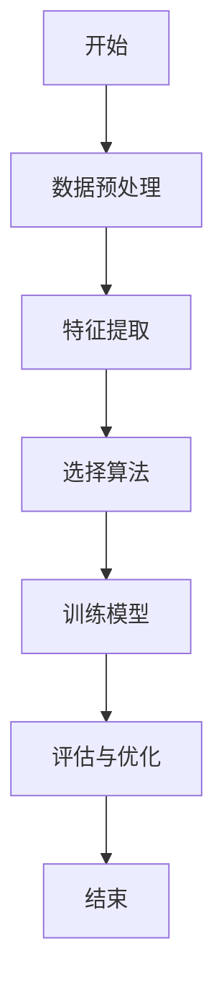
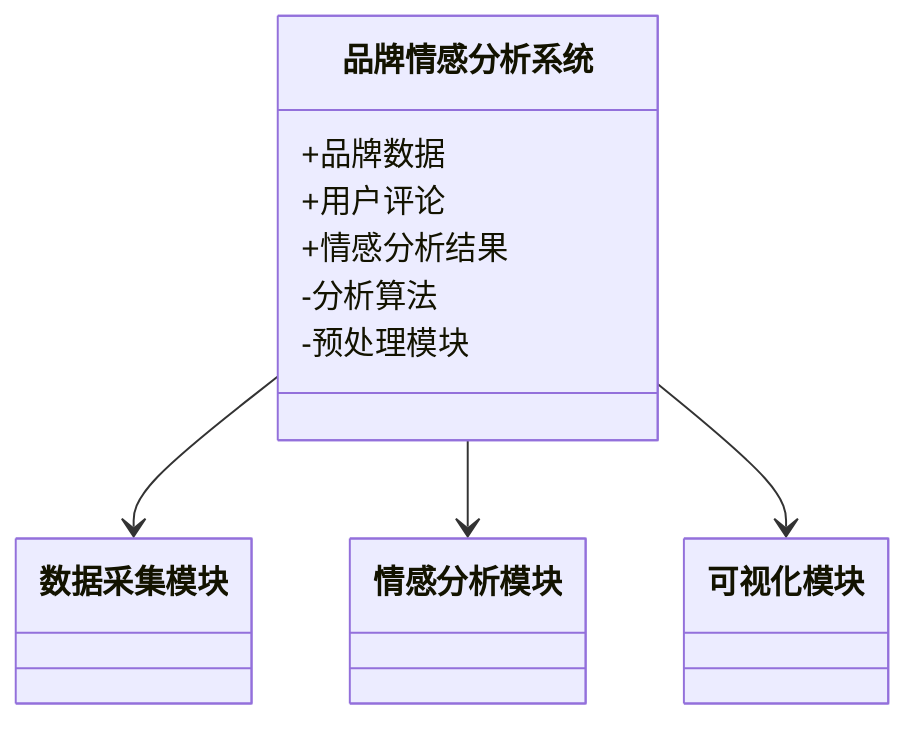
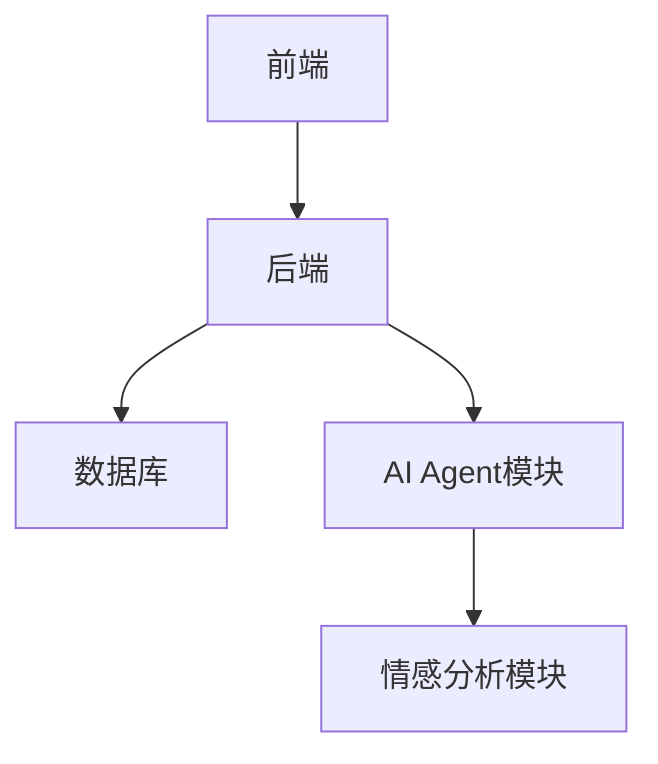
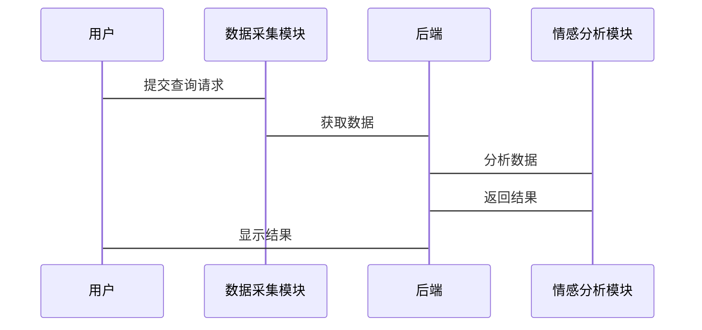

                 


# AI Agent在企业品牌情感分析与管理中的应用

## 关键词：AI Agent，情感分析，企业品牌，自然语言处理，机器学习，数据挖掘

## 摘要：AI Agent（人工智能代理）在企业品牌情感分析与管理中的应用，结合自然语言处理和机器学习技术，帮助企业实时监控和管理品牌声誉。本文详细探讨了AI Agent的核心概念、情感分析的算法原理、系统架构设计以及实际项目案例，为企业提供有效的解决方案和实施建议。

---

# 目录

1. [背景介绍](#背景介绍)
   1.1 [AI Agent的基本概念](#ai-agent的基本概念)
   1.2 [情感分析的基本概念](#情感分析的基本概念)
   1.3 [AI Agent在企业品牌管理中的应用](#ai-agent在企业品牌管理中的应用)

2. [核心概念与联系](#核心概念与联系)
   2.1 [AI Agent与情感分析的核心原理](#ai-agent与情感分析的核心原理)
   2.2 [概念属性特征对比分析](#概念属性特征对比分析)
   2.3 [ER实体关系图](#er实体关系图)

3. [算法原理](#算法原理)
   3.1 [常见的情感分析算法](#常见的情感分析算法)
   3.2 [基于AI Agent的情感分析算法](#基于ai-agent的情感分析算法)
   3.3 [算法步骤与流程图](#算法步骤与流程图)
   3.4 [Python代码实现](#python代码实现)
   3.5 [数学模型与公式](#数学模型与公式)

4. [系统分析与架构设计](#系统分析与架构设计)
   4.1 [问题场景介绍](#问题场景介绍)
   4.2 [系统功能模块设计](#系统功能模块设计)
   4.3 [领域模型设计](#领域模型设计)
   4.4 [系统架构设计](#系统架构设计)
   4.5 [系统接口设计](#系统接口设计)
   4.6 [系统交互流程图](#系统交互流程图)

5. [项目实战](#项目实战)
   5.1 [环境安装与配置](#环境安装与配置)
   5.2 [系统核心实现](#系统核心实现)
   5.3 [代码解读与分析](#代码解读与分析)
   5.4 [实际案例分析](#实际案例分析)
   5.5 [项目总结](#项目总结)

6. [最佳实践与总结](#最佳实践与总结)
   6.1 [实际应用中的建议](#实际应用中的建议)
   6.2 [注意事项与问题解答](#注意事项与问题解答)
   6.3 [未来拓展方向](#未来拓展方向)

---

# 正文

## 1. 背景介绍

### 1.1 AI Agent的基本概念

AI Agent（人工智能代理）是一种能够感知环境、自主决策并执行任务的智能体。它能够通过传感器接收信息，利用计算能力处理数据，并通过执行器与环境交互。AI Agent的核心特点包括自主性、反应性、目标导向性和社交能力。

### 1.2 情感分析的基本概念

情感分析是自然语言处理中的一个分支，旨在识别和理解文本中的情感倾向。它广泛应用于社交媒体监控、客户反馈分析和品牌声誉管理等领域。情感分析的目标是将文本分类为积极、消极或中性。

### 1.3 AI Agent在企业品牌管理中的应用

企业品牌管理中的常见问题包括品牌声誉监控、客户情感分析和竞争对手分析。AI Agent可以通过实时数据处理、情感分析和预测模型帮助企业解决这些问题，提升品牌管理效率。

---

## 2. 核心概念与联系

### 2.1 AI Agent与情感分析的核心原理

AI Agent通过自然语言处理技术，从文本中提取情感信息，结合上下文进行情感分析，从而帮助企业进行品牌管理。

### 2.2 概念属性特征对比分析

| 概念       | 属性1 | 属性2 | 属性3 |
|------------|-------|-------|-------|
| AI Agent   | 自主性 | 反应性 | 目标导向性 |
| 情感分析   | 文本预处理 | 特征提取 | 情感分类 |

### 2.3 ER实体关系图

```mermaid
er
  entity 品牌 (id, 名称, 类型)
  entity 情感 (id, 类型, 强度)
  entity 用户 (id, 名称, 情感)
  relation 品牌-情感 (关联关系)
  relation 用户-情感 (关联关系)
```

---

## 3. 算法原理

### 3.1 常见的情感分析算法

#### 3.1.1 朴素贝叶斯算法

朴素贝叶斯是一种基于概率的分类算法，常用于文本分类。其数学模型如下：

$$ P(y|x) = \frac{P(x|y)P(y)}{P(x)} $$

#### 3.1.2 支持向量机（SVM）

SVM是一种监督学习算法，适用于小规模数据集。其目标函数为：

$$ \text{min} \frac{1}{2}||w||^2 + C \sum_{i=1}^n \xi_i $$
$$ \text{subject to} \quad y_i(w \cdot x_i + b) \geq 1 - \xi_i $$

#### 3.1.3 深度学习模型（如LSTM、Transformer）

深度学习模型在处理长文本和上下文信息方面表现优异。

### 3.2 基于AI Agent的情感分析算法

#### 3.2.1 竞争性学习算法

竞争性学习通过多个模型竞争来提高分类准确性。

#### 3.2.2 迁移学习算法

迁移学习利用已训练好的模型，应用于新任务。

#### 3.2.3 联合学习算法

联合学习结合多个数据源进行情感分析。

### 3.3 算法步骤与流程图



### 3.4 Python代码实现

```python
import nltk
from sklearn.feature_extraction.text import TfidfVectorizer
from sklearn.naive_bayes import MultinomialNB

nltk.download('stopwords')
stopwords = nltk.corpus.stopwords.words('english')

def preprocess(text):
    return ' '.join([word.lower() for word in text.split() if word not in stopwords])

vectorizer = TfidfVectorizer()
model = MultinomialNB()

# 训练模型
X_train = vectorizer.fit_transform(X_train)
model.fit(X_train, y_train)

# 预测
X_test = vectorizer.transform(X_test)
y_pred = model.predict(X_test)
```

### 3.5 数学模型与公式

情感分析的分类模型可以表示为：

$$ f(x) = \text{sign}(w \cdot x + b) $$

其中，$w$ 是权重向量，$x$ 是输入向量，$b$ 是偏置项。

---

## 4. 系统分析与架构设计

### 4.1 问题场景介绍

企业需要实时监控社交媒体上的品牌相关评论，分析情感倾向，及时调整品牌策略。

### 4.2 系统功能模块设计

- 数据采集模块：从社交媒体获取数据
- 情感分析模块：处理并分类情感
- 可视化模块：展示分析结果

### 4.3 领域模型设计



### 4.4 系统架构设计



### 4.5 系统接口设计

- 数据接口：REST API
- 分析接口：WebSocket实时更新

### 4.6 系统交互流程图



---

## 5. 项目实战

### 5.1 环境安装与配置

安装Python、库（如scikit-learn、nltk）和开发工具。

### 5.2 系统核心实现

实现数据预处理、特征提取、模型训练和结果可视化。

### 5.3 代码解读与分析

```python
from sklearn.model_selection import train_test_split
from sklearn.metrics import accuracy_score

X_train, X_test, y_train, y_test = train_test_split(X, y, test_size=0.2)

model = MultinomialNB()
model.fit(X_train, y_train)
y_pred = model.predict(X_test)
print(accuracy_score(y_test, y_pred))
```

### 5.4 实际案例分析

以某品牌社交媒体评论为例，分析其情感倾向，调整品牌策略。

### 5.5 项目总结

通过AI Agent和情感分析技术，企业可以高效管理品牌声誉，提升客户满意度。

---

## 6. 最佳实践与总结

### 6.1 实际应用中的建议

- 数据清洗和特征工程至关重要。
- 定期更新模型以适应数据变化。
- 结合可视化工具提高用户体验。

### 6.2 注意事项与问题解答

- 数据隐私和安全问题需谨慎处理。
- 模型调参和优化需投入足够时间。
- 处理多语言数据时，需选择合适的算法。

### 6.3 未来拓展方向

- 研究多模态情感分析。
- 探索实时情感分析技术。
- 结合知识图谱进行深度分析。

---

# 结语

AI Agent在企业品牌情感分析与管理中的应用前景广阔。通过不断的技术进步和实践积累，企业可以更好地利用AI Agent提升品牌管理效率，应对市场挑战。

---

作者：AI天才研究院/AI Genius Institute  
禅与计算机程序设计艺术 /Zen And The Art of Computer Programming

