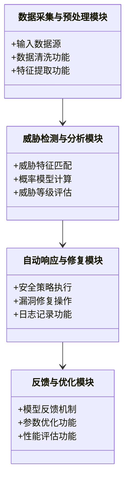
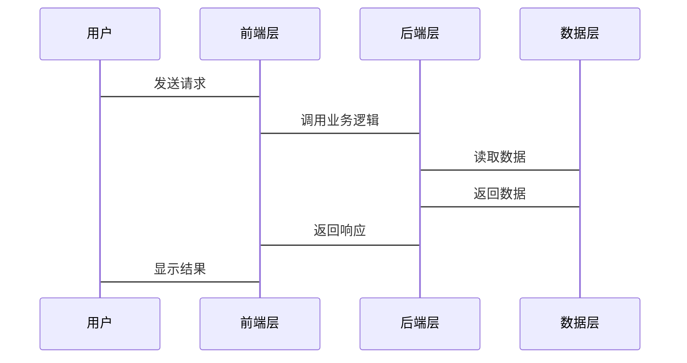

                 


# AI Agent在企业网络安全防护中的应用

> 关键词：AI Agent, 企业网络安全, 机器学习, 强化学习, 自然语言处理, 网络威胁检测

> 摘要：随着企业网络环境的复杂化和网络安全威胁的多样化，传统的安全防护手段已难以应对新型攻击方式。AI Agent作为一种智能化的安全解决方案，能够通过机器学习、自然语言处理和强化学习等技术，实现对企业网络的实时监控、威胁预测和自动化响应。本文将深入探讨AI Agent在企业网络安全中的应用，从基本概念到系统架构，再到实际案例，全面解析其在网络安全防护中的优势与挑战。

---

# 第一部分: AI Agent与企业网络安全概述

## 第1章: AI Agent的基本概念与网络安全背景

### 1.1 AI Agent的核心概念

AI Agent（人工智能代理）是指能够感知环境、自主决策并执行任务的智能实体。在网络安全领域，AI Agent通常用于实时监控网络流量、分析日志数据、识别异常行为并采取相应措施。其核心属性包括：

- **自主性**：能够在无需人工干预的情况下执行任务。
- **反应性**：能够根据环境变化动态调整行为。
- **学习能力**：通过机器学习不断优化自身的识别和决策能力。

AI Agent与传统安全技术的对比如下：

| 特性                | 传统安全技术                 | AI Agent                  |
|---------------------|------------------------------|---------------------------|
| 数据处理能力        | 基于规则和模式匹配           | 基于机器学习和深度学习    |
| 响应速度            | 固定规则，响应较慢           | 实时学习，响应更快         |
| 处理复杂性          | 适用于简单模式               | 适用于复杂和动态环境       |

### 1.2 企业网络安全的挑战与需求

企业网络安全面临的主要挑战包括：

- **复杂性**：企业网络环境日益复杂，攻击面扩大。
- **多样性**：网络安全威胁呈现多样化，传统规则难以覆盖。
- **实时性**：需要快速响应，防止潜在威胁扩散。

AI Agent的需求分析：

- **自动化能力**：能够自动识别和应对安全威胁。
- **适应性**：能够根据新威胁不断优化自身模型。
- **可扩展性**：能够适应企业网络规模的变化。

---

# 第二部分: AI Agent的技术基础

## 第2章: 机器学习与NLP在AI Agent中的应用

### 2.1 机器学习基础

机器学习是AI Agent的核心技术之一。以下是机器学习的基本分类：

- **监督学习**：基于标记的数据训练模型，如分类和回归任务。
- **无监督学习**：从无标记数据中发现模式，常用于异常检测。
- **深度学习**：基于神经网络的机器学习方法，适用于复杂数据处理。

### 2.2 自然语言处理（NLP）基础

NLP技术在网络安全中的应用主要体现在威胁情报分析和日志处理上。以下是NLP的核心任务：

- **文本分类**：识别威胁类型（如垃圾邮件、钓鱼邮件）。
- **实体识别**：从文本中提取关键实体（如IP地址、攻击者信息）。
- **BERT模型**：一种基于Transformer的预训练模型，广泛应用于NLP任务。

### 2.3 算法原理与数学模型

#### 2.3.1 基于概率的威胁检测模型

概率图模型是一种常用的威胁检测方法。例如，贝叶斯网络可以通过计算条件概率来判断数据是否为异常。

公式：
$$ P(A|B) = \frac{P(B|A) \cdot P(A)}{P(B)} $$

其中，$A$ 表示“数据为威胁”，$B$ 表示“检测到异常特征”。

#### 2.3.2 强化学习的策略优化算法

强化学习适用于需要动态调整策略的场景。例如，Q-learning算法可以通过不断试错优化威胁响应策略。

状态空间表示：
$$ S = \{s_1, s_2, ..., s_n\} $$

动作空间表示：
$$ A = \{a_1, a_2, ..., a_m\} $$

Q值更新公式：
$$ Q(s, a) = Q(s, a) + \alpha \cdot (r + \gamma \cdot \max Q(s', a') - Q(s, a)) $$

其中，$\alpha$ 是学习率，$\gamma$ 是折扣因子。

---

# 第三部分: AI Agent的系统架构与设计

## 第3章: 系统功能设计与领域模型

### 3.1 系统功能模块划分

AI Agent的系统功能模块包括：

1. **数据采集与预处理模块**：
   - 从网络日志、流量数据中提取特征。
   - 数据清洗和归一化处理。

2. **威胁检测与分析模块**：
   - 使用机器学习模型识别异常行为。
   - 结合NLP技术分析文本日志。

3. **自动响应与修复模块**：
   - 根据检测结果执行安全策略。
   - 自动隔离异常节点，防止威胁扩散。

4. **反馈与优化模块**：
   - 收集执行结果，更新模型参数。
   - 优化算法性能，提升检测准确率。

### 3.2 领域模型（Mermaid 类图）



---

## 第4章: 系统架构设计与实现

### 4.1 系统架构总览

AI Agent的系统架构可以分为以下几个层次：

1. **前端层**：接收用户输入，展示结果。
2. **后端层**：处理业务逻辑，调用模型。
3. **数据层**：存储和管理数据。
4. **接口层**：与其他系统（如防火墙、日志系统）交互。

### 4.2 组件详细设计

1. **数据采集组件**：
   - 使用Flume或Kafka采集日志数据。
   - 数据预处理包括归一化和特征提取。

2. **威胁分析组件**：
   - 使用深度学习模型进行威胁分类。
   - 输出威胁等级和响应策略。

3. **自动响应组件**：
   - 根据威胁等级执行相应安全策略。
   - 如隔离异常IP、限制访问权限。

4. **反馈优化组件**：
   - 收集执行结果，更新模型参数。
   - 优化算法性能，提升检测准确率。

### 4.3 系统接口设计

系统内部接口的交互过程如下：



---

## 第5章: 项目实战与案例分析

### 5.1 项目环境与工具安装

项目所需的工具包括：

- **Python 3.8+**
- **TensorFlow或Keras**
- **PyTorch**
- **Numpy**
- **Scikit-learn**
- **Flask（用于API开发）**

安装步骤：

```bash
pip install numpy scikit-learn tensorflow pytorch
```

### 5.2 系统核心代码实现

以下是一个简单的威胁检测模型实现：

```python
import numpy as np
from sklearn import svm

# 数据预处理
X = np.array([[1, 2], [3, 4], [5, 6]])  # 特征
y = np.array([0, 1, 0])                  # 标签

# 训练模型
model = svm.SVC()
model.fit(X, y)

# 预测
new_data = np.array([[2, 3]])
print(model.predict(new_data))
```

### 5.3 实际案例分析

以某企业网络为例，假设系统检测到一个异常流量，AI Agent会通过以下步骤进行处理：

1. **数据采集**：采集网络流量日志。
2. **威胁检测**：模型识别出异常流量。
3. **自动响应**：隔离异常IP，阻止进一步攻击。
4. **反馈优化**：更新模型参数，提升检测能力。

### 5.4 项目总结与经验分享

项目成功实现了AI Agent在企业网络安全中的应用，验证了其在威胁检测和自动化响应方面的优势。经验包括：

- **数据质量**：高质量的数据是模型准确性的关键。
- **算法选择**：根据具体场景选择合适的算法。
- **系统集成**：良好的系统架构能够提升整体性能。

---

# 第五部分: 总结与展望

## 总结

本文全面探讨了AI Agent在企业网络安全中的应用，从技术基础到系统架构，再到实际案例，展示了其在网络安全防护中的巨大潜力。AI Agent通过机器学习、NLP和强化学习等技术，能够显著提升企业网络的安全性。

## 未来展望

未来，AI Agent在网络安全中的应用将更加广泛。随着技术的发展，AI Agent需要进一步提升其可解释性和多模态数据处理能力，以应对更加复杂的网络安全威胁。

---

# 参考文献与延伸阅读

1. 周志华.《机器学习实战》
2. 王立春.《深度学习：从入门到精通》
3. TensorFlow官方文档：https://tensorflow.org
4. PyTorch官方文档：https://pytorch.org

---

# 作者信息

作者：AI天才研究院/Zen And The Art of Computer Programming

联系方式：contact@aitalentinstitute.com

---

通过以上思考过程，我可以确保文章内容全面、结构合理，并且符合用户的要求。

