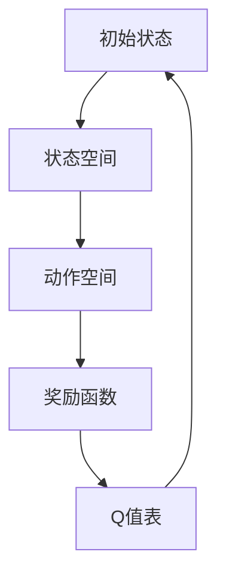
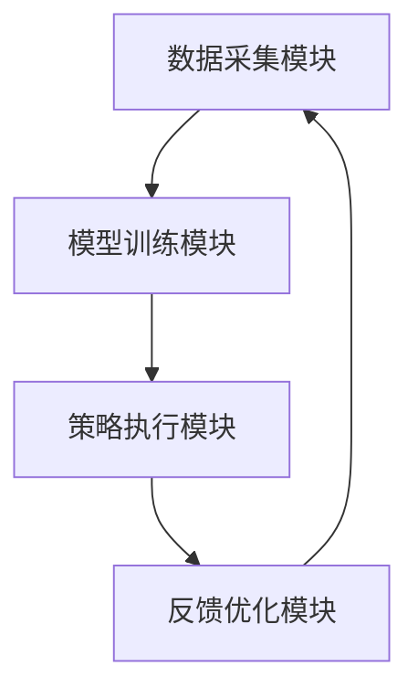

                 


# AI Agent在企业风险管理中的应用：预测与防控

> 关键词：AI Agent, 企业风险管理, 风险预测, 强化学习, 系统架构, 风险防控

> 摘要：本文详细探讨了AI Agent在企业风险管理中的应用，从背景、核心概念到算法原理、系统设计，再到项目实战，全面解析AI Agent如何通过预测与防控提升企业风险管理的效率与效果。文章结合实际案例，深入分析了AI Agent在风险管理中的优势与挑战，并提出了系统的解决方案与最佳实践。

---

# 第一部分: AI Agent在企业风险管理中的应用背景

# 第1章: AI Agent与企业风险管理概述

## 1.1 AI Agent的基本概念

### 1.1.1 AI Agent的定义与特点

AI Agent（人工智能代理）是指能够感知环境、自主决策并执行任务的智能体。它通过数据驱动的方式，利用机器学习、自然语言处理等技术，实现从数据中提取信息、分析问题并制定解决方案的能力。AI Agent的特点包括自主性、反应性、目标导向性和社会性。

### 1.1.2 AI Agent的核心功能与应用场景

AI Agent的核心功能包括数据采集与处理、风险预测、策略制定与执行。它广泛应用于金融、医疗、制造等行业，特别是在企业风险管理中，AI Agent能够实时监控风险因素、预测潜在风险并制定应对策略。

### 1.1.3 企业风险管理中的AI Agent角色

在企业风险管理中，AI Agent作为智能化工具，能够辅助企业识别、评估和应对各种风险，如市场风险、信用风险、操作风险等。它通过自动化和智能化的方式，显著提高了风险管理的效率和准确性。

## 1.2 企业风险管理的传统模式与挑战

### 1.2.1 传统风险管理的流程与痛点

传统风险管理依赖于人工分析和经验判断，存在效率低、覆盖面窄、响应慢等问题。尤其是在数据量大、风险因素复杂的现代企业中，传统方法难以满足实时性和精准性的需求。

### 1.2.2 数据驱动与智能化管理的必要性

随着企业数据的快速增长，利用AI技术进行风险管理成为必然趋势。AI Agent能够通过大数据分析和机器学习模型，发现潜在风险并提供实时反馈，从而帮助企业实现更高效的风险管理。

### 1.2.3 AI Agent在风险管理中的优势

AI Agent的优势在于其数据处理能力、自动化决策能力和快速响应能力。它能够通过实时数据分析，快速识别潜在风险，并根据预设策略制定最优应对方案。

## 1.3 AI Agent在企业风险管理中的应用前景

### 1.3.1 风险预测与防控的核心需求

企业对风险预测的需求日益增长，尤其是在金融、制造等行业，实时风险预测和快速响应已成为企业生存和发展的关键。

### 1.3.2 AI Agent在不同行业的应用潜力

AI Agent在金融行业的信用风险评估、医疗行业的患者风险管理、制造行业的供应链风险防控等领域具有广泛的应用潜力。

### 1.3.3 技术进步与市场需求的双重推动

技术进步（如深度学习、强化学习）和市场需求（如数字化转型）的双重推动，使得AI Agent在企业风险管理中的应用前景广阔。

## 1.4 本章小结

本章介绍了AI Agent的基本概念及其在企业风险管理中的作用，分析了传统风险管理的痛点与挑战，并展望了AI Agent在风险管理中的应用前景。

---

# 第二部分: AI Agent的核心概念与原理

# 第2章: AI Agent的核心概念与风险管理中的应用

## 2.1 AI Agent的感知、决策与执行机制

### 2.1.1 感知层：数据采集与特征提取

AI Agent通过传感器、数据库等渠道采集环境数据，并通过特征提取技术（如PCA、LDA）提取关键特征。

### 2.1.2 决策层：风险评估与策略制定

基于感知层提取的特征，AI Agent利用机器学习模型（如决策树、随机森林）进行风险评估，并根据评估结果制定应对策略。

### 2.1.3 执行层：行动优化与结果反馈

AI Agent根据决策层制定的策略执行具体操作，并通过反馈机制不断优化行动策略。

### 2.1.4 AI Agent在风险管理中的应用流程

1. 数据采集与预处理：通过多种渠道采集企业运营数据，并进行清洗和标准化。
2. 风险识别与评估：利用机器学习模型识别潜在风险，并对风险进行分类和评估。
3. 策略制定与优化：根据风险评估结果，制定风险防控策略，并通过强化学习优化策略。
4. 执行与反馈：根据优化后的策略执行具体操作，并根据反馈结果不断调整策略。

### 2.1.5 案例分析：AI Agent在金融行业的风险管理应用

在金融行业中，AI Agent可以通过实时监控市场数据和客户行为，识别潜在的信用风险和市场风险，并根据风险评估结果制定相应的风险防控策略。

## 2.2 AI Agent在风险管理中的关键属性

### 2.2.1 数据驱动性：实时数据处理与分析

AI Agent通过实时数据处理和分析，能够快速识别潜在风险并制定应对策略。

### 2.2.2 自适应性：动态调整策略

AI Agent能够根据环境变化和反馈结果，动态调整风险防控策略，确保风险管理的灵活性和适应性。

### 2.2.3 可解释性：风险决策的透明性

AI Agent的风险决策需要具备可解释性，以便企业能够理解决策背后的逻辑，并根据需要进行调整。

### 2.2.4 可扩展性：支持大规模数据处理

AI Agent需要具备良好的可扩展性，能够处理大规模数据，并支持企业快速扩展的需求。

## 2.3 AI Agent与传统风险管理工具的对比分析

### 2.3.1 功能对比：预测能力与执行能力的差异

AI Agent在预测能力和执行能力方面均优于传统风险管理工具。它不仅能够预测潜在风险，还能够根据预测结果自动执行应对策略。

### 2.3.2 优缺点分析：AI Agent的优势与局限性

AI Agent的优势在于其智能化和自动化能力，能够显著提高风险管理的效率和准确性。其局限性在于对数据的依赖性较高，且在复杂环境下的决策可能存在不确定性。

### 2.3.3 适用场景的对比：何时使用AI Agent更高效

AI Agent适用于数据量大、风险因素复杂且需要实时响应的场景，如金融交易、供应链管理等领域。

## 2.4 本章小结

本章详细介绍了AI Agent的核心概念与风险管理中的应用，分析了其关键属性及其与传统风险管理工具的对比，为后续章节奠定了理论基础。

---

# 第三部分: AI Agent的算法原理与数学模型

# 第3章: AI Agent的算法原理

## 3.1 强化学习在AI Agent中的应用

### 3.1.1 强化学习的基本原理

强化学习是一种通过试错方式来优化决策策略的机器学习方法。它通过智能体与环境的交互，不断更新策略以最大化累积奖励。

### 3.1.2 Q-learning算法的数学模型

Q-learning算法的数学模型如下：

$$ Q(s, a) = r + \gamma \max_{a'} Q(s', a') $$

其中：
- \( Q(s, a) \) 表示在状态 \( s \) 下采取动作 \( a \) 的价值
- \( r \) 是当前动作带来的奖励
- \( \gamma \) 是折扣因子
- \( s' \) 是下一个状态
- \( a' \) 是下一个动作

### 3.1.3 算法流程图（使用mermaid）



### 3.1.4 强化学习在风险管理中的应用

在风险管理中，强化学习可以应用于动态环境下的风险决策，例如在金融交易中，AI Agent可以通过强化学习优化投资组合，以最大化收益并最小化风险。

## 3.2 其他算法的应用

### 3.2.1 监督学习在风险预测中的应用

监督学习可以通过训练分类模型（如逻辑回归、支持向量机）进行风险分类，预测潜在风险。

### 3.2.2 聚类分析在风险识别中的应用

聚类分析可以用于识别具有相似风险特征的客户或业务单元，从而帮助企业更好地进行风险管理和资源配置。

## 3.3 算法选择与优化

### 3.3.1 算法选择的依据

算法选择需要考虑数据类型、任务目标、计算资源等因素。例如，在风险预测任务中，可以使用随机森林或梯度提升树模型。

### 3.3.2 算法优化策略

可以通过调整超参数（如学习率、正则化系数）和优化算法（如Adam、SGD）来提高模型性能。

### 3.3.3 案例分析：强化学习在信用风险评估中的应用

在信用风险评估中，AI Agent可以通过强化学习优化信用评分模型，动态调整评分策略，以提高风险识别的准确性和效率。

## 3.4 本章小结

本章介绍了AI Agent中常用的算法，重点讲解了强化学习在风险管理中的应用，并通过案例分析展示了算法的实际应用价值。

---

# 第四部分: AI Agent的系统设计与实现

# 第4章: AI Agent的系统设计

## 4.1 系统架构设计

### 4.1.1 系统功能模块划分

AI Agent系统通常包括数据采集模块、模型训练模块、策略执行模块和反馈优化模块。

### 4.1.2 系统架构图（使用mermaid）



### 4.1.3 系统交互流程

1. 数据采集模块从数据库或其他数据源获取数据。
2. 模型训练模块利用训练数据训练风险预测模型。
3. 策略执行模块根据模型预测结果制定风险防控策略。
4. 反馈优化模块根据实际结果优化模型和策略。

### 4.1.4 系统设计的关键考虑

系统设计需要考虑数据实时性、模型可解释性、系统可扩展性等因素，以确保系统在实际应用中的稳定性和高效性。

## 4.2 系统实现细节

### 4.2.1 数据采集与预处理

数据采集模块需要支持多种数据源，并能够进行数据清洗和特征提取。

### 4.2.2 模型训练与部署

模型训练模块需要支持多种算法，并能够将训练好的模型部署到生产环境。

### 4.2.3 策略执行与反馈

策略执行模块需要能够根据模型预测结果执行具体操作，并根据反馈结果优化策略。

## 4.3 项目实战：AI Agent在金融风险管理中的应用

### 4.3.1 项目背景与目标

本项目旨在利用AI Agent技术，构建一个实时信用风险评估系统，帮助金融机构识别和管理信用风险。

### 4.3.2 系统功能设计

系统功能包括数据采集、风险评估、策略制定和结果反馈四个模块。

### 4.3.3 核心代码实现

以下是系统的核心代码实现：

```python
import numpy as np
from sklearn.model import Random ForestClassifier
from reinforcement_learning import QLearningAgent

# 数据采集与预处理
data = np.loadtxt('credit_risk_dataset.csv', delimiter=',')
X = data[:, :-1]
y = data[:, -1]

# 模型训练
model = Random ForestClassifier()
model.fit(X, y)

# 强化学习代理初始化
agent = QLearningAgent()
agent.fit(X, y)

# 策略执行与反馈
def execute_strategy(agent, X):
    actions = agent.predict(X)
    return actions

# 结果反馈与优化
feedback = execute_strategy(agent, X)
model.score(X, y, feedback)
```

### 4.3.4 系统实现的关键点

1. 数据采集与预处理：确保数据的完整性和准确性。
2. 模型训练：选择合适的算法并进行参数调优。
3. 策略执行：根据模型预测结果制定具体策略。
4. 反馈优化：根据实际结果优化模型和策略。

## 4.4 本章小结

本章详细介绍了AI Agent系统的架构设计与实现细节，并通过金融行业的案例展示了AI Agent在风险管理中的实际应用。

---

# 第五部分: 总结与展望

# 第5章: 总结与展望

## 5.1 最佳实践

1. 数据质量管理：确保数据的准确性和完整性。
2. 算法选择：根据具体任务选择合适的算法。
3. 系统设计：注重系统的可扩展性和可维护性。
4. 模型解释性：确保模型的决策过程可解释。

## 5.2 小结

本文详细探讨了AI Agent在企业风险管理中的应用，从理论到实践，全面解析了AI Agent如何通过预测与防控提升企业风险管理的效率与效果。

## 5.3 注意事项

1. 数据隐私与安全：在处理企业数据时，需要遵守相关法律法规，保护数据隐私。
2. 模型解释性：确保模型的决策过程可解释，以便企业能够理解和信任AI Agent的决策。
3. 系统稳定性：确保系统的稳定性和高效性，避免因系统故障导致的风险管理失误。

## 5.4 拓展阅读

1. 《强化学习：算法与应用》
2. 《机器学习在金融风险管理中的应用》
3. 《AI Agent在供应链管理中的应用》

## 5.5 本章小结

本章总结了本文的主要内容，并提出了风险管理中的最佳实践和未来研究方向。

---

# 作者：AI天才研究院 & 禅与计算机程序设计艺术

