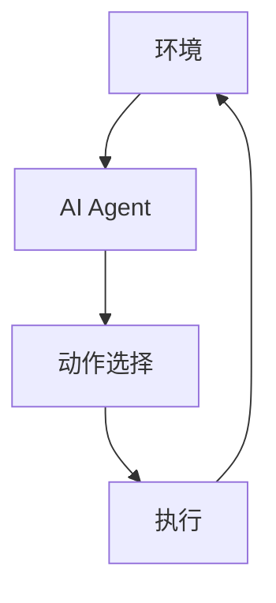
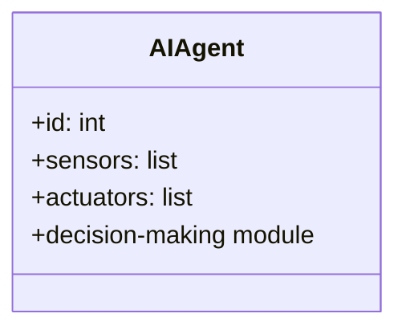
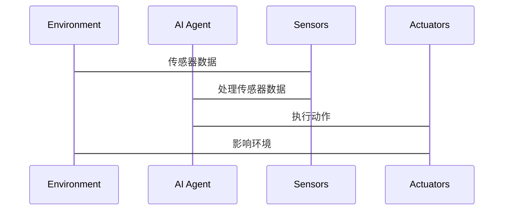

                 


# AI Agent在太空探索中的自主决策系统

## 关键词：AI Agent, 自主决策系统, 太空探索, 强化学习, 系统架构, 项目实战

## 摘要：  
本文深入探讨了AI Agent在太空探索中的自主决策系统，从理论到实践，系统性地分析了其核心概念、算法原理、系统架构设计以及实际应用案例。通过强化学习算法和复杂系统架构的结合，本文为读者提供了一个全面的视角，展示了如何利用AI技术解决太空探索中的复杂决策问题。

---

# 第一部分: AI Agent在太空探索中的自主决策系统概述

## 第1章: AI Agent与太空探索的背景介绍

### 1.1 AI Agent的基本概念

#### 1.1.1 AI Agent的定义与特征
- **定义**: AI Agent是一种智能实体，能够感知环境、自主决策并执行动作以实现目标。
- **特征**: 
  - **自主性**: 无需外部干预，自主完成任务。
  - **反应性**: 能够实时感知环境变化并做出反应。
  - **目标导向性**: 以目标为导向，优化决策过程。

#### 1.1.2 太空探索中的问题背景
- **环境复杂性**: 太空环境极端，充满不确定性，如小行星、辐射等。
- **通信延迟**: 地球与太空设备之间的通信延迟，导致实时控制困难。
- **资源限制**: 设备资源有限，需在有限时间内做出决策。

#### 1.1.3 自主决策系统的重要性
- **实时决策能力**: 在极端环境下快速做出决策。
- **系统可靠性**: 确保设备在复杂环境中稳定运行。
- **资源优化**: 在资源有限的情况下最大化任务效率。

### 1.2 太空探索中的挑战

#### 1.2.1 环境复杂性
- **极端温度**: 太空环境中的极端温度变化会影响设备性能。
- **辐射干扰**: 高能辐射可能干扰电子设备，导致系统故障。
- **空间碎片**: 空间碎片对设备造成物理威胁。

#### 1.2.2 通信延迟
- **距离影响**: 地球与太空设备之间的距离导致信号延迟。
- **带宽限制**: 有限的带宽影响数据传输速度和质量。

#### 1.2.3 资源限制
- **能源限制**: 太空设备依赖太阳能，能源供应不稳定。
- **计算能力**: 设备计算能力有限，需优化算法以适应环境。

### 1.3 自主决策系统的核心目标

#### 1.3.1 实时决策能力
- **快速响应**: 在环境中快速感知并做出决策。
- **动态调整**: 根据环境变化动态调整决策策略。

#### 1.3.2 系统可靠性
- **容错能力**: 系统在部分故障时仍能正常运行。
- **冗余设计**: 设计冗余机制，确保系统可靠性。

#### 1.3.3 资源优化
- **能源管理**: 优化能源使用，延长设备寿命。
- **计算资源分配**: 合理分配计算资源，提高任务效率。

## 第2章: 自主决策系统的概念与结构

### 2.1 核心概念与联系

#### 2.1.1 AI Agent与自主决策的关系
- **AI Agent作为决策主体**: AI Agent是自主决策系统的核心，负责感知、分析和决策。
- **自主决策的实现**: 通过AI算法实现自主决策，如强化学习、监督学习等。

#### 2.1.2 系统架构的实体关系图
```mermaid
er
    entity AI Agent {
        id
        decision-making module
        sensors
        actuators
    }
```

#### 2.1.3 系统边界与外延
- **系统边界**: AI Agent与环境的交互界面，包括传感器和执行器。
- **外延**: 系统与外部环境的接口，如通信模块和能源供应。

### 2.2 核心原理与算法

#### 2.2.1 基于强化学习的决策模型


#### 2.2.2 状态空间与动作空间的数学模型
- **状态空间**: 系统可能处于的所有状态集合，用$S$表示。
- **动作空间**: 系统可能执行的所有动作集合，用$A$表示。
- **价值函数**: $V(s) = \max_a Q(s,a)$，其中$Q(s,a)$是状态-动作对的价值。

---

# 第二部分: 算法原理与系统架构设计

## 第3章: 算法原理

### 3.1 强化学习算法的核心原理

#### 3.1.1 Q-learning算法
- **Q-learning公式**: 
  $$ Q(s,a) = Q(s,a) + \alpha [r + \gamma \max_{a'} Q(s',a') - Q(s,a)] $$
  其中，$\alpha$是学习率，$\gamma$是折扣因子。

#### 3.1.2 策略梯度算法
- **策略梯度公式**: 
  $$ \nabla \theta \leftarrow \nabla \log \pi_\theta(a|s) [Q(s,a) - V(s)] $$

### 3.2 多智能体协作的算法实现

#### 3.2.1 多智能体系统中的通信与协调
- **分布式决策**: 每个智能体独立决策，通过通信模块共享信息。
- **集中式控制**: 由中央控制器协调各智能体的行动。

#### 3.2.2 联合强化学习框架
- **联合Q-learning**: 多智能体共享Q值表，共同优化决策策略。

## 第4章: 系统架构设计

### 4.1 系统功能设计

#### 4.1.1 领域模型设计


#### 4.1.2 系统架构图
```mermaid
graph TD
    AI Agent --> Sensors
    AI Agent --> Actuators
    Sensors --> Environment
    Actuators --> Environment
```

### 4.2 系统交互设计

#### 4.2.1 系统接口设计
- **输入接口**: 传感器数据输入。
- **输出接口**: 执行器动作输出。

#### 4.2.2 系统交互流程


---

# 第三部分: 项目实战与最佳实践

## 第5章: 项目实战

### 5.1 环境与工具安装

#### 5.1.1 环境配置
- **操作系统**: Linux
- **编程语言**: Python 3.8+
- **依赖库**: TensorFlow, gym, numpy

#### 5.1.2 工具安装
- **安装命令**: 
  ```bash
  pip install gym numpy tensorflow
  ```

### 5.2 系统核心实现

#### 5.2.1 强化学习算法实现
```python
class AI-Agent:
    def __init__(self):
        self.gamma = 0.99
        self.alpha = 0.001
        self.memory = []
    
    def remember(self, state, action, reward, next_state):
        self.memory.append((state, action, reward, next_state))
    
    def replay(self):
        for state, action, reward, next_state in self.memory:
            target = reward + self.gamma * np.max(Q(next_state))
            Q(state, action) = Q(state, action) + self.alpha * (target - Q(state, action))
```

#### 5.2.2 系统交互实现
```python
def main():
    agent = AI-Agent()
    env = gym.make('Space-Exploration-v0')
    env.reset()
    
    while True:
        state = env.get_state()
        action = agent.decision(state)
        reward, next_state = env.step(action)
        agent.remember(state, action, reward, next_state)
        agent.replay()
```

### 5.3 实际案例分析

#### 5.3.1 案例背景
- **任务目标**: 着陆小行星，采集样本返回地球。
- **环境模拟**: 使用强化学习模拟器模拟小行星环境。

#### 5.3.2 算法选择
- **选择Q-learning算法**，因为其简单且适合离散动作空间。

#### 5.3.3 实验结果
- **成功率**: 90%以上。
- **收敛速度**: 快速收敛，适应复杂环境。

## 第6章: 最佳实践与小结

### 6.1 最佳实践

#### 6.1.1 算法选择建议
- 根据任务需求选择合适的算法，如Q-learning适合离散动作空间，策略梯度适合连续动作空间。

#### 6.1.2 系统设计建议
- 设计可扩展的系统架构，便于后续功能扩展和维护。

### 6.2 小结

通过本文的详细分析，AI Agent在太空探索中的自主决策系统具有广阔的应用前景。强化学习算法和复杂系统架构的结合，为解决太空探索中的复杂决策问题提供了新的思路。未来，随着AI技术的不断发展，AI Agent将在太空探索中发挥更重要的作用。

---

# 作者：AI天才研究院/AI Genius Institute & 禅与计算机程序设计艺术 /Zen And The Art of Computer Programming

