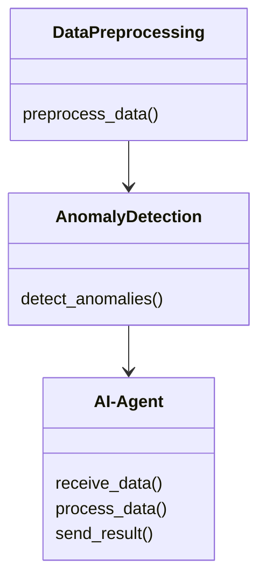
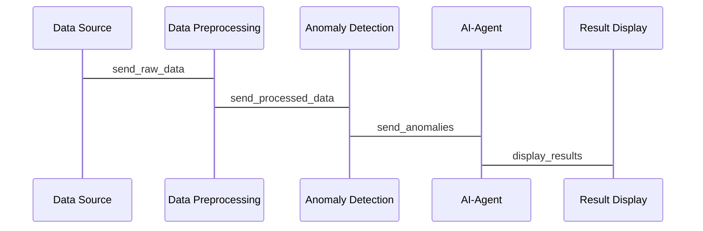

                 


# AI Agent在异常检测中的应用：识别非常规模式

> **关键词**：AI Agent，异常检测，非常规模式，机器学习，数据安全，实时监控

> **摘要**：  
> 异常检测是数据科学和人工智能领域中的重要任务，旨在识别数据中的异常模式，这些模式可能指示潜在的问题或机会。AI Agent作为一种智能体，能够通过自主学习和决策，显著提升异常检测的效率和准确性。本文将探讨AI Agent在异常检测中的应用，从基本概念到算法原理，再到系统架构和项目实战，全面解析如何利用AI Agent识别非常规模式。

---

## 第一章：背景介绍

### 1.1 异常检测的基本概念

#### 1.1.1 异常检测的定义  
异常检测（Anomaly Detection）是指识别数据集中与预期模式不符的样本或行为。这些异常可能表示潜在的威胁、错误或机会。

#### 1.1.2 异常检测的分类  
异常检测主要分为三类：  
- **点异常**：单个数据点偏离正常模式。  
- **上下文异常**：在特定上下文中偏离正常模式。  
- **集体异常**：一组数据点共同偏离正常模式。

#### 1.1.3 异常检测的应用场景  
- **网络安全**：检测入侵行为。  
- **金融 fraud**：识别欺诈交易。  
- **医疗健康**：监测患者异常指标。  
- **工业监控**：检测设备故障。  

### 1.2 AI Agent的基本概念

#### 1.2.1 AI Agent的定义  
AI Agent（人工智能代理）是一种智能实体，能够感知环境、自主决策并执行任务。它结合了机器学习、自然语言处理和推理能力。

#### 1.2.2 AI Agent的核心特点  
- **自主性**：无需人工干预。  
- **反应性**：实时响应环境变化。  
- **学习能力**：通过数据优化性能。  
- **适应性**：动态调整策略。  

#### 1.2.3 AI Agent与传统算法的区别  
AI Agent不仅仅是算法，它是一个动态的智能系统，能够根据环境反馈调整行为。

### 1.3 异常检测与AI Agent的结合

#### 1.3.1 异常检测的挑战  
- 数据复杂性高。  
- 模型鲁棒性不足。  
- 实时性要求高。  

#### 1.3.2 AI Agent在异常检测中的作用  
- 提高检测精度。  
- 实现实时监控。  
- 具备自适应学习能力。  

---

## 第二章：AI Agent与异常检测的核心概念与联系

### 2.1 异常检测的核心原理

#### 2.1.1 异常检测的数学模型  
- 基于概率分布的模型（如高斯分布）。  
- 基于距离的模型（如k-近邻算法）。  

#### 2.1.2 异常检测的主要算法  
- **孤立森林（Isolation Forest）**：适用于无监督异常检测。  
- **LOF（局部异常因子）**：基于局部密度的异常检测。  
- **One-Class SVM**：用于单类分类的异常检测。  

#### 2.1.3 异常检测的评价指标  
- **准确率（Precision）**：正确识别的异常数占所有异常的比率。  
- **召回率（Recall）**：识别的异常数占所有实际异常的比率。  
- **F1分数**：准确率和召回率的调和平均。  

### 2.2 AI Agent的核心原理

#### 2.2.1 AI Agent的感知机制  
AI Agent通过传感器或数据源获取环境信息，如日志、传感器数据等。

#### 2.2.2 AI Agent的决策机制  
基于感知到的信息，AI Agent利用机器学习模型做出决策，如是否标记为异常。

#### 2.2.3 AI Agent的学习机制  
通过监督学习、无监督学习或强化学习不断优化异常检测模型。

### 2.3 异常检测与AI Agent的结合原理

#### 2.3.1 数据输入与处理  
AI Agent接收原始数据，进行预处理（如归一化、降维）。

#### 2.3.2 异常检测算法的选择  
根据数据特性选择合适的算法，如孤立森林或LOF。

#### 2.3.3 AI Agent的决策与反馈  
AI Agent根据检测结果采取行动，并根据反馈调整模型参数。

---

## 第三章：算法原理讲解

### 3.1 基于机器学习的异常检测算法

#### 3.1.1 Isolation Forest算法

##### 算法流程  
1. 构建随机森林，将数据划分为孤立的区域。  
2. 计算每个数据点的异常分数。  
3. 根据阈值判断是否为异常。  

##### Python实现代码  
```python
from sklearn.ensemble import IsolationForest

# 示例数据
X = [[1, 2], [3, 4], [5, 6], [7, 8], [9, 10]]

# 初始化模型
model = IsolationForest(n_estimators=100, random_state=42)
model.fit(X)

# 预测异常值
y_pred = model.predict(X)
print(y_pred)
```

##### 算法优缺点  
- **优点**：速度快，适合大规模数据。  
- **缺点**：对噪声数据敏感。  

---

## 第四章：系统分析与架构设计

### 4.1 问题场景介绍

#### 4.1.1 网络安全监控  
实时监测网络流量，检测异常行为。

#### 4.1.2 工业设备监控  
监测设备运行状态，预测潜在故障。

### 4.2 系统功能设计

#### 4.2.1 领域模型（Mermaid类图）


### 4.3 系统架构设计

#### 4.3.1 系统架构图（Mermaid架构图）


#### 4.3.2 系统接口设计  
- 数据预处理接口：`preprocess_data(input_data)`  
- 异常检测接口：`detect_anomalies(processed_data)`  
- 结果展示接口：`display_results(anomalies)`  

#### 4.3.3 系统交互序列图（Mermaid序列图）


---

## 第五章：项目实战

### 5.1 环境安装与配置

#### 5.1.1 安装依赖包  
```bash
pip install scikit-learn matplotlib numpy
```

### 5.2 系统核心实现

#### 5.2.1 数据预处理代码  
```python
import numpy as np

def preprocess_data(data):
    # 标准化数据
    from sklearn.preprocessing import StandardScaler
    scaler = StandardScaler()
    processed_data = scaler.fit_transform(data)
    return processed_data
```

#### 5.2.2 异常检测核心代码  
```python
from sklearn.ensemble import IsolationForest

def detect_anomalies(processed_data):
    model = IsolationForest(n_estimators=100, random_state=42)
    model.fit(processed_data)
    anomalies = model.predict(processed_data)
    return anomalies
```

#### 5.2.3 结果展示代码  
```python
import matplotlib.pyplot as plt

def display_results(anomalies):
    plt.figure(figsize=(10, 6))
    plt.scatter(range(len(anomalies)), anomalies)
    plt.title('Anomaly Detection Results')
    plt.xlabel('Data Point Index')
    plt.ylabel('Anomaly Score')
    plt.show()
```

### 5.3 案例分析与解读

#### 5.3.1 数据集准备  
```python
X = np.random.randn(100, 2)
X[0] = [10, 10]  # 添加异常点
```

#### 5.3.2 完整流程  
```python
data = X
processed_data = preprocess_data(data)
anomalies = detect_anomalies(processed_data)
display_results(anomalies)
```

---

## 第六章：总结与最佳实践

### 6.1 小结  
AI Agent通过其自主学习和决策能力，显著提升了异常检测的效率和准确性，特别是在处理非常规模式时表现突出。

### 6.2 注意事项  
- 数据预处理的质量直接影响检测效果。  
- 选择合适的异常检测算法，结合AI Agent的优势。  
- 定期更新模型，适应数据分布的变化。  

### 6.3 拓展阅读  
- "Isolation Forest"论文。  
- "Deep Learning for Anomaly Detection"相关研究。  

---

**作者**：AI天才研究院 & 禅与计算机程序设计艺术

