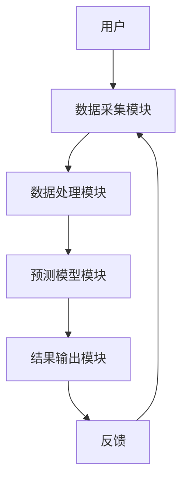

                 


# AI Agent在智能天气预报中的实践

> 关键词：AI Agent, 智能天气预报, 机器学习, 时间序列分析, 天气数据处理

> 摘要：本文深入探讨了AI Agent在智能天气预报中的实践应用，从AI Agent的基本概念到其在天气预报中的具体实现，详细分析了数据处理、算法实现、系统架构设计以及项目实战等关键环节，为读者提供了一套完整的解决方案。

---

# 目录

1. [AI Agent与智能天气预报概述](#ai-agent与智能天气预报概述)
2. [AI Agent的核心原理与技术](#ai-agent的核心原理与技术)
3. [天气数据处理与分析](#天气数据处理与分析)
4. [AI Agent的算法实现](#ai-agent的算法实现)
5. [智能天气预报系统的架构设计](#智能天气预报系统的架构设计)
6. [项目实战：基于AI Agent的天气预报系统](#项目实战基于ai-agent的天气预报系统)
7. [总结与展望](#总结与展望)

---

## 第1章: AI Agent与智能天气预报概述

### 1.1 AI Agent的基本概念

AI Agent（人工智能代理）是一种能够感知环境并采取行动以实现目标的智能实体。它能够通过传感器获取数据，利用算法进行分析，并根据结果执行相应的操作。AI Agent在天气预报中的应用，主要体现在数据处理、预测模型构建以及结果输出等方面。

#### 1.1.1 AI Agent的定义与特点
AI Agent是指能够感知环境、做出决策并执行动作的智能实体。其特点包括：
- **自主性**：能够在没有外部干预的情况下独立运行。
- **反应性**：能够实时感知环境变化并做出反应。
- **学习能力**：能够通过数据不断优化自身的预测能力。
- **可扩展性**：能够处理不同类型和规模的数据。

#### 1.1.2 AI Agent的核心功能与应用场景
AI Agent的核心功能包括数据采集、数据分析、预测建模和结果输出。在天气预报中的应用场景主要有：
- **短期天气预测**：利用历史数据和当前数据预测未来天气。
- **极端天气预警**：通过分析异常数据，提前预警极端天气事件。
- **气象数据优化**：通过机器学习算法优化气象数据的准确性。

#### 1.1.3 AI Agent与传统天气预报的区别
传统天气预报主要依赖气象卫星、气象站等设备的数据，结合气象模型进行预测。而AI Agent通过引入机器学习、深度学习等技术，能够更高效地处理海量数据，并提高预测的准确性。

---

### 1.2 智能天气预报的发展历程

#### 1.2.1 天气预报的历史演变
天气预报的发展经历了以下几个阶段：
1. **经验预报阶段**：基于天气现象的观察和经验进行预测。
2. **气象模型阶段**：利用物理模型和计算机进行数值模拟。
3. **数据驱动阶段**：引入大数据和机器学习技术，通过数据驱动的方式进行预测。

#### 1.2.2 AI Agent技术在天气预报中的应用现状
当前，AI Agent技术在天气预报中的应用主要体现在以下几个方面：
- **实时数据处理**：通过AI Agent实时采集和处理气象数据。
- **预测模型优化**：利用机器学习算法优化天气预测模型。
- **极端天气预警**：通过AI Agent快速识别异常数据并发出预警。

#### 1.2.3 智能天气预报的未来发展趋势
未来的智能天气预报将更加依赖AI Agent技术，实现更加精准和个性化的天气预测。具体表现为：
- **多源数据融合**：整合卫星、气象站、无人机等多种数据源。
- **实时预测能力**：实现分钟级的天气预测。
- **智能化决策支持**：为农业、交通等行业的用户提供智能化的决策支持。

---

### 1.3 AI Agent在智能天气预报中的作用

#### 1.3.1 AI Agent如何提升天气预报的准确性
AI Agent通过实时采集和处理海量气象数据，结合机器学习算法，能够显著提高天气预测的准确性。例如，利用时间序列分析模型（如LSTM）对历史数据进行建模，可以更准确地预测未来天气。

#### 1.3.2 AI Agent在天气预报中的具体应用场景
AI Agent在天气预报中的应用场景包括：
- **短期天气预测**：预测未来24小时的天气变化。
- **极端天气预警**：提前预警台风、暴雨等极端天气事件。
- **气象数据分析**：通过AI Agent对历史气象数据进行分析，提取有用的特征和规律。

#### 1.3.3 AI Agent与其他技术的协同作用
AI Agent在天气预报中需要与多种技术协同工作，例如：
- **物联网技术**：通过物联网设备实时采集气象数据。
- **云计算技术**：利用云计算平台进行海量数据的存储和计算。
- **大数据技术**：通过大数据分析技术对气象数据进行挖掘和分析。

---

## 第2章: AI Agent的核心原理与技术

### 2.1 AI Agent的核心原理

#### 2.1.1 感知模块: 数据采集与处理
AI Agent的感知模块负责从多种数据源采集气象数据，包括卫星、气象站、无人机等。数据采集后，需要进行预处理，包括数据清洗、归一化等步骤。

#### 2.1.2 决策模块: 数据分析与预测
决策模块负责对预处理后的数据进行分析和预测。常用的算法包括线性回归、随机森林、LSTM等。

#### 2.1.3 执行模块: 结果输出与反馈
执行模块负责将预测结果输出，并根据实际天气情况调整预测模型。例如，如果预测结果与实际天气差异较大，AI Agent会自动调整模型参数。

---

### 2.2 AI Agent的关键技术

#### 2.2.1 机器学习算法在AI Agent中的应用
常用的机器学习算法包括：
- **线性回归**：用于预测连续型变量（如温度）。
- **随机森林**：用于分类和回归问题。
- **LSTM**：用于时间序列预测。

#### 2.2.2 自然语言处理技术在天气预报中的应用
自然语言处理技术可以用于分析天气相关的文本数据，例如气象报告、新闻报道等。

#### 2.2.3 时间序列分析在天气预测中的应用
时间序列分析是天气预测的核心技术之一。常用的模型包括ARIMA、LSTM等。

---

### 2.3 AI Agent与天气数据的关系

#### 2.3.1 天气数据的多样性与复杂性
天气数据具有多样性和复杂性，包括温度、湿度、风速、气压等多种指标，且这些指标之间可能存在复杂的关联关系。

#### 2.3.2 AI Agent如何处理多源异构数据
AI Agent通过数据预处理、特征提取等技术，将多源异构数据转化为可用于机器学习模型的特征向量。

#### 2.3.3 数据预处理与特征工程
数据预处理包括数据清洗、归一化、缺失值处理等。特征工程则是通过提取有用的特征，提高模型的预测精度。

---

## 第3章: AI Agent在天气预报中的算法实现

### 3.1 常见的机器学习算法

#### 3.1.1 线性回归模型
线性回归是一种简单的回归算法，适用于预测连续型变量。其数学模型如下：

$$ y = \beta_0 + \beta_1 x + \epsilon $$

其中，$y$ 是目标变量，$x$ 是自变量，$\beta_0$ 和 $\beta_1$ 是模型参数，$\epsilon$ 是误差项。

#### 3.1.2 随机森林模型
随机森林是一种基于决策树的集成学习算法，具有较强的抗过拟合能力。其核心思想是通过构建多棵决策树，取其预测结果的平均值作为最终结果。

#### 3.1.3 LSTM模型
LSTM（长短期记忆网络）是一种时间序列模型，能够有效地捕捉时间序列中的长期依赖关系。其核心结构包括输入门、遗忘门和输出门。

---

### 3.2 算法实现的步骤

#### 3.2.1 数据采集与预处理
1. 从多种数据源采集气象数据。
2. 对数据进行清洗和归一化处理。
3. 提取有用的特征。

#### 3.2.2 模型训练
1. 将预处理后的数据输入模型进行训练。
2. 调整模型参数，优化模型性能。

#### 3.2.3 模型预测
1. 使用训练好的模型进行天气预测。
2. 对预测结果进行分析和评估。

---

## 第4章: 系统架构设计

### 4.1 系统模块划分
智能天气预报系统主要包括以下几个模块：
1. 数据采集模块：负责采集气象数据。
2. 数据处理模块：对数据进行预处理和特征提取。
3. 预测模型模块：构建和训练机器学习模型。
4. 结果输出模块：将预测结果输出并提供反馈。

### 4.2 系统架构图


### 4.3 接口设计
系统接口设计如下：
1. 数据采集模块提供API接口，供其他模块调用。
2. 预测模型模块提供预测接口，供结果输出模块调用。

---

## 第5章: 项目实战

### 5.1 环境搭建
1. 安装Python和相关库（如NumPy、Pandas、Scikit-learn、Keras等）。
2. 配置开发环境（如Jupyter Notebook）。

### 5.2 核心实现

#### 5.2.1 数据预处理
```python
import pandas as pd
import numpy as np

# 读取数据
data = pd.read_csv('weather.csv')

# 数据清洗
data = data.dropna()

# 数据归一化
from sklearn.preprocessing import MinMaxScaler
scaler = MinMaxScaler()
data_scaled = scaler.fit_transform(data)
```

#### 5.2.2 模型训练
```python
from sklearn.model_selection import train_test_split
from sklearn.linear_model import LinearRegression

# 划分训练集和测试集
X_train, X_test, y_train, y_test = train_test_split(data_scaled, data['temperature'], test_size=0.2)

# 训练模型
model = LinearRegression()
model.fit(X_train, y_train)

# 预测结果
y_pred = model.predict(X_test)
```

### 5.3 案例分析
通过实际案例分析，验证模型的预测精度。例如，预测某一天的温度，并与实际温度进行对比。

---

## 第6章: 总结与展望

### 6.1 全文总结
本文详细探讨了AI Agent在智能天气预报中的实践应用，从AI Agent的基本概念到其在天气预报中的具体实现，详细分析了数据处理、算法实现、系统架构设计以及项目实战等关键环节。

### 6.2 未来展望
未来的智能天气预报将更加依赖AI Agent技术，实现更加精准和个性化的天气预测。同时，随着技术的发展，AI Agent在气象数据处理、模型优化等方面也将不断创新。

### 6.3 最佳实践 tips
1. 在数据预处理阶段，要注意数据的清洗和归一化。
2. 在模型选择阶段，要根据具体问题选择合适的算法。
3. 在系统设计阶段，要注意模块的划分和接口的标准化。

---

作者：AI天才研究院 & 禅与计算机程序设计艺术

